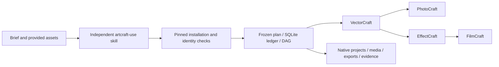

# ArtCraft Agent Plugin

Coordinate mixed creative work into project/workflow records, four-domain native child references and acceptance records.

Current plugin: `0.1.0-dev.107`; skill source: `0.1.0-dev.80`; 10 independent skills.

Current distribution: plugin dev.107 / source dev.80 / Art runtime dev.106. Ten fresh independent cold installations and 390 protocol checks pass; the real four-domain mixed workflow passes. [Evidence](docs/evidence/artcraft107-protocol-fixed-first-use-20261008.json). Complete V1 remains open.


Verified first-use platform: macOS arm64 and Python 3.11+. Pinned runtimes install into the user data directory; skill files stay in their host-loaded directory. These are development releases; complete V1 acceptance and generic Skills CLI installation remain open.

Fixed audio-tail acceptance: Film plugin dev.33 / source dev.31 and Art plugin dev.103 / source dev.77 pass actual installed first use. All 64 installed identities match; 23 changed skills pass fresh independent cold starts (258.282s), while 41 byte-identical skills retain their earlier cold evidence. Native audio-tail/gain/oversized-range checks, five-child spoken mixed delivery, moved package, and brand revision with unrelated reuse pass. This does not close generic Skills CLI, creative approval or full V1. [Version-bound evidence](docs/evidence/craft-art103-audio-tail-fixed-first-use-20261007.json).

Historical: Current sample-duration correction: Film plugin dev.34 / source dev.32 and Art plugin dev.104 / source dev.78 pass actual fixed public-tag installation. All 64 installed identities are rechecked; 23 skills pass fresh independent cold starts (13 Film, 10 Art), and 41 historical cold records are reused only after full-tree digest equality. Actual 2.20s and 2.211s audio tails, gain revision, explicit oversized rejection, sequence relocation, captioned/narrated short-film revision, five-child mixed delivery, moved package and selective brand revision pass. Only this bounded sample-duration release gate closes; full V1, generic Skills CLI, model dispatch and creative acceptance remain open. [Current fixed evidence](docs/evidence/craft-art104-sample-audio-fixed-first-use-20261007.json).

Historical dev.104 maintainer correction: acceptance tools used the then-verified dev.104 lock and matching evidence. Independent installation plans reject floating refs, malformed commits/digests and invalid skill names before creating a project or invoking external tools. Installed probes match both application identity and version. Regression: 79 tests, 5 conditional skips; actual installed verification: 64 version probes with five fresh domain caches and later cache reuse. Explicit historical lock parameters remain supported. This is a maintainer-tool correction; immutable plugin and skill releases are unchanged, and actual generic Skills CLI installation remains open. [Evidence](docs/evidence/artcraft104-install-lock-preflight-20261007.json).

Historical: Current Art dev.104 standalone scene-role verification passes for plan, revise, assets, deliver, review, recover, execute and setup. Tests use the actual installed fixed snapshot, independent copied skills and public runtime downloads. Native source revision and unrelated reuse, moved packages, stale/tampered review rejection, repeated cancellation, execution receipts and selected-domain setup are checked. Planning evidence is reused from the preceding unchanged-source installed run. Review remains pending with creative NOT_RUN; cancellation checks do not prove unknown-worker recovery. This does not close generic Skills CLI installation, all command contexts or full V1. [Evidence](docs/evidence/artcraft104-installed-role-first-use-20261007.json).

Maintainer installation planning, installed CLI verification and completion auditing now default to the verified dev.105 lock; the audit binds its matching ASR evidence. Explicit historical lock/evidence arguments remain supported. [Current audit architecture](docs/ArtCraft-First-Use-Completion-Audit-Architecture.md).

Maintainer source validation rejects symbolic links, incomplete locks and version-named branches, and checks all declared sources before replacing any managed skill. Published skill/runtime identities remain unchanged. [Snapshot preflight architecture](docs/Skill-Snapshot-Self-Contained.md).

## First use

Invoke **`artcraft-use`** in your host. For direct CLI use, set `SKILL_DIR` to the absolute directory of the `SKILL.md` actually loaded by that host. It may be under user/project `.agents/skills`, the plugin, or a host cache; use the actual path. Each entry below installs/verifies its locked runtime before invoking it.

<!-- CRAFT_FIRST_USE_START -->
```bash
: "${SKILL_DIR:?Set to the actual loaded skill directory}"
python3 -I -B "$SKILL_DIR/scripts/cli.py" -- --version
python3 -I -B "$SKILL_DIR/scripts/cli.py" -- --help
```
<!-- CRAFT_FIRST_USE_END -->

Read the [editable workflow](skills/artcraft-use/references/workflow.md) for inputs, native projects and targeted revisions. [Setup and skill entry](skills/artcraft-use/SKILL.md) · [version-bound history](RELEASE-HISTORY.md). Command/version queries verify installation and discovery; they do not constitute creative completion. ArtCraft does not adapt or call Jianying.

[First-use navigation evidence](docs/evidence/craft-readme-first-use-navigation-20261007.json).

Fixed installed path acceptance: standalone skills and Art mixed work pass native creation/reopen, targeted revision and export under Chinese-and-space paths; Art also verifies moved delivery. Skills/runtime identities stay unchanged. This is bounded macOS arm64 first-use evidence. [Path acceptance evidence](docs/evidence/craft-fixed-unicode-path-first-use-20261007.json).

Historical source candidate before the fixed release: structurally invalid runtime/Node locks now return local setup diagnostics before runtime writes/downloads. Five candidate native first-use checks pass; published plugin snapshots remain unchanged until separate immutable release acceptance. [Lock diagnostics candidate](docs/ArtCraft-Lock-Shape-Architecture.md).

Current fixed first-use verification: all64 installed skills pass independent empty-runtime installation/version/discovery in666.554s,296 malformed-lock calls preserve local recovery and user files, and the fixed Art mixed plus four original representative native tasks pass. OpenSpec3.27 closes this bounded gate; actual generic Skills CLI3.16, full formal contexts and creative acceptance remain open. [Current evidence](docs/evidence/craft-lock-preflight-fixed-installation-20261007.json) · [Completion audit](docs/evidence/craft-art102-first-use-completion-audit-20261007.json).

---

Complete domain command component candidate adds2639 offline queries, actual MCP schemas and selected-domain public handoff. Four-domain cold native creation/reopen/revision and target/control pixels pass; fixed installed6.50 and full DAG native delivery6.51 remain open. [Evidence](docs/evidence/art-complete-domain-component-candidate-20261007.json).

Fixed native first-use and complete-command recovery acceptance passed:58 standalone cold installations, ten Art all-domain cold installations, four partial-download SSL EOF recoveries,72 post-save faults, four healthy command revisions and mixed HD revision/recovery/moved delivery. Installed identities remain unchanged. Only domain2.10/8.11 and Art4.10 close; exhaustive2639-command, GUI, model, generic Skills CLI and fullV1 gates remain open. [Version-bound evidence](docs/evidence/codex-native-download-first-use-20261007.json).

Historical release record: Current plugin: `0.1.0-dev.85`; skill source: `0.1.0-dev.58`; runtime: `0.1.0-dev.83`. Bounded fixed native gateway first use passes; exhaustive commands/GUI/model/full V1 remain open.

Previous version-bound release: plugin dev.79 / source53 / runtime78 passed gate4.9. This remains historical evidence.

Historical candidate observation before fixed acceptance: Art native first-use recovery candidate pins Film18 / Effect, Photo, Vector17 and reuses runtime78. Earlier Art80 cold installation failed on a domain native SSL EOF; this is preserved evidence. New fixed installed acceptance remains open.

Previous version-bound release: plugin dev.79 / source53 / runtime78 passed gate4.9. This remains historical evidence.

Previous version-bound release: plugin dev.79 / source53 / runtime78 passed gate4.9. This remains historical evidence.

Fixed domain-client first use: Film plugin dev.16 / source dev.15; Effect/Photo/Vector plugin dev.15 / source dev.14. Codex discovers 58 skills without errors. Actual installed copies pass 24 post-save faults and four healthy public workflows; the published Art engine with the installed Vector client passes six faults. All58 installed identities remain unchanged. Art dev.75 still bundles earlier domain sources; exhaustive command/GUI/model acceptance remains open. [Version-bound evidence](docs/evidence/codex-public-workflow-session-first-use-20261007.json).
Fixed download-recovery acceptance passed: ten exact immutable source51 skills independently cold-installed all domains; actual installed75 cold mixed/revision/recovery/package checks, 58 post-run identities and fixed-tag CI passed. [Evidence](docs/evidence/codex-art75-download-recovery-first-use-20261007.json). OpenSpec4.8 closes; orchestration protocol faults under4.7, Skills CLI and full V1 remain open.

The download-recovery snapshot pins independent source dev.51, with at most three read-only attempts, mandatory digest checks and no native edit replay. [Design](docs/ArtCraft-Download-Recovery-Architecture.md). Dev.74 installed mixed acceptance and all58 post-run identities passed; [fixed historical evidence](docs/evidence/codex-art74-domain-distribution-first-use-20261007.json). Dev.75 acceptance is tracked separately.

Candidate distribution dev.73 pins the four complete-command/protocol-repair domain sources. Public cold mixed creation, dependent revisions, recovery, moved delivery and 24 downloaded-domain fault cases passed. [Candidate evidence](docs/evidence/art-domain-distribution-candidate-20261007.json). New immutable source/plugin installed-host checks and ten full skill installations remain separately tracked.

The four independent domain plugins passed fixed-install protocol recovery acceptance; see [evidence](docs/evidence/codex-protocol-fault-first-use-20261007.json). That historical host receipt used runtime dev.71. The new dev.73 bundle candidate has separate evidence; OpenSpec task 4.7 remains open for installed-host and full cold-install checks.

The current four domain plugin revisions pass their installed cold native revision samples together with Art dev.72 in isolated Codex: all58 skills are discovered and preserve digests. Art runtime and pinned domain bundles remain their established immutable releases; this does not claim arbitrary complete-command Art orchestration. [Evidence](docs/evidence/codex-complete-command-revision-first-use-20261007.json).

Previous version-bound release first use passed: isolated Codex 0.153.4 discovers all 58 skills without loading errors; every installed skill independently cold-installs its public locked runtime (385.234 seconds); installed domain command samples and Art 1080p mixed revision/recovery/package checks pass. All installed skill digests remain unchanged; fixed CI and five-bundle rebuild pass. [Version-bound evidence](docs/evidence/codex-complete-command-first-use-20261007.json). Generic Skills CLI installation, full command/GUI and creative acceptance remain open.

All ten source-dev.48 standalone skills pass separate empty-runtime public runtime/domain installation and exact CLI version/help probes (105.229 seconds; zero skips), preserving every skill digest. [Evidence](docs/evidence/art48-ten-skills-cold-cli-20261007.json). Each skill creative scenario remains separately scoped; the fixed installed-host proof above supplements this earlier source check.

The independent source dev.48 vendored snapshot passed public cold first use: 1920×1080, 24 fps, five seconds, 120 independently decoded movie frames, four image-sequence segments, Logo consumer revisions, corruption recovery and a moved five-child package. [Evidence](docs/evidence/segmented-hd-vendor-first-use-20261007.json). This is native snapshot verification; the fixed installed-host proof above separately verifies current publication.

Published development plugin dev.72 pins independent skills dev.48 and runtime dev.71. The 1080p / 24 fps / five-second mixed workflow passed public cold-install verification; bounded fixed-host first-use verification passed.

Current runtime and source now include typed dynamic-sequence handoff. Fixed full-plugin dynamic repetition and all 58 cold CLI starts pass; see [architecture](docs/ArtCraft-Dynamic-Sequence-Architecture.md).

Fixed JPEG release dev.59 / source dev.41 / runtime dev.58 passes isolated Codex discovery (five plugins, 58 skills, zero errors), installed copied-alone JPEG/PNG/PCM native delivery, ten Art cold CLI installations and all 58 installed digest checks. Progressive JPEG produces a reopened three-layer Photo project plus independently decoded PNG/PSD and a moved package. [Version-bound evidence](docs/evidence/codex-release59-jpeg-first-use-20261006.json). Full V1/model/GUI/creative acceptance remains open.

Plugin dev.59 / source dev.41 / runtime dev.58 pins JPEG content and property checks; fixed installed-host verification passes. Full V1/model/GUI/creative acceptance remains open.

PNG runtime dev.56 is published from an immutable tag and the source dev.40 snapshot is pinned. Scope and remaining installed-host gates: [PNG architecture](docs/ArtCraft-PNG-Architecture.md).

[English](README.md) | [简体中文](README.zh-CN.md)

## Current release and reproducible host checks

Fixed plugin dev.77 / source dev.52 / runtime dev.76 passes actual installed first use: Codex discovers five plugins and58 skills without loading errors; ten Art skills independently install all four domains into empty runtimes (461.66s cumulative); 1080p/24fps/five-second native mixed creation, Logo revision, corrupt-frame recovery and a moved five-child package pass (215.727s). All24 public-workflow post-save response faults stop downstream work without replay. All58 installed identities, four complete source bundles, native CLIs and Node remain unchanged; four fixed-commit CI runs pass. A test inspector generated one bytecode cache; it was removed, fixed identities rechecked and the tenth cold case rerun. Only OpenSpec4.7 distribution upgrade closes. Complete2639-command context/output/GUI/revision acceptance, generic Skills CLI, model dispatch and fullV1 remain open. Test proxy capture does not establish product preservation of failed staged projects. [Version-bound evidence](docs/evidence/codex-art77-domain-distribution-first-use-20261007.json).

Fixed dev.38 acceptance: Codex 0.153.4 discovered 58 skills with zero loading errors; installed single-skill cold online use passed 3 tests with no skips in 95.289 seconds. Four native source revisions, three geometry changes, saved-output digests, actual Effect video facts, reuse and source preservation pass; all 58 installed skills remain unchanged. [Evidence](docs/evidence/codex-release38-native-brief-first-use-20261006.json). Runtime regression: 123 passed, 5 optional skipped. Full model/GUI/creative/production acceptance remains open. Tag dev.37 is reserved after a staging failure, has no Release and is not used as a plugin snapshot.

[Host verification design](docs/ArtCraft-Host-Verification-Architecture.md) · [Version-bound evidence](docs/evidence/codex-skill-suite.json). Historical milestones below retain their original scope; the current manifest and locks own version identity.

> Implementation in progress. Four-domain native handoff, durable CLI resume and clean first use through default online downloads pass. Current-version full host acceptance, provider invoice settlement and final creative review remain unfinished; unknown worker/submission outcomes retain ownership for reconciliation.

## At a glance



| Property | Current state |
| --- | --- |
| Plugin ID / version | artcraft / 0.1.0-dev.107 |
| Specification authority | openspec/changes/establish-v1-plugin |
| Skill authority | Independent artcraft-skills / published v0.1.0-dev.80 |
| Runtime | macOS arm64; Python 3.11+; pinned Node installed automatically |
| Native delivery | .vectorcraft / .pcraft / .ecproj / .fcproj |
| Host and marketplace | Codex development install/discovery pass; production marketplace not eligible |

## Capabilities and boundaries

Jianying uses its own independent plugin. ArtCraft does not include a Jianying adapter or install/call Jianying; requests for its native format must remain separate and cannot silently become FilmCraft projects.

| Capability | Verified | Remaining work |
| --- | --- | --- |
| Planning and routing | Skill-led decomposition; explicit nodes bind actual capabilities | Automatic constraint inference; remaining Factory adapters |
| Dependency execution | DAG checks, bounded concurrency, one writer per project, verified inputs and original-attempt adoption | Unknown worker/submission windows require reconciliation |
| Versions and rework | Hashes, lineage, no-replay reuse, Logo consumer rebuilds | Complete creative revision orchestration |
| Technical delivery | Native projects, collected media, previews, exports, portable packages and hash-bound loss reports | Complete media metadata, cross-editor fidelity and creative approval |
| Evaluation | File/reference hashes, native reopen and real decode tests | Cross-artifact creative consistency and final review |
| Installation | Clean single skill, default online locked bundles, four official CLI installations and two Codex install/discovery runs | GUI and other hosts |

## Quick start

Run `scripts/workflow.py` from the actual independent skill directory. It installs pinned dependencies and creates the project ledger. The example requires an existing WAV; see the package's SKILL.md and workflow contract.

```text
python3 <skill-root>/scripts/workflow.py <plan.json> \
  --output <absolute-project-dir> --authorization <existing-scope-ref> \
  --asset voice=<absolute-voice.wav>
```

Default online downloads passed in a fresh runtime directory with only one copied skill and no global Node; see [online evidence](docs/evidence/online-first-use.json). Offline archive options also preserve hash checks. The actual CLI argv is `[nodeExecutable, entryPoint, ...]`; public commands are run, status and cancel.

## Architecture and documentation

- [Complete runtime architecture](docs/ArtCraft-Runtime-Architecture.md)
- [Domain design](docs/ArtCraft-Domain-Design.md)
- [Public protocol](docs/ArtCraft-Protocol-Implementation.md)
- [Task ledger](docs/ArtCraft-Task-Ledger.md)
- [Local execution](docs/ArtCraft-Local-Execution.md)
- [Dependency scheduling](docs/ArtCraft-Workflow-Scheduling.md)
- [Public skill adapter](docs/ArtCraft-Public-Skill-Adapter.md)
- [Four-domain native handoff](docs/ArtCraft-Native-Handoff.md)
- [First-use installation design](docs/ArtCraft-First-Use.md)
- [Complete documentation index](docs/README.md)
- [OpenSpec proposal](openspec/changes/establish-v1-plugin/proposal.md) and [tasks](openspec/changes/establish-v1-plugin/tasks.md)

## Reliability and verification

Trusted configuration pins interpreter, scripts, native executables and output roots; public payloads cannot choose executable code. Python runs isolated without bytecode caches. The runner persists intent, supervises process groups and verifies outputs before releasing ownership. Unknown outcomes are not replayed. The skill entry also serializes project-directory calls, freezes plans and registries and preserves existing user directories.

The dev.7 runtime's 79 native regression tests passed; see [exchange/report evidence](docs/evidence/exchange-loss.json). Independent installation and first-use evidence is in [setup records](docs/evidence/artcraft-setup-tests.json). Local installation, online download, native delivery, creative acceptance and host installation are separate evidence scopes. `review_ready` denotes technical readiness.

## Specification, contribution and license

The existing OpenSpec change remains the sole authority. Check tasks only against their actual scope; complete scenarios stay in progress until accepted. Hosts, provider invoice settlement, creative review and complete recovery remain unfinished.

```bash
python3 scripts/validate_docs.py
openspec validate establish-v1-plugin --strict --no-interactive
```

These validate documentation and specifications only. Original code uses [Apache-2.0](LICENSE). Node and official CLI licenses are retained separately. Restricted upstream ArtCraft/Services code and brand assets are not copied.

[Upstream reference](https://github.com/storytold/artcraft) · [Issues](https://github.com/full-aigc-plugins/artcraft-plugin/issues)

Independent skills are pinned at the current published development tag `v0.1.0-dev.9`, including the exact source commit and whole-skill digest in `skills.lock.json`. Verify using `python3 scripts/vendor/skill_vendor.py check`. These source snapshots do not establish plugin-host acceptance or production readiness.

## Codex development host checks

All five plugins installed from public tags into an isolated Codex configuration. App-server discovered their namespaced skills without loading errors; the installed ArtCraft entry produced four native projects. [Host evidence](docs/evidence/codex-installation.json). These controlled development checks do not establish desktop GUI, other hosts, complete creative or production marketplace acceptance.

## Shared budget admission

The development runtime now freezes one account per owner/workflow/authorization, reserves trusted cost bounds before native execution and limits subsequent plan revisions. Replays do not allocate twice; unknown outcomes keep their reservation. [Architecture and migration contract](docs/ArtCraft-Budget-Architecture.md). Paid-provider settlement and quality stagnation loops remain pending.

Version `0.1.0-dev.1` passes [default online first use and bounded Logo rework](docs/evidence/online-first-use-v1.json): all four outputs update, original native project hashes and provided audio remain intact, replay allocates no extra round, and a third revision is rejected.

The new development version also passes [Codex installed-skill execution](docs/evidence/codex-installation-v1.json), including bounded Logo rework. This is controlled host evidence, not desktop GUI or production marketplace acceptance.

Development version `0.1.0-dev.3` binds registered native source projects through public revision interfaces, saves new deliveries and verifies unchanged source packages and inherited media. See [revision architecture](docs/ArtCraft-Runtime-Architecture.md#101-native-source-revision-adapter-development-version-3) and [evidence](docs/evidence/native-source-revision.json). Native regressions serialize test files; intermittent parallel EffectCraft failures remain unresolved.

Version 3 passes [default online first use and native Logo source revision](docs/evidence/online-first-use-v3.json): single-skill dependency installation, four native deliveries, source-project recolor, consumer updates, unchanged old packages/audio, replay reuse and budget denial. This does not establish the new installed-host entry or final creative acceptance.

Development version `0.1.0-dev.4` pins all domain skills at dev.1 and resolves the previous parallel failure: competing CLI reuse failed at the nonblocking install lock, before rendering. After bounded waiting, 16/16 concurrent composition samples, 59 parallel native regression tests and 71 domain live skill tests pass. [Evidence](docs/evidence/install-concurrency.json).

Version 4 passes [default online first use](docs/evidence/online-first-use-v4.json), including all four native deliveries, source Logo revision, downstream updates, preserved source projects/audio and bounded rework. Public runtime and four skill ZIP digests match the installation lock.

Development version `0.1.0-dev.5` packages trusted ledger deliveries with native projects, registered media, previews, exports, frozen plans and task records, returning an independent manifest SHA. Existing directories and unfinished/active workflows are rejected. All four native projects reopen/export after moving the package and deleting original directories/audio. [Evidence](docs/evidence/project-package.json). State remains technical review_ready.

Version 5 passes [the complete default online entry](docs/evidence/online-first-use-v5.json): installation, native revision, public packaging and moved verification after deleting originals. All three AC-AR-001 OpenSpec tasks now have completion evidence; creative review and complete exchange-loss reporting remain open.

Development version `0.1.0-dev.6` adds detached native supervision and original-attempt recovery. Scheduler/worker SIGKILL, cancellation after scheduler death, DAG adoption, concurrent recovery and real EffectCraft rendering pass in 76 parallel native regression tests. Unknown worker/submission outcomes retain ownership; creative approval and full current host acceptance remain open.

Default online dev.6 acceptance passes from a single copied skill and empty runtime without archive overrides. Killing the installed scheduler during a native operation and re-running the same public workflow preserves the original attempt, produces exactly four executions and leaves no lease or duplicate budget allocation. Source revision and moved package verification also pass; see [online evidence](docs/evidence/online-first-use-v6.json).

The current development milestone adds hash-bound exchange loss reports to native deliveries. lost, observed and unknown are separate; derivatives never substitute for native projects. Font/effect/mask fidelity across editors remains unverified, so full exchange acceptance stays open.

Default online dev.7 first-use acceptance passes in 53.106 seconds: one copied skill, fresh runtime and no archive overrides. All four native deliveries include digest-bound exchange reports; source revisions, scheduler recovery and moved-package verification pass. See [online evidence](docs/evidence/online-first-use-v7.json).

## CLI and task skill suite

The source suite contains 10 independently installable skills with setup, public CLI operations and focused tasks. [Architecture and catalogue](docs/ArtCraft-Skill-Suite-Architecture.md). Runtime and plugin versions are separate; prior host evidence retains its original version scope.

Previously verified plugin: `0.1.0-dev.10`; skill suite: `0.1.0-dev.9`. The corrected examples resolve scripts from the actual host-loaded `SKILL.md` directory. All skills passed isolated entry-point checks in user, project and plugin layouts with spaces. [Path evidence](docs/evidence/installed-skill-paths.json). Earlier host evidence above covers its recorded release; existing installations require an update.

Plugin `0.1.0-dev.10` corrects the whole-skill digests by fetching the immutable public source tag, without local Python caches. Plugin tag `v0.1.0-dev.9` is superseded and must not be installed because its source digests included ignored development caches.

Previously verified plugin `0.1.0-dev.11` pins skill suite `0.1.0-dev.10` and runtime dev.7. One copied skill cold-installed default public dependencies, delivered four native projects, reused tasks and packaged/moved/verified the delivery with PhotoCraft/VectorCraft dev.5. Regression: 20 passed, one Node-only offline-archive test skipped. [Evidence](docs/evidence/online-domain-upgrade.json). Legacy adapters and full host/model/creative acceptance remain pending.

Previously verified plugin `0.1.0-dev.12` pins skill suite `0.1.0-dev.11` and runtime dev.7. Updated task contracts remove outdated budget/revision/recovery instructions. One revise skill cold-installs default public dependencies and revises four native sources in a five-node project, reusing the unrelated node and preserving old projects, animation, audio and captions. Replacing it with independent assets/deliver/review/recover skills verifies ledger access, moved delivery packages and idempotent cancellation of a stopped task. Regression: 22 passed, one Node-only offline test skipped. [Evidence](docs/evidence/task-skill-first-use.json). Full model dispatch, creative acceptance, worker-crash recovery and legacy adapters remain open.

Previously verified plugin dev.14 / runtime dev.13 pins skill suite dev.12 and supports optional Video Factory 0.4.0 public validation nodes. Explicit existing plugin/FFmpeg/ffprobe paths are hashed and frozen; model payloads cannot choose commands or executables. Real gates, input binding, report syntax and package retention are verified; missing provenance stays NOT_RUN and required FAIL blocks delivery. All 83 native runtime tests pass. Default public online first use now passes: 24 tests passed and one Node-only offline test skipped. The single installed skill cold-installs its dependencies, executes five nodes and verifies their delivery package. Plugin dev.14 fixes duplicated OpenSpec task IDs from snapshot dev.13 and adds a regression guard; runtime dev.13 retains its published bytes and digest. [Architecture](docs/ArtCraft-VideoFactory-Architecture.md), [candidate evidence](docs/evidence/video-factory-candidate.json), [online evidence](docs/evidence/video-factory-online.json). Legacy rendering, Image Factory adapters and full model/creative acceptance remain pending.

Historical release record: Current plugin dev.15 pins skill suite dev.13 and retains runtime dev.13. EffectCraft skills dev.6 enable native mask vertex revision; only intro and consuming video change while Logo/poster tasks reuse. Original file hashes, opacity keys, audio and captions stay intact; actual RGBA boundaries and the four-child package verify. Full default-online regression: 25 passed, one Node-only offline test skipped; 83 native integration tests pass. [Architecture](docs/ArtCraft-Mask-Revision-Architecture.md), [evidence](docs/evidence/mask-revision-first-use.json). Host/model, creative and broader legacy-adapter acceptance remain open.

Current fixed-release host refresh: Codex 0.153.4 installs FilmCraft dev.5, EffectCraft dev.7, PhotoCraft/VectorCraft dev.6 and ArtCraft dev.15 in an isolated configuration, discovers all 58 skills and verifies every locked identity. All five representative workflows pass from installed skill content; all 58 skill hashes remain unchanged afterward. The explicit-tag matrix generator has four passing boundary tests. [Evidence](docs/evidence/codex-current-release-20261006.json). Model dispatch awaits explicit authorization; GUI, creative and production acceptance remain open. Published plugin/skill/runtime tags are unchanged by this QA maintenance.

Skill suite dev.14 pins orchestration runtime dev.16 and FilmCraft dev.5 (maintained native CLI 0.2.0-craft.1). It supports complete Git release ZIPs and explicitly retained source media. One isolated revise skill cold-installs default public dependencies, creates four native projects with Chinese voice and burned captions, then updates only FilmCraft while preserving original files, audio and three task identities. Two tests passed; 72 video frames and all four packaged children were verified. [Architecture](docs/ArtCraft-Chinese-Mixed-Architecture.md), [evidence](docs/evidence/chinese-mixed-first-use.json). Full creative, GUI and model-dispatch acceptance remain pending.

Plugin dev.18 vendors independent source dev.16 and retains runtime dev.16. All ten skills bootstrap the orchestration runtime first; workflows select required domains. Logo-only avoids unused domains; a poster adds PhotoCraft; queries and packaging do not add unrelated CLIs. Default-online regression passed 35 tests, with one Node offline fixture skipped; six additional instruction/guard checks passed. [Architecture](docs/ArtCraft-Selected-Setup-Architecture.md), [evidence](docs/evidence/selected-domain-first-use.json). New-release host model dispatch and full creative acceptance remain pending.

Plugin dev.19 vendors skill source dev.17. Every independent skill now carries the current-package review recorder; runtime remains dev.16. It saves named observations and movable evidence, keeps missing creative/human acceptance pending, and leaves the task ledger unchanged. Six review unit tests and one source-isolated native first-use test pass. Fixture records do not prove creative acceptance. [Architecture](docs/ArtCraft-Review-Records-Architecture.md), [evidence](docs/evidence/review-record-first-use.json). Fixed-release host evidence is reported separately below.

Fixed release dev.19 host validation: all five plugins and 58 skills discovered with zero loading errors; the actual installed review skill passes one public cold first-use test in 30.165 seconds. All installed skill hashes remain identical to their locks after execution. This proves the review-record contract, not model dispatch, GUI or complete creative acceptance. [Host evidence](docs/evidence/codex-release19-review-first-use-20261006.json).

Plugin dev.20 vendors the revision helper from published independent source dev.18; runtime remains dev.16. It accepts a frozen policy, verified package/review and explicit native patches; preserves original deliveries; and supports bounded rounds, stagnation, budget stops and interrupted-process recovery. [Architecture](docs/ArtCraft-Revision-Cycle-Architecture.md). Fixed-release host verification is recorded separately. Fixture feedback does not establish creative acceptance.

Fixed plugin dev.20 host validation passed: five plugins and all 58 skills discovered without errors; the actual installed revise skill passed default-public cold first use and real interrupted-process recovery in 47.636 seconds. Every installed skill hash still matches its fixed release lock. Release-commit documentation/OpenSpec and implementation CI passed; Linux runtime CI reports 79 passed and 5 skipped, not native macOS acceptance. [Evidence](docs/evidence/codex-release20-revision-first-use-20261006.json). Model dispatch, GUI and complete creative acceptance remain open.

Current fixed-release mixed observation: installed plugin dev.20 and skills dev.18 passed two Chinese native first-use/revision tests. Four actual exports were inspected by the current assistant and a hash-bound model observation was recorded and reverified. Caption-only v2 deliberately retains the original narration but changes its text, so wording consistency is FAIL; engineering/technical PASS does not imply creative acceptance. Human acceptance remains NOT_RUN. [Evidence](docs/evidence/installed-mixed-observation.json). No new native release or model session was used for this QA check.

Plugin dev.21 pins skills dev.19 and runtime dev.16. Stop receipts retain the latest unresolved observation and package/review identity separately from the best package. Old journals remain NOT_RUN. Native source cold-first-use passes; fixed-release host evidence is separate. [Evidence](docs/evidence/revision-unresolved-first-use.json).

Fixed plugin dev.21 host verification passed: five plugins, all 58 skills, zero discovery errors and unchanged skill hashes after execution. The actual installed revise skill passed native cold first use, unresolved issue delivery and interrupted-process recovery in 50.054 seconds. [Host evidence](docs/evidence/codex-release21-unresolved-first-use-20261006.json). Release-commit documentation/OpenSpec and implementation CI passed. Full creative, model dispatch and GUI acceptance remain open.

Independent Skills CLI installation acceptance is prepared and NOT_RUN. The verifier reads fixed public source refs, checks 58 project-installed directories and probes every native launcher without changing global skill directories. Seven plan/guard/identity tests pass; the missing installer requires isolated-install authorization before live execution. [Design](docs/ArtCraft-Independent-Install-Architecture.md), [readiness evidence](docs/evidence/independent-install-readiness.json). Existing plugin/native evidence is unchanged.

Native global brand-token mixed workflow passes a single-skill public cold install: logo, poster, intro and film update while the unrelated badge task and original deliveries are preserved. VectorCraft skills are pinned to dev.6; ArtCraft runtime remains dev.16. Skill source dev.20 is published; plugin dev.22 is published. Fixed-release host discovery passes for 58 skills, and the installed single-skill cold native mixed test passes in 54.471 seconds. Actual npx independent installation and model dispatch remain unverified. [Architecture](docs/ArtCraft-Brand-Token-Mixed-Architecture.md), [evidence](docs/evidence/brand-token-mixed-first-use.json).

Existing default Homebrew Python 3.14.3 passes all 58 separately copied public CLI entries. Five domain caches start empty; later same-domain probes reuse verified caches. Skill hashes remain unchanged. This verifies launcher installation and queries, not actual npx installation or creative acceptance. [Architecture](docs/ArtCraft-Default-Python-Architecture.md), [evidence](docs/evidence/default-python-cli-first-use.json).

The actual host-installed ArtCraft mixed workflow also passes with Homebrew Python 3.14.3 invoking installation, native creation, selective brand revision and package verification (2 tests, 49.322 seconds). Image assertions use a separate test-only Pillow process. [Default-Python evidence](docs/evidence/default-python-cli-first-use.json).

Development candidate dev.23 vendors ArtCraft skills dev.21, pinning VectorCraft skills dev.7 with bundled sample fonts. Single-skill cold native mixed creation/revision/package tests pass (2 tests, 56.437 seconds); fixed-host installed verification of this candidate remains NOT_RUN. [Evidence](docs/evidence/vector-font-mixed-first-use.json).

Published dev.21 skills / dev.23 plugin now pass fixed-host discovery (58 skills) and actual installed single-skill native mixed cold-start verification (2 tests, 54.673 seconds) with default Python 3.14.3. All installed hashes remain unchanged. [Evidence](docs/evidence/codex-release25-vector-font-mixed-20261006.json).

Candidate skills dev.22 fix ordinary and Chinese Vector wordmark defaults. Both single-skill public cold native workflows pass (2 tests each, 52.807 / 52.964 seconds). New fixed-host installed retesting remains NOT_RUN. [Evidence](docs/evidence/default-campaign-font-first-use.json).

Published skills dev.22 / plugin dev.24 pass fixed-host discovery for all 58 skills. Both actual installed single-skill cold workflows pass: ordinary source-project revision (2 tests, 57.177 seconds) and Chinese delivery/caption revision (2 tests, 57.973 seconds). All installed skill hashes remain unchanged. Earlier candidate NOT_RUN states describe the pre-publication checkpoint. [Evidence](docs/evidence/codex-release26-default-campaign-20261006.json).

Current first-release capability and installation gaps are listed in the [delivery audit](docs/ArtCraft-Delivery-Audit.md).

Plugin candidate dev.25 pins skill source dev.23, validating frozen revision bindings before publishing installation metadata. Source single-skill native first use passes (3 tests, 92.662 seconds); installed-release retesting remains NOT_RUN. [Architecture](docs/ArtCraft-Frozen-Revision-Metadata-Architecture.md), [evidence](docs/evidence/frozen-revision-metadata-first-use.json).

Published plugin dev.25 / skills dev.23 pass actual installed single-skill native cold start, replay and metadata-preserving conflict refusal (3 tests, 90.697 seconds). Host discovery and unchanged installed hashes cover all 58 skills. [Proof](docs/evidence/codex-release27-binding-metadata-20261006.json).

Runtime dev.26 fixes cross-authorization task reuse. Candidate skill suite dev.24 pins that immutable archive, preserving same-scope selective reuse and blocking reuse from old producer authorization. Cold single-skill native proof passes (20.006 seconds); final installed-plugin proof remains NOT_RUN. [Architecture](docs/ArtCraft-Authorization-Reuse-Architecture.md), [evidence](docs/evidence/authorization-reuse.json).

Published plugin dev.27 / skills dev.24 / runtime dev.26 pass actual installed native authorization-scope testing (1 test, 23.649 seconds) and four-domain first-use/replay/conflict/relocated-package regression (3 tests, 95.854 seconds). All 58 installed hashes are unchanged. [Proof](docs/evidence/codex-release28-authorization-native-20261006.json).

Plugin candidate dev.29 vendors released ArtCraft skills dev.25 and pins runtime dev.28 for versioned Brief validation. Isolated single-skill online testing passed 3 tests in 98.048 seconds; final installed-host Brief acceptance remains pending. [Architecture](docs/ArtCraft-Versioned-Brief-Architecture.md), [proof](docs/evidence/versioned-brief-first-use.json).

Published plugin dev.29 / skills dev.25 / runtime dev.28 pass installed-skill online Brief first use (3 tests, 89.841 seconds). All 58 skills across five plugins are discovered and retain their hashes after execution. Overall implementation remains incomplete. [Proof](docs/evidence/codex-release29-brief-native-20261006.json).

Candidate plugin dev.30 vendors ArtCraft skills dev.26 with PhotoCraft skills dev.6 protected-source handoff. Runtime remains dev.28. Independent online proof passed; installed-plugin proof is pending. [Architecture](docs/ArtCraft-Photo-Protection-Architecture.md), [evidence](docs/evidence/photo-protection-first-use.json).

Fixed PhotoCraft plugin dev.7 / skills dev.6 and ArtCraft plugin dev.30 / skills dev.26 pass installed native protection/handoff proof; all 58 installed skill hashes remain unchanged. Only the scoped protection tasks are complete; overall implementation and creative acceptance remain incomplete. [Proof](docs/evidence/codex-release30-protected-native-20261006.json).

Candidate plugin dev.31 pins ArtCraft skills dev.27 and PhotoCraft skills dev.7 for protected retouch handoff. Source online-native test passed; fixed installed-plugin proof remains pending. Runtime stays dev.28.

Fixed PhotoCraft plugin dev.8 / skills dev.7 and ArtCraft plugin dev.31 / skills dev.27 pass installed native retouch/handoff testing (13.260s and 23.264s). All 58 installed skill hashes remain unchanged. Only scoped retouch tasks are complete; the full goal remains incomplete. [Proof](docs/evidence/codex-release31-retouch-native-20261006.json).

Local runtime candidate preserves bounded native-failure diagnostics without raw output text and retains them across repeated workflow queries. Immutable release and installed-native revalidation remain pending. [Architecture](docs/ArtCraft-Native-Failure-Diagnostics-Architecture.md).

Candidate plugin dev.33 pins ArtCraft skills dev.28 / runtime dev.32 with bounded native-failure diagnostics and durable public status/repeat queries. Source online-native proof passed; fixed installed-plugin proof remains pending.

Fixed ArtCraft plugin dev.33 / skills dev.28 / runtime dev.32 pass installed-native failure/status/repeat testing (1 test, 26.233s) and four-domain online first-use regression (3 tests, 95.701s). All 58 installed skill hashes remain unchanged. Scoped task 5.12 is verified; full implementation and creative acceptance remain incomplete. [Proof](docs/evidence/codex-release33-diagnostics-native-20261006.json).

Local runtime candidate dev.34 adds exact Film Brief timeline preflight and hash-bound saved-project/export duration verification before readiness and reuse. Local native mixed regression passed; fixed released first-use proof remains pending. [AC-DM-001-TIME](docs/ArtCraft-Film-Brief-Duration-Architecture.md)。

Plugin candidate dev.35 vendors fixed independent skills dev.29 and runtime dev.34. One-second Film Brief cold online source first use passed (3 tests, 93.401s); installed-host first use is pending.

Fixed ArtCraft plugin dev.35 / skills dev.29 / runtime dev.34 pass actual installed-skill online first use (3 tests, 94.638s), including the hash-bound one-second native Film duration and exported probe. All 58 installed skill hashes remain unchanged. Source-project Brief inspection and full implementation/creative acceptance remain open. [Evidence](docs/evidence/codex-release35-film-duration-native-20261006.json)。

Local Film source Brief candidate reads metadata with the fixed native CLI before writes, supports subtitle and shot revisions, and rejects a successfully rendered duration mismatch before readiness. Actual local native regression passed; fixed release and cold installed source first use remain pending. Photo/Effect/Vector source Brief checks and overall acceptance remain open. [Architecture](docs/ArtCraft-Film-Source-Brief-Architecture.md)。

Local candidate: Photo/Effect/Vector source adapters now perform identity-bound read-only native metadata inspection. The native moved-delivery test passes with unchanged source files and zero leases. Saved-output Brief gates and fixed-install acceptance remain open in task 6.28; this candidate is not published.

Local candidate update: source Brief checks now cover Photo/Effect/Vector with saved-native gates, primary PNG dimensions, actual Effect video probing and cache rechecks. Native source revisions, resizing and wrong-output rejection pass locally. Fixed-release cold acceptance remains open; no new release or managed skill snapshot has been published.

[PhotoCraft variant integration / 尺寸变体集成](docs/ArtCraft-Photo-Variant-Integration-Architecture.md) · [中文](docs/ArtCraft-Photo-Variant-Integration-Architecture.zh_CN.md) · [Evidence](docs/evidence/photo-variant-integration.json). Plugin dev.40 / independent skills dev.31 pins PhotoCraft skills dev.8 and retains runtime dev.36. Fixed-host mixed repetition and selective Logo revision passed; full creative acceptance remains open.

Fixed-release proof / 固定发行验收：[dev.40 Photo variant mixed first use](docs/evidence/codex-release40-photo-variant-first-use-20261006.json). Five fixed plugins / 58 skills, cold mixed workflow, selective Logo rework, moved geometry package and tamper rejection; technical evidence only.

[Variant reuse gate](docs/ArtCraft-Photo-Variant-Gate-Architecture.md) · [中文](docs/ArtCraft-Photo-Variant-Gate-Architecture.zh_CN.md) · [Native evidence](docs/evidence/photo-variant-gate-native.json). Plugin dev.42 / skills dev.32 / runtime dev.41; fixed installed repetition passed; full creative acceptance open.

[Fixed dev.42 variant reuse gate / 尺寸变体复用固定验收](docs/evidence/codex-release42-variant-gate-first-use-20261006.json).

ArtCraft source dev.33 pins FilmCraft skills dev.6 while retaining runtime dev.41. Cold public first use passed 3/3, including invalid native receipt refusal, whole-project preservation, restored task-ID reuse, four native source revisions and moved-package checks. Default regression: 66 passed, 13 optional skips. [Architecture](docs/ArtCraft-Film-Receipt-Integration-Architecture.md), [source evidence](docs/evidence/film-receipt-integration-native.json). Fixed plugin dev.43 host proof is recorded below; complete creative acceptance remains pending.

[Fixed installed first-use evidence](docs/evidence/codex-release43-film-receipt-first-use-20261006.json). Immutable release tags are preserved; QA changes only strengthen version and exported-pixel assertions.

Every skill independently passes empty-runtime first use: **58/58** (411.720 s). Each skill is copied alone, automatically installs into its own empty runtime, queries the native version and verifies its command contract, then removes that runtime. All original installed skill digests remain unchanged. This strengthens the earlier per-domain shared-runtime CLI evidence; scene-specific creative and model acceptance remain separate. [Evidence](docs/evidence/codex-release43-every-skill-cold-first-use-20261006.json).

Fixed plugin dev.44 was installed publicly with the unchanged four-domain matrix: all 58 skills discovered, zero loading errors. Its installed setup skill copied alone cold-installed runtime dev.41 and checked version/help without a Jianying adapter command; all installed skill hashes remained unchanged. [Release-scope and first-use evidence](docs/evidence/codex-release44-scope-and-cold-cli-20261006.json). Mixed/native evidence above retains its original versions.

The independent installer now rejects another CLI with the same version, diagnostic text containing the expected version, and incorrect ArtCraft JSON identity. Seven target tests pass; the 57-test regression has 53 passes and four skips. Re-parsing all 58 previously recorded native outputs passes; this does not constitute a new installation run. [Identity-gate evidence](docs/evidence/independent-install-identity-regression.json).

Installed recover-skill cold first use survives a scheduler SIGKILL: the independent worker records stop evidence, the public workflow reopens the same native attempt without replay or extra budget, and 96 decoded video frames validate the output. [Crash acceptance](docs/ArtCraft-Scheduler-Crash-Acceptance.md). Worker-crash/model/creative acceptance remains separate.

Known dev.44 first-use cancellation issue: a live native render may remain `cancel_requested` after close because a transient group existence EPERM aborts observation. Runtime dev.45 / skills dev.34 / plugin dev.46 now publish the repair and pass fixed public first-use cancellation; the dev.44 tag remains unchanged. [Fix and evidence](docs/ArtCraft-Live-Cancel-Architecture.md).

Fixed plugin dev.46 / skills dev.34 / runtime dev.45 now passes public installed first use: real live cancellation (31.291 s), scheduler SIGKILL adoption (29.652 s), all ten ArtCraft skills in separate empty runtimes (111.779 s), and mixed regression (3 passes, 114.047 s). Five-plugin host discovery finds 58 skills with zero errors; all installed hashes remain unchanged. This fixes the documented dev.44 cancellation issue. [Release-bound evidence](docs/evidence/codex-release46-live-cancel-first-use-20261006.json).

Installed dev.46 deadline acceptance passes: a recover skill cold-installs selected dependencies, then a four-second execution deadline stops an observed native render before lease release; its dependent consumer never starts. Repeating the cancelled plan preserves the native attempt and budget without replay. [Deadline proof](docs/ArtCraft-Deadline-Acceptance.md). Installation time is outside that execution deadline.

Required-source-audio propagation has passed local candidate native mixed tests, retaining failure diagnostics and blocking downstream work without replay. Positive audio/gain revision also passes. Subsequent fixed public-release verification is recorded below. [Design and candidate evidence](docs/ArtCraft-Required-Audio-Architecture.md).

Fixed ArtCraft dev.49 first use passes in Codex 0.153.4: 58 skills, zero loading errors; installed mixed required-audio failure and positive gain revision; ten Art skills in individual empty runtimes. All installed hashes are preserved. [Release-bound evidence](docs/evidence/codex-release49-required-audio-mixed-first-use-20261006.json). Full V1/model/GUI/creative acceptance remains open.

Fixed ArtCraft dev.50 / VectorCraft dev.10 first use passes in isolated Codex 0.153.4: five plugins, 58 skills and zero loading errors; one cold native export test with cross-second revision passes (8.108s), two mixed brand tests pass (51.409s), and all installed skill hashes remain unchanged. [Release-bound evidence](docs/evidence/codex-release50-vector10-stable-export-first-use-20261006.json). Generic Skills CLI installation, model/GUI, complete domain and creative acceptance remain open.

All 22 updated skills pass individual public cold first use (159.811s): each is copied alone to .agents/skills and installs into an independent empty runtime, checks exact version and command contracts, and preserves its files and all host-installed hashes. This does not establish generic Skills CLI installation or every creative scenario.

[Effect parameter diagnostics and immutable-release correction](docs/ArtCraft-Effect-Parameter-Diagnostics-Architecture.md): exact rejection blocks Film, preserves upstream work, and a corrected revision packages all five children. Runtime dev.52 and all four locked source bundles reproduce from fixed tags; dev.51 remains invalid and must not be installed.

Fixed dev.53 first use: 58 discovered / zero errors, ten independent Art cold starts (110.577s), installed native failure/corrected mixed delivery (56.202s), five reproducible locked bundles and 58 unchanged installed skill hashes. [Evidence](docs/evidence/codex-release53-effect-mapping-first-use-20261006.json). Generic Skills CLI, full creative V1, model/GUI and production remain open.

[PCM WAV input architecture](docs/ArtCraft-PCM-WAV-Architecture.md) and [candidate evidence](docs/evidence/pcm-wav-repair-20261006.json): declared audio facts bind actual RIFF PCM data; false/truncated WAV and metadata mismatch are rejected before domain execution.

Fixed dev.55 PCM WAV first use passes: 58 skills / zero errors; five-child native delivery and moved package (53.972s); ten independent Art cold starts (111.799s); all 58 installed skill hashes preserved. [Evidence](docs/evidence/codex-release55-pcm-wav-first-use-20261006.json). This does not close generic Skills CLI, complete V1, model/GUI or creative acceptance.

Fixed dev.57 PNG first use: five plugins / 58 discovered skills / zero loading errors; installed copied-alone PNG input, byte-identical native staging and moved Photo package pass; PCM five-child delivery also passes. Ten independent Art cold installations pass in 132.642s, and all 58 installed skill digests are preserved. [Version-bound evidence](docs/evidence/codex-release57-png-first-use-20261006.json). Model/GUI, generic Skills CLI, complete V1 and creative acceptance remain open.

Vector asset source candidate adds registered inputs and replacement verification to the public adapter. Native Vector-to-Photo delivery and selective reuse pass; the fixed dev.59 runtime/bundles remain unchanged. [Architecture](docs/ArtCraft-Vector-Assets-Architecture.md). New immutable releases and installed first-use acceptance are pending.

Plugin dev.61 pins source dev.42 / runtime dev.60 / Vector source dev.10 / Photo source dev.9. Public source cold mixed acceptance passed; the fixed plugin host repetition remains pending. [Architecture](docs/ArtCraft-Vector-Assets-Architecture.md).

Fixed installed matrix Film9 / Effect8 / Photo10 / Vector11 / Art61 passes registered PNG/JPEG Vector→Photo replacement/reuse (1 test), four-domain native first use/recovery/package (3 tests), and all 22 updated Photo/Art single-skill cold CLI starts (190.051s). All 58 installed skill hashes are preserved. SVG mixed input, dynamic transparent sequence and full creative acceptance remain open. [Proof](docs/evidence/codex-release61-vector-photo-first-use-20261006.json).

Fixed ArtCraft plugin dev.63 / skill source dev.43 / runtime dev.62 passes isolated Codex discovery (five plugins, 58 skills, zero errors), installed PNG/JPEG and SVG mixed first use (2 tests, 76.574s), four-domain regression (3 tests, 116.076s), and ten Art independent cold CLI starts (133.395s). All 58 installed digests remain unchanged, five locked bundles rebuild identically and both public release archives match their file hashes. SVG rejection preserves its domain code; replacement changes only consumers, retains non-target pixels and independently verified PNG/PSD composites, and packages relocate. This closes the bounded fixed SVG handoff gate; SVG type metadata, dynamic transparent sequence and full V1/creative/model/GUI remain open. [Fixed evidence](docs/evidence/codex-release63-svg-first-use-20261006.json).

Fixed Art dev.65 / source dev.44 / runtime dev.64: five plugins and 58 skills discovered with zero errors; installed single-skill dynamic four-domain delivery and Logo replacement/recovery pass (1 test, 62.100s), ordinary native source revision regression passes (1 native scenario plus 1 contract test, 52.541s), and all 58 independent cold CLI starts pass (408.253s). All installed hashes remain fixed; public archives, locked rebuilds and default user-data native installation are verified. [Evidence](docs/evidence/codex-release65-dynamic-first-use-20261006.json). Full V1, generic Skills CLI, model/GUI/creative/production acceptance remain open.

Current fixed-release domain task matrix: 37 native scenarios and 6 contract checks passed with zero skips across FilmCraft dev.10, EffectCraft dev.9, PhotoCraft dev.10 and VectorCraft dev.11. Each task copied only its selected installed skill and installed the native CLI into a fresh runtime directory from the default public archive. Native projects, actual pixels/audio and targeted preservation were checked; all 58 installed skill identities remained unchanged. [Version-bound evidence](docs/evidence/codex-current-domain-task-matrix-20261006.json). This does not close full V1, generic Skills CLI installation, model dispatch, GUI or creative acceptance.

## Fixed Effect parameter-preflight integration

Plugin dev.67 pins source dev.45 and runtime dev.66. Effect source dev.9 validates the six bounded effect/mask parameter contracts before editing; Art preserves typed contract diagnostics and blocks dependent Film tasks. Candidate source mixed correction/reuse and dynamic rendering/revision/recovery pass. Fixed installed-host and all 58 cold CLI repetitions pass for this release. [Architecture](docs/ArtCraft-Effect-Parameter-Diagnostics-Architecture.md), [candidate evidence](docs/evidence/preflight-domain-upgrade-candidate-20261006.json). Generic Skills CLI installation and full V1/model/GUI/creative acceptance remain open.

Fixed Art plugin dev.67 / source dev.45 / runtime dev.66, with Effect source dev.9: Codex 0.153.4 installs five pinned plugins and discovers all 58 skills without loading errors. Installed copied-alone Effect rejection/query/repeat/corrected-revision acceptance passes (55.362s); dynamic four-domain Logo rework, frame corruption recovery and moved five-child packaging passes (63.257s). All 58 independent cold CLI starts pass (422.907s), all installed hashes remain intact; public runtime/source archives, five reproducible bundles and default-user bootstrap are verified. [Version-bound evidence](docs/evidence/codex-release67-preflight-mixed-first-use-20261006.json). This closes only OpenSpec 6.40; generic Skills CLI installation and full V1/model/GUI/creative/production acceptance remain open.

Candidate LUT/motion integration with installed Film dev.11 and Effect dev.10 passed one native two-domain scenario. See [architecture](docs/ArtCraft-LUT-Motion-Architecture.md) and [evidence](docs/evidence/lut-motion-adapter-candidate-20261006.json). Art dev.67 does not contain this candidate; fixed-release acceptance remains open.

Fixed Art plugin dev.69 / source dev.46 / runtime dev.68 now passes actual installed public LUT/motion first use, selective revision and failed-parameter correction (one native gate, 37.836 s), ten independent Art cold starts (111.456 s), all 58 installed digest checks, public archives, five-bundle reconstruction and four exact-tag CI runs. [Version-bound evidence](docs/evidence/codex-artcraft69-lut-motion-first-use-20261006.json). Full V1, generic Skills CLI and model/GUI/creative acceptance remain open.

Fixed smart mixed acceptance (2026-10-06): Art plugin dev.70 / source dev.47 / runtime dev.68 and Photo plugin dev.11 / source dev.10 / maintained CLI 0.2.0-craft.1 pass one installed native test (64.957s), ten independent Art cold starts, all 58 installed digest checks, five fixed bundle rebuilds and four exact-commit CI runs. Logo replacement preserves the poster smart transform, mask and non-target layers; affected logo/poster/intro/film rebuild, independent work is reused, twelve film frames are decoded independently, corrupt-frame recovery and moved five-child package verification pass. [Evidence](docs/evidence/codex-artcraft70-smart-mixed-first-use-20261006.json). Full V1, generic Skills CLI, GUI/model dispatch, persistent external links and external PSD fidelity remain open.

## Segmented animation integration candidate

Current candidate adapters consume verified Effect segments through public Film workflows, preserve segment provenance and validate every frame. This is separate from released dev.70; fixed publication, HD long rendering and installed cold use remain open. [Architecture](docs/ArtCraft-Segmented-Sequence-Architecture.md).

Art HD source candidate passes five-second 1080p segmented orchestration, moved text revision and corruption recovery; immutable installed acceptance remains pending. [Architecture and evidence](docs/ArtCraft-Segmented-Sequence-Architecture.md).

Runtime release candidate dev.71 includes HD segmented adaptation and bounded PNG verification optimization. The current skill-source lock remains dev.47; the final plugin snapshot and installed acceptance are published separately. Full V1 remains incomplete.

Public-workflow reply validation is synchronized in the domain source candidates and has bounded native/Art protocol evidence. Fixed updated domain and Art distributions are still pending. [Candidate architecture](docs/ArtCraft-Public-Workflow-Protocol-Architecture.md) · [Evidence](docs/evidence/public-workflow-session-candidate-20261007.json).

Domain original-stage preservation is available in Film18/source16 and Effect/Photo/Vector17/source15; Art77 retains older downloaded clients. Art integration stays open under OpenSpec4.9. [Integration design](docs/ArtCraft-Failed-Stage-Integration-Architecture.md).

Fixed installed scene matrix passes37 native scenarios and6 contract checks with zero skips. The Photo fixture now resolves the maintained native version from the installed skill lock; the CLI and installed skills are unchanged. [Evidence](docs/evidence/codex-failed-stage-first-use-20261007.json).


Fixed Art plugin dev.79 / source dev.53 / runtime dev.78 passes bounded installed acceptance: five plugins and58 skills discover without loading errors; all24 native post-save faults preserve and reopen the product original, block consumers and prohibit replay. Four recovery-module missing/tampered bindings reject before writes. Ten independently copied Art skills cold-install Node, Art and all four domains (451.537s); 1080p/24fps/five-second mixed creation, Logo revision, corrupt-frame recovery and a moved five-child package pass (209.714s). All58 installed identities remain unchanged; five public bundles reproduce from tags, both public Art source ZIPs match and four exact plugin-commit CI runs pass. Only OpenSpec4.9 closes. Full2639-command context/output/GUI/revision, generic Skills CLI, model and fullV1 acceptance remain open. [Version-bound evidence](docs/evidence/codex-art79-failed-stage-first-use-20261007.json).

Current fixed distribution: ten Art plus twelve Vector installed cold native appearance/source-revision cases and one updated four-domain mixed/moved-five-child workflow pass. Exhaustive commands/GUI/model/fullV1 remain open. [Evidence](docs/evidence/codex-art86-vector-appearance-first-use-20261007.json).

Current fixed distribution: ten Art plus thirteen Effect installed cold native expression/source-revision cases and one updated four-domain mixed/moved-five-child workflow pass. Exhaustive commands/GUI/model/fullV1 remain open. [Evidence](docs/evidence/codex-art87-effect-expression-first-use-20261007.json).

Current fixed distribution: ten Art plus twelve Photo installed cold native adjustmentMask/source-revision cases and one updated four-domain mixed/moved-five-child workflow pass. Exhaustive commands/GUI/model/fullV1 remain open. [Evidence](docs/evidence/codex-art88-photo-adjustment-first-use-20261007.json).

## Owned desktop first use

The four domain source21 packages and plugin23 releases include pinned desktop+CLI installers and owned same-session command workflows. Art89/source62 delegates desktop startup to its selected immutable domain bundle, checks command and lifecycle receipts, and preserves failed or unknown outcomes. [Architecture](docs/Craft-Desktop-First-Use-Architecture.md).

Previous source-skill cold evidence is [recorded separately](docs/evidence/craft-owned-desktop-first-use-20261007.json). Current fixed-release installation/discovery and desktop cold acceptance remain pending until their exact version-bound reports pass. Exhaustive command and full V1 gates remain open.
## Current independent-install acceptance lock

Both CLI acceptance entrypoints now default to `host-acceptance-current64.lock.json`: FilmCraft/EffectCraft/VectorCraft plugin dev.29, PhotoCraft dev.30 and ArtCraft dev.96, totaling 64 skills. The previous `host-acceptance.lock.json` remains a historical 58-skill matrix. Reports derive probe counts from verified records. Generating the plan and testing the verifier do not prove an actual Skills CLI installation; that gate remains pending.

The new default lock passes a fresh installed CLI verification: all 64 standalone-copy version probes pass in 56.545 seconds with Python 3.13.5, with unchanged source hashes. Isolated Python plan execution and 59 regression tests pass (5 skipped). Actual Skills CLI installation remains NOT_RUN. [Evidence](docs/evidence/craft-current64-default-lock-readiness-20261007.json).

Fixed 64-skill installed native workflows pass: the mixed campaign, Logo revision, scheduler interruption/recovery and moved delivery package test passes in 88.332s; the source-project revision, reuse, Film duration and tampered installation receipt suite passes all three tests in 152.991s, without skips. All64 installed skill hashes remain unchanged. These are technical fixture checks; generic Skills CLI installation, exhaustive command contexts and fullV1 acceptance remain open. [Evidence](docs/evidence/craft-fixed64-installed-native-workflow-20261007.json).

Fixed strict-plan installed verification passes: 64 CLI probes, 324 duplicate-key rejections across54 independently copied installed domain skills, 54 unique-plan structure checks and four cold native save/reopen/render samples. All64 installed skill hashes remain unchanged. Only the bounded strict-plan publication gate closes; generic Skills CLI, Art domain-bundle upgrade, exhaustive contexts and fullV1 remain open. [Evidence](docs/evidence/command-plan-json-fixed-first-use-20261007.json).

The CLI acceptance default is now `host-acceptance-strict64.lock.json`: domain plugins dev.30 (Photo dev.31), ArtCraft dev.96. Earlier locks remain unchanged for historical evidence. ArtCraft96 still contains its earlier domain distribution bundles; upgrading those is a separate open task.

[Native paths first-use architecture](docs/ArtCraft-Native-Path-Architecture.md)

Released Art105 vendors published source79/Film source34/native craft.4, retaining Art runtime83. Public-source and actual fixed-host mixed ASR/revision pass; complete V1 remains open. [Evidence](docs/evidence/whisper-distribution-20261008.json).

Fixed Art105 acceptance: five plugins/all64 installed skill identities pass with zero loading errors. All10 installed Art skills independently cold-install (201.746s). First-model-download, five-child real recognition/subtitles, brand revision with changed consumer pixels, unrelated badge reuse, preserved originals/voice and moved package pass (196.910s). The23 fresh standalone records and41 byte-identical historical records remain distinct; full120-requirement acceptance is incomplete. [Evidence](docs/evidence/whisper-distribution-20261008.json).

Protocol own-field fix distribution: plugin dev.107 pins independent source dev.80 and runtime dev.106. Strict task/artifact fields reject inherited schema-property names, while permitted versioned payload JSON remains compatible. Fixed installed first-use acceptance is tracked separately from the passing source regression.
