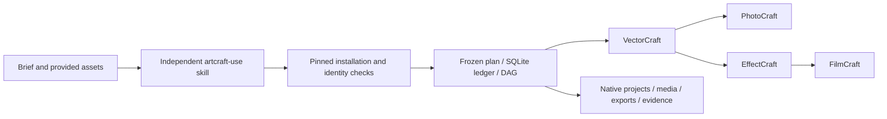

# ArtCraft Agent Plugin

Cross-tool project planning, asset dependencies, version propagation and selective rework. The independent `artcraft-use` skill runs a pinned runtime and invokes four independent domain skills through public scripts.

[English](README.md) | [简体中文](README.zh-CN.md)

> Implementation in progress. Four-domain native handoff, durable CLI resume and clean first use through default online downloads pass. Host installation, provider invoice settlement, final creative review and complete recovery remain unfinished.

## At a glance



| Property | Current state |
| --- | --- |
| Plugin ID / version | artcraft / 0.1.0-dev.1 |
| Specification authority | openspec/changes/establish-v1-plugin |
| Skill authority | Independent artcraft-skills / published v0.1.0-dev.1 |
| Runtime | macOS arm64; Python 3.11+; pinned Node installed automatically |
| Native delivery | .vectorcraft / .pcraft / .ecproj / .fcproj |
| Host and marketplace | Codex development install/discovery pass; production marketplace not eligible |

## Capabilities and boundaries

| Capability | Verified | Remaining work |
| --- | --- | --- |
| Planning and routing | Skill-led decomposition; explicit nodes bind actual capabilities | Automatic constraint inference; existing Jianying/Factory adapters |
| Dependency execution | DAG checks, bounded concurrency, one writer per project, verified inputs | Complete crash adoption |
| Versions and rework | Hashes, lineage, no-replay reuse, Logo consumer rebuilds | Native source-project revision bindings |
| Technical delivery | Native projects, collected media, previews, exports and public receipts | Complete media metadata, loss reports and final packaging |
| Evaluation | File/reference hashes, native reopen and real decode tests | Cross-artifact creative consistency and final review |
| Installation | Clean single skill, default online locked bundles, four official CLI installations | Host installation |

## Quick start

Run `scripts/workflow.py` from the actual independent skill directory. It installs pinned dependencies and creates the project ledger. The example requires an existing WAV; see the package's SKILL.md and workflow contract.

```text
python3 <skill-root>/scripts/workflow.py <plan.json> \
  --output <absolute-project-dir> --authorization <existing-scope-ref> \
  --asset voice=<absolute-voice.wav>
```

Default online downloads passed in a fresh runtime directory with only one copied skill and no global Node; see [online evidence](docs/evidence/online-first-use.json). Offline archive options also preserve hash checks. The actual CLI argv is `[nodeExecutable, entryPoint, ...]`; public commands are run, status and cancel.

## Architecture and documentation

- [Complete runtime architecture](docs/ArtCraft-Runtime-Architecture.md)
- [Domain design](docs/ArtCraft-Domain-Design.md)
- [Public protocol](docs/ArtCraft-Protocol-Implementation.md)
- [Task ledger](docs/ArtCraft-Task-Ledger.md)
- [Local execution](docs/ArtCraft-Local-Execution.md)
- [Dependency scheduling](docs/ArtCraft-Workflow-Scheduling.md)
- [Public skill adapter](docs/ArtCraft-Public-Skill-Adapter.md)
- [Four-domain native handoff](docs/ArtCraft-Native-Handoff.md)
- [First-use installation design](docs/ArtCraft-First-Use.md)
- [Complete documentation index](docs/README.md)
- [OpenSpec proposal](openspec/changes/establish-v1-plugin/proposal.md) and [tasks](openspec/changes/establish-v1-plugin/tasks.md)

## Reliability and verification

Trusted configuration pins interpreter, scripts, native executables and output roots; public payloads cannot choose executable code. Python runs isolated without bytecode caches. The runner persists intent, supervises process groups and verifies outputs before releasing ownership. Unknown outcomes are not replayed. The skill entry also serializes project-directory calls, freezes plans and registries and preserves existing user directories.

The runtime's 58-test regression passes; see [native evidence](docs/evidence/native-mixed-tests.json). Independent installation and first-use evidence is in [setup records](docs/evidence/artcraft-setup-tests.json). Local installation, online download, native delivery, creative acceptance and host installation are separate evidence scopes. `review_ready` denotes technical readiness.

## Specification, contribution and license

The existing OpenSpec change remains the sole authority. Check tasks only against their actual scope; complete scenarios stay in progress until accepted. Hosts, provider invoice settlement, creative review and complete recovery remain unfinished.

```bash
python3 scripts/validate_docs.py
openspec validate establish-v1-plugin --strict --no-interactive
```

These validate documentation and specifications only. Original code uses [Apache-2.0](LICENSE). Node and official CLI licenses are retained separately. Restricted upstream ArtCraft/Services code and brand assets are not copied.

[Upstream reference](https://github.com/storytold/artcraft) · [Issues](https://github.com/full-aigc-plugins/artcraft-plugin/issues)

Independent skills are now pinned at the published development tag `v0.1.0-dev.1`, including the exact source commit and whole-skill digest in `skills.lock.json`. Verify using `python3 scripts/vendor/skill_vendor.py check`. These source snapshots do not establish plugin-host acceptance or production readiness.

## Codex development host checks

All five plugins installed from public tags into an isolated Codex configuration. App-server discovered their namespaced skills without loading errors; the installed ArtCraft entry produced four native projects. [Host evidence](docs/evidence/codex-installation.json). These controlled development checks do not establish desktop GUI, other hosts, complete creative or production marketplace acceptance.

## Shared budget admission

The development runtime now freezes one account per owner/workflow/authorization, reserves trusted cost bounds before native execution and limits subsequent plan revisions. Replays do not allocate twice; unknown outcomes keep their reservation. [Architecture and migration contract](docs/ArtCraft-Budget-Architecture.md). Paid-provider settlement and quality stagnation loops remain pending.
