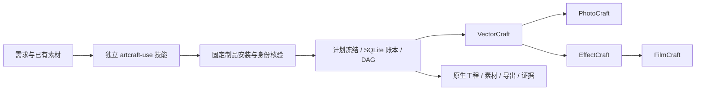

# ArtCraft Agent Plugin

跨工具项目规划、素材依赖、版本传播和选择性返工。独立 `artcraft-use` 技能调用锁定运行时，再通过四个独立领域技能的公开脚本执行。

[English](README.md) | [简体中文](README.zh-CN.md)

## 当前版本与可复现宿主验证

此前完成宿主验证的插件/技能源版本：`0.1.0-dev.8`。Codex 0.147.0 与 0.153.4 均安装五个固定公开发布，发现全部 58 项启用的命名空间技能，加载错误为零，来源摘要一致。五项代表流程已通过 0.147.0 安装后的场景技能入口验证，包括原生工程、局部修订和 ArtCraft 在线混合流程。模型自动派发、桌面 GUI、创作最终评审和完整交换保真尚未验证。

[宿主验证设计](docs/ArtCraft-Host-Verification-Architecture.zh_CN.md) · [绑定版本的证据](docs/evidence/codex-skill-suite.json)。历史里程碑保留原证据范围；当前版本身份以 manifest 和锁文件为准。

> 实施中。四领域原生交接、CLI 账本重开以及默认在线下载的干净首次安装已通过。当前版本完整宿主验收、付费账单核销和创作最终评审仍未完成；worker/提交窗口未知时保留占用等待核对。

## 一眼了解



| 属性 | 当前状态 |
| --- | --- |
| Plugin ID / 版本 | artcraft / 0.1.0-dev.8 |
| 规格事实源 | openspec/changes/establish-v1-plugin |
| 技能事实源 | 独立 artcraft-skills / 已发布 v0.1.0-dev.8 |
| 运行环境 | macOS arm64；Python 3.11+；自动安装固定 Node |
| 原生交付 | .vectorcraft / .pcraft / .ecproj / .fcproj |
| 宿主与市场 | Codex 受控安装与发现通过；尚不进入正式市场 |

## 能力与边界

| 能力 | 已验证 | 尚未完成 |
| --- | --- | --- |
| 计划与路由 | 技能指导拆解；显式节点选择真实能力快照 | 自动约束推导；既有剪映/Factory 适配 |
| 依赖调度 | DAG、并发上限、同工程单写、输入核验与原任务接管 | worker/提交窗口未知时等待核对 |
| 素材版本与返工 | 内容摘要、血缘、重跑复用、Logo 下游重建 | 完整创作修订协调 |
| 技术交付 | 原生工程、收集素材、预览、导出、移动包和摘要绑定损失报告 | 完整媒体元数据、跨编辑器保真与创作审核 |
| 评估 | 文件与引用摘要、原生重开、实际输出解码测试 | 跨产物创作一致性与最终审核 |
| 安装 | 单技能默认在线安装、四个官方 CLI 实装、Codex 受控安装与发现 | GUI 与其他宿主完整验收 |

## 快速开始

开发源技能使用实际目录运行 `scripts/workflow.py`。它安装全部锁定依赖并生成项目账本；示例需要已有 WAV，参见独立包中的 SKILL.md 和工作流合同。

```text
python3 <skill-root>/scripts/workflow.py <plan.json> \
  --output <absolute-project-dir> --authorization <existing-scope-ref> \
  --asset voice=<absolute-voice.wav>
```

默认在线下载已在只复制单技能、无全局 Node 的新运行时目录通过；参见[在线证据](docs/evidence/online-first-use.json)。离线制品参数也保留摘要校验。实际 CLI argv 为 `[nodeExecutable, entryPoint, ...]`，命令为 run、status、cancel。

## 架构与文档

- [完整运行时架构](docs/ArtCraft-Runtime-Architecture.zh_CN.md)
- [领域技术设计](docs/ArtCraft-Domain-Design.zh_CN.md)
- [公共协议](docs/ArtCraft-Protocol-Implementation.zh_CN.md)
- [任务账本](docs/ArtCraft-Task-Ledger.zh_CN.md)
- [本地执行](docs/ArtCraft-Local-Execution.zh_CN.md)
- [依赖调度](docs/ArtCraft-Workflow-Scheduling.zh_CN.md)
- [公开技能适配](docs/ArtCraft-Public-Skill-Adapter.zh_CN.md)
- [四领域原生交接](docs/ArtCraft-Native-Handoff.zh_CN.md)
- [首次使用安装设计](docs/ArtCraft-First-Use.zh_CN.md)
- [完整文档导航](docs/README.zh-CN.md)
- [OpenSpec proposal](openspec/changes/establish-v1-plugin/proposal.md)与[tasks](openspec/changes/establish-v1-plugin/tasks.md)

## 可靠性与验证

可信配置固定解释器、脚本、原生 CLI 与输出根；公共 payload 不能选择可执行代码。Python 使用隔离模式并禁止字节码缓存。执行器登记意图、监督进程组、核验输出后释放写占用；未知结果不自动重放。技能项目入口另外串行化同目录调用，冻结计划和登记表，不覆盖用户已有目录。

ArtCraft dev.7 运行时 79 项原生回归通过，见[交换报告证据](docs/evidence/exchange-loss.json)。独立技能安装与首次使用证据见[安装记录](docs/evidence/artcraft-setup-tests.json)。本地安装、在线下载、原生交付、创作验收和宿主安装分开报告。`review_ready` 是技术就绪，不是创作完成。

## 规范、贡献与许可

保持现有 OpenSpec 为唯一规范事实源；任务仅按实际范围勾选，完整场景未验收时保持进行中。宿主、付费账单核销、创作审核与完整恢复仍需后续实现。

```bash
python3 scripts/validate_docs.py
openspec validate establish-v1-plugin --strict --no-interactive
```

以上只校验文档与规范。原创内容使用 [Apache-2.0](LICENSE)。Node 与四款官方 CLI 的许可分别保留；不复制受限 ArtCraft/Services 上游代码或品牌资产。

[上游参考](https://github.com/storytold/artcraft) · [Issues](https://github.com/full-aigc-plugins/artcraft-plugin/issues)

独立技能现已绑定当前已发布开发标签 `v0.1.0-dev.9`，`skills.lock.json` 固定来源提交与整个技能摘要。使用 `python3 scripts/vendor/skill_vendor.py check` 核对。技能源快照发布不代表宿主验收或生产完成。

## Codex 开发版宿主验证

五个插件已在隔离 Codex 配置中从公开标签安装，app-server 发现带命名空间的技能且无加载错误；安装缓存中的 ArtCraft 入口已交付四种原生工程。[宿主证据](docs/evidence/codex-installation.json)。此为受控开发验收，不代表桌面 GUI、其他宿主、完整创作或正式市场发布通过。

## 共享预算准入

开发运行时为 owner/workflow/authorization 固定一个预算账户，在原生执行前分配可信消耗上界，并限制后续计划修订。重跑不重复分配；未知结果保留占用。[架构与迁移合同](docs/ArtCraft-Budget-Architecture.zh_CN.md)。付费服务核销与质量停滞循环仍待完成。

版本 `0.1.0-dev.1` 已通过[默认在线首次使用与有界 Logo 返工](docs/evidence/online-first-use-v1.json)：四种输出更新，旧原生工程摘要与输入音频保持不变，重跑不多扣轮次，第三次计划修订被拒绝。

新开发版本也已通过[Codex 安装技能实际执行](docs/evidence/codex-installation-v1.json)，包括有界 Logo 返工；此为受控宿主证据，不代替桌面 GUI 或正式市场验收。

开发版本 `0.1.0-dev.3` 接通四领域登记源工程的公开修订接口，另存新交付、核验旧包不变并收集继承素材。详见[修订架构](docs/ArtCraft-Runtime-Architecture.zh_CN.md#101-原生源工程修订适配开发版本-3)和[验证证据](docs/evidence/native-source-revision.json)。原生回归按测试文件串行；并行 EffectCraft 偶发失败尚未解决。

版本 3 已通过[默认在线首次使用和原生 Logo 修订](docs/evidence/online-first-use-v3.json)：单技能安装依赖、四原生交付、登记旧工程改色、下游更新、旧包与音频保留、重跑复用和预算阻断。此证据不代表新版宿主入口或创作最终验收。

开发版本 `0.1.0-dev.4` 使用四领域技能源 dev.1，修复了之前的并行失败：原因是 CLI 复用抢占非阻塞安装锁，并非已证实的渲染问题。修复后 16/16 并行合成样本、59 项并行原生回归以及四领域合计 71 项真实技能测试通过。[证据](docs/evidence/install-concurrency.json)。

版本 4 已通过[默认在线首次使用](docs/evidence/online-first-use-v4.json)，包含四种原生交付、旧 Logo 原生修改、下游更新、源工程与音频保留以及预算限制。公开运行时和四个技能 ZIP 的摘要与安装锁一致。

开发版本 `0.1.0-dev.5` 提供可信账本交付打包与移动验包：收集四类原生工程、登记素材、预览、导出、原始计划和任务记录，返回独立清单 SHA；已有目录不覆盖，未就绪或活跃工程拒绝。实际删除原目录/音频后，移动包中的四类原生工程均可重开并重新导出。[证据](docs/evidence/project-package.json)。状态保留技术待审。

版本 5 的[默认在线完整入口验收](docs/evidence/online-first-use-v5.json)已通过：安装、原生修订、公开打包、删除原工作目录后移动验包。OpenSpec 的 AC-AR-001 三项任务已按证据完成；创作审核与完整交换损失仍待验收。

开发版本 `0.1.0-dev.6` 增加独立原生监督与原任务接管。调度器/worker SIGKILL、调度器退出后取消、DAG 接管、并发恢复及真实 EffectCraft 渲染通过，76 项并行原生回归全部通过。worker/提交窗口未知时保留占用；创作审核与完整当前宿主验收继续推进。

dev.6 默认在线验收通过：仅复制一个技能目录、空运行时、无离线覆盖。原生操作运行期间 kill 安装后的调度器，再从同一公开 workflow 入口恢复，原 attempt 保持，恰好四次执行，无残留租约或重复预算占用。源工程修订及移动包核验同时通过；见[在线证据](docs/evidence/online-first-use-v6.json)。

当前开发里程碑为原生交付增加摘要绑定的交换损失报告，区分 lost、observed、unknown；派生导出不替代原生工程。跨编辑器字体、效果和蒙版保真尚未验证，完整交换验收任务保持未完成。

dev.7 默认在线首次使用 53.106 秒通过：单个复制技能、空运行时、无离线覆盖；四个原生交付均含摘要绑定交换报告，源工程修订、调度器恢复与移动包核验通过。见[在线证据](docs/evidence/online-first-use-v7.json)。

## CLI 与场景技能体系

技能源包含 10 项可独立安装的技能，分为安装、CLI 公共操作与场景任务。[架构与清单](docs/ArtCraft-Skill-Suite-Architecture.zh_CN.md)。运行时与插件版本分别维护；旧宿主证据保持原版本范围。

当前插件版本：`0.1.0-dev.10`；技能源版本：`0.1.0-dev.9`。命令示例以宿主实际加载的 `SKILL.md` 所在目录调用脚本。全部技能在用户、项目与插件三种含空格布局中通过隔离入口检查。[路径证据](docs/evidence/installed-skill-paths.json)。此前宿主验证仍对应其记录版本，既有安装需更新。

插件 `0.1.0-dev.10` 从固定公开标签重新取快照并修正整个技能摘要，未带入本地 Python 缓存。插件标签 `v0.1.0-dev.9` 的摘要误包含被忽略的开发缓存，已被替代，不可安装该标签。

当前插件 `0.1.0-dev.11` 固定技能源 `0.1.0-dev.10`，运行时保持 dev.7。单技能默认公开下载冷安装全部依赖，使用 PhotoCraft/VectorCraft dev.5 交付四份原生工程、复用任务并完成打包/移动/验包。回归 20 项通过、1 项 Node 专用离线制品测试跳过。[证据](docs/evidence/online-domain-upgrade.json)。旧插件适配及完整宿主/模型/创作验收仍未完成。
