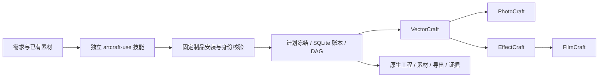

# ArtCraft Agent Plugin

当前插件 dev.47／技能源 dev.35／运行时 dev.45 固定 FilmCraft 技能源 dev.7。固定公开安装和静态音轨增益局部返工首次使用复验通过，全部 58 项安装技能摘要保留。历史证据保持原发行范围；完整首版／模型／GUI／创作验收仍开放。

[English](README.md) | [简体中文](README.zh-CN.md)

## 当前版本与可复现宿主验证

当前插件 `0.1.0-dev.49`，独立技能源 `0.1.0-dev.36`，运行时 `0.1.0-dev.48`。固定公开安装后首次使用复验在已记录范围通过。历史证据保持原发行范围；完整首版／模型／GUI／创作验收仍开放。

固定 dev.38 验收：Codex 0.153.4 发现 58 项技能，加载错误为零；实际安装目录的单技能在线冷启动通过 3 项、无跳过，95.289 秒。四源返工、三领域尺寸修改、保存后产物摘要、Effect 实际视频属性、复用和源工程保全均通过，58 个安装技能摘要未变。[证据](docs/evidence/codex-release38-native-brief-first-use-20261006.json)。运行时回归 123 项通过、5 项可选跳过；完整模型／GUI／创作／生产验收仍开放。dev.37 标签因暂存失败保留历史，未创建 Release，也不作为插件快照使用。

[宿主验证设计](docs/ArtCraft-Host-Verification-Architecture.zh_CN.md) · [绑定版本的证据](docs/evidence/codex-skill-suite.json)。历史里程碑保留原证据范围；当前版本身份以 manifest 和锁文件为准。

> 实施中。四领域原生交接、CLI 账本重开以及默认在线下载的干净首次安装已通过。当前版本完整宿主验收、付费账单核销和创作最终评审仍未完成；worker/提交窗口未知时保留占用等待核对。

## 一眼了解



| 属性 | 当前状态 |
| --- | --- |
| Plugin ID / 版本 | artcraft / 0.1.0-dev.49 |
| 规格事实源 | openspec/changes/establish-v1-plugin |
| 技能事实源 | 独立 artcraft-skills / 已发布 v0.1.0-dev.36 |
| 运行环境 | macOS arm64；Python 3.11+；自动安装固定 Node |
| 原生交付 | .vectorcraft / .pcraft / .ecproj / .fcproj |
| 宿主与市场 | Codex 受控安装与发现通过；尚不进入正式市场 |

## 能力与边界

剪映使用自己的独立插件。ArtCraft 不包含剪映适配，也不负责安装或调用剪映；剪映原生工程需求交给独立剪映插件处理，不静默转换为 FilmCraft 工程。

| 能力 | 已验证 | 尚未完成 |
| --- | --- | --- |
| 计划与路由 | 技能指导拆解；显式节点选择真实能力快照 | 自动约束推导；其余 Factory 适配 |
| 依赖调度 | DAG、并发上限、同工程单写、输入核验与原任务接管 | worker/提交窗口未知时等待核对 |
| 素材版本与返工 | 内容摘要、血缘、重跑复用、Logo 下游重建 | 完整创作修订协调 |
| 技术交付 | 原生工程、收集素材、预览、导出、移动包和摘要绑定损失报告 | 完整媒体元数据、跨编辑器保真与创作审核 |
| 评估 | 文件与引用摘要、原生重开、实际输出解码测试 | 跨产物创作一致性与最终审核 |
| 安装 | 单技能默认在线安装、四个官方 CLI 实装、Codex 受控安装与发现 | GUI 与其他宿主完整验收 |

## 快速开始

开发源技能使用实际目录运行 `scripts/workflow.py`。它安装全部锁定依赖并生成项目账本；示例需要已有 WAV，参见独立包中的 SKILL.md 和工作流合同。

```text
python3 <skill-root>/scripts/workflow.py <plan.json> \
  --output <absolute-project-dir> --authorization <existing-scope-ref> \
  --asset voice=<absolute-voice.wav>
```

默认在线下载已在只复制单技能、无全局 Node 的新运行时目录通过；参见[在线证据](docs/evidence/online-first-use.json)。离线制品参数也保留摘要校验。实际 CLI argv 为 `[nodeExecutable, entryPoint, ...]`，命令为 run、status、cancel。

## 架构与文档

- [完整运行时架构](docs/ArtCraft-Runtime-Architecture.zh_CN.md)
- [领域技术设计](docs/ArtCraft-Domain-Design.zh_CN.md)
- [公共协议](docs/ArtCraft-Protocol-Implementation.zh_CN.md)
- [任务账本](docs/ArtCraft-Task-Ledger.zh_CN.md)
- [本地执行](docs/ArtCraft-Local-Execution.zh_CN.md)
- [依赖调度](docs/ArtCraft-Workflow-Scheduling.zh_CN.md)
- [公开技能适配](docs/ArtCraft-Public-Skill-Adapter.zh_CN.md)
- [四领域原生交接](docs/ArtCraft-Native-Handoff.zh_CN.md)
- [首次使用安装设计](docs/ArtCraft-First-Use.zh_CN.md)
- [完整文档导航](docs/README.zh-CN.md)
- [OpenSpec proposal](openspec/changes/establish-v1-plugin/proposal.md)与[tasks](openspec/changes/establish-v1-plugin/tasks.md)

## 可靠性与验证

可信配置固定解释器、脚本、原生 CLI 与输出根；公共 payload 不能选择可执行代码。Python 使用隔离模式并禁止字节码缓存。执行器登记意图、监督进程组、核验输出后释放写占用；未知结果不自动重放。技能项目入口另外串行化同目录调用，冻结计划和登记表，不覆盖用户已有目录。

ArtCraft dev.7 运行时 79 项原生回归通过，见[交换报告证据](docs/evidence/exchange-loss.json)。独立技能安装与首次使用证据见[安装记录](docs/evidence/artcraft-setup-tests.json)。本地安装、在线下载、原生交付、创作验收和宿主安装分开报告。`review_ready` 是技术就绪，不是创作完成。

## 规范、贡献与许可

保持现有 OpenSpec 为唯一规范事实源；任务仅按实际范围勾选，完整场景未验收时保持进行中。宿主、付费账单核销、创作审核与完整恢复仍需后续实现。

```bash
python3 scripts/validate_docs.py
openspec validate establish-v1-plugin --strict --no-interactive
```

以上只校验文档与规范。原创内容使用 [Apache-2.0](LICENSE)。Node 与四款官方 CLI 的许可分别保留；不复制受限 ArtCraft/Services 上游代码或品牌资产。

[上游参考](https://github.com/storytold/artcraft) · [Issues](https://github.com/full-aigc-plugins/artcraft-plugin/issues)

独立技能现已绑定当前已发布开发标签 `v0.1.0-dev.9`，`skills.lock.json` 固定来源提交与整个技能摘要。使用 `python3 scripts/vendor/skill_vendor.py check` 核对。技能源快照发布不代表宿主验收或生产完成。

## Codex 开发版宿主验证

五个插件已在隔离 Codex 配置中从公开标签安装，app-server 发现带命名空间的技能且无加载错误；安装缓存中的 ArtCraft 入口已交付四种原生工程。[宿主证据](docs/evidence/codex-installation.json)。此为受控开发验收，不代表桌面 GUI、其他宿主、完整创作或正式市场发布通过。

## 共享预算准入

开发运行时为 owner/workflow/authorization 固定一个预算账户，在原生执行前分配可信消耗上界，并限制后续计划修订。重跑不重复分配；未知结果保留占用。[架构与迁移合同](docs/ArtCraft-Budget-Architecture.zh_CN.md)。付费服务核销与质量停滞循环仍待完成。

版本 `0.1.0-dev.1` 已通过[默认在线首次使用与有界 Logo 返工](docs/evidence/online-first-use-v1.json)：四种输出更新，旧原生工程摘要与输入音频保持不变，重跑不多扣轮次，第三次计划修订被拒绝。

新开发版本也已通过[Codex 安装技能实际执行](docs/evidence/codex-installation-v1.json)，包括有界 Logo 返工；此为受控宿主证据，不代替桌面 GUI 或正式市场验收。

开发版本 `0.1.0-dev.3` 接通四领域登记源工程的公开修订接口，另存新交付、核验旧包不变并收集继承素材。详见[修订架构](docs/ArtCraft-Runtime-Architecture.zh_CN.md#101-原生源工程修订适配开发版本-3)和[验证证据](docs/evidence/native-source-revision.json)。原生回归按测试文件串行；并行 EffectCraft 偶发失败尚未解决。

版本 3 已通过[默认在线首次使用和原生 Logo 修订](docs/evidence/online-first-use-v3.json)：单技能安装依赖、四原生交付、登记旧工程改色、下游更新、旧包与音频保留、重跑复用和预算阻断。此证据不代表新版宿主入口或创作最终验收。

开发版本 `0.1.0-dev.4` 使用四领域技能源 dev.1，修复了之前的并行失败：原因是 CLI 复用抢占非阻塞安装锁，并非已证实的渲染问题。修复后 16/16 并行合成样本、59 项并行原生回归以及四领域合计 71 项真实技能测试通过。[证据](docs/evidence/install-concurrency.json)。

版本 4 已通过[默认在线首次使用](docs/evidence/online-first-use-v4.json)，包含四种原生交付、旧 Logo 原生修改、下游更新、源工程与音频保留以及预算限制。公开运行时和四个技能 ZIP 的摘要与安装锁一致。

开发版本 `0.1.0-dev.5` 提供可信账本交付打包与移动验包：收集四类原生工程、登记素材、预览、导出、原始计划和任务记录，返回独立清单 SHA；已有目录不覆盖，未就绪或活跃工程拒绝。实际删除原目录/音频后，移动包中的四类原生工程均可重开并重新导出。[证据](docs/evidence/project-package.json)。状态保留技术待审。

版本 5 的[默认在线完整入口验收](docs/evidence/online-first-use-v5.json)已通过：安装、原生修订、公开打包、删除原工作目录后移动验包。OpenSpec 的 AC-AR-001 三项任务已按证据完成；创作审核与完整交换损失仍待验收。

开发版本 `0.1.0-dev.6` 增加独立原生监督与原任务接管。调度器/worker SIGKILL、调度器退出后取消、DAG 接管、并发恢复及真实 EffectCraft 渲染通过，76 项并行原生回归全部通过。worker/提交窗口未知时保留占用；创作审核与完整当前宿主验收继续推进。

dev.6 默认在线验收通过：仅复制一个技能目录、空运行时、无离线覆盖。原生操作运行期间 kill 安装后的调度器，再从同一公开 workflow 入口恢复，原 attempt 保持，恰好四次执行，无残留租约或重复预算占用。源工程修订及移动包核验同时通过；见[在线证据](docs/evidence/online-first-use-v6.json)。

当前开发里程碑为原生交付增加摘要绑定的交换损失报告，区分 lost、observed、unknown；派生导出不替代原生工程。跨编辑器字体、效果和蒙版保真尚未验证，完整交换验收任务保持未完成。

dev.7 默认在线首次使用 53.106 秒通过：单个复制技能、空运行时、无离线覆盖；四个原生交付均含摘要绑定交换报告，源工程修订、调度器恢复与移动包核验通过。见[在线证据](docs/evidence/online-first-use-v7.json)。

## CLI 与场景技能体系

技能源包含 10 项可独立安装的技能，分为安装、CLI 公共操作与场景任务。[架构与清单](docs/ArtCraft-Skill-Suite-Architecture.zh_CN.md)。运行时与插件版本分别维护；旧宿主证据保持原版本范围。

此前验证插件版本：`0.1.0-dev.10`；技能源版本：`0.1.0-dev.9`。命令示例以宿主实际加载的 `SKILL.md` 所在目录调用脚本。全部技能在用户、项目与插件三种含空格布局中通过隔离入口检查。[路径证据](docs/evidence/installed-skill-paths.json)。此前宿主验证仍对应其记录版本，既有安装需更新。

插件 `0.1.0-dev.10` 从固定公开标签重新取快照并修正整个技能摘要，未带入本地 Python 缓存。插件标签 `v0.1.0-dev.9` 的摘要误包含被忽略的开发缓存，已被替代，不可安装该标签。

此前验证插件 `0.1.0-dev.11` 固定技能源 `0.1.0-dev.10`，运行时保持 dev.7。单技能默认公开下载冷安装全部依赖，使用 PhotoCraft/VectorCraft dev.5 交付四份原生工程、复用任务并完成打包/移动/验包。回归 20 项通过、1 项 Node 专用离线制品测试跳过。[证据](docs/evidence/online-domain-upgrade.json)。旧插件适配及完整宿主/模型/创作验收仍未完成。

此前验证插件 `0.1.0-dev.12` 固定技能源 `0.1.0-dev.11`，运行时保持 dev.7。修正场景合同中的过期预算/修订/恢复说明，验证单个返工技能默认在线冷启动和五节点项目的四种源工程修订；无关节点复用，旧工程、动画、音轨与字幕保留。逐次独立安装素材、交付、审阅和恢复技能后，账本查询、移动验包与停止任务幂等取消通过。完整回归 22 项通过、1 项 Node 专用离线测试跳过。[证据](docs/evidence/task-skill-first-use.json)。完整模型派发、创作、worker 崩溃及旧插件适配仍未完成。

此前验证插件 dev.14 / 运行时 dev.13 固定技能套件 dev.12，支持可选 Video Factory 0.4.0 公开验证节点。现有插件和 FFmpeg/ffprobe 按实际路径登记并冻结摘要，模型 payload 不能选择命令或执行器。真实门禁、输入绑定、报告语法与打包保留通过验证；缺来源门禁保持 NOT_RUN，必需 FAIL 阻断交付。83 项原生回归全部通过。默认公开在线首次使用已通过：24 项通过、1 项 Node 专用离线测试跳过；单独安装的技能冷启动依赖、执行五节点并验包。插件 dev.14 修复 dev.13 快照的 OpenSpec 重复任务编号并加入回归检查；运行时 dev.13 的公开字节和摘要保持不变。[架构](docs/ArtCraft-VideoFactory-Architecture.zh_CN.md)、[候选证据](docs/evidence/video-factory-candidate.json)、[在线证据](docs/evidence/video-factory-online.json)。旧插件渲染、图片工厂适配及完整模型/创作验收仍未完成。

当前插件 dev.15 固定技能套件 dev.13，运行时保持 dev.13。EffectCraft 技能 dev.6 支持原生蒙版顶点修订，仅更新片头和消费它的成片，Logo/海报任务复用。原文件摘要、透明度关键帧、音轨与字幕保留，真实 RGBA 边界和四子交付验包通过；完整默认在线回归 25 项通过、1 项 Node 专用离线测试跳过，原生集成 83 项通过。[架构](docs/ArtCraft-Mask-Revision-Architecture.zh_CN.md)、[证据](docs/evidence/mask-revision-first-use.json)。宿主/模型、创作与更广旧插件适配仍未完成。

当前固定发布的宿主刷新：Codex 0.153.4 在隔离配置安装 FilmCraft dev.5、EffectCraft dev.7、PhotoCraft/VectorCraft dev.6、ArtCraft dev.15，加载并核对全部 58 技能身份。实际安装内容的五代表工作流通过，调用后 58 个技能摘要保持不变；显式标签矩阵生成器四项边界测试通过。[证据](docs/evidence/codex-current-release-20261006.json)。模型派发等待明确授权；GUI、创作和生产验收仍未完成。本次 QA 维护不修改已发布插件/技能/运行时标签。

技能套件 dev.14 固定编排运行时 dev.16 和 FilmCraft dev.5（维护版 CLI 0.2.0-craft.1），支持完整 Git 发布 ZIP 与原工程媒体保留绑定。单返工技能默认在线冷启动完成四工程、中文配音及字幕烧录，字幕修订仅更新 FilmCraft，保留旧文件、音轨及三个任务身份；2 项测试通过，成片 72 帧，四子交付验包通过。[架构](docs/ArtCraft-Chinese-Mixed-Architecture.zh_CN.md)、[证据](docs/evidence/chinese-mixed-first-use.json)。完整创作、GUI 与模型调度验收仍待完成。

插件 dev.18 内置独立技能源 dev.16，编排运行时保持 dev.16。十个技能先安装基础编排运行时，再由任务图选择领域；只做 Logo 不安装其他领域，追加海报增量安装 PhotoCraft，查询/打包/验包不补装无关 CLI。35 项默认在线回归通过、1 项 Node 离线测试未运行；指引与守卫另有 6 项通过。[架构](docs/ArtCraft-Selected-Setup-Architecture.zh_CN.md)、[证据](docs/evidence/selected-domain-first-use.json)。新发布的宿主模型调度与完整创作验收仍未完成。

插件 dev.19 锁定技能源 dev.17，各独立技能均包含当前交付审阅记录器；编排运行时仍为 dev.16。记录具名观察及可移动证据，缺少创作／人工接受时保持 pending，不改变账本。6 个审阅单元测试及 1 个源码单技能首次原生调用通过，测试观察不证明创作验收。[架构](docs/ArtCraft-Review-Records-Architecture.zh_CN.md)、[证据](docs/evidence/review-record-first-use.json)。当前固定发布版宿主证据见下文。

固定发行版 dev.19 宿主验证：五插件共 58 技能发现成功、加载错误为零；实际安装的审阅技能通过 1 个公开冷启动首次调用测试，耗时 30.165 秒。执行后全部技能仍与锁定摘要一致。此结果证明审阅记录合同，未证明模型调度、GUI 或完整创作验收。[宿主证据](docs/evidence/codex-release19-review-first-use-20261006.json)。

插件 dev.20 锁定发布的独立技能源 dev.18 返工脚本，运行时仍为 dev.16。它接收冻结策略、已核验交付包与审阅、明确的原生补丁，保留原交付，支持轮次、停滞、预算停止和中断恢复。[架构](docs/ArtCraft-Revision-Cycle-Architecture.zh_CN.md)。固定发行版宿主验证单独记录；反馈 fixture 不证明创作验收。

插件 dev.20 固定发行版宿主验证通过：五插件共 58 项技能发现正常、加载错误为零；实际安装的返工技能通过默认在线冷启动及真实进程中断恢复，用时 47.636 秒。运行后全部技能摘要仍与发行版锁定值一致。发布提交的文档／OpenSpec 和实现 CI 均通过；Linux 运行时 CI 为 79 项通过、5 项跳过，不能作为 macOS 原生验收。[证据](docs/evidence/codex-release20-revision-first-use-20261006.json)。模型派发、GUI 和完整创作验收仍未完成。

当前固定发行版混合审阅：插件 dev.20、技能源 dev.18 的实际安装内容通过两项中文原生首次使用／返工测试。当前助手查看四个真实输出，保存摘要绑定的模型观察并重新核验。仅改字幕的 v2 测试刻意保留原配音、改变文字，因此文案与配音一致性为 FAIL；工程／技术 PASS 不代表创作验收。人工接受仍为 NOT_RUN。[证据](docs/evidence/installed-mixed-observation.json)。本次 QA 未创建新原生发行版或新模型会话。

插件 dev.21 锁定技能源 dev.19，运行时仍为 dev.16。停止回执保留最近未解决观察及包／审阅身份，与最佳包分开绑定；旧日志保持 NOT_RUN。技能源原生冷启动通过，固定发行版宿主证据单独记录。[证据](docs/evidence/revision-unresolved-first-use.json)。

插件 dev.21 固定发行版宿主验证通过：五插件、58 项技能、加载错误为零，执行后全部技能摘要不变。实际安装的返工技能通过原生冷启动、未解决问题交付及中断恢复，用时 50.054 秒。[宿主证据](docs/evidence/codex-release21-unresolved-first-use-20261006.json)。发布提交的文档／OpenSpec 和实现 CI 通过。完整创作、模型派发和 GUI 验收仍未完成。

独立 Skills CLI 安装验收已准备，实际执行为 NOT_RUN。验收器读取固定公开技能源版本，核验项目内 58 个安装目录并探测每个原生启动入口，不修改全局技能目录。七项计划／保护／身份测试通过；缺少的安装工具需取得隔离安装授权后才执行。[设计](docs/ArtCraft-Independent-Install-Architecture.zh_CN.md)、[准备证据](docs/evidence/independent-install-readiness.json)。已有插件／原生证据不变。

单技能在线冷启动品牌色混合工作流验证通过：图形、海报、片头、成片更新，独立图标任务复用，旧交付保留。VectorCraft 技能固定 dev.6，ArtCraft 运行时保持 dev.16。技能源 dev.20 已发布，插件 dev.22 已发布；58 个技能的固定发行版宿主发现通过，安装后单技能在线冷启动混合验证通过（54.471 秒）。实际 npx 独立安装与模型派发仍待验证。[架构](docs/ArtCraft-Brand-Token-Mixed-Architecture.zh_CN.md)、[证据](docs/evidence/brand-token-mixed-first-use.json)。

默认 Homebrew Python 3.14.3 通过 58 个逐一独立复制的公开 CLI 入口验证。五领域缓存初始为空，后续同领域探测复用已核验缓存；技能摘要不变。此证据覆盖启动器安装与查询，不替代真实 npx 安装或创作验收。[架构](docs/ArtCraft-Default-Python-Architecture.zh_CN.md)、[证据](docs/evidence/default-python-cli-first-use.json)。

实际宿主安装后的 ArtCraft 混合工作流也通过 Homebrew Python 3.14.3 复验：安装、原生创作、品牌色选择性返工和打包均使用该 Python（2 项测试，49.322 秒）。图像断言使用单独的测试专用 Pillow 进程。[默认 Python 证据](docs/evidence/default-python-cli-first-use.json)。

开发候选 dev.23 引用 ArtCraft 技能 dev.21，固定 VectorCraft 技能 dev.7 和运行时自带示例字体。单技能冷启动原生混合创建、修订与打包验证通过（2 项，56.437 秒）；当前候选的固定宿主安装复验为 NOT_RUN。[证据](docs/evidence/vector-font-mixed-first-use.json)。

已发布技能 dev.21／插件 dev.23 固定宿主发现 58 个技能通过；实际安装的单技能使用默认 Python 3.14.3 冷启动完成原生混合验收（2 项，54.673 秒），全部安装摘要不变。[证据](docs/evidence/codex-release25-vector-font-mixed-20261006.json)。

候选技能 dev.22 修复普通和中文模板的矢量字标默认字体。两个单技能公开冷启动原生流程均通过（各 2 项，52.807／52.964 秒），新固定宿主安装复验仍为 NOT_RUN。[证据](docs/evidence/default-campaign-font-first-use.json)。

已发布技能 dev.22／插件 dev.24 的全部 58 个技能固定宿主发现通过。实际安装单技能冷启动普通源工程返工（2 项，57.177 秒）和中文交付／字幕修订（2 项，57.973 秒）均通过，全部安装摘要不变。此前候选 NOT_RUN 描述发布前检查点。[证据](docs/evidence/codex-release26-default-campaign-20261006.json)。

首版能力、首次安装与剩余门禁逐项记录在[交付核对表](docs/ArtCraft-Delivery-Audit.zh_CN.md)。

插件候选 dev.25 固定技能源 dev.23，先核对冻结修订绑定再发布安装身份。来源独立技能原生首次使用通过（3 项，92.662 秒）；固定插件安装复验仍为 NOT_RUN。[架构](docs/ArtCraft-Frozen-Revision-Metadata-Architecture.zh_CN.md)、[证据](docs/evidence/frozen-revision-metadata-first-use.json)。

已发布插件 dev.25／技能 dev.23 的实际安装单技能原生冷启动、重放和冲突元数据保全通过（3 项，90.697 秒）；宿主发现及执行后摘要核验覆盖全部 58 技能。[证据](docs/evidence/codex-release27-binding-metadata-20261006.json)。

运行时 dev.26 修复跨授权范围的旧任务复用。候选技能源 dev.24 固定其不可变制品，保留同范围选择性复用，同时核对原生产任务授权。单技能原生冷启动通过（20.006 秒）；最终固定插件安装复验仍为 NOT_RUN。[架构](docs/ArtCraft-Authorization-Reuse-Architecture.zh_CN.md)、[证据](docs/evidence/authorization-reuse.json)。

已发布插件 dev.27／技能 dev.24／运行时 dev.26 的实际安装原生授权范围测试通过（1 项，23.649 秒），四领域首次使用／重放／冲突保全／移动验包回归通过（3 项，95.854 秒），全部 58 个安装摘要不变。[证据](docs/evidence/codex-release28-authorization-native-20261006.json)。

插件候选 dev.29 同步已发布技能 dev.25 并锁定运行时 dev.28，支持版本化 Brief。独立单技能在线冷启动通过（3 项，98.048 秒），最终安装宿主 Brief 验收尚待完成。[架构](docs/ArtCraft-Versioned-Brief-Architecture.zh_CN.md)、[证据](docs/evidence/versioned-brief-first-use.json)。

已发布插件 dev.29／技能 dev.25／运行时 dev.28 的实际安装 Brief 在线首次使用复验通过（3 项，89.841 秒），五插件 58 个技能发现通过且执行后摘要不变。整体实现仍未完成。[证据](docs/evidence/codex-release29-brief-native-20261006.json)。

候选插件 dev.30 同步 ArtCraft 技能 dev.26，锁定 PhotoCraft 技能 dev.6 保护修改交接，运行时保持 dev.28。独立在线验收通过，实际安装宿主复验尚待完成。[架构](docs/ArtCraft-Photo-Protection-Architecture.zh_CN.md)、[证据](docs/evidence/photo-protection-first-use.json)。

固定 PhotoCraft 插件 dev.7／技能 dev.6 与 ArtCraft 插件 dev.30／技能 dev.26 的实际安装原生保护／交接复验通过；五插件全部 58 个技能摘要不变。只完成对应保护任务，整体实现和创作接受仍未完成。[证据](docs/evidence/codex-release30-protected-native-20261006.json)。

候选插件 dev.31 固定 ArtCraft 技能源 dev.27 与 PhotoCraft 技能源 dev.7，支持带保护检查的修图交接。源码在线原生测试通过；固定插件安装后证据待完成。运行时仍为 dev.28。

固定 PhotoCraft 插件 dev.8／技能源 dev.7 与 ArtCraft 插件 dev.31／技能源 dev.27 通过安装后的原生修图和交接测试（13.260 秒／23.264 秒）。58 个安装后技能摘要全部保持不变。仅完成有界修图任务；完整目标仍未完成。[证据](docs/evidence/codex-release31-retouch-native-20261006.json)。

本地运行时候选支持有界原生失败诊断，不保存原始输出，并在重复查询工作流时保留诊断。固定发布和安装后的原生复验仍待完成。[架构](docs/ArtCraft-Native-Failure-Diagnostics-Architecture.zh_CN.md)。

候选插件 dev.33 固定 ArtCraft 技能源 dev.28／运行时 dev.32，提供有界失败诊断及持久公开状态／重复查询。源码在线原生证据通过，固定安装后插件复验待完成。

固定 ArtCraft 插件 dev.33／技能源 dev.28／运行时 dev.32 通过安装后的失败／状态／重复执行测试（1 项，26.233 秒）及四领域在线首次使用回归（3 项，95.701 秒）。58 个已安装技能摘要全部保持不变。仅完成有界任务 5.12；完整实施和创作接受仍未完成。[证据](docs/evidence/codex-release33-diagnostics-native-20261006.json)。

本地运行时候选 dev.34 增加 Film Brief 时间线精确预检，以及就绪发布和复用前的保存后工程／成片时长摘要绑定检查。真实本地混合回归通过；固定发布后的首次使用证据仍待完成。 [AC-DM-001-TIME](docs/ArtCraft-Film-Brief-Duration-Architecture.zh_CN.md)。

插件候选 dev.35 同步固定独立技能源 dev.29 和运行时 dev.34。一秒 Film Brief 技能源在线冷安装通过（3 项、93.401 秒）；实际安装宿主首次使用待完成。

固定 ArtCraft 插件 dev.35／技能源 dev.29／运行时 dev.34 已通过实际安装技能的在线首次使用（3 项、94.638 秒），包含一秒原生 Film 时长与成片探测摘要绑定检查。58 个安装技能摘要保持不变。源工程 Brief 检查及完整实施／创作验收仍未完成。 [Evidence](docs/evidence/codex-release35-film-duration-native-20261006.json)。

本地 Film 源工程 Brief 候选在写入前使用固定原生 CLI 读取真实元数据，支持字幕与镜头修订，并在就绪发布前拒绝原生导出成功但时长不符的结果。实际本地原生回归通过；固定发行及安装后的源工程首次使用待完成。Photo／Effect／Vector 源工程 Brief 检查及整体验收仍未完成。 [Architecture](docs/ArtCraft-Film-Source-Brief-Architecture.zh_CN.md)。

本地候选：Photo／Effect／Vector 源适配器已支持绑定身份的原生只读元数据检查；移动交付真实测试通过，源文件不变、零租约。保存后 Brief 门禁与固定安装验收仍在任务 6.28 中开放，本候选尚未发布。

本地候选更新：Photo／Effect／Vector 源 Brief 已接入保存后原生门禁、主 PNG 尺寸、Effect 实际视频探测与缓存复验。真实源返工、尺寸调整与错误结果拒绝本地通过；固定发布冷启动验收仍开放，尚未发布新版本或更新托管技能快照。

[PhotoCraft variant integration / 尺寸变体集成](docs/ArtCraft-Photo-Variant-Integration-Architecture.md) · [中文](docs/ArtCraft-Photo-Variant-Integration-Architecture.zh_CN.md) · [Evidence](docs/evidence/photo-variant-integration.json). Plugin dev.40 / independent skills dev.31 pins PhotoCraft skills dev.8 and retains runtime dev.36. Fixed-host mixed repetition and selective Logo revision passed; full creative acceptance remains open.

Fixed-release proof / 固定发行验收：[dev.40 Photo variant mixed first use](docs/evidence/codex-release40-photo-variant-first-use-20261006.json). Five fixed plugins / 58 skills, cold mixed workflow, selective Logo rework, moved geometry package and tamper rejection; technical evidence only.

[Variant reuse gate](docs/ArtCraft-Photo-Variant-Gate-Architecture.md) · [中文](docs/ArtCraft-Photo-Variant-Gate-Architecture.zh_CN.md) · [Native evidence](docs/evidence/photo-variant-gate-native.json). Plugin dev.42 / skills dev.32 / runtime dev.41; fixed installed repetition passed; full creative acceptance open.

[Fixed dev.42 variant reuse gate / 尺寸变体复用固定验收](docs/evidence/codex-release42-variant-gate-first-use-20261006.json).

ArtCraft 技能源 dev.33 固定 FilmCraft 技能 dev.6，保留运行时 dev.41。公开冷启动 3/3 通过，覆盖原生回执异常拒绝、全部项目文件保留、恢复后复用原任务 ID、四种源工程修订和移动包验证。默认回归 66 项通过、13 项可选跳过。[架构](docs/ArtCraft-Film-Receipt-Integration-Architecture.zh_CN.md)、[源码证据](docs/evidence/film-receipt-integration-native.json)。固定插件 dev.43 宿主证据见下方；完整创作验收仍待完成。

[固定安装首次使用证据](docs/evidence/codex-release43-film-receipt-first-use-20261006.json)。保留不可变发行标签；QA 修改仅加强版本绑定与实际导出像素断言。

五套技能逐项空运行时复验 **58/58 通过**（411.720 秒）：每项仅复制自身，使用独立空运行时自动安装、查询原生版本并核对命令合同；随后删除该运行时。全部原安装技能摘要不变。此项加强此前按领域共用运行时的 CLI 验收，仍不替代场景创作或模型验收。[证据](docs/evidence/codex-release43-every-skill-cold-first-use-20261006.json)。

固定插件 dev.44 与未改变的四领域矩阵已公开安装复验：58 技能发现、零加载错误；单独复制安装后的 setup 技能，从空运行目录安装运行时 dev.41 并核对版本／帮助，无剪映适配命令，全部安装技能摘要保持不变。[发行范围与首次使用证据](docs/evidence/codex-release44-scope-and-cold-cli-20261006.json)。上述混合／原生证据保持其原版本范围。

独立安装验证器现已拒绝同版本的其他工具、包含预期版本的错误诊断和错误的 ArtCraft JSON 身份。目标 7 项通过；全库 57 项中 53 项通过、4 项跳过。重新解析此前记录的 58 项原生输出全部通过，此检查不代表重新执行安装。[身份门禁证据](docs/evidence/independent-install-identity-regression.json)。

安装后的恢复技能从空运行目录首次使用，真实调度器 SIGKILL 后独立 worker 留下停止证据；公开工作流重开同一原生 attempt，不重放、不增加预算，视频确认 96 帧。[崩溃接管验收](docs/ArtCraft-Scheduler-Crash-Acceptance.zh_CN.md)。worker 崩溃、模型及创作验收仍需独立证据。

dev.44 首次使用已知取消问题：原生运行中取消后，短暂进程组存在性 EPERM 使监督器停止观察，可能保持 `cancel_requested`。运行时 dev.45／技能源 dev.34／插件 dev.46 已发布修复并通过固定公开首次使用取消；dev.44 标签保留原内容。[修复与证据](docs/ArtCraft-Live-Cancel-Architecture.zh_CN.md)。

固定插件 dev.46／技能源 dev.34／运行时 dev.45 已通过公开安装后首次使用：真实原生运行中取消（31.291 秒）、调度器 SIGKILL 接管（29.652 秒）、十项 ArtCraft 技能各自空运行目录冷启动（111.779 秒）及混合回归（3 项通过，114.047 秒）。五插件发现 58 技能、零错误，全部安装摘要保持不变，修复了已记录的 dev.44 取消问题。[版本绑定证据](docs/evidence/codex-release46-live-cancel-first-use-20261006.json)。

安装后的 dev.46 截止时间验收通过：恢复技能从空运行目录安装选定依赖，随后四秒执行期限停止实际原生渲染，确认停止后释放占用，依赖消费者未启动。重跑保留原 attempt／预算且不重放。[期限证据](docs/ArtCraft-Deadline-Acceptance.zh_CN.md)。安装时间不计入该执行期限。

必需源音轨失败传递已通过本地候选真实混合测试：保留诊断、阻断后续任务且不重复执行；正常音轨与增益返工同样通过。后续固定公开发行复验记录如下。[方案与候选证据](docs/ArtCraft-Required-Audio-Architecture.zh_CN.md)。

固定 ArtCraft dev.49 在 Codex 0.153.4 首次使用复验通过：58 技能、零加载错误；安装后的混合缺源音轨失败与正常增益返工，以及十项 Art 技能逐项空运行时启动。全部安装摘要保留。[发行绑定证据](docs/evidence/codex-release49-required-audio-mixed-first-use-20261006.json)。完整首版／模型／GUI／创作验收仍开放。
