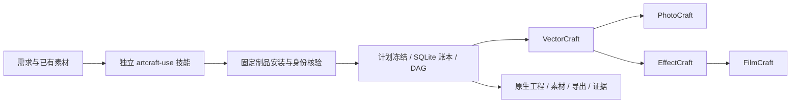

# ArtCraft Agent Plugin

跨工具项目规划、素材依赖、版本传播和选择性返工。独立 `artcraft-use` 技能调用锁定运行时，再通过四个独立领域技能的公开脚本执行。

[English](README.md) | [简体中文](README.zh-CN.md)

> 实施中。四领域原生交接、CLI 账本重开以及默认在线下载的干净首次安装已通过。插件宿主安装、共享预算、创作最终评审与完整恢复仍未完成。

## 一眼了解



| 属性 | 当前状态 |
| --- | --- |
| Plugin ID / 版本 | artcraft / 0.1.0-dev.0 |
| 规格事实源 | openspec/changes/establish-v1-plugin |
| 技能事实源 | 独立 artcraft-skills / 已发布 v0.1.0-dev.0 |
| 运行环境 | macOS arm64；Python 3.11+；自动安装固定 Node |
| 原生交付 | .vectorcraft / .pcraft / .ecproj / .fcproj |
| 宿主与市场 | Codex 受控安装与发现通过；尚不进入正式市场 |

## 能力与边界

| 能力 | 已验证 | 尚未完成 |
| --- | --- | --- |
| 计划与路由 | 技能指导拆解；显式节点选择真实能力快照 | 自动约束推导；既有剪映/Factory 适配 |
| 依赖调度 | DAG、并发上限、同工程单写、输入核验 | 完整故障接管 |
| 素材版本与返工 | 内容摘要、血缘、重跑复用、Logo 下游重建 | 原生源工程修订绑定 |
| 技术交付 | 原生工程与收集素材、预览、导出、公共回执 | 完整媒体元数据、损失报告、最终打包 |
| 评估 | 文件与引用摘要、原生重开、实际输出解码测试 | 跨产物创作一致性与最终审核 |
| 安装 | 干净单技能目录、本地锁定包、四个官方 CLI 实装 | 自有制品在线下载及宿主安装 |

## 快速开始

开发源技能使用实际目录运行 `scripts/workflow.py`。它安装全部锁定依赖并生成项目账本；示例需要已有 WAV，参见独立包中的 SKILL.md 和工作流合同。

```text
python3 <skill-root>/scripts/workflow.py <plan.json> \
  --output <absolute-project-dir> --authorization <existing-scope-ref> \
  --asset voice=<absolute-voice.wav>
```

默认在线下载已在只复制单技能、无全局 Node 的新运行时目录通过；参见[在线证据](docs/evidence/online-first-use.json)。离线制品参数也保留摘要校验。实际 CLI argv 为 `[nodeExecutable, entryPoint, ...]`，命令为 run、status、cancel。

## 架构与文档

- [完整运行时架构](docs/ArtCraft-Runtime-Architecture.zh_CN.md)
- [领域技术设计](docs/ArtCraft-Domain-Design.zh_CN.md)
- [公共协议](docs/ArtCraft-Protocol-Implementation.zh_CN.md)
- [任务账本](docs/ArtCraft-Task-Ledger.zh_CN.md)
- [本地执行](docs/ArtCraft-Local-Execution.zh_CN.md)
- [依赖调度](docs/ArtCraft-Workflow-Scheduling.zh_CN.md)
- [公开技能适配](docs/ArtCraft-Public-Skill-Adapter.zh_CN.md)
- [四领域原生交接](docs/ArtCraft-Native-Handoff.zh_CN.md)
- [首次使用安装设计](docs/ArtCraft-First-Use.zh_CN.md)
- [完整文档导航](docs/README.zh-CN.md)
- [OpenSpec proposal](openspec/changes/establish-v1-plugin/proposal.md)与[tasks](openspec/changes/establish-v1-plugin/tasks.md)

## 可靠性与验证

可信配置固定解释器、脚本、原生 CLI 与输出根；公共 payload 不能选择可执行代码。Python 使用隔离模式并禁止字节码缓存。执行器登记意图、监督进程组、核验输出后释放写占用；未知结果不自动重放。技能项目入口另外串行化同目录调用，冻结计划和登记表，不覆盖用户已有目录。

ArtCraft 运行时 48 项回归通过，见[原生证据](docs/evidence/native-mixed-tests.json)。独立技能安装与首次使用证据见[安装记录](docs/evidence/artcraft-setup-tests.json)。本地安装、在线下载、原生交付、创作验收和宿主安装分开报告。`review_ready` 是技术就绪，不是创作完成。

## 规范、贡献与许可

保持现有 OpenSpec 为唯一规范事实源；任务仅按实际范围勾选，完整场景未验收时保持进行中。宿主、共享预算、创作审核与完整恢复仍需后续实现。

```bash
python3 scripts/validate_docs.py
openspec validate establish-v1-plugin --strict --no-interactive
```

以上只校验文档与规范。原创内容使用 [Apache-2.0](LICENSE)。Node 与四款官方 CLI 的许可分别保留；不复制受限 ArtCraft/Services 上游代码或品牌资产。

[上游参考](https://github.com/storytold/artcraft) · [Issues](https://github.com/full-aigc-plugins/artcraft-plugin/issues)

独立技能现已绑定已发布的开发标签 `v0.1.0-dev.0`，`skills.lock.json` 固定来源提交与整个技能摘要。使用 `python3 scripts/vendor/skill_vendor.py check` 核对。技能源快照发布不代表宿主验收或生产完成。

## Codex 开发版宿主验证

五个插件已在隔离 Codex 配置中从公开标签安装，app-server 发现带命名空间的技能且无加载错误；安装缓存中的 ArtCraft 入口已交付四种原生工程。[宿主证据](docs/evidence/codex-installation.json)。此为受控开发验收，不代表桌面 GUI、其他宿主、完整创作或正式市场发布通过。
