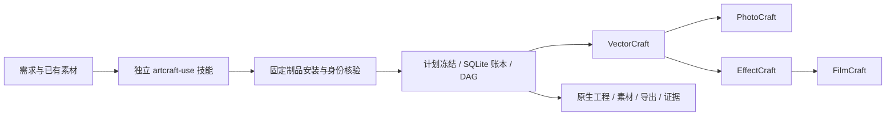

# ArtCraft Agent Plugin

候选模式目录：FilmCraft、PhotoCraft、EffectCraft 实际桌面保存／重开通过；VectorCraft 为763记录／762 ID，`file.place` 参数描述重复冲突，desktop／bridge执行保持拒绝。此候选尚未发行或完成固定安装验收。[模式目录设计与证据](docs/ArtCraft-Mode-Command-Catalog-Architecture.zh_CN.md)。

固定135命令检查点：十技能独立空缓存首用、40项真实原生命令探测、210项模式目标、真实Effect bridge与36项保存后故障通过。完整任务4.6继续开放。[证据及范围](docs/ArtCraft-Fixed-Command-Checkpoint-Architecture.zh_CN.md)。

固定135版本绑定与单写验收完成任务5.3：64宿主身份、四领域原生创建／修订、同源串行、冻结元数据与授权复用，以及真实GUI保存后的固定安装旧计划冲突均通过。仍有12项编号任务与完整V1开放。[验收](docs/ArtCraft-Version-Single-Writer-Acceptance-Architecture.zh_CN.md)。

开发插件135固定独立技能源107与运行时134-runtime.1，包含三模式命令校验和源版本冲突修复。运行时571项通过、25项条件跳过；真实隔离EffectCraft界面及固定运行时重复拒绝已核验。新宿主／空缓存分发验收、完整V1继续开放。[架构](docs/ArtCraft-Source-Revision-Architecture.zh_CN.md)。

未发行候选补齐独立bridge／desktop命令合同及EffectCraft附加工具身份校验。220项受控边界及526项运行时测试通过（25条件跳过）；实际GUI和新固定分发验收仍开放。[模式架构](docs/ArtCraft-Command-Modes-Architecture.zh_CN.md)。

开发检查点134／源106／runtime133增加headless编辑前2646命令合同校验。运行时380通过／25跳过，20项原生只读探针及36项原生故障回归通过；新固定宿主／混合验收和任务4.6保持开放。[架构](docs/ArtCraft-Live-Command-Contract-Architecture.zh_CN.md)。

固定133／源105／runtime132实际工具schema验收通过：64宿主身份、十独立冷首用、20原生schema探针、四领域快照／模式拒绝、混合3/3及36保存后故障。仅关闭4.18；整体4.6为16项中14项，2646命令参数只读一致不能代替漂移拒绝。[验收](docs/ArtCraft-Live-Tool-Schema-Architecture.zh_CN.md)。

此前候选133／源105／runtime132补齐DAG编辑前受信实际工具schema发现；固定宿主与原生验收待完成。任务4.18与整体4.6保持开放。[架构](docs/ArtCraft-Live-Tool-Schema-Architecture.zh_CN.md)。

固定132／源104／runtime131模式修复验收通过：四领域bridge DAG均在输出／原生启动前拒绝，独立显式模式检查保持区分；64宿主身份、十独立冷首用、实际四领域混合返工／移动包和36项原生响应故障通过。任务4.17完成；4.6仍开放（新增MODE后13/15场景），12个编号任务仍开放。[固定模式验收](docs/ArtCraft-Runtime-Mode-Boundary-Architecture.zh_CN.md)。

此前MODE边界候选：固定131四领域bridge身份被准备为headless的红灯已复现；候选明确capability_missing，四领域目标、Effect原生创建／复用和305项运行时回归通过。新固定分发验收未完成。[模式边界](docs/ArtCraft-Runtime-Mode-Boundary-Architecture.zh_CN.md)。

当前固定131新增品牌／网关／1080p分段验收通过：两入口九变体继承、原生交付、旧计划篡改／品牌误改阻断、120帧解码、Logo返工／坏帧恢复与五子工程移动包。4.6累计12/14场景有证据，整体及12个编号任务仍开放。[验收](docs/ArtCraft-Brand-Segment-Acceptance-Architecture.zh_CN.md)。

固定plugin131/source103/runtime130安装验收通过：64项宿主身份、十独立冷入口、3项原生混合及36项响应故障。INNER-JSON修复门禁完成；4.6整体开放（9/14场景，明确区分当前安装与既有证据复用）。[固定分发](docs/ArtCraft-Fixed-Inner-JSON-Distribution-Architecture.zh_CN.md)。

此前固定130的INNER-JSON回归：固定130的12项安装用例均未满足预期。Art自有边界候选通过36项原生故障、13组边界、正常渲染及301项运行时测试；固定发行／安装复验待完成。[候选](docs/ArtCraft-Inner-JSON-Boundary-Architecture.zh_CN.md)。

当前失败暂存分发已验收：24项真实原生保存后响应故障及四领域绑定检查通过。14场景中8项已验收，4.6继续开放。[验收](docs/ArtCraft-Current-Failed-Stage-Architecture.zh_CN.md)。

当前严格计划分发条款已验收：空缓存在线原生混合3/3通过（138.920秒）、22次调用、2646命令身份及240次安装前拒绝。14场景中7项已验收，4.6继续开放。[验收](docs/ArtCraft-Installed-Strict-Plan-Architecture.zh_CN.md)。

此前预检单项验收：240次重复键拒绝通过，未创建运行时／输出，十技能原安装及副本摘要保全。当时完整场景待验；后续完整条款结果见上。[验收说明](docs/ArtCraft-Installed-Strict-Plan-Architecture.zh_CN.md)。

固定账本迁移／公开升级条款验收通过：15类只读拒写、公开旧账本status／cancel及未知schema0／77，既有原生工程与快照身份复核不变。14场景累计六个通过，4.6仍开放。[账本验收](docs/ArtCraft-Ledger-Upgrade-Acceptance-Architecture.zh_CN.md)。

当前固定下载恢复通过：四领域空缓存原生安装，以及Node／核心／Vector归档故障后第三次真实公开下载；另有79项受控边界测试通过。四个运行场景已验证，4.6仍开放。[下载验收](docs/ArtCraft-Current-Download-Recovery-Architecture.zh_CN.md)。

Art固定四领域安装并行补验通过：每领域三个等待者、24次实际调用，覆盖生产120秒拒绝与OS锁释放后的核验复用。两个互斥场景已验证，4.6仍开放。[领域互斥验收](docs/ArtCraft-Domain-Install-Mutex-Architecture.zh_CN.md)。

固定安装互斥补验：十个公开入口通过Node／组合安装的真实120秒超时与持锁者退出复用，共40调用。4.6仍开放。[互斥验收](docs/ArtCraft-Install-Mutex-Acceptance-Architecture.zh_CN.md)。

固定安装升级边界补验：24次公开调用覆盖12类账本边界，64个安装身份复核通过。4.6完整14场景验收仍开放。[边界架构](docs/ArtCraft-Upgrade-Boundaries-Architecture.zh_CN.md)。

当前验收：插件130／源102／runtime129固定升级分发通过，任务4.5完成，剩余12项；4.6完整场景矩阵继续开放。64宿主技能树、十入口独立冷启动与实际升级拒绝、原生旧账本迁移／兼容快照、四领域返工／移动包及旧版本保全通过。源101／插件129的升级白名单错误已记录并由新版本修复。[分发架构](docs/ArtCraft-Runtime-Upgrade-Distribution-Architecture.zh_CN.md)。

此前分发：插件130锁定源102，修复公开upgrade白名单遗漏；runtime129保持不可变。源码151通过／52条件跳过。准确固定安装升级／冷启动验收待验，完整V1继续开放。

此前分发：插件129锁定独立源101与runtime129，提供公开账本升级／快照回执。源码150通过／52条件跳过。安装后升级与冷启动正在单独验收，完整V1继续开放。

此前源码候选runtime129新增公开账本升级回执；测试任务4.4已完成，剩余13项。20项目标回归、真实旧schema1原生排空／快照兼容验证通过；完整运行时300通过／22条件跳过。4.5／4.6仍开放，公开发行保持128／100／128。[候选架构](docs/ArtCraft-Public-Upgrade-Candidate-Architecture.zh_CN.md)。

此前开发发行：插件 `0.1.0-dev.128`／独立技能源 `0.1.0-dev.100`／runtime `0.1.0-dev.128-runtime.1`，包含旧账本排空、只读状态与迁移前快照修复。运行时298项通过、21项条件跳过；14项任务继续开放，完整V1未完成。固定安装证据单独记录。见[账本升级架构](docs/ArtCraft-Ledger-Upgrade-Architecture.zh_CN.md)。

此前验收：固定插件127／源99／runtime126的预算与取消六场景通过，5.9已完成。真实主动／期限取消、额度及政策拒绝、空缓存原生worker崩溃恢复通过。运行时303项：282通过／21条件跳过；技能源201项：149通过／52条件跳过。剩余14项，5.3仍缺实际GUI旧计划冲突证据。生产发行包不变。见[预算与取消验收](docs/ArtCraft-Budget-Cancel-Acceptance-Architecture.zh_CN.md)。

此前维护检查点：独立安装计划、安装副本CLI验收与完成审计默认统一到已验收插件127／源99及匹配证据。3.4／3.5完成；33项目标测试、十入口20次公开发现及安装失败自身setup路径验证通过。实际Skills CLI安装3.16与完整安装验收3.6仍开放；全工作区审计正确拒绝四域跟踪源漂移。剩余15项任务，完整V1未完成。见[默认身份架构](docs/ArtCraft-Independent-Install-Defaults-Architecture.zh_CN.md)。

此前原生验收检查点：当前补充：原生工程与交换损失八场景验收完成，任务 7.6 已标记完成；历史 SC-003 已审计，四领域当前固定源均超过 dev.27 目标。五源重开、损失拒绝、尺寸变体／移动包、空缓存 HD 分段混合通过。运行时回归 301 项：280 通过、21 条件跳过。剩余 17 项编号任务；人工接受与完整 V1 继续开放。见[原生与损失验收架构](docs/ArtCraft-Native-Loss-Acceptance-Architecture.zh_CN.md)。

此前外部交付检查点：当前补充：外部交付三个规范场景已验收，6.16／6.17／6.18 完成；六节点公开验证、错误尺寸拒绝、原工程保全及移动包通过。仍有 18 项编号任务及历史 SC-003（共 19 项），完整 V1 未完成。插件 dev.127／技能源 dev.99 安装包不变。见[外部交付验收架构](docs/ArtCraft-External-Delivery-Acceptance-Architecture.zh_CN.md)。

此前一致性检查点：固定插件 dev.127／技能源 dev.99 的四个一致性场景已完成验收，任务 6.15 已标记完成。旧依赖拒绝、原交付保全、当前保护区／笔刷修订、实际样本视觉观察与移动记录核验通过。源码回归 199 项：149 通过、50 条件跳过。仍有 21 项编号任务及历史 SC-003（共 22 项）；人工接受与完整 V1 未完成。[验收架构](docs/ArtCraft-Consistency-Acceptance-Architecture.zh_CN.md)。

此前源码候选检查点：源码候选已补充固定品牌／主体参考的一致性观察绑定：8 项目标 fixture 与 7 项既有审阅测试通过。6.13 完成，6.14／6.15 仍未完成；公开发行身份不变。见 [候选架构](docs/ArtCraft-Consistency-Candidate-Architecture.zh_CN.md)。

此前路由检查点：能力路由任务6.6已完成当前11个场景；十个固定安装入口各自完成完整四域混合网关冷启动、原生源返工、恢复与移动包验收。插件126／源98／runtime126生产字节保持不变。仍有22项编号任务及历史SC-003（共23项），完整V1未完成。见[验收架构](docs/ArtCraft-Capability-Routing-Acceptance-Architecture.zh_CN.md)。

此前专项检查点（当时6.6开放，现已完成）：固定126补验已通过真实混合ASR、Vector外观、Effect表达式、Photo蒙版调整与四类非可信源拒绝、四领域网关／命令组件，以及十入口各自的单Vector Brief网关冷启动／返工／移动包。64安装技能树与每个入口的33个运行时文件符合发布锁。6.6继续开放，十入口各自完整混合矩阵仍待验。见[范围与证据](docs/ArtCraft-Routing-Scenario-Revalidation.zh_CN.md)。

混合需求约束的实现与七个当前规格场景验收已完成，任务6.1／6.2／6.3均完成；固定安装公开入口8类拒绝、四领域原生交付／源返工／保存后门禁／复用／移动Brief包通过。其他计划继续开放，完整V1未完成。见[当前验收架构](docs/ArtCraft-Brief-Acceptance-Architecture.zh_CN.md)。

2026-10-08 补证：技能 Python 入口与 TypeScript 运行时共用 19 个需求约束样本，当前全部一致；历史提交 `5311ec6` 回放出现 2 个时长行为失败，记录为事后历史回放，不冒充原始 TDD 日志。运行时回归 278 通过／21 条件跳过，技能源回归 137 通过／46 条件跳过。该历史检查点完成了任务6.1；当时6.2／6.3开放，现已完成，当前七场景验收见上文。本次只修改测试和文档，33 个固定运行时文件与十份独立 Brief 脚本摘要均一致，不新增发布版本。见 [证据](docs/evidence/brief-contract-parity-20261008.json)。

DAG节点身份修复已固定至插件126／源98／runtime126；6.7／6.8核心任务完成，6.9原生调度验收现已完成，见[三场景验收](docs/ArtCraft-Native-Scheduling-Acceptance-Architecture.zh_CN.md)。[架构与证据](docs/ArtCraft-Dag-Identity-Architecture.zh_CN.md)。此前6.12七场景证据绑定插件125，不表示已在126重跑完整矩阵。

核心素材版本与选择性失效实现已核验，任务6.10／6.11完成；原生源工程修订后旧包与旧审阅仍可独立追溯，旧审阅应用到新包时拒绝。6.12七场景验收已完成，见[当前验收架构](docs/ArtCraft-Selective-Version-Acceptance-Architecture.zh_CN.md)。完整V1仍开放。见[实现架构](docs/ArtCraft-Selective-Version-Implementation-Architecture.zh_CN.md)。

维护分支已修正十个独立技能源的命令使用指南：明确离线查询、单领域调用与 DAG 原生命令交付的入口，清理旧依赖版本说明。16项命令回归及文档／固定索引检查通过；运行时和领域依赖未变，本插件已锁定包含新指南的source91；固定安装与实际原生使用须分别记录版本绑定的证据。 [Evidence](docs/evidence/command-guidance-refresh-20261008.json).

固定 source88／plugin116 已通过十项 Art 独立公开冷安装（Node／核心及所选 Vector32）、固定安装副本五节点品牌返工／移动交付和两条真实原生品牌误改阻断。64 安装摘要一致；54 个未变技能沿用历史冷安装证明。完整首版仍开放。[固定证据](docs/evidence/craft-art116-brand-guard-fixed-first-use-20261008.json)。

开发发行 source88／plugin116 固定 Vector32 并绑定品牌依赖校验；候选混合返工通过，该阶段的固定安装待验状态已由上方固定证据更新。[架构](docs/ArtCraft-Brand-Guard-Distribution-Architecture.zh_CN.md)。

四领域RT-001运行时来源与完整性已完成当前全部场景验收，固定技能字节保持不变；运行时升级与完整首版仍开放。[验收架构](docs/Craft-Fixed-Runtime-Integrity-Architecture.zh_CN.md)。

固定 source87／plugin115 已包含十个 Art 技能的 Node／组合安装锁修复，每把锁最多等待 120 秒。实际 Codex 安装发现全部 64 个技能，零加载错误；10 个变化技能逐项独立冷安装通过，其余 54 项仅在完整摘要相等时复用历史冷证明。[安装锁架构](docs/ArtCraft-Install-Lock-Architecture.zh_CN.md)。 固定安装副本的四领域原生创建、源返工、同修订复用、回执篡改拒绝及移动包验证通过；前两次磁盘不足失败日志保留。[固定验收](docs/evidence/craft-art115-install-lock-fixed-first-use-20261008.json)。

独立安装验收器已保留逐次调用的失败诊断，包括超时部分输出；真实通用 Skills CLI 安装仍未完成。[诊断说明](docs/Independent-Skill-Install-Diagnostics-Architecture.zh_CN.md)。

固定源86／插件114通过10技能独立冷安装、保留工程的四域原生返工与移动交付，64个安装身份一致；完整首版仍开放。[证据](docs/evidence/craft-art-photo34-fixed-first-use-20261008.json)。[架构](docs/ArtCraft-Photo-Integrity-Dependency-Architecture.zh_CN.md)。

多领域创作需求进入，交付项目清单、工作流记录、四领域子工程引用及验收记录。

当前开发插件：`0.1.0-dev.135`；独立技能源：`0.1.0-dev.107`；此前固定127版本的限定一致性安装验收通过；128升级验收单独记录。完整V1仍在实施。

源84修复工作流入口结构化拒绝，兼容保留error与workflowReceipt；固定安装112验收另行记录。[架构](docs/ArtCraft-Workflow-Error-Detail-Architecture.zh_CN.md)。
此前固定字幕修正版验收：64安装身份与CLI探测匹配；23变化技能各自独立冷安装／命令发现通过，41完整摘要一致技能复用历史冷证据；两个当前安装原生字幕／品牌案例通过。仅证明所列安装和场景，完整V1仍开放。[当前固定证据](docs/Craft-Caption-Fixed-First-Use.zh_CN.md)。

历史分发：插件 dev.107／源 dev.80／Art runtime dev.106。十技能独立空缓存安装及390项协议检查通过，实际四域混合工作流通过。[证据](docs/evidence/artcraft107-protocol-fixed-first-use-20261008.json)。完整V1仍开放。


已验证首次使用平台：macOS arm64、Python 3.11+。固定运行时安装在用户数据目录，技能文件保留在宿主加载目录。当前为开发版本；完整首版验收及通用 Skills CLI 实际安装仍未完成。

固定音频尾部验收：Film 插件 dev.33／源 dev.31、Art 插件 dev.103／源 dev.77 已通过实际安装首用。64 项安装身份核验；23 项有变更技能逐个空运行时安装通过（258.282 秒），另 41 项摘要未变并复用原冷安装证据。音频尾部、增益另存、显式越界拒绝、五子工程配音混合交付、移动包和品牌返工／无关节点复用通过；不关闭通用 Skills CLI、创作审批或完整 V1。[版本绑定证据](docs/evidence/craft-art103-audio-tail-fixed-first-use-20261007.json)。

历史版本证据：当前采样时长修复验收：Film 插件 dev.34／源 dev.32、Art 插件 dev.104／源 dev.78 已通过固定公开标签的实际安装。64 项安装文件身份复核通过；本次 23 项技能分别空运行时安装（Film 13 项、Art 10 项），另 41 项仅在完整摘要一致后复用历史冷安装证据。2.20 秒及 2.211 秒音频尾部、增益另存、显式越界拒绝、序列迁移、带字幕配音短片局部修改、五子工程混合交付、移动包及品牌依赖返工通过。这仅关闭采样时长修复的有界发行门禁，完整 V1、通用 Skills CLI、模型调度和创作验收仍未完成。[当前固定证据](docs/evidence/craft-art104-sample-audio-fixed-first-use-20261007.json)。

历史 dev.104 维护修正：当时维护验收工具默认使用已核验的 dev.104 锁及对应证据。独立安装计划在创建项目或调用外部工具前拒绝浮动引用、不完整提交／摘要及非法技能名称；安装副本的探测同时匹配应用身份和版本。回归 79 项、5 项条件跳过；实际安装副本 64 次版本探测通过，使用五个新领域缓存并在后续复用。显式历史锁参数保持兼容。此项只修正维护工具，不修改已发布插件／技能源快照，实际通用 Skills CLI 安装仍未完成。 [证据](docs/evidence/artcraft104-install-lock-preflight-20261007.json).

历史版本证据：当前 Art dev.104 的八项独立场景角色验证通过：规划、返工、素材、交付、审阅、恢复、执行及安装诊断。测试使用真实固定安装副本、单技能复制和公开运行时下载，检查源工程修改与无关节点复用、移动验包、过期／篡改审阅拒绝、重复取消、执行回执和按领域安装。规划证据复用上一轮源码未变化的当前安装验证；审阅仍为 pending／creative NOT_RUN，取消验证不证明未知 worker 恢复。实际通用 Skills CLI 安装、全量命令上下文和完整 V1仍未完成。 [证据](docs/evidence/artcraft104-installed-role-first-use-20261007.json).

维护者的安装计划、安装副本 CLI 验证和完成审计现默认使用已核验的 Art115／Photo34 依赖矩阵锁；审计绑定对应固定首用证据。显式历史锁／证据参数继续兼容。[当前审计架构](docs/ArtCraft-First-Use-Completion-Audit-Architecture.zh_CN.md)。

维护者来源校验拒绝符号链接、不完整锁及版本同名分支，并在替换任一管理技能前检查全部声明来源；已发布技能／运行时身份保持。[快照预检架构](docs/Skill-Snapshot-Self-Contained.zh_CN.md)。

## 首次使用

在宿主中调用 **`artcraft-use`**。直接使用 CLI 时，将 `SKILL_DIR` 设为宿主实际加载的 `SKILL.md` 所在绝对目录；可能位于用户／项目 `.agents/skills`、插件内部或宿主缓存，以实际路径为准。以下入口在调用前安装并核验固定运行时。

<!-- CRAFT_FIRST_USE_START -->
```bash
: "${SKILL_DIR:?Set to the actual loaded skill directory}"
python3 -I -B "$SKILL_DIR/scripts/cli.py" -- --version
python3 -I -B "$SKILL_DIR/scripts/cli.py" -- --help
```
<!-- CRAFT_FIRST_USE_END -->

实际制作、所需输入、原生工程和局部修改参见[可编辑工作流](skills/artcraft-use/references/workflow.md)。[安装与技能入口](skills/artcraft-use/SKILL.md) · [版本绑定历史](RELEASE-HISTORY.zh-CN.md)。版本与命令查询验证安装和发现，不代表创作完成。 ArtCraft 不适配或调用剪映。

[首次使用入口证据](docs/evidence/craft-readme-first-use-navigation-20261007.json)。

固定安装路径验收：独立技能及 Art 混合工作流在含中文和空格的路径下，通过原生创建与重开、定点返工及导出；Art 另验证移动交付包。技能与运行时身份保持不变。该结果仅覆盖 macOS arm64 的本次首次使用场景。 [路径验收证据](docs/evidence/craft-fixed-unicode-path-first-use-20261007.json).

固定发行前的历史源码候选：结构损坏的 runtime／Node 锁在写运行时目录或下载前返回本地恢复诊断。五项候选原生首次使用通过；发布插件快照保持不变，新不可变发行安装需另行验收。 [锁诊断候选](docs/ArtCraft-Lock-Shape-Architecture.zh_CN.md).

当前固定首次使用验证：64项已安装技能以各自空运行时完成安装、版本与命令发现，耗时666.554秒；296次损坏锁调用保留自身恢复诊断及用户文件；固定 Art 混合与四个原始代表性原生任务通过。OpenSpec3.27仅关闭此限定门禁，实际通用 Skills CLI3.16、完整规范上下文与创作验收仍开放。[当前证据](docs/evidence/craft-lock-preflight-fixed-installation-20261007.json) · [完成审计](docs/evidence/craft-art102-first-use-completion-audit-20261007.json)。

---

Art完整领域命令组件候选已支持2639条离线查询、实际MCP schema及只安装选定领域的公开交接。四域冷安装创建／重开／返工与目标／对照像素通过；固定安装6.50及DAG原生交付6.51仍开放。 [Evidence](docs/evidence/art-complete-domain-component-candidate-20261007.json).

固定原生首次安装与完整命令恢复验收通过：新版五插件58技能逐项独立冷安装，十个Art技能分别安装四领域；四个原生下载半包SSL EOF恢复、72个原生保存后故障、四个健康命令返工及混合HD返工／恢复／移动包通过，全部安装摘要保全。仅关闭领域2.10／8.11与Art4.10；2639条命令逐项、GUI、模型、通用Skills CLI及完整V1仍开放。 [版本及证据](docs/evidence/codex-native-download-first-use-20261007.json).

历史发行记录：当前插件 dev.85／技能源58／runtime83；固定原生网关与公开Brief首用通过，全量逐命令／GUI／模型／完整V1仍开放。

固定发布前的候选记录：Art原生首用恢复候选固定Film18／Effect、Photo、Vector17，复用runtime78。此前Art80冷安装在领域CLI下载遇到SSL EOF失败，保留失败证据；新固定安装验收仍开放。

历史插件版本记录 dev.80／技能源 dev.54，复用runtime dev.78，发布完整命令内层JSON分发升级；新固定安装门禁4.10待验收。

历史插件版本记录 dev.79／技能源 dev.53／运行时 dev.78，升级领域包并绑定失败暂存保全。固定安装门禁4.9已通过，完整V1仍开放；下方既有版本绑定结果保持原证据范围。

固定领域客户端首用复验：Film 插件 dev.16／技能源 dev.15，Effect／Photo／Vector 插件 dev.15／技能源 dev.14。隔离 Codex 发现58项零错误；实际安装副本24类保存后故障、四个健康公开工作流和已发布 Art 引擎＋安装后 Vector 客户端六类故障通过，全部58项安装摘要保全。Art dev.75 内置旧领域分发包尚需升级，全量命令／GUI／模型验收仍开放。[版本绑定证据](docs/evidence/codex-public-workflow-session-first-use-20261007.json)。
下载恢复固定发行验收通过：十项技能源均与dev.51逐文件一致，各自空运行时公开安装全部领域；dev.75实际安装副本冷混合／返工／恢复／打包、58项安装摘要与固定标签CI通过。[证据](docs/evidence/codex-art75-download-recovery-first-use-20261007.json)。本次关闭OpenSpec4.8；4.7编排协议故障、独立Skills CLI和完整V1仍开放。

下载恢复快照固定独立技能源dev.51，最多三次只读尝试，保留摘要校验与编辑不重放。[方案](docs/ArtCraft-Download-Recovery-Architecture.zh_CN.md)。dev.74实际安装副本混合验收与全部58项摘要保全通过，[历史固定证据](docs/evidence/codex-art74-domain-distribution-first-use-20261007.json)；dev.75验收另行跟踪。

领域分发候选已升级至dev.73：四领域固定完整命令／协议修复技能源，公开冷安装混合创作、依赖返工、恢复、移动包和24个领域故障案例通过。[候选证据](docs/evidence/art-domain-distribution-candidate-20261007.json)。新技能源／插件固定安装与十技能完整安装验收另行跟踪。

四领域独立插件的协议故障修复已完成固定安装复验，见 [验收记录](docs/evidence/codex-protocol-fault-first-use-20261007.json)。该历史宿主验收使用dev.71旧领域包；新dev.73分发的候选验证另有证据。OpenSpec任务4.7仍等待新固定宿主及十技能完整冷安装。

四个领域插件的新返工版本与 Art dev.72 在隔离 Codex 中完成实际固定安装：全部58项技能发现、安装领域冷返工样例及摘要保全通过。Art运行时与领域捆绑包保持既有不可变版本，本证据不宣称 Art 自动编排任意完整命令。[证据](docs/evidence/codex-complete-command-revision-first-use-20261007.json)。

当前固定发行首用通过：隔离 Codex 0.153.4 发现全部 58 项技能零加载错误；每项安装技能独立空运行时公开安装（385.234 秒）；安装后的领域新命令入口及 Art 1080p 混合返工／恢复／移动包检查通过。全部安装摘要保全，固定 CI 与五包重建通过。[版本绑定证据](docs/evidence/codex-complete-command-first-use-20261007.json)。通用 Skills CLI、全命令／GUI 与完整创作验收仍开放。

技能源 dev.48 的全部十项独立技能，分别在空运行时公开安装运行时／领域包，精确版本及帮助命令核验通过（105.229 秒，零跳过），技能摘要保全。[证据](docs/evidence/art48-ten-skills-cold-cli-20261007.json)。每项创作场景和固定宿主验证另行验收。

独立技能源 dev.48 的 vendor 快照已通过公开冷首用：1920×1080／24 fps／五秒／120 帧成片独立解码、四段图片序列、Logo 依赖返工、坏帧恢复与五子工程移动包验证。[证据](docs/evidence/segmented-hd-vendor-first-use-20261007.json)。本轮是原生快照验证，当前固定宿主首用代表门禁已通过。

已发布开发插件 dev.72 固定独立技能源 dev.48 与运行时 dev.71。1080p／24 fps／五秒混合流程公开冷安装验收已通过；固定宿主首用代表门禁已通过。历史证据保留原版本范围。

当前 runtime 与独立技能源已接入类型化动态序列；新版完整插件动态复验与全部 58 项 CLI 冷启动已通过。详见[架构](docs/ArtCraft-Dynamic-Sequence-Architecture.zh_CN.md)。

历史固定 JPEG 发行 dev.59／技能源 dev.41／运行时 dev.58：隔离 Codex 发现五插件／58 技能／零错误；安装副本 JPEG、PNG、PCM 原生交付、十项 Art 冷安装及全部安装摘要保全通过。渐进 JPEG 交付重开的三层 Photo 工程及独立解码 PNG／PSD，迁移验包通过。[版本绑定证据](docs/evidence/codex-release59-jpeg-first-use-20261006.json)。完整首版／模型／GUI／创作验收仍开放。

历史插件 dev.59／技能源 dev.41／运行时 dev.58 固定 JPEG 内容和属性核验，安装后宿主复验通过；完整首版／模型／GUI／创作验收仍开放。

PNG 运行时 dev.56 已由不可变标签发布，技能源 dev.40 快照已固定；范围和未完成安装后门禁见 [PNG 架构](docs/ArtCraft-PNG-Architecture.zh_CN.md)。

[English](README.md) | [简体中文](README.zh-CN.md)

## 当前版本与可复现宿主验证

固定插件 dev.77／技能源 dev.52／运行时 dev.76 已通过实际安装首用：Codex 发现五插件58项技能、零加载错误；十个 Art 技能分别从空运行时公开安装全部四领域（累计461.66秒）；1080p／24 fps／五秒混合创作、Logo 返工、坏帧恢复及五子工程移动包通过（215.727秒）；四领域公开工作流24个保存后响应故障均停止且不重放。全部58项安装身份、四领域完整源包、原生CLI和Node摘要保全，四项固定提交CI通过。测试检查器曾产生一个字节码缓存，清理后重新核验固定身份并补跑第十项。仅关闭OpenSpec4.7分发升级子门禁；全量2639命令／GUI／修订、通用Skills CLI、模型和完整V1仍开放。测试代理捕获工程不证明产品保留失败暂存工程。[版本绑定证据](docs/evidence/codex-art77-domain-distribution-first-use-20261007.json)。

固定 dev.38 验收：Codex 0.153.4 发现 58 项技能，加载错误为零；实际安装目录的单技能在线冷启动通过 3 项、无跳过，95.289 秒。四源返工、三领域尺寸修改、保存后产物摘要、Effect 实际视频属性、复用和源工程保全均通过，58 个安装技能摘要未变。[证据](docs/evidence/codex-release38-native-brief-first-use-20261006.json)。运行时回归 123 项通过、5 项可选跳过；完整模型／GUI／创作／生产验收仍开放。dev.37 标签因暂存失败保留历史，未创建 Release，也不作为插件快照使用。

[宿主验证设计](docs/ArtCraft-Host-Verification-Architecture.zh_CN.md) · [绑定版本的证据](docs/evidence/codex-skill-suite.json)。历史里程碑保留原证据范围；当前版本身份以 manifest 和锁文件为准。

> 实施中。四领域原生交接、CLI 账本重开以及默认在线下载的干净首次安装已通过。当前版本完整宿主验收、付费账单核销和创作最终评审仍未完成；worker/提交窗口未知时保留占用等待核对。

## 一眼了解



| 属性 | 当前状态 |
| --- | --- |
| Plugin ID / 版本 | artcraft / 0.1.0-dev.135 |
| 规格事实源 | openspec/changes/establish-v1-plugin |
| 技能事实源 | 独立 artcraft-skills / 已发布 v0.1.0-dev.107 |
| 运行环境 | macOS arm64；Python 3.11+；自动安装固定 Node |
| 原生交付 | .vectorcraft / .pcraft / .ecproj / .fcproj |
| 宿主与市场 | Codex 受控安装与发现通过；尚不进入正式市场 |

## 能力与边界

剪映使用自己的独立插件。ArtCraft 不包含剪映适配，也不负责安装或调用剪映；剪映原生工程需求交给独立剪映插件处理，不静默转换为 FilmCraft 工程。

| 能力 | 已验证 | 尚未完成 |
| --- | --- | --- |
| 计划与路由 | 技能指导拆解；显式节点选择真实能力快照 | 自动约束推导；其余 Factory 适配 |
| 依赖调度 | DAG、并发上限、同工程单写、输入核验与原任务接管 | worker/提交窗口未知时等待核对 |
| 素材版本与返工 | 内容摘要、血缘、重跑复用、Logo 下游重建 | 完整创作修订协调 |
| 技术交付 | 原生工程、收集素材、预览、导出、移动包和摘要绑定损失报告 | 完整媒体元数据、跨编辑器保真与创作审核 |
| 评估 | 文件与引用摘要、原生重开、实际输出解码测试 | 跨产物创作一致性与最终审核 |
| 安装 | 单技能默认在线安装、四个官方 CLI 实装、Codex 受控安装与发现 | GUI 与其他宿主完整验收 |

## 快速开始

开发源技能使用实际目录运行 `scripts/workflow.py`。它安装全部锁定依赖并生成项目账本；示例需要已有 WAV，参见独立包中的 SKILL.md 和工作流合同。

```text
python3 <skill-root>/scripts/workflow.py <plan.json> \
  --output <absolute-project-dir> --authorization <existing-scope-ref> \
  --asset voice=<absolute-voice.wav>
```

默认在线下载已在只复制单技能、无全局 Node 的新运行时目录通过；参见[在线证据](docs/evidence/online-first-use.json)。离线制品参数也保留摘要校验。实际 CLI argv 为 `[nodeExecutable, entryPoint, ...]`，命令为 run、status、cancel。

## 架构与文档

- [完整运行时架构](docs/ArtCraft-Runtime-Architecture.zh_CN.md)
- [领域技术设计](docs/ArtCraft-Domain-Design.zh_CN.md)
- [公共协议](docs/ArtCraft-Protocol-Implementation.zh_CN.md)
- [任务账本](docs/ArtCraft-Task-Ledger.zh_CN.md)
- [本地执行](docs/ArtCraft-Local-Execution.zh_CN.md)
- [依赖调度](docs/ArtCraft-Workflow-Scheduling.zh_CN.md)
- [公开技能适配](docs/ArtCraft-Public-Skill-Adapter.zh_CN.md)
- [四领域原生交接](docs/ArtCraft-Native-Handoff.zh_CN.md)
- [首次使用安装设计](docs/ArtCraft-First-Use.zh_CN.md)
- [完整文档导航](docs/README.zh-CN.md)
- [OpenSpec proposal](openspec/changes/establish-v1-plugin/proposal.md)与[tasks](openspec/changes/establish-v1-plugin/tasks.md)

## 可靠性与验证

可信配置固定解释器、脚本、原生 CLI 与输出根；公共 payload 不能选择可执行代码。Python 使用隔离模式并禁止字节码缓存。执行器登记意图、监督进程组、核验输出后释放写占用；未知结果不自动重放。技能项目入口另外串行化同目录调用，冻结计划和登记表，不覆盖用户已有目录。

ArtCraft dev.7 运行时 79 项原生回归通过，见[交换报告证据](docs/evidence/exchange-loss.json)。独立技能安装与首次使用证据见[安装记录](docs/evidence/artcraft-setup-tests.json)。本地安装、在线下载、原生交付、创作验收和宿主安装分开报告。`review_ready` 是技术就绪，不是创作完成。

## 规范、贡献与许可

保持现有 OpenSpec 为唯一规范事实源；任务仅按实际范围勾选，完整场景未验收时保持进行中。宿主、付费账单核销、创作审核与完整恢复仍需后续实现。

```bash
python3 scripts/validate_docs.py
openspec validate establish-v1-plugin --strict --no-interactive
```

以上只校验文档与规范。原创内容使用 [Apache-2.0](LICENSE)。Node 与四款官方 CLI 的许可分别保留；不复制受限 ArtCraft/Services 上游代码或品牌资产。

[上游参考](https://github.com/storytold/artcraft) · [Issues](https://github.com/full-aigc-plugins/artcraft-plugin/issues)

独立技能现已绑定当前已发布开发标签 `v0.1.0-dev.9`，`skills.lock.json` 固定来源提交与整个技能摘要。使用 `python3 scripts/vendor/skill_vendor.py check` 核对。技能源快照发布不代表宿主验收或生产完成。

## Codex 开发版宿主验证

五个插件已在隔离 Codex 配置中从公开标签安装，app-server 发现带命名空间的技能且无加载错误；安装缓存中的 ArtCraft 入口已交付四种原生工程。[宿主证据](docs/evidence/codex-installation.json)。此为受控开发验收，不代表桌面 GUI、其他宿主、完整创作或正式市场发布通过。

## 共享预算准入

开发运行时为 owner/workflow/authorization 固定一个预算账户，在原生执行前分配可信消耗上界，并限制后续计划修订。重跑不重复分配；未知结果保留占用。[架构与迁移合同](docs/ArtCraft-Budget-Architecture.zh_CN.md)。付费服务核销与质量停滞循环仍待完成。

版本 `0.1.0-dev.1` 已通过[默认在线首次使用与有界 Logo 返工](docs/evidence/online-first-use-v1.json)：四种输出更新，旧原生工程摘要与输入音频保持不变，重跑不多扣轮次，第三次计划修订被拒绝。

新开发版本也已通过[Codex 安装技能实际执行](docs/evidence/codex-installation-v1.json)，包括有界 Logo 返工；此为受控宿主证据，不代替桌面 GUI 或正式市场验收。

开发版本 `0.1.0-dev.3` 接通四领域登记源工程的公开修订接口，另存新交付、核验旧包不变并收集继承素材。详见[修订架构](docs/ArtCraft-Runtime-Architecture.zh_CN.md#101-原生源工程修订适配开发版本-3)和[验证证据](docs/evidence/native-source-revision.json)。原生回归按测试文件串行；并行 EffectCraft 偶发失败尚未解决。

版本 3 已通过[默认在线首次使用和原生 Logo 修订](docs/evidence/online-first-use-v3.json)：单技能安装依赖、四原生交付、登记旧工程改色、下游更新、旧包与音频保留、重跑复用和预算阻断。此证据不代表新版宿主入口或创作最终验收。

开发版本 `0.1.0-dev.4` 使用四领域技能源 dev.1，修复了之前的并行失败：原因是 CLI 复用抢占非阻塞安装锁，并非已证实的渲染问题。修复后 16/16 并行合成样本、59 项并行原生回归以及四领域合计 71 项真实技能测试通过。[证据](docs/evidence/install-concurrency.json)。

版本 4 已通过[默认在线首次使用](docs/evidence/online-first-use-v4.json)，包含四种原生交付、旧 Logo 原生修改、下游更新、源工程与音频保留以及预算限制。公开运行时和四个技能 ZIP 的摘要与安装锁一致。

开发版本 `0.1.0-dev.5` 提供可信账本交付打包与移动验包：收集四类原生工程、登记素材、预览、导出、原始计划和任务记录，返回独立清单 SHA；已有目录不覆盖，未就绪或活跃工程拒绝。实际删除原目录/音频后，移动包中的四类原生工程均可重开并重新导出。[证据](docs/evidence/project-package.json)。状态保留技术待审。

版本 5 的[默认在线完整入口验收](docs/evidence/online-first-use-v5.json)已通过：安装、原生修订、公开打包、删除原工作目录后移动验包。OpenSpec 的 AC-AR-001 三项任务已按证据完成；创作审核与完整交换损失仍待验收。

开发版本 `0.1.0-dev.6` 增加独立原生监督与原任务接管。调度器/worker SIGKILL、调度器退出后取消、DAG 接管、并发恢复及真实 EffectCraft 渲染通过，76 项并行原生回归全部通过。worker/提交窗口未知时保留占用；创作审核与完整当前宿主验收继续推进。

dev.6 默认在线验收通过：仅复制一个技能目录、空运行时、无离线覆盖。原生操作运行期间 kill 安装后的调度器，再从同一公开 workflow 入口恢复，原 attempt 保持，恰好四次执行，无残留租约或重复预算占用。源工程修订及移动包核验同时通过；见[在线证据](docs/evidence/online-first-use-v6.json)。

当前开发里程碑为原生交付增加摘要绑定的交换损失报告，区分 lost、observed、unknown；派生导出不替代原生工程。跨编辑器字体、效果和蒙版保真尚未验证，完整交换验收任务保持未完成。

dev.7 默认在线首次使用 53.106 秒通过：单个复制技能、空运行时、无离线覆盖；四个原生交付均含摘要绑定交换报告，源工程修订、调度器恢复与移动包核验通过。见[在线证据](docs/evidence/online-first-use-v7.json)。

## CLI 与场景技能体系

技能源包含 10 项可独立安装的技能，分为安装、CLI 公共操作与场景任务。[架构与清单](docs/ArtCraft-Skill-Suite-Architecture.zh_CN.md)。运行时与插件版本分别维护；旧宿主证据保持原版本范围。

此前验证插件版本：`0.1.0-dev.10`；技能源版本：`0.1.0-dev.9`。命令示例以宿主实际加载的 `SKILL.md` 所在目录调用脚本。全部技能在用户、项目与插件三种含空格布局中通过隔离入口检查。[路径证据](docs/evidence/installed-skill-paths.json)。此前宿主验证仍对应其记录版本，既有安装需更新。

插件 `0.1.0-dev.10` 从固定公开标签重新取快照并修正整个技能摘要，未带入本地 Python 缓存。插件标签 `v0.1.0-dev.9` 的摘要误包含被忽略的开发缓存，已被替代，不可安装该标签。

此前验证插件 `0.1.0-dev.11` 固定技能源 `0.1.0-dev.10`，运行时保持 dev.7。单技能默认公开下载冷安装全部依赖，使用 PhotoCraft/VectorCraft dev.5 交付四份原生工程、复用任务并完成打包/移动/验包。回归 20 项通过、1 项 Node 专用离线制品测试跳过。[证据](docs/evidence/online-domain-upgrade.json)。旧插件适配及完整宿主/模型/创作验收仍未完成。

此前验证插件 `0.1.0-dev.12` 固定技能源 `0.1.0-dev.11`，运行时保持 dev.7。修正场景合同中的过期预算/修订/恢复说明，验证单个返工技能默认在线冷启动和五节点项目的四种源工程修订；无关节点复用，旧工程、动画、音轨与字幕保留。逐次独立安装素材、交付、审阅和恢复技能后，账本查询、移动验包与停止任务幂等取消通过。完整回归 22 项通过、1 项 Node 专用离线测试跳过。[证据](docs/evidence/task-skill-first-use.json)。完整模型派发、创作、worker 崩溃及旧插件适配仍未完成。

此前验证插件 dev.14 / 运行时 dev.13 固定技能套件 dev.12，支持可选 Video Factory 0.4.0 公开验证节点。现有插件和 FFmpeg/ffprobe 按实际路径登记并冻结摘要，模型 payload 不能选择命令或执行器。真实门禁、输入绑定、报告语法与打包保留通过验证；缺来源门禁保持 NOT_RUN，必需 FAIL 阻断交付。83 项原生回归全部通过。默认公开在线首次使用已通过：24 项通过、1 项 Node 专用离线测试跳过；单独安装的技能冷启动依赖、执行五节点并验包。插件 dev.14 修复 dev.13 快照的 OpenSpec 重复任务编号并加入回归检查；运行时 dev.13 的公开字节和摘要保持不变。[架构](docs/ArtCraft-VideoFactory-Architecture.zh_CN.md)、[候选证据](docs/evidence/video-factory-candidate.json)、[在线证据](docs/evidence/video-factory-online.json)。旧插件渲染、图片工厂适配及完整模型/创作验收仍未完成。

历史插件版本记录 `0.1.0-dev.63`，独立技能源 `0.1.0-dev.43`，运行时 `0.1.0-dev.62`。公开技能源及固定安装后的 SVG／PNG／JPEG 混合验收通过；完整首版仍开放，历史证据保留原范围。

当前固定发布的宿主刷新：Codex 0.153.4 在隔离配置安装 FilmCraft dev.5、EffectCraft dev.7、PhotoCraft/VectorCraft dev.6、ArtCraft dev.15，加载并核对全部 58 技能身份。实际安装内容的五代表工作流通过，调用后 58 个技能摘要保持不变；显式标签矩阵生成器四项边界测试通过。[证据](docs/evidence/codex-current-release-20261006.json)。模型派发等待明确授权；GUI、创作和生产验收仍未完成。本次 QA 维护不修改已发布插件/技能/运行时标签。

技能套件 dev.14 固定编排运行时 dev.16 和 FilmCraft dev.5（维护版 CLI 0.2.0-craft.1），支持完整 Git 发布 ZIP 与原工程媒体保留绑定。单返工技能默认在线冷启动完成四工程、中文配音及字幕烧录，字幕修订仅更新 FilmCraft，保留旧文件、音轨及三个任务身份；2 项测试通过，成片 72 帧，四子交付验包通过。[架构](docs/ArtCraft-Chinese-Mixed-Architecture.zh_CN.md)、[证据](docs/evidence/chinese-mixed-first-use.json)。完整创作、GUI 与模型调度验收仍待完成。

插件 dev.18 内置独立技能源 dev.16，编排运行时保持 dev.16。十个技能先安装基础编排运行时，再由任务图选择领域；只做 Logo 不安装其他领域，追加海报增量安装 PhotoCraft，查询/打包/验包不补装无关 CLI。35 项默认在线回归通过、1 项 Node 离线测试未运行；指引与守卫另有 6 项通过。[架构](docs/ArtCraft-Selected-Setup-Architecture.zh_CN.md)、[证据](docs/evidence/selected-domain-first-use.json)。新发布的宿主模型调度与完整创作验收仍未完成。

插件 dev.19 锁定技能源 dev.17，各独立技能均包含当前交付审阅记录器；编排运行时仍为 dev.16。记录具名观察及可移动证据，缺少创作／人工接受时保持 pending，不改变账本。6 个审阅单元测试及 1 个源码单技能首次原生调用通过，测试观察不证明创作验收。[架构](docs/ArtCraft-Review-Records-Architecture.zh_CN.md)、[证据](docs/evidence/review-record-first-use.json)。当前固定发布版宿主证据见下文。

固定发行版 dev.19 宿主验证：五插件共 58 技能发现成功、加载错误为零；实际安装的审阅技能通过 1 个公开冷启动首次调用测试，耗时 30.165 秒。执行后全部技能仍与锁定摘要一致。此结果证明审阅记录合同，未证明模型调度、GUI 或完整创作验收。[宿主证据](docs/evidence/codex-release19-review-first-use-20261006.json)。

插件 dev.20 锁定发布的独立技能源 dev.18 返工脚本，运行时仍为 dev.16。它接收冻结策略、已核验交付包与审阅、明确的原生补丁，保留原交付，支持轮次、停滞、预算停止和中断恢复。[架构](docs/ArtCraft-Revision-Cycle-Architecture.zh_CN.md)。固定发行版宿主验证单独记录；反馈 fixture 不证明创作验收。

插件 dev.20 固定发行版宿主验证通过：五插件共 58 项技能发现正常、加载错误为零；实际安装的返工技能通过默认在线冷启动及真实进程中断恢复，用时 47.636 秒。运行后全部技能摘要仍与发行版锁定值一致。发布提交的文档／OpenSpec 和实现 CI 均通过；Linux 运行时 CI 为 79 项通过、5 项跳过，不能作为 macOS 原生验收。[证据](docs/evidence/codex-release20-revision-first-use-20261006.json)。模型派发、GUI 和完整创作验收仍未完成。

当前固定发行版混合审阅：插件 dev.20、技能源 dev.18 的实际安装内容通过两项中文原生首次使用／返工测试。当前助手查看四个真实输出，保存摘要绑定的模型观察并重新核验。仅改字幕的 v2 测试刻意保留原配音、改变文字，因此文案与配音一致性为 FAIL；工程／技术 PASS 不代表创作验收。人工接受仍为 NOT_RUN。[证据](docs/evidence/installed-mixed-observation.json)。本次 QA 未创建新原生发行版或新模型会话。

插件 dev.21 锁定技能源 dev.19，运行时仍为 dev.16。停止回执保留最近未解决观察及包／审阅身份，与最佳包分开绑定；旧日志保持 NOT_RUN。技能源原生冷启动通过，固定发行版宿主证据单独记录。[证据](docs/evidence/revision-unresolved-first-use.json)。

插件 dev.21 固定发行版宿主验证通过：五插件、58 项技能、加载错误为零，执行后全部技能摘要不变。实际安装的返工技能通过原生冷启动、未解决问题交付及中断恢复，用时 50.054 秒。[宿主证据](docs/evidence/codex-release21-unresolved-first-use-20261006.json)。发布提交的文档／OpenSpec 和实现 CI 通过。完整创作、模型派发和 GUI 验收仍未完成。

独立 Skills CLI 安装验收已准备，实际执行为 NOT_RUN。验收器读取固定公开技能源版本，核验项目内 58 个安装目录并探测每个原生启动入口，不修改全局技能目录。七项计划／保护／身份测试通过；缺少的安装工具需取得隔离安装授权后才执行。[设计](docs/ArtCraft-Independent-Install-Architecture.zh_CN.md)、[准备证据](docs/evidence/independent-install-readiness.json)。已有插件／原生证据不变。

单技能在线冷启动品牌色混合工作流验证通过：图形、海报、片头、成片更新，独立图标任务复用，旧交付保留。VectorCraft 技能固定 dev.6，ArtCraft 运行时保持 dev.16。技能源 dev.20 已发布，插件 dev.22 已发布；58 个技能的固定发行版宿主发现通过，安装后单技能在线冷启动混合验证通过（54.471 秒）。实际 npx 独立安装与模型派发仍待验证。[架构](docs/ArtCraft-Brand-Token-Mixed-Architecture.zh_CN.md)、[证据](docs/evidence/brand-token-mixed-first-use.json)。

默认 Homebrew Python 3.14.3 通过 58 个逐一独立复制的公开 CLI 入口验证。五领域缓存初始为空，后续同领域探测复用已核验缓存；技能摘要不变。此证据覆盖启动器安装与查询，不替代真实 npx 安装或创作验收。[架构](docs/ArtCraft-Default-Python-Architecture.zh_CN.md)、[证据](docs/evidence/default-python-cli-first-use.json)。

实际宿主安装后的 ArtCraft 混合工作流也通过 Homebrew Python 3.14.3 复验：安装、原生创作、品牌色选择性返工和打包均使用该 Python（2 项测试，49.322 秒）。图像断言使用单独的测试专用 Pillow 进程。[默认 Python 证据](docs/evidence/default-python-cli-first-use.json)。

开发候选 dev.23 引用 ArtCraft 技能 dev.21，固定 VectorCraft 技能 dev.7 和运行时自带示例字体。单技能冷启动原生混合创建、修订与打包验证通过（2 项，56.437 秒）；当前候选的固定宿主安装复验为 NOT_RUN。[证据](docs/evidence/vector-font-mixed-first-use.json)。

已发布技能 dev.21／插件 dev.23 固定宿主发现 58 个技能通过；实际安装的单技能使用默认 Python 3.14.3 冷启动完成原生混合验收（2 项，54.673 秒），全部安装摘要不变。[证据](docs/evidence/codex-release25-vector-font-mixed-20261006.json)。

候选技能 dev.22 修复普通和中文模板的矢量字标默认字体。两个单技能公开冷启动原生流程均通过（各 2 项，52.807／52.964 秒），新固定宿主安装复验仍为 NOT_RUN。[证据](docs/evidence/default-campaign-font-first-use.json)。

已发布技能 dev.22／插件 dev.24 的全部 58 个技能固定宿主发现通过。实际安装单技能冷启动普通源工程返工（2 项，57.177 秒）和中文交付／字幕修订（2 项，57.973 秒）均通过，全部安装摘要不变。此前候选 NOT_RUN 描述发布前检查点。[证据](docs/evidence/codex-release26-default-campaign-20261006.json)。

首版能力、首次安装与剩余门禁逐项记录在[交付核对表](docs/ArtCraft-Delivery-Audit.zh_CN.md)。

插件候选 dev.25 固定技能源 dev.23，先核对冻结修订绑定再发布安装身份。来源独立技能原生首次使用通过（3 项，92.662 秒）；固定插件安装复验仍为 NOT_RUN。[架构](docs/ArtCraft-Frozen-Revision-Metadata-Architecture.zh_CN.md)、[证据](docs/evidence/frozen-revision-metadata-first-use.json)。

已发布插件 dev.25／技能 dev.23 的实际安装单技能原生冷启动、重放和冲突元数据保全通过（3 项，90.697 秒）；宿主发现及执行后摘要核验覆盖全部 58 技能。[证据](docs/evidence/codex-release27-binding-metadata-20261006.json)。

运行时 dev.26 修复跨授权范围的旧任务复用。候选技能源 dev.24 固定其不可变制品，保留同范围选择性复用，同时核对原生产任务授权。单技能原生冷启动通过（20.006 秒）；最终固定插件安装复验仍为 NOT_RUN。[架构](docs/ArtCraft-Authorization-Reuse-Architecture.zh_CN.md)、[证据](docs/evidence/authorization-reuse.json)。

已发布插件 dev.27／技能 dev.24／运行时 dev.26 的实际安装原生授权范围测试通过（1 项，23.649 秒），四领域首次使用／重放／冲突保全／移动验包回归通过（3 项，95.854 秒），全部 58 个安装摘要不变。[证据](docs/evidence/codex-release28-authorization-native-20261006.json)。

插件候选 dev.29 同步已发布技能 dev.25 并锁定运行时 dev.28，支持版本化 Brief。独立单技能在线冷启动通过（3 项，98.048 秒），最终安装宿主 Brief 验收尚待完成。[架构](docs/ArtCraft-Versioned-Brief-Architecture.zh_CN.md)、[证据](docs/evidence/versioned-brief-first-use.json)。

已发布插件 dev.29／技能 dev.25／运行时 dev.28 的实际安装 Brief 在线首次使用复验通过（3 项，89.841 秒），五插件 58 个技能发现通过且执行后摘要不变。整体实现仍未完成。[证据](docs/evidence/codex-release29-brief-native-20261006.json)。

候选插件 dev.30 同步 ArtCraft 技能 dev.26，锁定 PhotoCraft 技能 dev.6 保护修改交接，运行时保持 dev.28。独立在线验收通过，实际安装宿主复验尚待完成。[架构](docs/ArtCraft-Photo-Protection-Architecture.zh_CN.md)、[证据](docs/evidence/photo-protection-first-use.json)。

固定 PhotoCraft 插件 dev.7／技能 dev.6 与 ArtCraft 插件 dev.30／技能 dev.26 的实际安装原生保护／交接复验通过；五插件全部 58 个技能摘要不变。只完成对应保护任务，整体实现和创作接受仍未完成。[证据](docs/evidence/codex-release30-protected-native-20261006.json)。

候选插件 dev.31 固定 ArtCraft 技能源 dev.27 与 PhotoCraft 技能源 dev.7，支持带保护检查的修图交接。源码在线原生测试通过；固定插件安装后证据待完成。运行时仍为 dev.28。

固定 PhotoCraft 插件 dev.8／技能源 dev.7 与 ArtCraft 插件 dev.31／技能源 dev.27 通过安装后的原生修图和交接测试（13.260 秒／23.264 秒）。58 个安装后技能摘要全部保持不变。仅完成有界修图任务；完整目标仍未完成。[证据](docs/evidence/codex-release31-retouch-native-20261006.json)。

本地运行时候选支持有界原生失败诊断，不保存原始输出，并在重复查询工作流时保留诊断。固定发布和安装后的原生复验仍待完成。[架构](docs/ArtCraft-Native-Failure-Diagnostics-Architecture.zh_CN.md)。

候选插件 dev.33 固定 ArtCraft 技能源 dev.28／运行时 dev.32，提供有界失败诊断及持久公开状态／重复查询。源码在线原生证据通过，固定安装后插件复验待完成。

固定 ArtCraft 插件 dev.33／技能源 dev.28／运行时 dev.32 通过安装后的失败／状态／重复执行测试（1 项，26.233 秒）及四领域在线首次使用回归（3 项，95.701 秒）。58 个已安装技能摘要全部保持不变。仅完成有界任务 5.12；完整实施和创作接受仍未完成。[证据](docs/evidence/codex-release33-diagnostics-native-20261006.json)。

本地运行时候选 dev.34 增加 Film Brief 时间线精确预检，以及就绪发布和复用前的保存后工程／成片时长摘要绑定检查。真实本地混合回归通过；固定发布后的首次使用证据仍待完成。 [AC-DM-001-TIME](docs/ArtCraft-Film-Brief-Duration-Architecture.zh_CN.md)。

插件候选 dev.35 同步固定独立技能源 dev.29 和运行时 dev.34。一秒 Film Brief 技能源在线冷安装通过（3 项、93.401 秒）；实际安装宿主首次使用待完成。

固定 ArtCraft 插件 dev.35／技能源 dev.29／运行时 dev.34 已通过实际安装技能的在线首次使用（3 项、94.638 秒），包含一秒原生 Film 时长与成片探测摘要绑定检查。58 个安装技能摘要保持不变。源工程 Brief 检查及完整实施／创作验收仍未完成。 [Evidence](docs/evidence/codex-release35-film-duration-native-20261006.json)。

本地 Film 源工程 Brief 候选在写入前使用固定原生 CLI 读取真实元数据，支持字幕与镜头修订，并在就绪发布前拒绝原生导出成功但时长不符的结果。实际本地原生回归通过；固定发行及安装后的源工程首次使用待完成。Photo／Effect／Vector 源工程 Brief 检查及整体验收仍未完成。 [Architecture](docs/ArtCraft-Film-Source-Brief-Architecture.zh_CN.md)。

本地候选：Photo／Effect／Vector 源适配器已支持绑定身份的原生只读元数据检查；移动交付真实测试通过，源文件不变、零租约。保存后 Brief 门禁与固定安装验收仍在任务 6.28 中开放，本候选尚未发布。

本地候选更新：Photo／Effect／Vector 源 Brief 已接入保存后原生门禁、主 PNG 尺寸、Effect 实际视频探测与缓存复验。真实源返工、尺寸调整与错误结果拒绝本地通过；固定发布冷启动验收仍开放，尚未发布新版本或更新托管技能快照。

[PhotoCraft variant integration / 尺寸变体集成](docs/ArtCraft-Photo-Variant-Integration-Architecture.md) · [中文](docs/ArtCraft-Photo-Variant-Integration-Architecture.zh_CN.md) · [Evidence](docs/evidence/photo-variant-integration.json). Plugin dev.40 / independent skills dev.31 pins PhotoCraft skills dev.8 and retains runtime dev.36. Fixed-host mixed repetition and selective Logo revision passed; full creative acceptance remains open.

Fixed-release proof / 固定发行验收：[dev.40 Photo variant mixed first use](docs/evidence/codex-release40-photo-variant-first-use-20261006.json). Five fixed plugins / 58 skills, cold mixed workflow, selective Logo rework, moved geometry package and tamper rejection; technical evidence only.

[Variant reuse gate](docs/ArtCraft-Photo-Variant-Gate-Architecture.md) · [中文](docs/ArtCraft-Photo-Variant-Gate-Architecture.zh_CN.md) · [Native evidence](docs/evidence/photo-variant-gate-native.json). Plugin dev.42 / skills dev.32 / runtime dev.41; fixed installed repetition passed; full creative acceptance open.

[Fixed dev.42 variant reuse gate / 尺寸变体复用固定验收](docs/evidence/codex-release42-variant-gate-first-use-20261006.json).

ArtCraft 技能源 dev.33 固定 FilmCraft 技能 dev.6，保留运行时 dev.41。公开冷启动 3/3 通过，覆盖原生回执异常拒绝、全部项目文件保留、恢复后复用原任务 ID、四种源工程修订和移动包验证。默认回归 66 项通过、13 项可选跳过。[架构](docs/ArtCraft-Film-Receipt-Integration-Architecture.zh_CN.md)、[源码证据](docs/evidence/film-receipt-integration-native.json)。固定插件 dev.43 宿主证据见下方；完整创作验收仍待完成。

[固定安装首次使用证据](docs/evidence/codex-release43-film-receipt-first-use-20261006.json)。保留不可变发行标签；QA 修改仅加强版本绑定与实际导出像素断言。

五套技能逐项空运行时复验 **58/58 通过**（411.720 秒）：每项仅复制自身，使用独立空运行时自动安装、查询原生版本并核对命令合同；随后删除该运行时。全部原安装技能摘要不变。此项加强此前按领域共用运行时的 CLI 验收，仍不替代场景创作或模型验收。[证据](docs/evidence/codex-release43-every-skill-cold-first-use-20261006.json)。

固定插件 dev.44 与未改变的四领域矩阵已公开安装复验：58 技能发现、零加载错误；单独复制安装后的 setup 技能，从空运行目录安装运行时 dev.41 并核对版本／帮助，无剪映适配命令，全部安装技能摘要保持不变。[发行范围与首次使用证据](docs/evidence/codex-release44-scope-and-cold-cli-20261006.json)。上述混合／原生证据保持其原版本范围。

独立安装验证器现已拒绝同版本的其他工具、包含预期版本的错误诊断和错误的 ArtCraft JSON 身份。目标 7 项通过；全库 57 项中 53 项通过、4 项跳过。重新解析此前记录的 58 项原生输出全部通过，此检查不代表重新执行安装。[身份门禁证据](docs/evidence/independent-install-identity-regression.json)。

安装后的恢复技能从空运行目录首次使用，真实调度器 SIGKILL 后独立 worker 留下停止证据；公开工作流重开同一原生 attempt，不重放、不增加预算，视频确认 96 帧。[崩溃接管验收](docs/ArtCraft-Scheduler-Crash-Acceptance.zh_CN.md)。worker 崩溃、模型及创作验收仍需独立证据。

dev.44 首次使用已知取消问题：原生运行中取消后，短暂进程组存在性 EPERM 使监督器停止观察，可能保持 `cancel_requested`。运行时 dev.45／技能源 dev.34／插件 dev.46 已发布修复并通过固定公开首次使用取消；dev.44 标签保留原内容。[修复与证据](docs/ArtCraft-Live-Cancel-Architecture.zh_CN.md)。

固定插件 dev.46／技能源 dev.34／运行时 dev.45 已通过公开安装后首次使用：真实原生运行中取消（31.291 秒）、调度器 SIGKILL 接管（29.652 秒）、十项 ArtCraft 技能各自空运行目录冷启动（111.779 秒）及混合回归（3 项通过，114.047 秒）。五插件发现 58 技能、零错误，全部安装摘要保持不变，修复了已记录的 dev.44 取消问题。[版本绑定证据](docs/evidence/codex-release46-live-cancel-first-use-20261006.json)。

安装后的 dev.46 截止时间验收通过：恢复技能从空运行目录安装选定依赖，随后四秒执行期限停止实际原生渲染，确认停止后释放占用，依赖消费者未启动。重跑保留原 attempt／预算且不重放。[期限证据](docs/ArtCraft-Deadline-Acceptance.zh_CN.md)。安装时间不计入该执行期限。

必需源音轨失败传递已通过本地候选真实混合测试：保留诊断、阻断后续任务且不重复执行；正常音轨与增益返工同样通过。后续固定公开发行复验记录如下。[方案与候选证据](docs/ArtCraft-Required-Audio-Architecture.zh_CN.md)。

固定 ArtCraft dev.49 在 Codex 0.153.4 首次使用复验通过：58 技能、零加载错误；安装后的混合缺源音轨失败与正常增益返工，以及十项 Art 技能逐项空运行时启动。全部安装摘要保留。[发行绑定证据](docs/evidence/codex-release49-required-audio-mixed-first-use-20261006.json)。完整首版／模型／GUI／创作验收仍开放。

固定 ArtCraft dev.50／VectorCraft dev.10 的 Codex 0.153.4 隔离首次使用通过：五插件 58 技能发现、零加载错误；单导出技能空运行时跨秒原生验收 1 项通过（8.108 秒），混合品牌返工 2 项通过（51.409 秒），全部安装摘要保留。[发行绑定证据](docs/evidence/codex-release50-vector10-stable-export-first-use-20261006.json)。通用 Skills CLI 安装、模型／GUI、完整领域与创作验收仍开放。

本次更新的 22 个技能逐项公开冷启动全部通过（159.811 秒）：每项只复制自身目录到 .agents/skills，独立空运行时完成版本与命令合同检查，目录摘要和全部宿主安装摘要保留。该证据不代表通用 Skills CLI 安装或全部创作场景。

[效果参数诊断与不可变发行纠正](docs/ArtCraft-Effect-Parameter-Diagnostics-Architecture.zh_CN.md)：精确参数拒绝阻断 Film、保全上游，修正后完成五子工程打包。runtime dev.52 与四个领域锁定技能源可从固定标签重建；dev.51 来源无效，请勿安装。

固定 dev.53 首次使用：58 技能发现／零错误、十项 Art 独立冷启动（110.577 秒）、安装后真实失败及修正混合交付（56.202 秒）、五个锁定包可重建且原安装 58 项技能摘要不变。[证据](docs/evidence/codex-release53-effect-mapping-first-use-20261006.json)。通用 Skills CLI、完整创作首版、模型／GUI 与生产门禁仍开放。

[PCM WAV 输入架构](docs/ArtCraft-PCM-WAV-Architecture.zh_CN.md)与[候选证据](docs/evidence/pcm-wav-repair-20261006.json)：音频声明绑定实际 RIFF PCM 数据；假／截断 WAV 及元数据不符在领域执行前拒绝。

固定 dev.55 PCM WAV 首次使用通过：58 技能／零错误；五子工程原生交付及迁移验包（53.972 秒）；十项 Art 独立冷启动（111.799 秒）；原安装 58 技能摘要保全。[证据](docs/evidence/codex-release55-pcm-wav-first-use-20261006.json)。不关闭通用 Skills CLI、完整首版、模型／GUI 或创作验收。

固定 dev.57 PNG 首次使用：五插件／58 项技能发现／零加载错误；安装副本的单独 PNG 输入、原样暂存及 Photo 迁移验包通过；PCM 五子工程交付亦通过。十项 Art 独立冷安装用时 132.642 秒，全部 58 项安装技能摘要保全。[版本绑定证据](docs/evidence/codex-release57-png-first-use-20261006.json)。模型／GUI、通用 Skills CLI、完整首版与创作验收仍开放。

Vector 素材源码候选已接入登记输入和替换核验，真实 Vector 到 Photo 交付与选择性复用通过。固定 dev.59 对应 runtime／bundle 未改动；新版不可变发行和安装首次使用仍待完成。[架构](docs/ArtCraft-Vector-Assets-Architecture.zh_CN.md)。

插件 dev.61 固定技能源 dev.42／runtime dev.60／Vector 技能源 dev.10／Photo 技能源 dev.9。公开技能源冷启动混合验收通过；固定插件宿主复验仍待完成。[架构](docs/ArtCraft-Vector-Assets-Architecture.zh_CN.md)。

固定已安装矩阵 Film9／Effect8／Photo10／Vector11／Art61 通过登记 PNG／JPEG 的 Vector→Photo 替换复用（1 项）、四领域原生首用／恢复／打包（3 项），以及更新的 Photo／Art 全部 22 技能独立空缓存 CLI 检查（190.051 秒）；58 个安装技能摘要保持不变。SVG 混合输入、动态透明序列与完整创作验收仍开放。[证据](docs/evidence/codex-release61-vector-photo-first-use-20261006.json)。

固定 ArtCraft 插件 dev.63／技能源 dev.43／runtime dev.62：隔离 Codex 发现五插件／58 技能／零错误；安装后 PNG／JPEG 与 SVG 混合首用 2 项通过（76.574 秒）、四领域回归 3 项通过（116.076 秒）、Art 十项独立冷启动通过（133.395 秒）。原安装全部 58 项摘要保全，五包固定重建一致，两份公开发行附件及逐文件摘要匹配。SVG 拒绝保留领域代码；替换只重建消费者，非目标像素保持，PNG／PSD 独立核对且迁移包通过。仅关闭有界固定 SVG 交接门禁；SVG 类型元数据、动态透明序列及完整首版／创作／模型／GUI 仍开放。[固定证据](docs/evidence/codex-release63-svg-first-use-20261006.json)。

固定 Art dev.65／技能源 dev.44／runtime dev.64：五插件 58 技能发现零错误；安装后单技能动态四领域交付与 Logo 替换／恢复通过（1 项，62.100 秒），普通原生源工程局部返工回归通过（1 项原生场景＋1 项合同测试，52.541 秒），全部 58 项独立 CLI 冷启动通过（408.253 秒）。安装摘要保持固定，公开附件、固定重建及默认用户数据目录原生安装已核验。[证据](docs/evidence/codex-release65-dynamic-first-use-20261006.json)。完整首版、通用 Skills CLI、模型／GUI／创作／生产验收仍开放。

当前固定发行领域场景矩阵：FilmCraft dev.10、EffectCraft dev.9、PhotoCraft dev.10、VectorCraft dev.11 共 37 个原生场景及 6 项合同检查通过，零跳过。每个场景仅复制对应安装技能，从空运行时目录使用默认公开附件安装原生 CLI；核验原生工程、实际像素／音频及局部修改保持，全部 58 项安装身份保持一致。[版本绑定证据](docs/evidence/codex-current-domain-task-matrix-20261006.json)。完整首版、通用 Skills CLI 安装、模型派发、GUI 与创作验收仍开放。

## 固定 Effect 参数预检集成

插件 dev.67 固定技能源 dev.45 和运行时 dev.66。Effect 技能源 dev.9 在编辑前校验六类受限效果／蒙版参数合同；Art 保留类型化合同诊断，并阻断依赖它的 Film 任务。候选源码混合纠正／复用与动态渲染／修订／恢复已通过；本次固定安装后的宿主与全部 58 项 CLI 冷启动复验通过。[架构](docs/ArtCraft-Effect-Parameter-Diagnostics-Architecture.zh_CN.md)、[候选证据](docs/evidence/preflight-domain-upgrade-candidate-20261006.json)。通用 Skills CLI 安装与完整首版／模型／GUI／创作验收仍开放。

固定 Art 插件 dev.67／技能源 dev.45／runtime dev.66，接入 Effect 技能源 dev.9：Codex 0.153.4 安装五个固定插件，发现全部 58 技能，加载错误为零。安装后单技能 Effect 拒绝／查询／重复执行／纠正修订验收通过（55.362 秒）；动态四领域 Logo 返工、坏帧恢复及移动五子工程打包通过（63.257 秒）。58 项独立 CLI 冷启动全部通过（422.907 秒），全部安装摘要保全；公开运行时／技能源附件、五包固定重建及默认用户目录安装已核验。[版本证据](docs/evidence/codex-release67-preflight-mixed-first-use-20261006.json)。只关闭 OpenSpec 6.40；通用 Skills CLI 安装及完整首版／模型／GUI／创作／生产验收仍开放。

固定安装 Film dev.11／Effect dev.10 与候选 Art LUT／运动适配器完成一项两领域原生联调，详见[架构](docs/ArtCraft-LUT-Motion-Architecture.zh_CN.md)与[证据](docs/evidence/lut-motion-adapter-candidate-20261006.json)。Art dev.67 不含该候选能力，新的固定发行验收仍开放。

固定 Art 插件 dev.69／技能源 dev.46／runtime dev.68 已通过实际安装公开 LUT／运动首次使用、局部返工和参数失败纠正恢复（一项原生门禁，37.836 秒），十项 Art 独立冷启动（111.456 秒）、全部 58 安装摘要、公开发行附件逐文件、五包重建及四项标签 CI 通过。[版本证据](docs/evidence/codex-artcraft69-lut-motion-first-use-20261006.json)。完整首版、通用 Skills CLI、模型／GUI／创作验收仍开放。

2026-10-06 固定智能对象混合验收：Art 插件 dev.70／技能源 dev.47／运行时 dev.68 与 Photo 插件 dev.11／技能源 dev.10／维护版 CLI 0.2.0-craft.1，通过安装后原生测试一项（64.957 秒）、十项 Art 独立冷启动、58 安装摘要保全、五固定包重建及四项对应提交 CI。Logo 替换保留海报智能对象变换、蒙版及非目标图层；受影响 Logo／海报／片头／影片更新，独立任务复用，成片十二帧独立解码、坏帧恢复及五子工程移动验包通过。[证据](docs/evidence/codex-artcraft70-smart-mixed-first-use-20261006.json)。完整首版、通用 Skills CLI、GUI／模型调度、持久外部链接及外部 PSD 保真仍开放。

## 分段动画联调候选

当前候选适配器通过 Film 公开工作流消费 Effect 完整分段，保留来源和逐帧证据。它不属于既有 dev.70 固定发布；固定发行、HD 长渲染和安装后冷使用仍开放。[架构与验收边界](docs/ArtCraft-Segmented-Sequence-Architecture.zh_CN.md)。

Art HD 源码候选通过五秒 1080p 分段编排、移动文字返工及损坏恢复；固定安装验收待完成。[架构与证据](docs/ArtCraft-Segmented-Sequence-Architecture.zh_CN.md)。

运行时发行候选 dev.71 包含 HD 分段适配与有界 PNG 校验优化；当前技能源锁保持 dev.47，最终插件快照及实际安装验收将另行发布。完整 V1 仍未完成。

公开工作流回复检查已同步领域技能源候选，并通过有界原生／Art 协议验证。新的固定领域和 Art 分发包仍待发行与实际安装验收。[候选架构](docs/ArtCraft-Public-Workflow-Protocol-Architecture.zh_CN.md) · [证据](docs/evidence/public-workflow-session-candidate-20261007.json)。

领域原暂存保全由 Film18／源16、Effect／Photo／Vector17／源15提供；Art77仍下载旧客户端，Art 集成由 OpenSpec4.9 保持开放。[集成设计](docs/ArtCraft-Failed-Stage-Integration-Architecture.zh_CN.md)。

固定安装场景矩阵通过37个原生场景及6个合同检查，零跳过。Photo测试已从安装后的技能锁读取维护版原生版本，CLI与安装技能未修改。 [Evidence](docs/evidence/codex-failed-stage-first-use-20261007.json).


固定 Art 插件 dev.79／技能源 dev.53／运行时 dev.78 的有界安装验收通过：五插件58技能零加载错误；24项原生保存后故障均保留并重新打开产品原工程、阻断下游且不重放；四领域恢复模块缺失／摘要错误在写入前拒绝。十项 Art 技能分别从空运行时公开安装 Node＋Art＋四领域（451.537秒）；1080p／24 fps／五秒混合创作、Logo 返工、坏帧恢复及五子工程移动包通过（209.714秒）。58项安装身份保全，五包固定标签重建、两个公开 Art 源ZIP和四项精确插件提交CI通过。仅关闭 OpenSpec4.9；全量2639命令上下文／产物／GUI／修订、通用Skills CLI、模型与完整V1仍开放。[版本绑定证据](docs/evidence/codex-art79-failed-stage-first-use-20261007.json)。

当前固定分发：十项Art＋十二项Vector独立冷启动外观和源返工通过；更新四领域混合任务与五子工程移动包通过。全量命令／GUI／模型／完整V1仍开放。 [Evidence](docs/evidence/codex-art86-vector-appearance-first-use-20261007.json).

当前固定分发：十项Art＋十三项Effect独立冷启动表达式和源返工通过；更新四领域混合任务与五子工程移动包通过。全量命令／GUI／模型／完整V1仍开放。 [Evidence](docs/evidence/codex-art87-effect-expression-first-use-20261007.json).

当前固定分发：十项Art＋十二项Photo独立冷启动蒙版调整和源返工通过；更新四领域混合任务与五子工程移动包通过。全量命令／GUI／模型／完整V1仍开放。 [Evidence](docs/evidence/codex-art88-photo-adjustment-first-use-20261007.json).

## 自有桌面首次使用

四领域source21与plugin23已包含固定桌面及CLI安装器和自有同会话命令入口。Art89／source62向所选固定领域包交接桌面启动，核对命令与生命周期回执，保留失败和未知结果。[架构](docs/Craft-Desktop-First-Use-Architecture.zh_CN.md)。

此前候选技能源的冷启动证据[单独记录](docs/evidence/craft-owned-desktop-first-use-20261007.json)。当前固定发行安装发现与桌面冷启动验收仍待确切版本报告通过；全量命令与完整V1仍保持开放。
## 历史独立安装验收锁

两条 CLI 验收入口现默认使用 `host-acceptance-current64.lock.json`：FilmCraft／EffectCraft／VectorCraft 插件 dev.29、PhotoCraft dev.30、ArtCraft dev.96，共 64 个技能。原 `host-acceptance.lock.json` 保留为历史 58 技能矩阵。报告中的探测数来自实际验证记录。生成安装计划和验证脚本测试不证明真实 Skills CLI 安装通过，该门禁仍待执行。

新默认锁的实际安装 CLI 复验通过：Python 3.13.5 下 64 个独立副本版本探测全部通过，用时 56.545 秒，源摘要不变；隔离 Python 安装计划执行通过，回归 59 项通过、5 项跳过。真实 Skills CLI 安装仍为 NOT_RUN。[证据](docs/evidence/craft-current64-default-lock-readiness-20261007.json)。

固定 64 技能的实际安装原生工作流复验通过：混合项目、Logo 返工、调度中断恢复和移动交付包用例用时 88.332 秒；源工程返工、复用、Film 时长及安装回执篡改拒绝共 3 项通过，用时 152.991 秒，无跳过。执行后全部 64 个安装技能摘要不变。这些是技术测试素材的验证；通用 Skills CLI 安装、全部命令上下文和完整首版验收仍开放。[证据](docs/evidence/craft-fixed64-installed-native-workflow-20261007.json)。

严格计划解析的固定安装复验通过：64 个 CLI 探测、54 个独立安装领域技能的 324 次重复键拒绝、54 次有效计划结构检查，以及四领域空缓存原生保存／重开／渲染实例通过；执行后全部 64 个安装技能摘要不变。仅关闭本次修复的发布门禁；通用 Skills CLI、Art 领域包升级、全部命令上下文和完整首版仍开放。[证据](docs/evidence/command-plan-json-fixed-first-use-20261007.json)。

CLI 验收默认锁现为 `host-acceptance-strict64.lock.json`：领域插件 dev.30（Photo dev.31）、ArtCraft dev.96。旧锁保留历史证据。ArtCraft96 内部分发的领域包仍为此前版本，升级属于单独未完成任务。

[原生路径首次使用架构](docs/ArtCraft-Native-Path-Architecture.zh_CN.md)

已发布 Art105 接入源79／Film源34／native craft.4，保留 Art runtime83。公开源与实际固定宿主混合ASR及返工均通过；完整V1仍开放。 [Evidence](docs/evidence/whisper-distribution-20261008.json).

固定Art105验收：五插件64技能实际安装与身份复核、零加载错误；安装的10独立Art技能各自冷安装201.746秒通过；首次模型下载、实际五子工程识别与字幕、Logo返工消费者像素变化、无关徽标复用、原交付／配音保全及移动包196.910秒通过。23项新冷证据与41项摘要完全相同的历史证据分列；完整120需求验收仍未完成。 [Evidence](docs/evidence/whisper-distribution-20261008.json).

协议自有字段修复分发：插件dev.107固定独立技能源dev.80及运行时dev.106。严格任务／素材字段拒绝继承的schema属性名，允许的版本化payload JSON保持兼容；固定安装首用验收与已通过源码回归单独记录。

固定 EffectCraft 插件 dev.35／技能源 dev.33 验收通过：64 项安装身份与发现、15 项独立 Effect CLI 空缓存安装，以及原生木偶录制／跟随／重开／局部返工和三类失败路径。另 49 项冷安装记录复用摘要一致的历史证据。完整首版仍开放。[固定证据](docs/evidence/effectcraft-puppet-record-follow-fixed-first-use-20261008.json)。

固定 EffectCraft 插件 dev.36／技能源 dev.34 通过 64 项安装身份与发现、15 项独立 Effect CLI 空缓存安装，以及原生摄像机渲染／重开／局部返工和三类失败路径。其余 49 项冷安装记录仅复用摘要一致的历史运行。完整首版仍开放。[固定摄像机证据](docs/evidence/effectcraft-camera-scene-fixed-first-use-20261008.json)。

固定 PhotoCraft 插件 dev.35／技能源 dev.33 通过 64 项安装身份与发现，以及 13 项独立 Photo 公开空缓存原生保存／重开／局部返工／错误保护及 CLI 命令参数查询。其余 51 项冷安装记录仅复用摘要一致的历史运行。完整首版仍开放。[固定持久选区证据](docs/evidence/photocraft-saved-selection-fixed-first-use-20261008.json)。

固定独立安装边界验收：全部 64 个当前技能的自身安装器／CLI 共 128 个不可用归档失败案例通过；错误保留本技能 setup 路径，无重试／原生启动，源副本摘要不变。四领域 SK-002 按当前精确锁验收；Art SK-002 和通用 Skills CLI 实际安装仍开放。历史 CLI 红灯为本轮重建，不冒充旧运行。[证据](docs/evidence/craft-fixed-setup-boundary-20261008.json)。

当前固定协议引用发行矩阵（Film／Effect dev.37、Photo dev.36、Vector dev.34、Art dev.107）已通过隔离 Codex 安装／发现 64 项技能、16 项实际安装所有者文件摘要核对，以及五个全新领域缓存下的 64 项独立公开 CLI 探测。原生场景证据仅对字节一致的技能复用，完整首版仍开放。[固定发行证据](docs/evidence/craft-protocol-authority-fixed-first-use-20261008.json)。

源码候选：工作流节点公开持久任务回执及结构化拒绝详情，同时保留现有摘要与错误字段。已发布运行时验收仍待完成。[架构说明](docs/Craft-Workflow-Task-Receipt-Architecture.zh_CN.md)。

源码候选将 Art 领域依赖更新为 Film35／Effect34／Photo33／Vector31，并严格归一化固定 Photo 归档前缀。五个不可变归档精确重建，114 项源码测试通过、36 项条件跳过，且已有真实公开空缓存原生 Photo 返工／打包证据。固定完整插件验收仍待完成。[架构说明](docs/Craft-Domain-Archive-Prefix-Architecture.zh_CN.md)。

固定发行 Film38／Effect38／Photo37／Vector35／Art109 已通过实际隔离 Codex 安装和发现 64 项技能、16 项安装副本协议文件摘要核对、五个全新领域缓存下的 64 项 CLI 探测。十项 ArtCraft 技能分别从空缓存完成原生 Photo 蒙版调整、源工程返工与迁移打包；另外 54 项技能仅复用整个技能摘要一致的历史原生证据。默认维护验收矩阵已更新；通用 Skills CLI 安装、模型调度、GUI 和完整 V1／协议验收仍开放。[本次固定证据](docs/evidence/craft-archive-prefix-fixed-first-use-20261008.json)。

当前 Art109 安装副本的混合品牌返工用例通过：四个受影响产物更新，独立徽标复用，无关画板 SVG／PNG／PDF 和原交付保持不变，五个原生子工程打包核验通过。本次覆盖一项 revise 技能的五节点场景。[固定混合场景证据](docs/evidence/craft-archive-prefix-mixed-brand-first-use-20261008.json)。

当前固定安装的恢复技能通过真实原生渲染的任务／父工作流取消、暂存工程重开、重复不重放，以及真实调度器 SIGKILL 后保持 attempt／预算的四工程接管和迁移验包。单任务取消的工作流仍 blocked，不能提升为成功。仅覆盖所列路径，完整恢复／取消需求仍开放。[验收说明](docs/Craft-Installed-Cancellation-Recovery.zh_CN.md)。

当前实际安装技能已保留两个五子工程品牌版本和字幕局部返工包：品牌依赖更新、无关节点复用、旧产物保全、移动验包及原路径不可用时CLI源工程重链接通过。具名视觉审阅发现并修正小尺寸字幕，人工验收仍pending。[交付与证据](docs/Craft-Retained-Mixed-Delivery.zh_CN.md)。

dev.110 内置不可变独立技能源dev.82，锁定Film源36并重建完整命令索引身份。小尺寸字幕模板及自身指引更新，源码混合原生首用通过；新固定安装另验。[证据](docs/Caption-Size-First-Use.zh_CN.md)。

[固定预算协议首次使用](docs/ArtCraft-Budget-Protocol-Architecture.zh_CN.md)：64技能发现、10变化项冷安装及54整树相等历史项复用通过；原生修订拒绝保全原任务和文件，完整V1仍开放。

历史独立Photo38验收：[证据](docs/evidence/craft-photo-delivery-integrity-fixed-first-use-20261008.json)。当时默认锁为host-acceptance-photo-integrity.lock.json，Art113内部固定Photo33。历史Art114内部升级Photo34；当前Art115保持该领域依赖，默认锁为host-acceptance-art115.lock.json。

Vector33 捆绑升级候选已通过两入口真实混合返工、九变体及移动五子工程包验收。此候选记录早于下方source89/plugin117固定验收。 [Evidence](docs/evidence/art-vector33-gateway-export-candidate-20261008.json).

固定source89/plugin117：十个实际安装技能分别空缓存公开安装Node／核心／Vector33，核对新工作流受信摘要并发现585个原生命令。两入口混合返工均交付九变体，更新消费产物、保留无关图形并验证移动五子工程包。64项安装身份一致，其中54项历史冷启动未重跑。完整V1尚未完成。 [Evidence](docs/evidence/craft-art117-gateway-export-fixed-first-use-20261008.json).

固定 Film41/source38 与 Art118/source90 首用通过：64项安装身份一致；Film13和Art10分别独立冷安装，41项未变技能仅复用摘要匹配的历史冷安装证据。新Art安装副本通过1080p／24fps／120帧混合创建、Logo依赖返工、坏帧恢复及五子工程迁移；Film通过移动工程文字返工与关键帧保全。完整V1仍开放。 [Evidence](docs/evidence/craft-art118-segment-guide-fixed-first-use-20261008.json).

固定Art119／源91身份与指南分发门禁通过：64项宿主身份及公开CLI核验，十项新独立冷安装，54项仅复用整树摘要一致的历史冷证明；安装的execute技能真实表达式创建、源返工、原工程／非目标像素保全及移动包通过。技能源包清单与套件均为91。只关闭3.28，完整V1仍开放。 [Evidence](docs/evidence/craft-art119-guidance-fixed-first-use-20261008.json).

固定源92／插件120已完成场景安装诊断的有界验收，见下方记录。 [Evidence](docs/evidence/scenario-setup-diagnostics-20261008.json).

固定Art120／源92：十项新独立公开冷安装、64安装身份与CLI核验、20个安装副本真实失败调用、安装失败后公开冷安装／原生图形创建／同任务复用／移动交付恢复通过。54项其他技能仅复用整树摘要相等的历史冷证明。只关闭3.29，完整V1与目标保持未完成。 [Evidence](docs/evidence/craft-art120-scenario-setup-fixed-first-use-20261008.json).

嵌套安装诊断与固定领域检查参数兼容已通过源码回归和真实公开冷恢复；固定发行验收仍开放。 [Evidence](docs/evidence/nested-setup-diagnostics-candidate-20261008.json).

固定Art121／源93通过10项独立公开冷启动、64宿主身份／CLI核验、30条安装副本嵌套拒绝、12项固定领域检查及原生恢复／审阅／返工。54项其他技能仅复用整树摘要相等历史冷证明；只关闭3.30。并行运行时取消时序与完整V1仍开放。 [Evidence](docs/evidence/craft-art121-nested-setup-fixed-first-use-20261008.json).

取消信号ESRCH退出竞态已通过可控真实进程红灯／绿灯与并行／串行回归；固定安装原生验收待完成。 [Architecture](docs/ArtCraft-Cancel-Signal-Architecture.zh_CN.md).

固定Art122／源94／运行时122-runtime.1通过10项独立公开冷启动、64宿主身份／CLI核验，以及安装副本可控ESRCH和普通期限两条原生取消。原attempt／预算保留，下游不启动，重复不重放。54项其他技能仅复用整树摘要相等历史冷证明。只关闭5.19；完整5.9／V1及原偶发并行失败归因仍开放。 [Evidence](docs/evidence/craft-art122-cancel-signal-fixed-first-use-20261008.json).

公共任务协议实施审计已完成 OpenSpec 任务 1.1、1.2：固定107基线复现两项行为失败，当前固定122协议测试135项通过，完整回归255通过／20条件跳过，两次独立公开原生首用通过。1.3仍开放，需补全四领域消费者对新增预算错误码的兼容性及完整公开响应／错误矩阵证据。[审计架构](docs/ArtCraft-Public-Task-Architecture.zh_CN.md) · [证据](docs/evidence/public-task-implementation-audit-20261008.json)。

质量证据分离与受限明确补丁修订已完成任务8.1–8.6：当前固定技能的审阅迁移／篡改拒绝、真实 Film 解码与损坏副本拒绝、三种原生停止策略及中断恢复通过。创作观察为测试声明，不代表真实审美或人工接受；完整 V1 仍未完成。[机制架构](docs/ArtCraft-Quality-Gates-Architecture.zh_CN.md) · [证据](docs/evidence/quality-mechanisms-acceptance-20261008.json)。

版本绑定与单写的实施任务 **5.1–5.2** 已有当前固定运行时、独立安装技能及四领域原生返工证据。完整 AC-TX-001 验收 **5.3 继续开放**，包括实际 GUI 冲突观察。[版本绑定架构](docs/ArtCraft-Version-Binding-Architecture.zh_CN.md)。

素材版本不可变保护已固定至runtime123／源95／插件123：十项Art独立冷启动、64项安装CLI及原生冲突拒绝／合法新版本／四领域返工通过。任务2.2完成，2.3与完整V1保持开放。 [Evidence](docs/evidence/craft-art123-artifact-version-fixed-first-use-20261008.json).

Film精确时间交接固定至runtime124／源96／插件124：原生ticks字符串、时间基准、有理帧率及摘要绑定的探测记录进入公共素材；安装后的创建、返工、复用与移动包通过。完整素材协议2.3仍开放。[架构](docs/ArtCraft-Film-Timing-Architecture.zh_CN.md)。

派生 PNG/JPEG 元数据已固定至runtime125／源97／插件125，安装后的图片返工／复用／移动包通过。[架构与证据](docs/ArtCraft-Image-Metadata-Architecture.zh_CN.md)。完整任务2.3仍开放。
