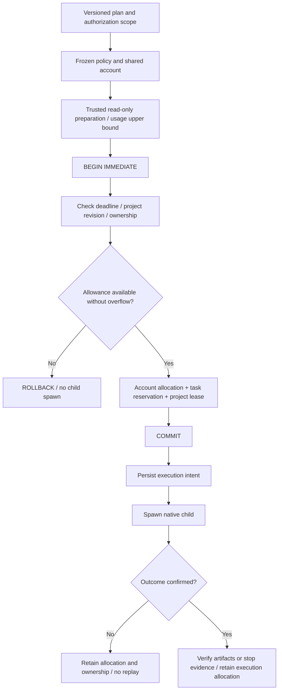

# ArtCraft shared budget architecture

This implements existing OpenSpec AC-TX-003. Parent and child calls share an actual allowance, enforced before native side effects. Source: `src/harness/budget.ts`, `task_ledger.ts`, `local_runner.ts` and `planning/workflow_engine.ts`.

## Scope and current state

| Concern | Current behavior | Boundary |
| --- | --- | --- |
| Money and call limits | Nonnegative safe integers; explicit null means no cap | Money uses the declared currency's minor unit; no FX conversion |
| Shared scope | ownerId + workflowId + authorizationRef | All nodes and plan revisions share an account |
| Policy | Frozen at first registration; currency or cap changes conflict | Authorization strings reference real task authorization; they are not credentials |
| Revisions | Initial plan costs no round; each subsequent new revision uses one maxRevisions | Replays cost no round; quality stagnation detection is pending |
| Execution | Trusted adapter declares cost and external-service call upper bounds | Payload cannot choose usage; omitted usage fails |
| Four native domains | Explicit zero money and zero external-service calls | Local stdio/rendering and installation downloads are not paid creative API calls |
| Accounting | Conservative upper-bound allocation retained after execution intent | Not provider billing; paid adapters and invoice reconciliation are pending |

## Control flow and atomicity

SQLite WAL, FULL synchronization and `BEGIN IMMEDIATE` serialize allowance and lease acquisition in the same transaction. Different processes targeting different projects still share the cap. Safe-integer overflow fails before cap comparison, including under unlimited policies.

Plan-revision allocation and workflow registration also commit together. Rejected registration leaves no spent revision or partial workflow. A task acquires only one execution identity; unknown outcomes cannot receive a second native submission by replay.

## Data and modules

| Persistent object | Content | Responsibility |
| --- | --- | --- |
| budget_accounts | Account key, immutable policy, cumulative allocation | TaskLedger write transaction |
| workflow_budget_links | Workflow revision to shared account | Atomic beginWorkflow registration |
| task_budget_links | Child to parent account; standalone task to own account | register binds caller, authorization and policy |
| budget_reservations | Usage upper bound, reserved / committed | claim allocates; prepareExecution records intent |
| Workflow result / CLI status | Policy and allocation snapshots | Reports ledger state, not actual provider settlement |

WorkflowEngine passes the parent run key internally; model JSON cannot supply account IDs. LocalRunner reads trusted `ExecutionPlan.budgetUsage` and rejects omissions, negative/fractional/NaN values, unknown fields and overflow. Verified cached artifacts need no second execution reservation.

## Failures and cancellation

Insufficient nodes report `budget_exceeded` without an execution intent or native process. Unverified dependent nodes stop; independent nodes with sufficient allowance may continue. Tasks cancelled before execution allocate no execution allowance. Claimed, unknown or failed execution does not receive an automatic refund: failure or disconnect does not prove a provider charged nothing.

Cumulative allocations survive termination. Paid adapters need actual usage evidence and a settlement contract; unknown consumption cannot simply be subtracted.

## Compatibility and operations

Ledger `user_version` advances from 1 to 2 with budget tables. Historical task status and artifacts remain readable. Historical workflows without budget evidence block new execution in that old authorization scope with `budget_history_untracked`; migration does not invent a free past. The old runtime rejects version 2 ledgers, preventing downgrade bypass. Version 0 release artifacts remain available but cannot keep writing an upgraded ledger.

Frozen project plans, registries and runtime hashes still apply. Runtime upgrades require explicit new plan revisions and authorized scopes; existing revisions cannot replace runtimes or raise limits in place. Public CLI `status --database ABS` exposes `budgets`; workflow results expose `budget`. Exhaustion retains verified deliveries and reports unfinished nodes without changing authorization or expanding limits automatically.

## Verification

[Budget evidence](evidence/shared-budget-tests.json) records the RED phase, eight ledger budget tests and 58 runtime tests including native integrations and runner/DAG admission tests. Coverage includes process races, call/revision caps, frozen policies, reopen, unknown outcomes, invalid usage, overflow, legacy-history protection, pre-spawn rejection and replay deduplication.

Native fixtures establish technical behavior. Real paid-provider billing, creative acceptance, complete quality loops, crash adoption and production release remain outside this evidence scope.
