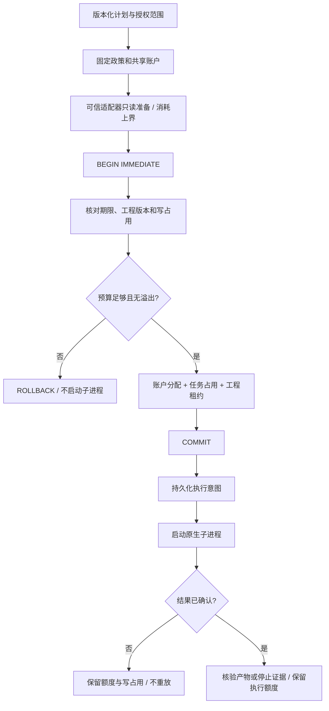

# ArtCraft 共享预算架构

本实现对应既有 OpenSpec AC-TX-003。目标是让父子调用共享真实额度，并在原生副作用前拒绝超额；它不把计划上的预算字段当作已执行的控制。实施代码位于 `src/harness/budget.ts`、`task_ledger.ts`、`local_runner.ts` 和 `planning/workflow_engine.ts`。

## 范围与当前状态

| 项目 | 当前行为 | 边界 |
| --- | --- | --- |
| 金额与调用上限 | 非负安全整数；显式 null 表示无该项上限 | 金额是指定货币的最小单位，不做汇率换算 |
| 共享范围 | ownerId + workflowId + authorizationRef | 同范围的全部节点和计划修订共享账户 |
| 政策 | 首次登记后固定，货币或上限改变报冲突 | 新授权引用必须对应真实任务授权，字符串不是凭据 |
| 修订 | 首个计划不计轮次，之后新修订各占一次 maxRevisions | 同修订重跑不扣；质量停滞检测尚未实现 |
| 执行 | 可信适配器声明金额及外部服务调用上界 | payload 无法指定消耗；缺失上界报错 |
| 原生四领域 | 显式声明金额 0、外部服务调用 0 | 本地 stdio、原生渲染和安装下载不是付费创作 API 调用 |
| 计量状态 | 保守分配上界，执行意图提交后保留 | 不是服务商账单；付费适配器与实际账单核销尚未接入 |

## 控制流与原子性

数据库使用 SQLite WAL、FULL 同步与 `BEGIN IMMEDIATE`。额度和工程写入租约在同一事务中提交；两个进程处理不同工程也不能绕过共同预算。安全整数溢出先于上限检查失败，无限额度不意味着允许精度丢失。

新计划修订的轮次与工作流登记也是同一事务。失败登记不会留下已扣轮次或半个工作流。同任务只能取得一次执行身份；未知结果不能靠重跑获得第二次原生调用。

## 数据和模块

| 持久对象 | 内容 | 责任 |
| --- | --- | --- |
| budget_accounts | 账户键、固定政策、累计分配 | TaskLedger，写事务内更新 |
| workflow_budget_links | 工作流修订到共享账户 | beginWorkflow 原子登记 |
| task_budget_links | 子任务到父账户；独立任务到自身账户 | register 绑定调用者、授权与政策 |
| budget_reservations | 任务消耗上界、reserved / committed | claim 分配；prepareExecution 提交意图 |
| workflow result / CLI status | 政策和分配快照 | 只报告账本，不假装实际费用结算 |

跨节点消费由 `WorkflowEngine` 传递父工作流键，不从模型 JSON 读取账户 ID。`LocalRunner` 从可信 `ExecutionPlan.budgetUsage` 取得上界；拒绝遗漏、负数、小数、NaN、未知字段及溢出。复用已核验产物不申请第二份执行额度。

## 失败与取消

预算不足的节点报告 `budget_exceeded`，保持没有执行意图或原生进程的状态，下游因缺少已核验依赖停止。其他独立且有额度的节点可以继续。取消前未执行的任务不占执行额度；已经取得执行权、未知或失败的任务不自动退款，因为失败或断线不能证明服务商没有计费。

终结时仍保留累计分配。这是保守上限控制；后续付费适配器需要追加真实使用证据和明确的核销合同，不能直接减掉未知消耗。

## 兼容性与操作

账本 `user_version` 从 1 升为 2，新增预算表；旧任务状态与产物仍可读取。旧授权范围若已有工作流但没有预算证据，新的执行返回 `budget_history_untracked`，不伪造免费历史。旧运行时拒绝版本 2 账本，避免降级绕过预算。版本 0 的发布包保留，不能用于继续写入已升级账本。

项目计划、登记表与运行身份仍按摘要冻结。升级后使用明确的新计划修订和已授权范围；同修订不能原地换运行时或提高预算。状态检查使用公开 CLI `status --database ABS`，读取 `budgets` 与工作流结果中的 `budget`。额度耗尽时保留已核验交付，并报告未完成节点；不自动更换授权或扩大预算。

## 验证

[共享预算证据](evidence/shared-budget-tests.json) 记录失败阶段、8 个预算边界测试，以及加入真实执行器/DAG 测试的 58 项原生回归。验证覆盖跨进程竞争、调用上限、修订上限、政策冻结、重开、未知结果、无效消耗、溢出、旧历史保护、原生副作用前阻断和重跑去重。

原生样本证明技术行为，付费服务实际计费、创作质量、完整质量循环、崩溃接管和生产发布仍不在本次通过范围。
