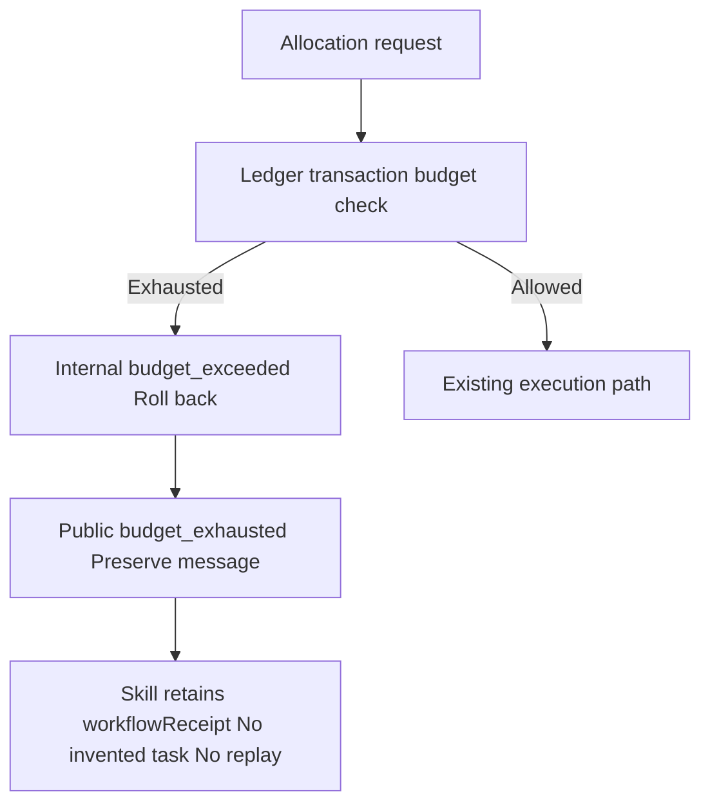

# Public budget rejection codes

craft-task/v1 requires budget_exhausted; the old implementation exposed internal budget_exceeded directly. taskErrorDetail normalizes only the public code, preserving the message and legacy CLI error string. Internal transaction exceptions, accounting and state transitions are unchanged, as are unrelated error identities. The Python workflow envelope retains upstream details and does not replay the original task.

Three dimension mappings and workflow assertions first produced four failures, then33 passed. Full runtime regression:243 total,223 passed,20 conditional skips. Actual installed112 creates a native project then reproduces the mismatched code on a capped revision in35.021seconds. New candidate runtime0.1.0-dev.113-runtime.1 uses a separate immutable runtime tag without replacing historical plugin tags; fixed installation qualification is pending.

Native first-use qualification must verify no new revision/task/execution/lease, preservation of original attempt and artifacts, and stable repeated refusal. Error mapping tests do not prove all budget timings, full protocol or fullV1.

[Candidate evidence](evidence/artcraft-budget-code-20261008.json).
