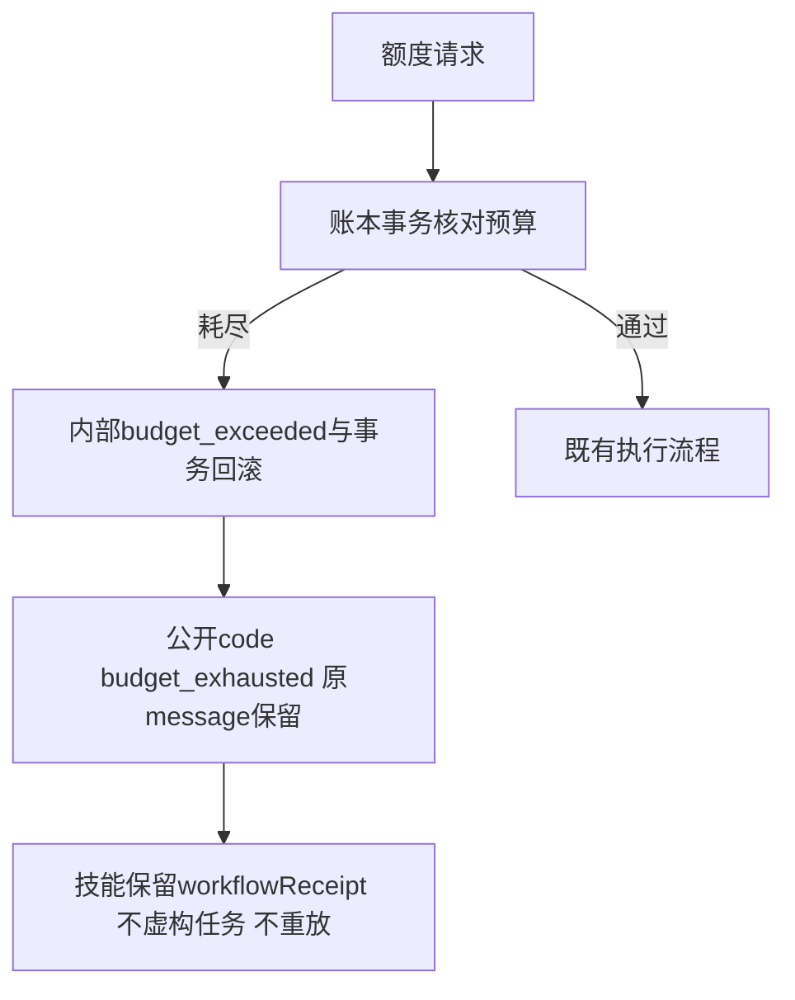

# 公共预算拒绝错误码

公共craft-task/v1要求budget_exhausted，原实现将内部budget_exceeded直接暴露。taskErrorDetail只归一化公开code，保留原message与CLI error字符串，内部事务异常、预算计算和状态机不改名；其他错误身份不改变。Python工作流封装继续传递上游结构化拒绝，不据此重放原任务。

三维度映射与工作流测试先出现4失败，修正后33通过；全运行时243项223通过20条件跳过。旧固定安装112实际原生创建后因修订额度拒绝，35.021秒复现错误码不一致。新runtime候选版本为0.1.0-dev.113-runtime.1，使用独立不可变runtime标签，不覆盖历史插件标签；该源码候选阶段尚未执行固定安装验收；当前固定结果见下文。

原生首用验收须验证新修订没有登记、新执行和占用为零、原任务attempt及产物保全、重复拒绝稳定；错误码测试不能代替所有预算时序、完整协议或完整V1。

[候选证据](evidence/artcraft-budget-code-20261008.json)。

[固定安装证据](evidence/craft-budget-protocol-fixed-first-use-20261008.json)：Art113／源85原生冷安装38.790秒通过；10变化技能分别冷安装，54整树相同技能复用历史证据。默认工具绑定host-acceptance-budget-protocol.lock.json。仅关闭AC-CP-001-BUDGET-CODE，完整协议仍开放。
