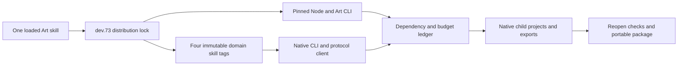

# ArtCraft domain distribution upgrade

Candidate standalone skills dev.49 pin runtime distribution dev.73, FilmCraft skills dev.14 and the other three domain skills dev.13. Each Art skill carries its own lock and installer. Public downloads verify archive and file digests, runtime versions and native CLI identities. Existing locks, artifacts and release tags remain immutable.

The domain bundles preserve complete Git release ZIP bytes. Art uses archives without an outer directory, published under distinct filenames from the domains' existing prefixed user-install archives. No existing asset is overwritten. The builder reads immutable tags, verifies each file and excludes working-tree changes.

The domain clients detect malformed, non-object, missing/ambiguous and nonfinite responses, broken pipes and invalid tool content. Uncertain requests must not be replayed automatically. Preserve native projects, failure receipts and the ledger, then inspect actual state. Complete command helpers are included; their presence does not establish arbitrary Art planning support.

Acceptance requires ten independent empty-runtime installs of all domains, real mixed creation and dependent Logo revisions, fault stopping and no replay, portable delivery, immutable skill vendoring and actual installed-host checks. OpenSpec task 4.7 closes only after its matching evidence passes. Exhaustive commands, GUI, model dispatch and creative approval remain separately tracked.

## Updated domain-client distribution candidate dev.77

Runtime dev.76 and Art source dev.52 pin Film source dev.15 and Effect/Photo/Vector dev.14. Full immutable Git source ZIPs include all48 domain clients. Earlier tags, locks and installations remain unchanged. Ten clean committed Art skills separately cold-install public Node, Art and all four native CLIs in452.970seconds; version/help and fingerprints pass.

One cold copied revision skill completes a1920×1080,24fps,5-second mixed project:120 decoded frames, four RGBA segments, Logo-dependent revision, independent-node reuse, corrupt-frame recovery and a moved five-child package in227.331seconds. The actual public runtime executes24 post-save faults through all four public domain adapters: one real native save, structured outcome_unknown, unregistered blocked consumers, unchanged attempt/budget/inputs, no frozen-plan replay and native reopening of captured projects.

Proxy capture does not prove product preservation of failed staged projects. Candidate source validation does not substitute for fixed installed plugin identity/first use. [Bound evidence](evidence/art-updated-domain-distribution-candidate-20261007.json). Task4.7 stays open until fixed plugin acceptance; exhaustive command/GUI/model and fullV1 gates remain separate.
