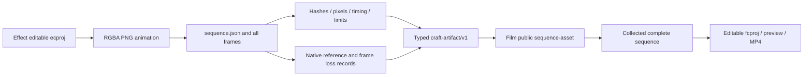

# ArtCraft dynamic sequence architecture

## Status and authority

This is a candidate implementation under `establish-v1-plugin`, requirement AC-AR-003. Public Art plugin dev.63 / source dev.43 / runtime dev.62 does not contain this change. Fixed-release installation, a full four-domain Logo replacement workflow, generic Skills CLI and model/GUI/creative acceptance remain open. [Candidate evidence](evidence/dynamic-sequence-candidate-20261006.json) owns the exact test and source identity.

## Handoff contract

The MIME is `application/vnd.craft.image-sequence+json`; its descriptor schema is `craft-image-sequence/v1`. A sequence is one versioned asset. Its descriptor hash binds every frame's encoded hash, decoded RGBA hash and Alpha extrema. `durationTicks` is the decimal frame count; `timeBase` is the reciprocal of normalized rational `frameRate`. Unknown color space remains explicit; this contract does not establish ICC or creative fidelity.

## Verification and implementation

`src/protocol/image_sequence.ts` rejects duplicate JSON keys, escaped duplicate keys, unknown fields, noncontinuous indices, missing/extra files and symlinks. Descriptor size is capped at 4 MiB before hashing; one PNG at 64 MiB; aggregate encoded and RGBA sizes at 512 MiB each. Maximum dimensions are 16384 and frame count 10000; normalized rates are 1–240 fps. Existing PNG inspection also caps decompressed scan data at 128 MiB per image. PNG must be noninterlaced RGBA8; all five PNG filters are decoded before checking pixel digest and Alpha extrema. Every frame's digest, byte size and file identity are checked.

`src/adapters/public_skill.ts` derives input kind from verified MIME. Film gets `--sequence-asset`; other domains refuse this input. Prepare rechecks all input artifacts, including changed intermediate frames. Effect outputs require the matching delivery manifest's `imageSequence` path/hash. Actual timing and dimensions populate public metadata; all frame references enter evidence. Collected and inherited Film sequence dependencies are checked against the complete manifest. Exchange-loss validation binds the native project and every PNG output record; the descriptor does not replace native editing structure.

## Revision and acceptance

The candidate native test uses fixed installed Effect dev.9 and Film dev.10 skills through their public scripts, without importing private Python modules. Art's current working-tree WorkflowEngine/ledger/runner creates the Effect animation, consumes it as a Film sequence, independently decodes the 12-frame video and checks sampled alpha composites. After moving the Film project and deleting the original background, retained media is read from the moved package and a title-only Effect revision replaces the overlay; background and initial frame remain unchanged, the animated title frame changes, and all prior Film files retain their hashes. A corrupt intermediate frame is rejected; rerunning the scheduler enters blocked state before further consumption.

This proves the tested candidate route. It does not prove an updated installed Art skill, a cold Art bundle, complete mixed branding, all failure recovery, or artistic approval. Tasks 6.37–6.39 separate protocol, candidate mapping and fixed-release acceptance. Research repositories and existing immutable releases remain unchanged; Art contains no Jianying adapter.
