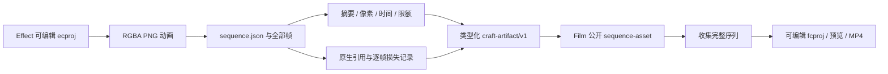

# ArtCraft 动态序列架构

## 状态与事实源

本次是 `establish-v1-plugin` 下 AC-AR-003 的固定安装增量验收。公开 Art 插件 dev.63／技能源 dev.43／runtime dev.62 尚未包含该变更。固定发行安装与四领域 Logo 替换的有界验收已通过；通用 Skills CLI、模型／GUI／完整创作验收仍开放。[候选证据](evidence/dynamic-sequence-candidate-20261006.json) 记录精确测试与源码身份。

runtime dev.64 与独立技能源 dev.44 已公开发布，单技能默认公开冷启动四领域五节点、Logo 替换、损坏帧恢复和移动包 1 项通过（59.343 秒）。[源码固定依赖证据](evidence/dynamic-source44-first-use-20261006.json)。完整插件 dev.65 固定安装后的动态混合首用和 58 项 CLI 冷启动已通过；历史候选证据保留原范围。

## 交接合同

MIME 为 `application/vnd.craft.image-sequence+json`，描述文件 schema 为 `craft-image-sequence/v1`。完整序列作为一个版本化素材；描述文件摘要绑定每帧编码摘要、解码 RGBA 摘要和 Alpha 极值。`durationTicks` 是十进制帧数，`timeBase` 是规范化有理帧率的倒数。未知色彩空间明确保留，本合同不证明 ICC 或创作保真。

## 校验与技术实现

`src/protocol/image_sequence.ts` 拒绝重复 JSON 键、转义后同名键、未知字段、不连续编号、缺帧、多余文件与符号链接。描述文件在摘要读取前限制为 4 MiB，单帧 PNG 为 64 MiB，总编码与总 RGBA 各限 512 MiB；最大尺寸 16384、帧数 10000，规范化帧率 1–240 fps。已有 PNG 检查另限制单帧解压扫描数据为 128 MiB。PNG 必须为非隔行 RGBA8；五种过滤算法反滤波后核对像素摘要与实际 Alpha 极值。每帧同时核对摘要、字节数和文件身份。

`src/adapters/public_skill.ts` 根据已验证 MIME 判断输入类型：Film 使用 `--sequence-asset`，其他领域拒绝此输入。Prepare 再次核对全部输入，防止准备后中间帧改变。Effect 输出必须匹配交付 manifest 的 `imageSequence` 路径与摘要；实际时间与尺寸写入公共元数据，全部帧引用进入证据。Film 收集与继承的序列依赖均与完整 manifest 核对。交换损失报告绑定原生工程与每帧 PNG 输出记录；描述文件不能替代原生编辑结构。

## 局部返工与验收

候选原生测试通过公开脚本调用固定安装的 Effect dev.9 与 Film dev.10 技能，不导入其私有 Python 模块。Art 当前工作树的 WorkflowEngine／ledger／runner 生成动画并交给 Film，独立解码 12 帧视频并检查抽样 Alpha 合成。移动 Film 工程并删除原背景文件后，仅从移动包读取保留背景，修改 Effect 标题并替换叠加片段：背景与初始帧不变，动画文字帧改变，旧 Film 全部文件摘要保留。中间帧损坏会被拒绝，再次调度进入 blocked 状态，禁止下游继续消费。

历史候选证据仅证明当时的候选路径，不代表新版 Art 安装技能、Art 空运行时、完整混合品牌项目、全部故障恢复或创作批准。任务 6.37–6.39 分开记录协议、候选映射和固定发行验收。research 与旧不可变发行保持原样；Art 不含剪映适配器。

固定 dev.65 安装验收见 [版本证据](evidence/codex-release65-dynamic-first-use-20261006.json)：动态四领域 Logo 替换／恢复与移动包、普通原生工程返工、58 项独立 CLI 冷启动及安装摘要保全均有实际记录；默认用户数据目录包含锁定四领域 CLI 与 Art runtime。完整首版和创作门禁未关闭。
