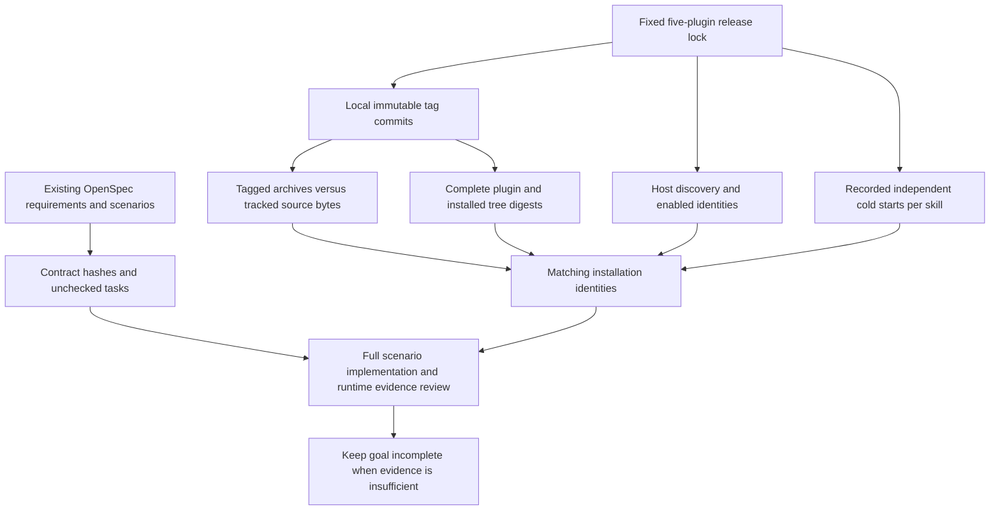

# Five-plugin first-use completion audit

Current defaults: `host-acceptance-art115.lock.json` and `craft-art115-install-lock-fixed-first-use-20261008.json`. Art115/source87 includes bounded install locks and retains internal Film36/Effect34/Photo34/Vector31. Ten changed skills pass separate empty-cache public installation;54 historical cases are reused only by complete tree equality. Installation identity is audited separately from formal scenario completion; fullV1 remains incomplete.

Historical dev.107: the three maintainer defaults used `host-acceptance-art107.lock.json`; the auditor uses `artcraft107-protocol-fixed-first-use-20261008.json`. The actual default audit verifies 64 identities and reports 120 requirements and 262 open tasks. Historical overrides remain supported.

## Fixed installed acceptance dev.107 (2026-10-08)

Art plugin dev.107 pins source dev.80 and runtime dev.106. A real isolated Codex host discovers five plugins and 64 skills without loading errors. Ten installed Art skills each cold-download their runtime: all 390 protocol tests pass, rejecting unknown prototype-named strict fields while preserving permitted payload JSON data. Both public plugin ZIP digests match the fixed tag archive.

Three actual single-skill mixed first-use tests pass in 169.915 seconds, covering four-domain native creation, source-project revisions, same-version reuse, installation-receipt drift rejection and moved delivery. Technical audio fixtures do not establish ASR or creative quality. All 64 installed trees are rehashed: ten cold installations are new; 54 historical records are reused only after full digest equality. The outer recording wrapper failed when requesting a result key absent from the evidence schema; the three underlying tests passed and their original evidence and log were verified separately without rerunning or rewriting them.

Only the bounded AC-CP-001-OWN-FIELDS release gate closes. Full CP-001, V1, actual generic Skills CLI, model dispatch and other platforms remain open.

[Fixed installed evidence](evidence/artcraft107-protocol-fixed-first-use-20261008.json).


This audit checks the current fixed releases and actual installation identities while retaining the full goal. **Installation identities and recorded cold starts match; overall completion remains unproven.** It neither changes OpenSpec/tasks/releases nor reruns native work.

## Historical dev.105 defaults

The three maintainer tools use `host-acceptance-art105.lock.json`; the auditor uses `craft-art105-whisper-fixed-first-use-20261008.json`. The default audit rehashed all 64 current identities and reports 120 requirements and 277 open tasks. Recorded cold evidence comprises 23 new Film/Art runs and 41 historical records reused after complete digest equality. Explicit historical lock/evidence parameters remain supported. Nine audit tests cover current defaults, historical overrides and existing rejection boundaries; they do not prove new creative acceptance.

[Current fixed evidence](evidence/craft-art105-whisper-fixed-first-use-20261008.json).

Actual default installed verification passes 64 CLI probes in 73.069s, with five new domain caches and later reuse. The 80-test Python regression has 75 passes and five conditional skips. [Maintainer correction evidence](evidence/artcraft105-maintainer-defaults-20261008.json).

## Historical dev.102 audit

The current immutable matrix is Film32/source30, Effect33/31, Photo33/31, Vector32/30 and Art102/76, totaling64 skills. All64 freshly executed independent cold installations pass in666.554s; these are one current run, separate from the historical composed proof below. Current tracked source exports, full plugin/installed skill trees and exact host/tag identities match. There are120 requirements,439 scenarios and277 unchecked tasks. No complete formal requirement is inferred from this installation proof. Actual generic Skills CLI, exhaustive command contexts and creative review remain open.

[Current audit](evidence/craft-art102-first-use-completion-audit-20261007.json) · [Fixed installation/native evidence](evidence/craft-lock-preflight-fixed-installation-20261007.json).


## Historical dev.101 evidence and scope

| Plugin | Plugin version | Skill source version | Skills | Requirements / scenarios | Unchecked tasks |
| --- | --- | --- | ---: | ---: | ---: |
| FilmCraft | dev.31 | dev.29 | 13 | 23 / 77 | 58 |
| EffectCraft | dev.32 | dev.30 | 15 | 23 / 74 | 57 |
| PhotoCraft | dev.32 | dev.30 | 13 | 23 / 75 | 55 |
| VectorCraft | dev.31 | dev.29 | 13 | 26 / 79 | 55 |
| ArtCraft | dev.101 | dev.75 | 10 | 25 / 134 | 52 |

All versions have the `0.1.0-` prefix. Totals: 64 skills, 120 requirements, 439 scenarios and 277 unchecked tasks. Unchecked tasks are not a missing-feature count; implemented items awaiting complete acceptance can remain unchecked. Each contract/scenario retains its name, location and SHA-256 for subsequent evidence review.

- **Rechecked:** complete plugin and installed skill trees, plugin metadata, independent source locks and local immutable tag commits.
- **Rechecked:** fixed skill-source archives against current tracked files byte for byte, and archive skill digests against the lock. The source working trees contain 41 ignored files, reported separately and preserved. They are not release content; the entire source working tree is not asserted to match the release.
- **Recorded identity checked:** all host-discovered skills, enabled states and exact hashes; recorded independent cold-start coverage has no missing/duplicate/stale/warm entries. The 64 records combine three version-bound runs, rather than a new 64-case native invocation this turn.
- **Unproven:** actual generic Skills CLI installation, complete scenarios/creative acceptance, model dispatch, other platforms and production release. Formal scenarios remain pending full evidence review; installation success cannot close their contracts.

Original fixed runtime observations remain in the [structured-receipt first-use evidence](evidence/artcraft101-structured-workflow-receipt-fixed-first-use-20261007.json). This read-only recheck is the [completion audit](evidence/craft-current-first-use-completion-audit-20261007.json). Evidence layers remain separate.

## Validation flow



The auditor rejects duplicate JSON keys, stale locks, incorrect host identities, duplicate/missing skills, warm-start records, tracked source changes and digest drift. Failure does not publish a successful report. It preserves source caches; extra files in plugin/installed skill trees still fail strict hashing.

## Reproduction and remaining work

Run from the ArtCraft plugin root with caller-provided paths. `HOST_RECEIPT` must come from a real isolated installation; a handwritten directory inventory is insufficient. Output must be a new file.

```bash
python3 -I -B scripts/audit_first_use_completion.py \
  --plugins-root "$PLUGINS_ROOT" --skills-root "$SKILLS_ROOT" \
  --host-receipt "$HOST_RECEIPT" --output "$NEW_AUDIT_OUTPUT"
```

This is a maintainer evidence tool. Independent user skills retain their own `cli.py` / `workflow.py` entries. The audit does not install tools or publish releases.

Continue the original contracts: actual Skills CLI acceptance remains pending authorization; review complete evidence for native creation, referenced assets, save/reopen, previews/exports, targeted revisions and mixed dependency/delivery scenarios. Reuse older runs only when their exact current identities and scenario scopes match. Matching identities must not mark all formal scenarios complete.

Seven unit tests cover stale hashes, duplicate/missing/warm records, missing run identifiers, success counts without records, duplicate JSON keys, preserved ignored caches, tracked modifications and task state not substituting for scenario evidence. They establish auditor behavior, not new native/creative acceptance.

Historical dev.107 installed CLI verification passed all 64 probes in 60.573 seconds (five fresh domain caches; later probes reuse). Python regression: 97 tests, 92 passed and five conditional skips. [CLI evidence](evidence/artcraft107-installed-cli-20261008.json) · [Completion audit](evidence/artcraft107-maintainer-audit-20261008.json).

## Fixed installed own-directory acceptance (2026-10-08)

The then-fixed host matrix was Film36/source35, Effect34/source32, Photo34/source32, Vector33/source31 and Art107/source80: 64 skills, zero loading errors. Six changed scenario skills independently install their pinned public CLI into empty caches in Unicode/space paths, then discover commands and describe parameters through their own supported entry. Runtime archives are unchanged. All 64 installed/vendored trees match; 58 historical cold records are reused only after complete digest equality.

Four source regressions total 596 tests: 474 passed and 122 conditional skips. Four plugin regressions pass all 72 tests. The path tests cover 54 skills, 162 copied installation layouts and 474 argument-parser help calls; these do not establish native creative tasks. Two auxiliary verifier mistakes are retained: unsupported cross-domain native describe and rejection of Photo’s valid dev-build version suffix. Five successful fixed cold cases were retained; Photo alone was rerun with the existing exact named version matcher. Six actual cold cases now pass.

Only the own-directory bounded release gates close; full V1, exhaustive contexts, actual generic Skills CLI and creative acceptance remain open. [Fixed installed evidence](evidence/craft-scenario-paths-fixed-first-use-20261008.json).

Historical maintainer defaults: `host-acceptance-scenario-paths.lock.json` and `craft-scenario-paths-fixed-first-use-20261008.json`; historical explicit parameters remain supported.

Art runtime106/source80 retains its original immutable domain bundle locks. All four domain use-skill digests and native CLI archive digests remain identical, so this directory-example correction does not change mixed-workflow adapters or trigger a new Art runtime release.
