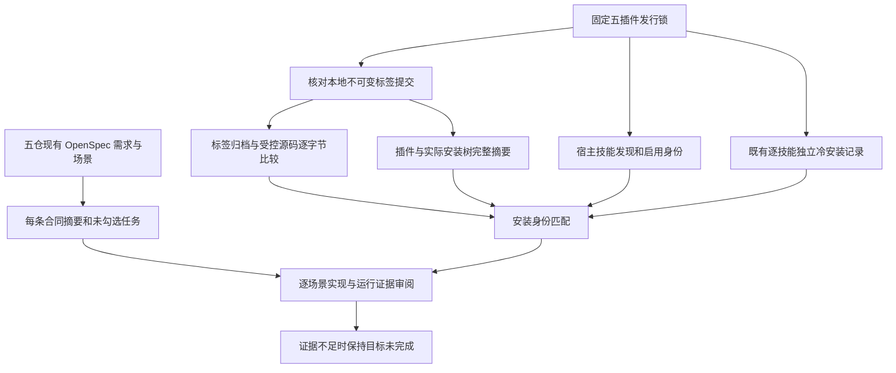

# 五插件首次使用完成审计

本次审计核对当前固定发布与实际安装身份，保留完整目标。结果是**安装身份与已有冷安装记录匹配；整体目标尚未证明完成**。审计不改变 OpenSpec、不勾选任务、不升级发行，也不重新执行原生任务。

## 当前 dev.102 审计

当前固定矩阵为 Film32／技能源30、Effect33／31、Photo33／31、Vector32／30、Art102／76，共64项技能。新执行的64项独立空运行时安装全部通过，耗时666.554秒；这是一次当前完整运行，与下方历史组合证据分开。当前受控技能源导出、插件和安装技能完整树、宿主与标签身份全部匹配。仍有120条需求、439个场景和277个未勾选任务，不从安装通过推断完整规范验收；实际通用 Skills CLI、穷尽命令上下文及创作审查仍开放。

[当前审计](evidence/craft-art102-first-use-completion-audit-20261007.json) · [固定安装与原生证据](evidence/craft-lock-preflight-fixed-installation-20261007.json)。


## 历史 dev.101 证据与完整目标

| 插件 | 插件版本 | 技能源版本 | 技能数 | 规范需求 / 场景 | 未勾选任务 |
| --- | --- | --- | ---: | ---: | ---: |
| FilmCraft | dev.31 | dev.29 | 13 | 23 / 77 | 58 |
| EffectCraft | dev.32 | dev.30 | 15 | 23 / 74 | 57 |
| PhotoCraft | dev.32 | dev.30 | 13 | 23 / 75 | 55 |
| VectorCraft | dev.31 | dev.29 | 13 | 26 / 79 | 55 |
| ArtCraft | dev.101 | dev.75 | 10 | 25 / 134 | 52 |

所有版本均为 `0.1.0-` 前缀。总计 64 个技能、120 条规范需求、439 个场景、277 个未勾选任务。未勾选数量来自当前任务表，不能直接当作未实现功能数；已实现但尚未完整验收的条目也可能在其中。每条合同及场景保留名称、文件行号和 SHA-256，便于下一步逐项审阅完整证据。

- **重新核验**：当前插件和安装副本的完整技能树、插件身份与独立技能源锁，以及本地固定标签对应提交。
- **重新核验**：固定技能源标签归档与当前受版本控制文件逐字节相同；标签技能摘要匹配锁。源码工作树有 41 个忽略文件，单独报告并保留；不将其混入发行，也不声称整个源码工作树与发行逐字节相同。
- **记录身份核验**：固定宿主发现结果包含全部技能、启用状态和准确摘要；既有独立冷安装记录无漏项、重复、摘要漂移或缓存复用项。64 项是三次版本绑定运行的组合，不是本轮新执行的 64 项原生测试。
- **未证明**：实际通用 Skills CLI 安装、完整场景与创作验收、模型派发、其他平台和生产发布。完整规范场景默认保留待审状态；成功安装不能自动关闭这些合同。

原始固定运行的详细结果见[结构化回执首次使用证据](evidence/artcraft101-structured-workflow-receipt-fixed-first-use-20261007.json)。本次只读核验见[完成审计报告](evidence/craft-current-first-use-completion-audit-20261007.json)。不同证据层分别保留。

## 验证流程



审计脚本拒绝同名 JSON 重复键、过期发行锁、错误宿主身份、重复或缺失技能、非冷安装记录、受控源码修改、来源或安装摘要漂移。失败不生成成功报告。源码缓存不删除；当前插件和安装树中的额外文件仍被严格摘要检查拒绝。

## 重现与下一步

从 ArtCraft 插件根目录运行，路径均由调用者提供。`HOST_RECEIPT` 必须是实际隔离安装生成的回执，不能用手工目录列表替代；输出必须是不存在的新文件。

```bash
python3 -I -B scripts/audit_first_use_completion.py \
  --plugins-root "$PLUGINS_ROOT" --skills-root "$SKILLS_ROOT" \
  --host-receipt "$HOST_RECEIPT" --output "$NEW_AUDIT_OUTPUT"
```

审计工具是维护者的证据核验入口，独立技能使用入口仍是各技能自己的 `cli.py` / `workflow.py`。审计不负责安装工具或发布版本。

下一步按原规范继续：实际 Skills CLI 门禁保留待授权执行；逐项核对首版原生创建、素材清单、保存重开、预览与导出、局部返工，以及混合依赖与交付的完整场景证据。旧运行仅在当前字节身份与场景范围一致时复用。不能凭本审计的身份通过将所有规范场景标记完成。

测试覆盖：过期摘要、重复/漏项记录、非冷安装、缺少运行标识、只给成功数量、JSON 重复键、忽略缓存保留、受控文件修改与任务状态不能替代场景证据。7 项单元测试验证审计器行为，不代表新增原生或创作验收。
