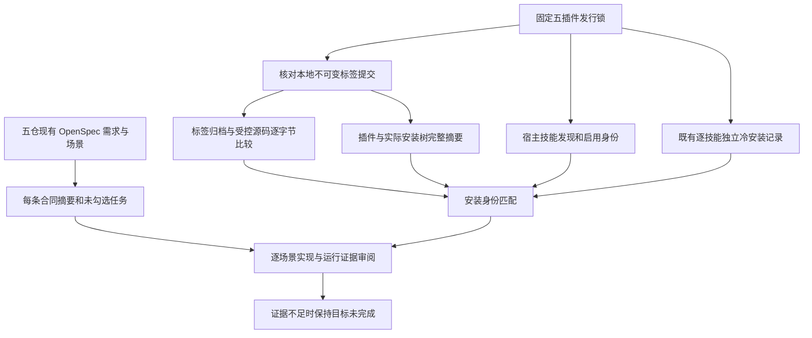

# 五插件首次使用完成审计

当前默认使用 `host-acceptance-art-photo34.lock.json` 与 `craft-art-photo34-fixed-first-use-20261008.json`。真实当前审计绑定64项身份，记录120条正式需求／250项开放任务。Art114／源86内部固定Photo34。10个Art技能独立冷安装通过，54项历史案例仅按完整目录摘要一致复用。实际安装副本64项CLI探测通过，69.508秒，五个新领域缓存、后续复用。保留工程的四域混合创建／返工／移动交付测试通过，222.429秒；仅证明相应技术场景，不等于完整V1。[当前证据](evidence/craft-art-photo34-fixed-first-use-20261008.json)。

历史dev.107：三个维护入口当时默认使用 `host-acceptance-art107.lock.json`；审计默认使用 `artcraft107-protocol-fixed-first-use-20261008.json`。实际默认审计核对64项身份，保留120条需求、262项开放任务。显式历史参数仍兼容。

## 固定安装验收 dev.107（2026-10-08）

Art 插件 dev.107 固定源 dev.80 与运行时 dev.106。实际隔离 Codex 宿主发现五插件64技能，零加载错误；十个已安装 Art 技能各自从空缓存下载运行时，390项协议测试全部通过，严格对象拒绝原型同名未知字段，允许的 payload JSON 数据保持兼容。公开两个插件 ZIP 摘要与固定标签归档一致。

实际单技能混合首用三项测试通过（169.915秒），包括四域原生创建、源工程返工、相同版本复用、安装收据漂移拒绝、移动包验收。使用技术音频夹具，不证明真实语音识别或创作质量。全部64当前安装目录重算摘要；10项为本轮新冷安装，54项仅在完整摘要相同时复用历史冷安装记录。外层记录脚本尝试读取不存在的 result 字段而报错；测试本体三项通过，证据按原 schema 和测试日志核验，没有重跑或补写原证据。

仅关闭 AC-CP-001-OWN-FIELDS 有界发行门禁；完整 CP-001、V1、通用 Skills CLI、模型分派及其他平台仍开放。

[固定安装证据](evidence/artcraft107-protocol-fixed-first-use-20261008.json)。


本次审计核对当前固定发布与实际安装身份，保留完整目标。结果是**安装身份与已有冷安装记录匹配；整体目标尚未证明完成**。审计不改变 OpenSpec、不勾选任务、不升级发行，也不重新执行原生任务。

## 历史 dev.105 默认入口

三个维护工具使用 `host-acceptance-art105.lock.json`；审计使用 `craft-art105-whisper-fixed-first-use-20261008.json`。默认实际审计重算全部64项当前身份，报告120条需求及277个开放任务。已有冷安装证据包含23项新执行 Film／Art 记录及41项完整摘要一致后复用的历史记录。显式历史锁／证据参数继续兼容。9项审计测试覆盖当前默认值、历史覆盖与既有拒绝边界，不证明新增创作验收。

[当前固定证据](evidence/craft-art105-whisper-fixed-first-use-20261008.json)。

默认实际安装验证完成64项CLI探测，耗时73.069秒；5个领域新缓存，后续复用。Python回归80项中75通过、5条件跳过。[维护修正证据](evidence/artcraft105-maintainer-defaults-20261008.json)。

## 历史 dev.102 审计

当前固定矩阵为 Film32／技能源30、Effect33／31、Photo33／31、Vector32／30、Art102／76，共64项技能。新执行的64项独立空运行时安装全部通过，耗时666.554秒；这是一次当前完整运行，与下方历史组合证据分开。当前受控技能源导出、插件和安装技能完整树、宿主与标签身份全部匹配。仍有120条需求、439个场景和277个未勾选任务，不从安装通过推断完整规范验收；实际通用 Skills CLI、穷尽命令上下文及创作审查仍开放。

[当前审计](evidence/craft-art102-first-use-completion-audit-20261007.json) · [固定安装与原生证据](evidence/craft-lock-preflight-fixed-installation-20261007.json)。


## 历史 dev.101 证据与完整目标

| 插件 | 插件版本 | 技能源版本 | 技能数 | 规范需求 / 场景 | 未勾选任务 |
| --- | --- | --- | ---: | ---: | ---: |
| FilmCraft | dev.31 | dev.29 | 13 | 23 / 77 | 58 |
| EffectCraft | dev.32 | dev.30 | 15 | 23 / 74 | 57 |
| PhotoCraft | dev.32 | dev.30 | 13 | 23 / 75 | 55 |
| VectorCraft | dev.31 | dev.29 | 13 | 26 / 79 | 55 |
| ArtCraft | dev.101 | dev.75 | 10 | 25 / 134 | 52 |

所有版本均为 `0.1.0-` 前缀。总计 64 个技能、120 条规范需求、439 个场景、277 个未勾选任务。未勾选数量来自当前任务表，不能直接当作未实现功能数；已实现但尚未完整验收的条目也可能在其中。每条合同及场景保留名称、文件行号和 SHA-256，便于下一步逐项审阅完整证据。

- **重新核验**：当前插件和安装副本的完整技能树、插件身份与独立技能源锁，以及本地固定标签对应提交。
- **重新核验**：固定技能源标签归档与当前受版本控制文件逐字节相同；标签技能摘要匹配锁。源码工作树有 41 个忽略文件，单独报告并保留；不将其混入发行，也不声称整个源码工作树与发行逐字节相同。
- **记录身份核验**：固定宿主发现结果包含全部技能、启用状态和准确摘要；既有独立冷安装记录无漏项、重复、摘要漂移或缓存复用项。64 项是三次版本绑定运行的组合，不是本轮新执行的 64 项原生测试。
- **未证明**：实际通用 Skills CLI 安装、完整场景与创作验收、模型派发、其他平台和生产发布。完整规范场景默认保留待审状态；成功安装不能自动关闭这些合同。

原始固定运行的详细结果见[结构化回执首次使用证据](evidence/artcraft101-structured-workflow-receipt-fixed-first-use-20261007.json)。本次只读核验见[完成审计报告](evidence/craft-current-first-use-completion-audit-20261007.json)。不同证据层分别保留。

## 验证流程



审计脚本拒绝同名 JSON 重复键、过期发行锁、错误宿主身份、重复或缺失技能、非冷安装记录、受控源码修改、来源或安装摘要漂移。失败不生成成功报告。源码缓存不删除；当前插件和安装树中的额外文件仍被严格摘要检查拒绝。

## 重现与下一步

从 ArtCraft 插件根目录运行，路径均由调用者提供。`HOST_RECEIPT` 必须是实际隔离安装生成的回执，不能用手工目录列表替代；输出必须是不存在的新文件。

```bash
python3 -I -B scripts/audit_first_use_completion.py \
  --plugins-root "$PLUGINS_ROOT" --skills-root "$SKILLS_ROOT" \
  --host-receipt "$HOST_RECEIPT" --output "$NEW_AUDIT_OUTPUT"
```

审计工具是维护者的证据核验入口，独立技能使用入口仍是各技能自己的 `cli.py` / `workflow.py`。审计不负责安装工具或发布版本。

下一步按原规范继续：实际 Skills CLI 门禁保留待授权执行；逐项核对首版原生创建、素材清单、保存重开、预览与导出、局部返工，以及混合依赖与交付的完整场景证据。旧运行仅在当前字节身份与场景范围一致时复用。不能凭本审计的身份通过将所有规范场景标记完成。

测试覆盖：过期摘要、重复/漏项记录、非冷安装、缺少运行标识、只给成功数量、JSON 重复键、忽略缓存保留、受控文件修改与任务状态不能替代场景证据。7 项单元测试验证审计器行为，不代表新增原生或创作验收。

历史dev.107实际安装 CLI 验证64项全部通过，耗时60.573秒（五域新缓存，后续探测复用）。Python回归97项，92通过、5项条件跳过。[CLI证据](evidence/artcraft107-installed-cli-20261008.json) · [完成审计](evidence/artcraft107-maintainer-audit-20261008.json)。

## 自身目录固定安装验收（2026-10-08）

当时固定宿主矩阵为 Film36／源35、Effect34／源32、Photo34／源32、Vector33／源31、Art107／源80：64项技能、零加载错误。六个有变更场景技能各自从空缓存安装固定公开CLI，在含中文和空格的路径查询实时命令并通过自身支持的入口描述参数；运行时制品保持不变。64安装／插件完整目录摘要匹配；58项历史冷安装仅在完整摘要相同时复用。

四套源回归共596项，474通过、122条件跳过；四插件72项回归全部通过。路径测试覆盖54技能、162独立安装布局和474次参数解析帮助入口，不替代原生创作任务。保留两项辅助验收器错误：跨域误用原生describe、误拒Photo合法dev-build版本后缀。五项成功的固定冷安装保留；仅Photo使用既有准确命名版本匹配器重新冷执行，当前六项均通过。

仅关闭自身目录有界发行门禁；完整V1、穷尽命令上下文、实际通用Skills CLI与创作验收仍开放。[固定安装证据](evidence/craft-scenario-paths-fixed-first-use-20261008.json)。

历史维护默认入口：`host-acceptance-scenario-paths.lock.json` 与 `craft-scenario-paths-fixed-first-use-20261008.json`；显式历史参数继续兼容。

Art runtime106／源80保留原有不可变领域包锁。四域 use 技能完整摘要与原生CLI制品摘要均未改变，因此本目录示例修正不改变混合工作流适配器，也不触发新的Art运行时发行。
