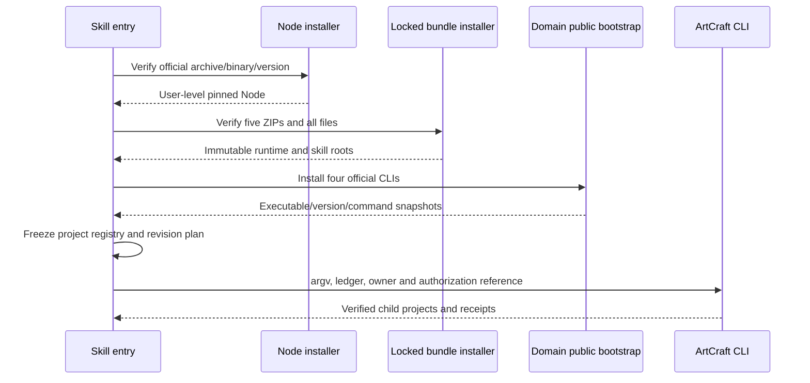

# ArtCraft first-use and distribution implementation

The independent source is artcraft-use in artcraft-skills. Public workflow.py invokes bootstrap.py, then runs the ArtCraft CLI through a generated registry. A clean copied skill directory without global Node or sibling repositories has delivered all four native projects. Initial tests used local locked project bundles; the published development version also passes default online downloads into a fresh runtime root.

## Sources and locks

`build_runtime_bundle.py` creates five deterministic ZIPs from the plugin runtime's src, schemas, package.json and LICENSE, plus the four independent skill directories. It sorts files and fixes ZIP metadata. Locks record repositories, versions, filenames, URLs, archive sizes/digests and every file digest. It does not edit independent skill sources or transfer runtime source ownership to the skill repository. Default online setup now passes for the published development artifacts; see the scoped evidence below.

The Node lock pins official version, platform, archive and binary digests. Only Node and LICENSE are extracted after path and digest checks. Domain installations use each skill's public bootstrap, retaining licenses and receipts without importing private sibling modules.

## Installation and identity

Project bundles install under `<runtime-home>/artcraft/bundles/<bundle>/<version>/<sha256>` after staged verification. Reuse verifies all files and rejects unexpected files. Corrupt versions remain untouched. A setup lock serializes installation. Capability identity binds actual command-catalog hashes, skill bundle/script hashes and the ArtCraft runtime bundle hash, preventing stale cache reuse after source changes.

Python uses `-I -B` to isolate user import paths and prevent bytecode writes into snapshots. Trusted launcher configuration also pins the interpreter digest. Current support is macOS arm64 with Python 3.11+ required.

## Projects and recovery

A project file lock serializes same-directory calls; unmanaged nonempty user directories are rejected. Projects retain installation receipts, hashed registries, frozen workflow/revision plans, binding hashes, SQLite ledger and results. Default deadlines are generated only when a revision is first frozen. Changing plan, inputs or registry under the same revision conflicts. Media hashes are streamed with change detection rather than loading entire videos into memory.

Repeats reuse verified tasks; new revisions invalidate affected consumers. Unknown outcomes retain ownership without replay. Complete crash adoption, shared budgets, native source revision bindings, final creative review and delivery packaging remain unfinished.

## Evidence

[Setup and first-use evidence](evidence/artcraft-setup-tests.json) records source digests and scope. The live case copies one skill, restricts PATH to /usr/bin:/bin, installs fresh Node/runtime/skills/CLIs and creates four native projects. A repeat reuses tasks; changed content under the same revision fails. This does not prove online project download, host installation, GUI operation, other platforms or creative quality.

## Default online release acceptance

The v0.1.0-dev.0 runtime and four skill bundles are now public. [Online first-use evidence](evidence/online-first-use.json) records a single copied skill, no global Node and no offline overrides. The default entry downloaded all dependencies, produced four native projects and checked replay reuse, ledger reopening and same-revision conflicts. Earlier offline statements remain historical stage evidence. This macOS arm64 technical case does not establish host, GUI, complete creative or production acceptance.
