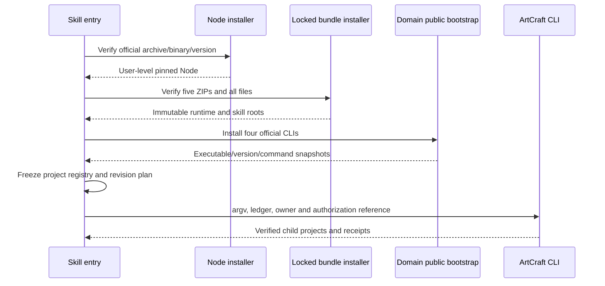

# ArtCraft 首次使用与分发实现

独立源码位于 artcraft-skills 的 artcraft-use。公开 workflow.py 自动调用 bootstrap.py，再通过生成的登记表执行 ArtCraft CLI。干净复制单技能目录、没有全局 Node 或兄弟仓库的验证已交付四种原生工程。当前安装测试使用本地锁定自有发布包；Node 与四个 CLI 是实际官方制品，四 CLI 在新运行时目录从官方地址安装。

## 发布事实源与锁定

`build_runtime_bundle.py` 从 ArtCraft 插件的 src、schemas、package.json、LICENSE，以及四个独立技能目录生成五个确定性 ZIP。ZIP 元数据固定，内容按路径排序；锁记录来源仓库、版本、文件名、URL、压缩包大小与摘要、逐文件摘要。它不编辑独立技能源，不把运行时源码的维护事实源迁入技能源仓。当前 ArtCraft ZIP 与技能 ZIP 的在线发布 URL 尚未上传，默认在线完整 setup 因此仍未验收。

Node 锁固定官方版本、平台、tar.gz 与二进制摘要。安装器只提取 Node 和许可文件，检查全部条目的路径，禁止执行未核验内容。领域 CLI 安装交给各技能公开 bootstrap，保留其安装回执和许可，不导入兄弟技能私有 Python 模块。

## 安装与身份

自有包安装到 `<runtime-home>/artcraft/bundles/<bundle>/<version>/<sha256>`，暂存验证后原子发布。复用时检查全部文件和未知文件；损坏版本保留并报错，不覆盖。安装全局文件锁防止并发写入。运行时身份快照结合实际命令目录摘要、技能源包摘要、脚本摘要和 ArtCraft 运行时包摘要，避免脚本或适配器变化后误用旧缓存。

Python 启动使用 `-I -B`，不依赖用户 PYTHONPATH，不在只读快照写入字节码缓存。解释器本身的摘要也进入可信启动器配置。当前平台仅 macOS arm64；前置为 Python 3.11+。

## 项目调用与恢复

入口使用项目文件锁串行化同目录调用，拒绝未受管理的非空用户目录。项目保存安装回执、带摘要的登记表、按工作流与修订冻结的计划、绑定摘要、SQLite 账本和结果回执。默认截止时间仅在初次冻结时生成，重跑不刷新；同修订修改计划、输入或登记表会拒绝。媒体摘要流式计算，避免把大型视频整体读入内存，并检查摘要期间的文件变更。

重复调用复用已核验任务；新修订由依赖指纹确定受影响节点。未知执行结果保留租约，不重放。完整崩溃接管、共享预算扣减、原生源工程修订绑定、最终创作审核和交付包仍未完成。

## 验证证据

[安装与首次使用证据](evidence/artcraft-setup-tests.json) 记录来源摘要与实际范围。用例复制单技能目录、将 PATH 限定为 /usr/bin:/bin，安装全新 Node、运行时、四技能和四 CLI，生成四个原生工程；再次运行复用任务；同修订修改计划失败。它不证明自有发布 URL 下载成功、插件宿主安装、GUI 操作、其他平台或创作质量。
