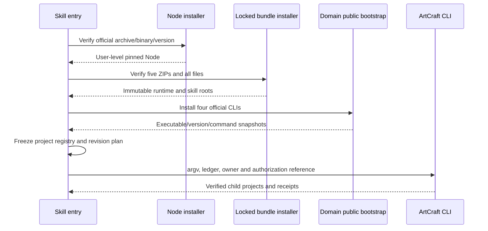

# ArtCraft 首次使用与分发实现

## 当前固定发布检查点

插件版本依次为 FilmCraft dev.6、EffectCraft dev.7、PhotoCraft dev.6、VectorCraft dev.8、ArtCraft dev.25；配套技能源依次为 dev.5、dev.6、dev.5、dev.7、dev.23。当前运行时保持 ArtCraft dev.16，FilmCraft 使用维护制品 0.2.0-craft.1，其余领域 CLI 为 0.2.0。固定宿主发现 58 个技能、单技能公开冷安装及有界原生混合验收已有证据；实际 Skills CLI 安装、模型派发和完整创作接受仍未完成。以下章节保留早期实现记录，其中“尚未完成”是当时检查点；当前恢复、预算与打包范围应以各自后续架构和 evidence 为准。


独立源码位于 artcraft-skills 的 artcraft-use。公开 workflow.py 自动调用 bootstrap.py，再通过生成的登记表执行 ArtCraft CLI。干净复制单技能目录、没有全局 Node 或兄弟仓库的验证已交付四种原生工程。初始安装测试使用本地锁定自有发布包；开发版发布后，默认在线下载也已在新运行时目录通过。Node 与四个 CLI 为实际官方制品。



## 发布事实源与锁定

`build_runtime_bundle.py` 从 ArtCraft 插件的 src、schemas、package.json、LICENSE，以及四个独立技能目录生成五个确定性 ZIP。ZIP 元数据固定，内容按路径排序；锁记录来源仓库、版本、文件名、URL、压缩包大小与摘要、逐文件摘要。它不编辑独立技能源，不把运行时源码的维护事实源迁入技能源仓。ArtCraft ZIP 与四个技能 ZIP 已公开发布，默认在线 setup 已通过本文记录的范围验收。

Node 锁固定官方版本、平台、tar.gz 与二进制摘要。安装器只提取 Node 和许可文件，检查全部条目的路径，禁止执行未核验内容。领域 CLI 安装交给各技能公开 bootstrap，保留其安装回执和许可，不导入兄弟技能私有 Python 模块。

## 安装与身份

自有包安装到 `<runtime-home>/artcraft/bundles/<bundle>/<version>/<sha256>`，暂存验证后原子发布。复用时检查全部文件和未知文件；损坏版本保留并报错，不覆盖。安装全局文件锁防止并发写入。运行时身份快照结合实际命令目录摘要、技能源包摘要、脚本摘要和 ArtCraft 运行时包摘要，避免脚本或适配器变化后误用旧缓存。

Python 启动使用 `-I -B`，不依赖用户 PYTHONPATH，不在只读快照写入字节码缓存。解释器本身的摘要也进入可信启动器配置。当前平台仅 macOS arm64；前置为 Python 3.11+。

## 项目调用与恢复

入口使用项目文件锁串行化同目录调用，拒绝未受管理的非空用户目录。项目保存安装回执、带摘要的登记表、按工作流与修订冻结的计划、绑定摘要、SQLite 账本和结果回执。默认截止时间仅在初次冻结时生成，重跑不刷新；同修订修改计划、输入或登记表会拒绝。媒体摘要流式计算，避免把大型视频整体读入内存，并检查摘要期间的文件变更。

重复调用复用已核验任务；新修订由依赖指纹确定受影响节点。未知执行结果保留租约，不重放。完整崩溃接管、共享预算扣减、原生源工程修订绑定、最终创作审核和交付包仍未完成。

## 验证证据

[安装与首次使用证据](evidence/artcraft-setup-tests.json) 记录来源摘要与实际范围。用例复制单技能目录、将 PATH 限定为 /usr/bin:/bin，安装全新 Node、运行时、四技能和四 CLI，生成四个原生工程；再次运行复用任务；同修订修改计划失败。它不证明自有发布 URL 下载成功、插件宿主安装、GUI 操作、其他平台或创作质量。

## 默认在线发布验收

开发标签 v0.1.0-dev.0 的运行时包与四个技能源包现已公开。[在线首次使用证据](evidence/online-first-use.json) 记录仅复制单项技能、无全局 Node、无离线覆盖参数的实际测试。默认入口在线安装全部依赖，交付四种原生工程，并验证重跑复用、账本重开和同修订冲突。前文的离线记录保留为历史阶段证据；在线结果仅针对 macOS arm64 技术场景，不代替宿主、GUI、完整创作或生产验收。

## 按发行锁重建发布包

打包器默认读取插件内 `skills/artcraft-use/scripts/distribution.lock.json`；也可通过 `--input-lock` 指定经过审核的锁。每个包按自身版本读取本地仓库的固定 `refs/tags/v<version>`，从解析后的提交执行 `git archive`，不读取工作树。缺少标签时直接失败，不隐式获取网络或回退到 HEAD。不同领域技能允许使用不同版本。

所有包在临时目录生成，逐文件摘要、ZIP 摘要、大小、来源和 URL 必须与输入锁完全一致，随后才输出。已有同名不同内容的包或不同发行锁会拒绝覆盖；相同包可重复验证。标签中的符号链接和路径逃逸会拒绝。新版本必须先形成经审核的发行锁；本命令用于重现锁定发布，不自动重新标记版本。

```bash
python3 -B scripts/build_runtime_bundle.py \
  --skills-root <独立技能源仓库集合> \
  --output <发布包输出目录> \
  --lock-output <重建发行锁路径>
```

[固定标签打包证据](evidence/locked-bundle-rebuild.json) 记录本轮五包逐字节复现及隔离 Git 用例。此修改只影响维护者打包工具，不改变当前安装器、技能快照或运行时发行版本。

## 默认宣传模板字体兼容

任务 3.21／AC-SK-003-DEFAULT 覆盖普通和中文内置示例。旧普通模板在 dev.7 字体检查后 Logo 和独立矢量节点失败、消费者阻塞（2 项，1 项失败，53.638 秒）。两个模板的矢量字标改为明确的随运行时字体 Source Sans 3，并同步十技能；用户字体与其他领域字体不变。来源技能普通返工两项通过，52.807 秒；中文交付返工两项通过，52.964 秒。原混合任务保持无关节点和旧文件，移动后交付包可验。默认回归 58 项，47 项通过、11 项跳过。候选技能 dev.22 新宿主安装复验仍为 NOT_RUN；中文字幕单独修订刻意保留旧配音，不证明创作一致性。证据：docs/evidence/default-campaign-font-first-use.json。

已发布技能 dev.22／插件 dev.24 的实际安装普通与中文模板冷启动分别通过（各 2 项，57.177 和 57.973 秒）；宿主发现 58 个技能、零加载错误，执行后全部安装摘要不变。普通测试的每个独立任务入口均来自实际不可变安装快照。上文候选 NOT_RUN 为历史检查点。证据：docs/evidence/codex-release26-default-campaign-20261006.json。
