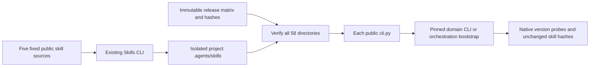

# Independent skill installation acceptance architecture

## 1. Authority and scope

Existing OpenSpec AC-SK-002 remains the authority. Plugin installation, manual single-skill copies and actual Skills CLI installation have separate evidence. The verifier and three plan/guard tests exist; actual Skills CLI installation is NOT_RUN, pending authorization for the missing tool. Marketplace and host acceptance are unchanged.

## 2. Two installation layers



Skills CLI installs skill files. Each skill's Python launcher installs its native CLI or orchestration runtime. Scripts resolve from the loaded SKILL.md directory; runtime caches are separate. No fixed mount or sibling skill is assumed.

## 3. Verifier behavior

`verify_independent_skill_install.py --plan` reads the existing host release lock and produces fixed GitHub tree URLs and arguments. Actual mode requires existing Node, Skills CLI JS entry and Python. Missing tools fail before output creation; the verifier never downloads them. Output must be new. Commands target Codex project installation with copy/yes and no global flag.

All installed files in 58 skill directories must match the release lock. Each directory's public launcher then executes a native version probe using a project-local runtime cache and a system-only PATH. Skill hashes are rechecked afterward. Failure or timeout does not produce a success receipt or restart automatically; the isolated output remains available for diagnosis.

## 4. Invocation and evidence

```bash
python3 -I -B scripts/verify_independent_skill_install.py --plan
python3 -I -B scripts/verify_independent_skill_install.py \
  --node <existing-absolute-node> --cli <existing-absolute-skills-js-entry> \
  --python <existing-absolute-python> --output <new-isolated-directory>
```

Current npm metadata resolves skills@1.7.0; its registry integrity is recorded in pending evidence. Installation waits for tool authorization. Five tests cover the fixed plan, missing-tool refusal before directory creation, symlink rejection, wrong-version refusal and removal of offline overrides. They do not establish real installation or creative execution.

## 5. External contract

[Official Skills CLI documentation](https://github.com/vercel-labs/skills), checked 2026-10-06, documents project-default installation, skill/agent selection, copy/yes flags and GitHub tree sources. Agreement between the current README and npm release still requires actual execution. Model dispatch, native creative workflows and GUI acceptance retain separate evidence.

## 6. Exact native version gate

The verifier now reads the expected native version from each hash-verified installed skill lock. A zero exit with a different full maintenance or prerelease suffix fails without a success receipt. Each successful native probe must record expected and actual versions. Inherited CRAFT_RUNTIME_HOME, CRAFT_NODE_ARCHIVE, CRAFT_BUNDLE_DIRECTORY and CRAFT_NATIVE_ARCHIVE_DIRECTORY are removed before execution. The failure fixture accepted craft.10 when craft.1 was expected before the fix; five unit tests now pass. Subprocesses are simulated, so actual public Skills CLI installation remains NOT_RUN and task 3.16 stays open. The generated plan now binds the current dev.7 VectorCraft and dev.21 ArtCraft skill sources.

## Native identity acceptance

Version probes use the same parser as independent cold-start verification: four domain CLIs require their own `*-cli` name and exact full version; ArtCraft requires a JSON object with `name=artcraft` and the exact locked `version`. PhotoCraft build metadata remains accepted. Zero exit alone, another tool at the same version, and diagnostics quoting the expected version cannot publish a successful receipt.

Regression evidence: [identity gate](evidence/independent-install-identity-regression.json). Actual Skills CLI installation remains NOT_RUN; parsing previously recorded outputs is compatibility evidence only.
