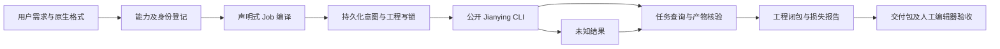

# ArtCraft 剪映适配设计

状态：设计已核对源码；适配器、固定发布和真实首次使用验收尚未完成。规范事实源为 `establish-v1-plugin` 的 AC-DM-006，本文不声明剪映已可路由。

## 固定接口与证据

基线为 Jianying CLI v1.6.31，源码提交 `6fe623096f1ce281d5f0a06f93ca23989b901cff`。核对文件为 `src/main.rs`、`src/job_runner.rs`、`crates/jianying-cli/src/success_envelope.rs`、`crates/jianying-jobs/src/job_record.rs`、`provenance/CAPABILITIES.json`。发行制品摘要以现有剪映插件的 `runtime/jianying-cli.lock.json` 为输入，在登记时复制并冻结，不动态信任另一仓库的最新文件。

| 接口 | 实际语义 | ArtCraft 的要求 |
| :--- | :--- | :--- |
| `capabilities --json` | 成功 envelope 为 `{ok:true,data:...}`；运行时覆写版本和发行身份 | 验证二进制、版本、源码身份及能力状态；仅 supported 可路由 |
| `job run JOB --out OUTPUT --state-root STATE --json` | 创建新 jy-task ID，同步执行；data 是业务结果，附 task_id | 固定 argv、Job 摘要、独占输出和状态目录；执行前写意图 |
| `job show TASK --state-root STATE --json` | data 是 JobRecord，包含 state、路径、revision、attempts、history；不保存业务结果 | succeeded 后重新 inspect/verify 和核对工程、素材摘要 |
| `job list --state-root STATE --json` | 列出状态目录内持久记录 | 尚未收到 task_id 时以唯一 Job 路径与输出路径收敛；多条或无确定结果保持未知 |
| `job retry TASK ...` | 对原任务显式重试，增加 attempts | 不由父编排器自动调用；未知结果不得新 run |
| Job export proxy | 可生成代理视频 | 标注 proxy_preview，不能冒充原生成片 |
| Job export native / draft_archive | 当前执行器返回 incompatible capability | 提前拒绝；schema 允许枚举不能证明可执行 |

## 组件与交接

新增公开登记入口须接收实际 CLI 绝对路径及可信发行锁，不导入剪映插件的私有 runtime_adapter。模型 payload 不可选择二进制、状态目录、环境变量或任意 shell。独立技能通过自己的安装资源和公开 workflow 入口使用适配器；不能依赖兄弟技能目录。首次安装只在用户授权范围内执行，已安装版本按摘要验证后复用。

创建任务将登记的图像、视频、音频转换为 Job v2 的本地 materials，保持逻辑资产 ID 与输入哈希。时间单位为整数微秒，帧率为有理数；转换损失必须记录。编辑任务指定 source 和全新 output，执行前后比较整个源目录和外部引用素材，不只相信 isolation.source_unchanged 字段。源工程返工保留无关层、轨道和素材；下游只失效依赖所改资产的节点。

## 恢复与取消

ArtCraft 在启动前冻结唯一 Job 文件路径、输出路径、状态根和输入摘要。子 CLI 生成任务 ID，因此父进程在回执前崩溃存在提交窗口。恢复必须先确认原 worker 停止，再通过专用状态根 list/show 寻找匹配记录；不得以等待超时推断未提交。只有唯一匹配且产物重新核验成功才能采用 succeeded；没有记录、多记录、running 或路径/摘要漂移均保留占用并要求核对。

JobRecord 不含原始业务结果，必须重建只读证据，不伪造旧回执。cancel 状态本身不证明渲染/写入进程已停止，停止证据确认前不释放写锁。失败重试属于显式决定；父任务重复运行不得产生第二份新草稿。

## 工程交付与验收

剪映原生交付是草稿目录及其引用素材闭包，不改名成 `.fcproj`。ArtCraft 可自行打包该闭包，但不能称调用了未实现的 store.archive。仅允许已核验普通文件，拒绝路径逃逸、符号链接、重复输出和外部依赖缺失；移动包后重新核对引用并执行公开 inspect/verify。结构验证、代理预览、真实编辑器重开与原生导出分别记录，未执行的层级保持 NOT_RUN。

真实验收必须覆盖品牌图形／海报／片头进入剪映草稿、文字或 Logo 局部替换、源目录保全、无关产物复用、中断窗口收敛和移动包。最后在受支持版本剪映中重开并核对可编辑对象；如要求最终原生成片，需独立的原生导出能力及证据，不能以代理视频替代。

## 实施顺序

1. 失败测试：envelope 解包、能力 partial 拒绝、摘要漂移、未知提交不重放、Job succeeded 但缺产物、archive/native 不可用。
2. 实现公开登记、Job 编译、监督驱动、持久查询、闭包交付和独立技能入口，保持四领域与 Video Factory 兼容。
3. 固定候选 CLI/运行时/技能/插件发布；真实空运行目录首次使用及失败恢复验收。
4. 编辑器重开、选择性返工与原生导出分别验收；全部要求有证据后再关闭 AC-DM-006。

## 契约模块实施记录

源码 `src/adapters/jianying_contract.ts` 已实现 envelope 解包、失败 task_id 保留、固定发行身份／supported 能力检查、操作范围拒绝和唯一持久任务收敛。历史序列、状态转移、revision、attempts、last_error 与路径需一致；仅原 worker 已停止时判断任务，succeeded 只产生 verify_candidate，不发布交付或重放命令。目标测试为 `test/jianying_contract.test.ts`。

这是候选源码模块，尚未登记到公开工作流，也尚未发布到固定运行时或安装技能。真实 CLI 调用、缺产物核验、源目录差分、闭包打包和宿主／编辑器验收继续按 12.2–12.6 推进。fixture 回归不替代这些验收。
