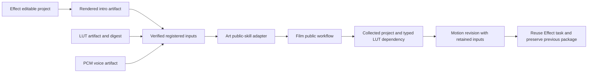

# ArtCraft LUT and motion architecture

## Scope and status

This increment adds registered FilmCraft LUT dependencies to the candidate public-skill adapter. It does not change the immutable ArtCraft dev.67 release. OpenSpec AC-DM-004 is the authority; tasks 6.41 and 6.42 cover candidate behavior, while 6.43 retains fixed-release installation acceptance.

## Dependency contract

An asset binding may add `kind: "lut"` to an existing registered artifact binding. The adapter accepts that kind only for FilmCraft and only for `.cube` or `.3dl` file locations. It resolves paths from verified registered inputs and passes `--lut-asset` to the public Film skill. Inline native paths remain prohibited. Bindings without `kind` preserve existing media and sequence behavior.

## Validation and failure behavior

Unknown binding kinds fail with `skill_asset_binding_invalid`; LUT use outside Film fails with `skill_lut_domain_unsupported`; unsupported extensions fail with `skill_lut_format_unsupported`. Validation happens before writing the executable plan. Collected LUT dependencies must retain the expected digest and typed manifest entry. Revision inputs are checked against the prior collected package, including LUT kind, hash and location evidence.

## Selective revision

Motion revision changes only the Film task. A retained LUT can be loaded from the collected package after the original LUT is removed. The upstream Effect artifact, subtitle tracks, decoded audio, non-target LUT and original Film package remain intact. Repeating the same revision reuses tasks and budget rather than executing again.

## Evidence and remaining work

[Candidate evidence](evidence/lut-motion-adapter-candidate-20261006.json) binds the adapter and driver digests to installed Film dev.11 and Effect dev.10. One native two-domain scenario passed, independently decoding 24 frames; the green LUT pixel, motion output change, retained audio and dependency behavior were checked. The runtime suite passed 166 tests with nine explicit native skips; the LUT native gate passed separately without skips. Component regression first failed before implementation.

This proves the bounded candidate behavior. It does not prove a newly published Art runtime, installation of that future release, four-domain creative acceptance, GUI/model review, generic Skills CLI installation or production readiness. Task 6.43 remains open.
