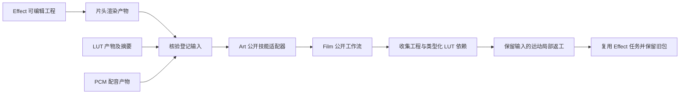

# ArtCraft LUT 与运动架构

## 范围与状态

本增量为候选公开技能适配器增加 FilmCraft 登记 LUT 依赖；现有不可变 ArtCraft dev.67 发行不含该候选改动。规格事实源为 OpenSpec AC-DM-004。6.41、6.42 验收候选行为，6.43 保留固定发行安装验收。

## 依赖合同

登记素材绑定可以增加 `kind: "lut"`。仅 FilmCraft 可使用，文件位置必须为 `.cube` 或 `.3dl`。适配器从已验证的登记输入解析路径，通过公开 Film 技能的 `--lut-asset` 参数交接。禁止在计划中嵌入原生绝对路径；未指定 kind 的普通媒体和序列保持既有行为。

## 校验与失败行为

未知类型报 `skill_asset_binding_invalid`；非 Film 使用 LUT 报 `skill_lut_domain_unsupported`；扩展名不支持报 `skill_lut_format_unsupported`。校验在可执行计划写入前完成。收集清单必须保留 LUT 类型和预期摘要；返工绑定同时核验旧包中的类型、摘要和位置证据。

## 局部返工

仅修改运动时，只更新 Film 任务。删除原始 LUT 后仍可从已收集交付包加载保留依赖。Effect 上游产物、字幕、解码音轨、非目标 LUT 和旧 Film 工程包均保留。重复同一修订复用任务及预算。

## 证据与剩余工作

[候选证据](evidence/lut-motion-adapter-candidate-20261006.json) 绑定适配器及测试驱动摘要，使用真实安装的 Film dev.11、Effect dev.10。两领域原生场景一项通过，独立解码 24 帧，核验绿色 LUT 像素、运动变化、音轨和依赖保留。运行时回归 166 项通过、九项明确原生跳过；LUT 原生门禁另行执行，一项通过且无跳过。组件用例已先确认目标行为缺失导致失败。

该证据限定候选范围，不证明未来 Art 固定 runtime 的公开安装、四领域创作验收、GUI／模型评审、通用 Skills CLI 安装或生产就绪。6.43 保持开放。
