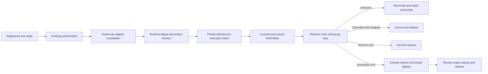

# ArtCraft local execution and settlement

The [runner](../src/harness/local_runner.ts) and [ledger](../src/harness/task_ledger.ts) now connect trusted adapters, actual subprocesses, exit observation, output verification and writer release. Complete mixed-project delivery is still pending.

## Execution path

Trusted adapter preparation inspects and compiles an authorized request without editing. It provides a fixed executable, separate arguments, working directory and current revision. The runner verifies the binary digest, commits execution intent, then spawns without a shell. Model output must not replace the adapter or become an arbitrary command.

The host authorization callback is mandatory. It validates existing authority for the task without repeated approval for covered calls. Rejection prevents claiming or spawning. Authorization storage and external budget accounting remain pending integration.

## Stops, cancellation and unknown outcomes

The supervisor persists attempt/token, command digest, PID, exit code/signal and group-stop evidence. Token and epoch must match. `recordExit` is an internal trusted-supervisor API, not a public tool allowing a model to declare that execution stopped.

Cancellation or deadline expiry first records intent, sends group SIGTERM and escalates to SIGKILL when needed. Only observed close plus confirmed process-group stop permits cancellation and release. Unknown stops retain ownership for reconciliation.

The runner uses POSIX process groups. macOS is tested. Windows is rejected before execution; Linux runtime acceptance remains pending.

## Outputs and review

Successful exit starts verification. The domain adapter checks native/media behavior; the public layer checks locations, digests, sizes and supported signatures. Missing or incorrect outputs cannot publish output references. Verified output manifests are persisted at review_ready and stopped writer ownership is released.

Creative completion is not implied. Completed review evidence, complete referenced-file verification and immutable asset registration remain pending. Cancelling an already-stopped review-ready task can terminate immediately while retaining historical outputs.

## Evidence and remaining work

Thirty-one tests pass. A real EffectCraft test uses an explicitly supplied installed CLI, creates an editable project, supervises native H.264 rendering, decodes 320×180 at 12 fps with 12 frames using ffprobe, checks that the source project did not change, and registers a public artifact. ffprobe is an additional test dependency; this is not independent ArtCraft first-use installation acceptance.

Other tests cover real process success, nonzero exit, cancellation, authorization rejection, incorrect artifacts, concurrent calls and unconfirmed stop evidence. Ledger tests cover process competition and SIGKILL persistence. Long native cancellation, killed-supervisor adoption, complete four-plugin orchestration and host loading remain unverified.

Independent skills/setup, immutable released adapters, shared budgets, native result reconciliation, final review and mixed-project delivery still require implementation. OpenSpec tasks remain tied to complete requirement evidence.
