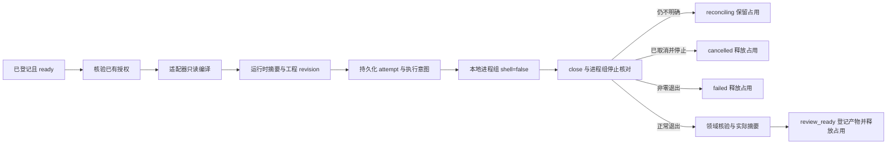

# ArtCraft 本地执行与终结

当前代码：[执行器](../src/harness/local_runner.ts)、[账本](../src/harness/task_ledger.ts)。本轮接通可信适配器、真实子进程、退出观察、产物核验和工程占用释放。现阶段是本地执行基础，不是完整混合场景插件。

## 执行路径

`ExecutionAdapter.prepare` 是可信编译层，仅检查和编译已授权请求，不执行编辑。它返回固定可执行文件、独立 argv、工作目录与当前工程 revision。执行器比较实际二进制摘要与请求的 runtimeIdentity，随后登记执行意图再启动进程。模型输出不得直接作为 shell 命令或替换适配器实现。

`authorize` 是必需的宿主回调。它核验本任务已有授权，不要求每次工具调用重新确认；拒绝时不 claim、不 spawn。当前执行器不实现授权存储或外部计费预算核算，这些仍由下一阶段接入。

## 停止、取消与未知结果

监督器保存 attempt、执行 token、命令摘要、PID、退出码/信号与进程组停止证据。token 与 epoch 必须一致。`recordExit` 是仅供可信监督器使用的内部接口，不作为允许模型自行声明停止的公共工具。

取消或截止时间到期会先登记 cancel_requested，然后发送进程组 SIGTERM；必要时升级 SIGKILL。只有观察到 close 且进程组已停止，才允许 cancelled。未知停止保留占用并进入核对，不按 PID 或时间猜测可安全重试。

当前支持 POSIX 进程组接口，实测为 macOS。Windows 在启动前返回 unsupported_platform。Linux 行为尚未真实验收。

## 产物与创作审阅

成功退出只是核验入口。领域适配器先检查原生或媒体行为，公共层再检查文件位置、摘要、大小和支持格式的签名。无产物、坏摘要或 producerTaskId 不匹配不能发布 outputRefs。成功后状态为 review_ready，持久化公共素材清单，释放已经停止的写入占用。

review_ready 不表示创作审阅通过。completed 的审核证据、完整引用文件核验及不可变素材注册仍待实现。此时取消已停止任务可直接 cancelled，旧产物继续作为历史记录保留。

## 当前验收

总计 31 项测试通过。其中真实 EffectCraft 联调使用显式指定的已安装 CLI，建立 `.ecproj` 后由监督器渲染 H.264，使用 ffprobe 解码核对 320×180、12 fps、12 帧和原工程摘要未变，并登记公共产物。该测试额外依赖 ffprobe，不是独立 ArtCraft 首次安装验收。

其余执行器测试覆盖真实本地进程成功、非零退出、取消、授权拒绝、坏产物、同时调用及未确认停止时保留占用。账本测试包括双进程竞争和 SIGKILL 后意图保留。没有测试真实长渲染取消、父监督器被杀后的安全 adoption、完整四插件编排或宿主加载。

后续需要加入独立 ArtCraft 技能与安装器、固定发布的领域适配器、共享预算、原生结果 reconcile、完整审核与混合项目交付。OpenSpec 任务继续按完整需求验收，不因本轮测试勾选未满足的任务。
