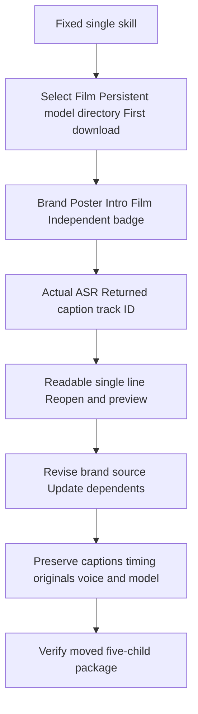

# First-use caption handoff in mixed ASR projects

ArtCraft source83 includes mixed-asr-operations.json and the updated guide in all10 self-contained skills. Plugin111 pins this source. Art runtime remains108; Film remains source36/nativecraft.4, with2646 domain commands. The file is a Film-node operation fragment, not a complete Art DAG.

The old mixed flow retained one caption track but default size54 was too small at180 height. The native regression failed. The new fragment styles the actual returned speechCaptions.track ID, with maxChars32, lines1, size84 and margin0.02. This reserves room for the brand title in the English example. Size is normalized to1080 lines, giving nominal14px at180 height. Recalculate for changed fonts, language or dimensions and inspect the preview. Existing projects retain unrelated captions and disable only explicitly superseded placeholders.

Actual first model download,28-word recognition, five child projects, brand-color revision, four dependent updates, unrelated badge reuse, preserved captions/timing, original outputs/voice and a moved five-child package passed in101.242s. Weights stay outside packages. An earlier two-line candidate passed technical checks but competed with the title in the preview; the current fragment produces six single-line segments. A test observer initially read the wrong mapped-command receipt field; it was corrected to arguments.params, not classified as a product defect. Source regression:150 tests,114 passed,36 conditional skips.

[Bounded evidence](evidence/artcraft-mixed-asr-caption-handoff-20261008.json). Fixed Art111 passed isolated public-tag installation with64 discovered skills and no loading errors. Its actual installed single skill passed first model download, mixed creation/revision, caption preservation and moved packaging in117.673s. All23 changed skills passed separate empty public runtime installation/discovery;41 unchanged skills reused historical cold proof only after complete tree equality. All64 post-use hashes match. All roles, generic Skills CLI, other platforms, GUI, human creative acceptance and full V1 remain open. No sync/archive or Jianying integration.
