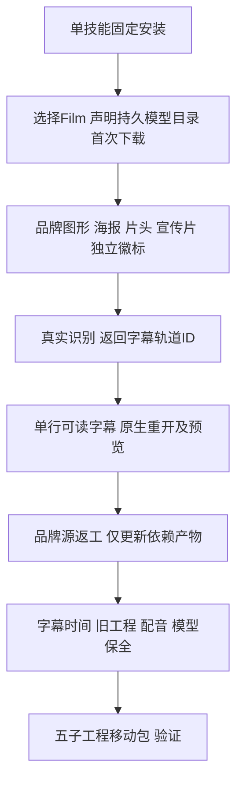

# 混合ASR字幕首用交接

ArtCraft源83将mixed-asr-operations.json和更新的指南收录到十个自包含技能。插件111锁定此源；Art运行时保持108，Film依赖保持源36／原生craft.4，四领域目录2646条。此模板片段用于Film节点操作，不是完整Art DAG。

旧混合识别已保留单一轨道，但原生默认size54在180高画面过小，真实回归失败。新操作以createCaptions返回的speechCaptions.track ID设样式，不猜测C1；maxChars32、lines1、size84、margin0.02给默认英语短片留出品牌标题空间。size按1080行归一，180高时为名义14px。语言、字体、尺寸改变后重新计算并看预览。已有用户工程只关闭明确替换的占位轨道，不自动丢弃字幕。

真实模型首次下载、28词识别、五子工程创建、品牌色返工、四受影响节点更新、无关徽标复用、字幕文字与时间保全、旧产物和配音保全、移动五子工程包均通过（101.242秒）。包不包含模型权重。早期双行候选技术通过，但预览与品牌标题争用底部空间，故当前示例使用六段单行字幕。测试观察器曾读错mapped命令回执字段，已按arguments.params修正，不归为产品错误。源码150项中114通过、36条件跳过。

[限定证据](evidence/artcraft-mixed-asr-caption-handoff-20261008.json)。固定Art111已通过公开标签隔离安装，64项发现、零错误；实际安装单技能首次模型下载与混合创建、品牌返工、字幕保全及移动包117.673秒通过。23变化技能逐个独立空缓存公开安装与发现通过，41项完整摘要相等复用旧冷证据，操作后64摘要匹配。全部角色、通用Skills CLI、其他平台、GUI、人工创作与完整V1保持开放。不sync/archive，不适配剪映。
