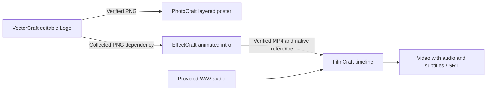

# Four-domain native handoff and installation progress

On 2026-10-05 the full ArtCraft suite passed 48 tests without skips on pinned installed Node.js 24.21.0. The mixed case invoked the four independent public workflow.py entry points to create and reopen `.vectorcraft`, `.pcraft`, `.ecproj` and `.fcproj` projects, with SVG/PNG, PSD/PNG, MP4 and subtitled video exports.

## Verified behavior

The Logo PNG was handed off through public artifact references into the poster and intro, then the intro MP4 entered FilmCraft with provided WAV audio. The film decoded to 320×180 at 12 fps with 12 frames and an audio stream; SRT contained the requested text. Helpers reopened the native projects. The poster PNG was also visually inspected as a procedural functional sample.

Repeating a workflow revision reused existing tasks. Changing the Logo color in a new semantic plan rebuilt all affected consumers with different render hashes while preserving old native project hashes and the original WAV. The public CLI reopened the ledger and reused verified results; status showed eight child tasks and no active writer leases.

This verifies selective rebuilding from a changed semantic plan. Native source-project revision bindings in ArtCraft remain unfinished. Geometric Logo and sine-wave audio fixtures do not prove commercial brand design or voiceover creative acceptance.

## Independent first installation

The new independent artcraft-skills source package includes an official Node installer with pinned URL, archive/binary hashes and version. It installs Node and LICENSE only, validates in staging and publishes atomically. Six installer tests pass, including real official Node installation and reuse from a clean copied directory without global Node. Support currently covers macOS arm64 with Python 3.11+ required.

The complete ArtCraft runtime bundle, four-skill dependency installation, public SKILL.md entry and host release are still pending. Installing Node alone does not establish ArtCraft first-use acceptance. Shared budgets, creative review, complete media metadata, crash adoption and release snapshots remain unfinished.

See [native evidence](evidence/native-mixed-tests.json) and [Node installation evidence](evidence/artcraft-node-tests.json). OpenSpec remains in progress.
