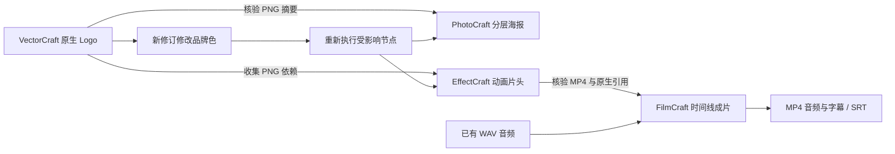

# 四领域原生交接与安装进展

2026-10-05，在锁定安装的 Node.js 24.21.0 上运行 ArtCraft 完整回归：48 项通过，无跳过。混合用例通过四个独立技能的公开 workflow.py，实际生成并重开 `.vectorcraft`、`.pcraft`、`.ecproj`、`.fcproj`，交付 SVG/PNG、PSD/PNG、MP4 与字幕成片。

## 实际检查

- VectorCraft 导出 PNG 和 SVG；PNG 通过公共素材协议绑定并复制到 PhotoCraft 和 EffectCraft。
- PhotoCraft 保存独立图层与原生工程，输出 PNG/PSD；已查看输出 PNG，属于程序化功能样本。
- EffectCraft 保存透明度关键帧，收集 Logo 素材并渲染 MP4。
- FilmCraft 导入片头与固定 WAV，编排一秒时间线、字幕，保存原生工程并导出 320×180、12 fps、12 帧、含音频的 MP4 和 SRT。
- 同工作流修订重跑复用原任务；新工作流修订修改 Logo 颜色，四个节点产物摘要均改变，旧原生工程摘要和 WAV 摘要保持不变。
- CLI run 重开账本并复用结果；status 返回 8 个已技术核验的子任务且无活动写租约。

这是语义计划修改后重建受影响节点的验收，尚未实现 ArtCraft 对原生源工程的局部修订绑定。样本是几何 Logo 与正弦音频，不是商业品牌设计与真人配音的创作验收。

## 独立首次安装

新的独立 `artcraft-skills` 源码包已经有官方 Node 安装器，锁定 URL、tar.gz 摘要、二进制摘要和版本，仅安装 Node 与 LICENSE，暂存校验后原子发布。6 项安装测试通过，含没有全局 Node 的干净复制目录中安装实际官方 Node 并复用。当前平台仅 macOS arm64；Python 3.11+ 为前置。

完整 ArtCraft 运行时包、四技能依赖安装、公开 SKILL.md 入口和宿主发布仍待串联。Node 安装成功不等于完整 ArtCraft 首次使用完成。共享预算、创作评审、完整媒体元数据、崩溃接管、发布快照仍待实施。

[测试与摘要证据](evidence/native-mixed-tests.json)；[Node 安装证据](evidence/artcraft-node-tests.json)。OpenSpec 保持实施中，不把这组结果作为所有场景的完成证明。
