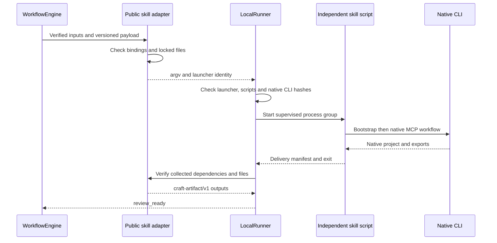

# Public skill script adapter

`src/adapters/public_skill.ts` invokes the independent skill's public `scripts/workflow.py` entry point without importing private Python modules. Trusted configuration pins the plugin, skill root, Python digest, native executable, runtime home, script digests and output root. Model payloads cannot select these paths.

## Invocation contract

The domain payload uses `craft-skill-workflow/v1` and accepts only `schemaVersion`, `plan`, `assetBindings` and `outputs`. `plan` contains a native skill plan without inline `assets`. Each `{name, assetId}` binding passes a verified public input through `--asset name=absolutePath`. Every input must be bound once. VectorCraft currently accepts no external media. Outputs declare `{assetId, location, mediaType}` with package-relative paths and unique IDs.

The adapter currently creates projects only; `expectedRevision` must be null. Domain helpers already support `--source` revisions, but native source-project revision bindings are not yet implemented in this orchestration adapter.

A trusted adapter can provide `LocalRunner` with a `launcherIdentity` containing the Python executable digest, declared script and lock-file digests, and native executable path. The public request SHA still binds the native CLI. Execution intent also hashes launcher identity. Changed launchers, scripts or native runtimes are rejected before writer acquisition and process start. Identity checks do not sandbox arbitrary Python imports or the complete operating-system environment.

## Delivery conversion

The adapter validates the manifest schema, native runtime digest, listed files and collected media against actual hashes, and requires the domain's native project. Public outputs preserve input lineage, native project references, manifest evidence and collected-media references. Every reference is checked again for package containment and digest. This adapter does not yet populate technical metadata; complete media probing and exchange-loss reports remain pending.

## Verification scope

The complete suite passes 45 tests without skips. Two are actual EffectCraft cases: direct native rendering and native project/video creation through the independent skill script. The latter also checks no-replay reuse and rejection of a wrong script digest. Preflight tests reject arbitrary script fields, escaping output paths, inline media and unsupported revisions. See [evidence](evidence/public-skill-tests.json).

The 45-test evidence is the initial adapter snapshot. Subsequent 48-test evidence covers four-domain native handoff and public media inputs; see below. Complete clean ArtCraft installation, shared budgets, creative review, crash adoption and host release remain unverified. The skill script is an unpublished source checkout, not an immutable released skill snapshot.

[Subsequent native integration evidence](ArtCraft-Native-Handoff.md): four-domain handoff now passes; complete first-use setup remains pending.
