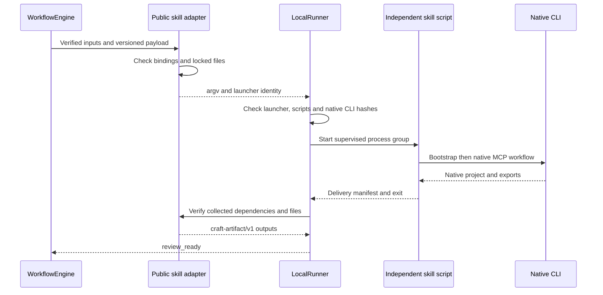

# 公共技能脚本适配器

`src/adapters/public_skill.ts` 只通过独立技能的公开 `scripts/workflow.py` 调用，不导入其 Python 内部模块。可信配置锁定插件、技能根、Python 摘要、原生 CLI、运行时目录、脚本摘要及输出根；模型 payload 不能选择这些路径。

## 调用合同

领域 payload 为 `craft-skill-workflow/v1`，仅接受 `schemaVersion`、`plan`、`assetBindings`、`outputs`。`plan` 为对应技能的原生计划，禁止内联 `assets`。`assetBindings` 用 `{name, assetId}` 将已核验公共输入绑定到 `--asset name=absolutePath`。每个输入必须消费且只绑定一次；VectorCraft 当前不接收外部素材。`outputs` 使用 `{assetId, location, mediaType}`，路径必须在交付包内，重复 ID 拒绝。

当前仅支持新建工程，`expectedRevision` 必须为 null。领域技能自身的 `--source` 修订已经存在，但编排适配器的原生源工程修订绑定尚未接入，不把四领域底层修订能力等同于 ArtCraft 全部返工能力。

`LocalRunner` 支持可信适配器提供的 `launcherIdentity`：Python 二进制摘要、全部声明脚本/锁文件摘要，以及原生 CLI 路径。公共任务的运行时 SHA 仍绑定原生 CLI。执行意图摘要同时包含启动器身份。文件变化、启动器变化或原生运行时变化均在取得写租约和启动之前拒绝。该机制校验声明文件身份，不构成对任意 Python 导入或操作系统环境的完整沙箱。

## 交付转换

适配器核对技能清单 schema、原生运行时摘要、清单列出文件及收集素材的实际摘要，要求约定原生工程存在。输出保留公共输入血缘、原生工程引用、清单证据和收集素材证据，全部引用再次通过包内真实路径和摘要校验。技术元数据目前未由该适配器补全，完整媒体探测与交换损失报告仍需实现。

## 当前验证

完整回归 45 项通过，无跳过；其中 2 项为实际 EffectCraft 用例：原生 CLI 渲染，以及通过独立技能脚本创建工程并导出 MP4。后者也核对重复运行不重复启动和脚本摘要错误拒绝。额外测试覆盖任意脚本字段、包外输出、内联资产、未支持修订的拒绝。见[证据](evidence/public-skill-tests.json)。

上述 45 项证据是适配器首轮快照。后续 48 项测试已补齐四领域原生交接和公共素材联调，见下方链接；首次完整 ArtCraft 安装、共享预算、创作评审、崩溃接管与宿主发布仍未完成。独立技能脚本仍在未发布源码目录运行，尚不是锁定发布技能快照。

[后续原生联调证据](ArtCraft-Native-Handoff.zh_CN.md)：四领域交接已通过，首次完整安装仍未完成。
