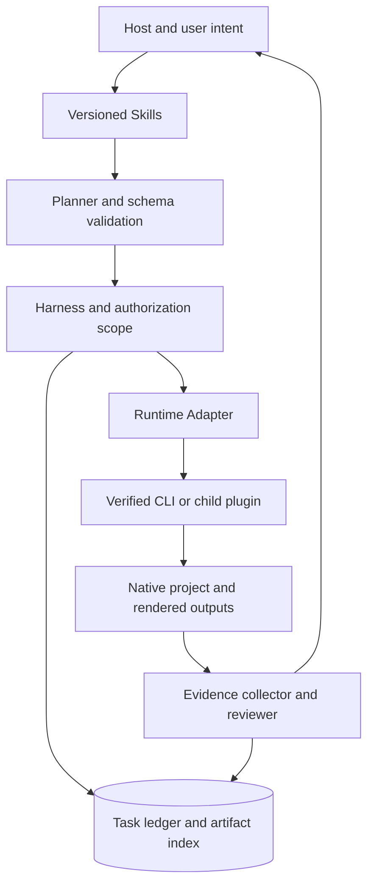
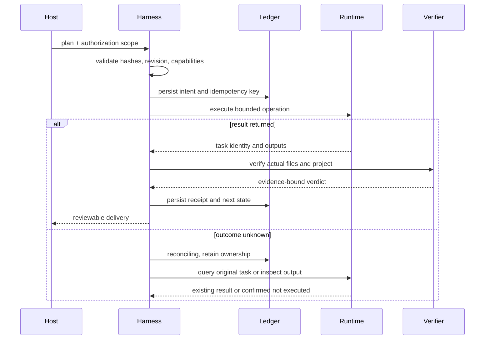
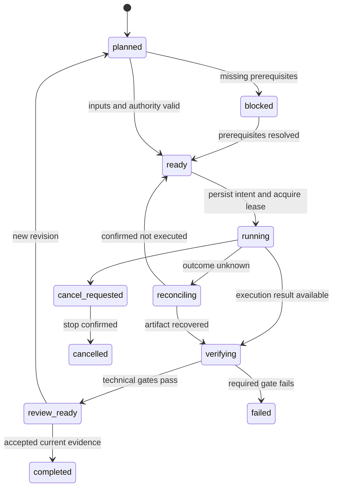
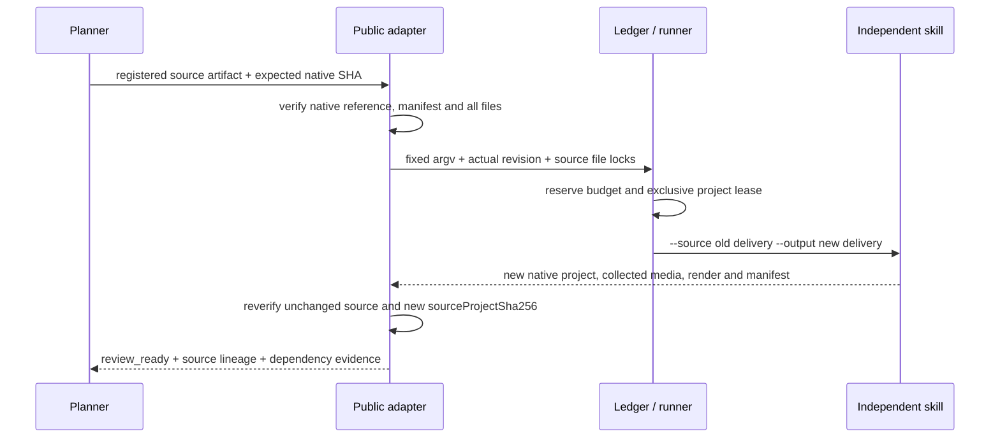
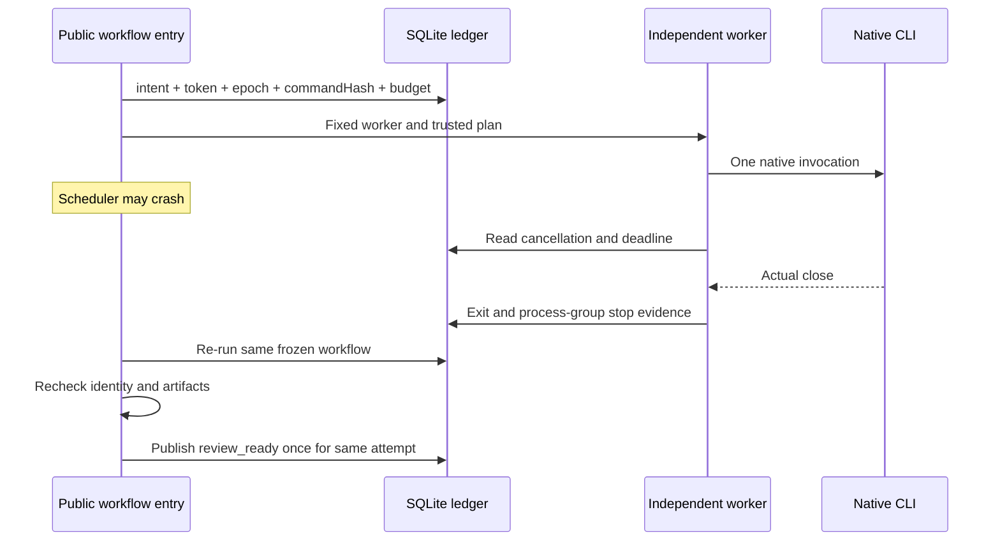

# ArtCraft Runtime Architecture

> **Purpose**: Complete target design for processes, data, protocols, recovery and acceptance.
>
> **Version**: 1.0.0
> **Updated**: 2026-10-05
> **Status**: Target design, not implemented. Observations and acceptance evidence are identified separately.

Related documents: [Brand boundary](../product-docs/ArtCraft/en/1%E3%80%81ArtCraft-Naming-and-Brand.md) · [Technical plan](../product-docs/ArtCraft/en/5%E3%80%81ArtCraft-Technical-Plan.md) · [Detailed architecture](ArtCraft-Runtime-Architecture.md) · [OpenSpec](../openspec/changes/establish-v1-plugin/proposal.md) · [Evidence](evidence/runtime-baseline.json)

## 1. Positioning and evidence boundary

ArtCraft provides cross-plugin creative orchestration, asset dependencies and selective rework. This repository currently contains documentation, specifications, metadata and sanitized runtime evidence; application source, business skills and full host integration are not implemented. Runtime components below describe the target design.

## 2. Drivers and non-goals

Preserve native editability, independent skills, recoverable execution and evidence-backed delivery. V1 uses a local workspace; SaaS, multi-tenancy, billing accounts, web administration and a new desktop editor are out of scope. Automatic lossless cross-application dynamic linking is not promised.

## 3. Components and dependency direction

| Component | Authoritative data | Must not own |
| :--- | :--- | :--- |
| Skills | Procedural knowledge, triggers and domain methods | Task state or secrets |
| Domain Harness | Domain plans, project revisions and child task ledger | Other plugins’ internal state |
| Runtime Adapter | Command mappings and capability snapshots | Changing creative goals |
| Native CLI | Native objects, edits and rendering | Cross-plugin project authority |
| ArtCraft | Brief, DAG, asset versions and aggregate delivery | Fabricating child success |

## 4. Repository and module boundaries

| Planned module | Responsibility | Input and output |
| :--- | :--- | :--- |
| src/planning/ | Normalize goals and edit plans | Brief → DomainPlan |
| src/harness/ | State machine, authorization, budget, recovery | DomainPlan → TaskReceipt |
| src/adapters/ | Upstream command and result mapping | TaskRequest → native command |
| src/artifacts/ | Register hashes, references and delivery | files → ArtifactManifest |
| src/evaluation/ | Technical checks and creative findings | artifacts → QualityVerdict |
| skills/ | Build-time locked skill snapshots | skills.lock.json → packaged knowledge |
| runtime/ | Release locks and compatibility matrix | artifact metadata → verified executable |

These are planned modules, not claims that the source exists.

## 5. Native domain boundary

| Capability | Behavioral boundary | Status |
| :--- | :--- | :--- |
| Mixed brief and deliverable constraints | Create a versioned brief covering aspect ratios, brand, identities, fonts, budget and native deliverables; unresolved constraints block dependent steps but not independent inspections. | Planned |
| Capability and deliverable driven routing | Route using capability snapshots and requested native formats; never silently replace a requested Jianying project with FilmCraft or FFmpeg; do not require every plugin for every task. | Planned |
| Dependency scheduling and concurrency isolation | Validate DAG cycles, missing nodes and input revisions; independent nodes may run concurrently, native projects have one writer, and downstream nodes consume only verified artifacts. | Planned |
| Asset versions and selective invalidation | Separate logical asset IDs from content hashes; record derivation edges and invalidate only transitive dependents of a logo change while retaining historical reviewed versions. | Planned |
| Cross-artifact consistency | Evaluate posters, intros and films against fixed brand and identity references; bind findings to versions and frames or regions; a shared prompt is not consistency evidence. | Planned |
| Delivery and external ecosystem adapters | Collect child projects, assets, outputs, loss reports and acceptance records; integrate existing plugins through public adapters without importing private sibling modules or fabricating completion. | Planned |

Domain objects: `CreativeBrief`, `WorkflowPlan`, `ProjectRevision`, `AssetVersion`, `TaskReceipt`.

## 6. Processes, sessions and concurrency

The host loads knowledge and invokes the plugin entrypoint. A local harness calls upstream through stdio MCP subprocesses or verified CLI argv. Continuous editing retains one native session; separate CLI invocations do not implicitly share memory. Each project has an exclusive write lease and epoch; reads use stable snapshots. expectedRevision detects GUI edits. ArtCraft schedules concurrently only when write resources do not overlap.

## 7. Success path and side-effect boundary

## 8. State machine and legal transitions

Late results after cancellation may be recorded as orphan artifacts but cannot change a cancelled task to completed. Unknown outcomes retain ownership until reconciled; manual reconciliation also requires evidence.

## 9. Persistence, recovery and memory

Use SQLite transactions for tasks, events, asset indexes and authorization references, with large files in content-addressed storage. Commit intent before launching side effects; stage files, verify, atomically rename, then register consumable artifacts. Reconcile or quarantine orphan files after crashes. SQLite and native applications do not form a distributed atomic transaction. Session summaries assist planning; project state, task ledgers and acceptance records remain separate authorities. Persist long-term preferences only when authorized, and never promote inferred preferences into project facts.

## 10. Interfaces and public contracts

Planned adapter operations are capabilities, validate, estimate, submit, status, cancel, reconcile, collect and verify. They are not assertions that upstream CLIs expose these command names. ArtCraft OpenSpec owns craft-task/v1 and craft-artifact/v1; domain plugins own command mappings and domain payloads. Pin cross-repository references to an integration-tested commit before release.

| Field | Semantics |
| :--- | :--- |
| idempotencyKey | Same inputs return original task; changed inputs conflict |
| expectedRevision | Protect modifications made by users or other runs |
| authorizationRef | Reference existing authority; do not demand repeated approval for covered actions |
| inputRefs | Include asset version and digest, not only a path |
| runtimeIdentity | Bind version, digest, mode and capability snapshot |
| deadline / budget | Parent and child share ceilings without double counting |

### 10.1 Native source revision adapter (development version 3)

`payload.sourceProject = {"assetId":"old-output"}` consumes exactly one registered input artifact separately from `assetBindings`. Supply its root and artifact from the previous result as a node `externalInputs` entry (or an explicit dependency binding). `expectedRevision` must equal that artifact's native-project SHA, rather than its preview/export SHA. The adapter derives the source delivery from this input; arbitrary source paths, missing manifest evidence, incompatible runtime identity and `document` recreation are rejected. It fills `plan.expectedProjectSha256` and calls the independent skill's public `--source` interface.

The old delivery remains a historical lineage reference; it is not falsely labeled as a copied media dependency. All inherited collected media appear in new evidence references and the new manifest. EffectCraft replacement bindings are checked against the explicit `asset.replace` target alias. Source drift at factory preparation, runner preparation or final verification rejects the operation. Published paths are immutable new deliveries; this feature does not implement GUI cooperation, crash adoption or creative approval.

The local native regression uses `npm run test:native` to serialize test files. Parallel full native suites showed intermittent EffectCraft failures; multi-process native rendering stability remains unverified. Independent unit and SQLite/process-race tests retain their explicit concurrency coverage.

### 10.2 Install lock contention fix (development version 4)

The prior parallel failure was traced to immediate LOCK_NB acquisition in all four domain bootstrap installers: 12 of 16 samples failed before rendering. Domain skill dev.1 waits up to 120 seconds using a monotonic clock, then rechecks installed digests/receipts; atomic installation still happens once. Timeout reports runtime_install_busy, preserves installations/projects and never retries native tasks. OS lock release follows process exit; a stale lock file is not proof of a live installer.

After this fix, 16/16 EffectCraft samples under four workers, 59 parallel ArtCraft native regression tests and 71 domain live skill tests pass. This supersedes the historical serialized-suite limitation for the tested workload, without promising unlimited concurrency or production capacity.

### 10.3 Ledger-backed project delivery package (development version 5)

`package --database ABS --workflow RUN_KEY --owner ID --authorization REF --output ABS` reads an authorized transactional ledger snapshot. All nodes must be ready/reused with verified terminal task receipts and confirmed process-group stop; an active project writer blocks packaging. Node artifacts must match their trusted task receipts. Each domain manifest defines the collected file set, including native projects, footage, previews, exports and exchange evidence. External media and historical source inputs are collected separately. Only registered files are copied; large media are hashed through streams.

The package contains project.json, children, inputs, the exact executed workflow-plan.json, a separately hashed relative workflow-plan-portable.json and workflow-record.json. The original plan retains historical paths for evidence; portable roots are relative indexes and are not silently claimed as the original plan. The JSON receipt provides the manifest SHA independently of the package. `verify-package --package ABS --sha SHA` checks this SHA, every indexed file, native reference and exact file inventory; it returns child roots resolved under the current location.

```mermaid
flowchart LR
    L[Authorized ledger snapshot] --> G[Ready receipts and no active writer]
    G --> C[Collect manifest files and external inputs]
    C --> S[Private staging and streamed digest checks]
    S --> V[Recheck original sources]
    V --> P[Exclusive new directory publication]
    P --> M[Move package]
    M --> H[Verify using receipt SHA]
    H --> R[Public source interface relinks native media]
```

Publication reserves a new directory exclusively and atomically replaces only that empty reservation. Cleanup removes only owned staging or the owned empty reservation; existing user files are preserved. Missing dependencies, escaping paths, substituted artifacts, changed sources or unfinished tasks reject publication. Extra files and symlinks invalidate verification. Packaging retains review_ready and the budget snapshot; it neither approves creative quality nor copies an active SQLite ledger or creates authorization for rerunning historical plans. Native internal media pointers can be relinked via independent skills after verification; runtime/font/effect compatibility still applies.

### 10.4 Implemented: independent supervision and original-attempt adoption (dev.6)

After committing intent, token, epoch, command digest and budget reservation, LocalRunner starts the fixed execution_worker.ts from the pinned runtime. The worker rechecks identity, starts a native child in its own process group and ignores standard streams, so scheduler pipes are not a lifetime dependency. It reads task and parent-workflow cancellation plus deadlines from SQLite, observes actual close and process-group stop, then records evidence under the original token and epoch.

Adoption does not claim again, allocate budget again or replay native work. Active executions remain waiting; stopped successful executions recompile the read-only plan, match the command digest and verify artifacts. Interrupted verifying can be rechecked and concurrent adopters publish at most one outcome. Parent cancellation without stop evidence remains cancel_requested and retains ownership; the worker stops its own child group when it reads cancellation.

Worker death, an uncertain prepared/submission window or unverified group stop retains reconciling/waiting and the writer lease. PID disappearance and file existence cannot establish completion. Older executions without worker stop evidence remain waiting; SQLite stays at schema v2. Local acceptance covers macOS arm64, Node 24 and EffectCraft 0.2.0 with 76 parallel tests; Linux CI, paid-provider reconciliation, full host acceptance and creative review are separate scopes. See [recovery evidence](evidence/crash-recovery.json).

## 11. Error semantics

| Code | Trigger | Recovery |
| :--- | :--- | :--- |
| runtime_missing | No compatible runtime | Explicit setup; no unverified source build |
| capability_missing | Unsupported command, parameter or mode | Revise plan or pin a supported runtime |
| revision_conflict | Project changed | Inspect and replan without overwrite |
| outcome_unknown | Side effect outcome unknown | reconcile |
| artifact_invalid | Hash, decode or project validation failed | Retain evidence and rework target |
| budget_exhausted | Cost or revision ceiling reached | Stop new work and report state |

## 12. Configuration, permissions and input trust

Configuration precedence is authorized task parameters, project config, user config, then defaults; secrets are references only. Explicit CLI paths still require identity verification. V1 defaults to local files, separates read/write roots and rejects canonical-path escape, symlink escape and non-target overwrite. Use argv arrays rather than shell concatenation. Asset names, layer text, upstream responses and reference documents are data, not policy. Domain editing does not upload by default; cloud adapters check authorization scope and budget.

## 13. Quality and evaluation

A deterministic evaluator checks structure, hashes, dimensions, duration, audio, alpha and project reopening. A creative evaluator reads fixed references and artifacts and produces localized findings; it cannot edit directly or declare completion. Planner, executor and evaluator are logical roles and do not require multi-agent deployment. Human acceptance binds the current evidence digest. Offline fixtures cover success, missing dependencies, corrupt output, stale evidence and adversarial metadata; aesthetic reviews record model, prompt and rubric versions rather than treating one score as proof of stability.

## 14. Resource and performance targets

Unmeasured targets: at most one writer per project, one render at a time by default, and at most three creative revision rounds. Metadata requests have a 10-second deadline; render deadlines are explicit plan parameters and expiration does not prove failure. Measure speed, memory and disk use by dimensions, duration, effects and hardware; no throughput or real-time guarantee is made. Disk budgets include inputs, native projects, checkpoints, outputs and peak temporary usage; insufficient space blocks new side effects.

## 15. Installation, upgrade and rollback

Store CLI versions, licenses, digests and receipts in user-level versioned directories; plugin caches contain read-only packages. Prefer official artifacts, verify platform and digest, then atomically activate a validated staging directory. Drain active sessions before upgrade, retain the previous version and switch only after startup probes; state-schema migration requires backups and rollback compatibility checks. Standalone skills discover runtimes through public setup entrypoints. Routine tasks must not repeatedly download, upgrade or compile CLIs.

## 16. Observability and operations

Correlate logs by projectId, taskId, attemptId, runtimeIdentity, planHash and artifactHash; record transitions, queue wait, execution duration, retries and gates without credentials or private media contents. Doctor distinguishes installation, version, capability, host and native delivery. Quiesce writes for consistent ledger backup and retain an asset manifest; recompute hashes and reconcile unfinished tasks after restore. Clean only confirmed unreferenced caches, preserving projects, evidence and user inputs.

## 17. Compatibility, acceptance and evolution

Observed: official CLI 0.2.0 for the four applications starts and completes basic MCP calls on macOS arm64. Unverified: full creative workflows, host plugin installation, desktop bridges, macOS x64, Windows and Linux. Every compatibility row requires version, platform, mode and real-case evidence. V1 validates local native workflows before cross-plugin and generation-service integration.

Deliver brand graphics, a poster, motion intro and film; replace the logo and rebuild only its dependents; recover interruption without resubmitting already-created generation jobs.

## 18. Mixed scenarios and selective rework

Brand recipe: VectorCraft graphics → PhotoCraft poster and EffectCraft intro → FilmCraft master film. Independent voice-over has no logo dependency and must be reused after a logo revision. Generation recipe: Blender previs references → authorized provider → EffectCraft → FilmCraft. Delivery recipe: master film → aspect/language variants → Content Factory receives verified visual assets. The parent holds child references while child plugins own execution state; adapter failure reports missing capabilities instead of reading private databases.

## 19. Risks and decision reversal

| Risk | Detection | Mitigation and owner |
| :--- | :--- | :--- |
| R1 | Upstream command or format changes | Runtime owner: pin releases, diff schemas and rerun fixtures; keep old version until verified |
| R2 | Text, alpha or color loss on handoff | Domain owner: retain native sources, emit loss reports and inspect pixels and objects |
| R3 | Duplicate submission after disconnect | Harness owner: persist intent and idempotency keys, reconcile before retry |
| R4 | Design documentation mistaken for implementation | Release owner: planned feature status; no marketplace entry without working skills and runtime |
| R5 | ArtCraft branding and restricted-source boundaries | Maintainer: independent implementation; do not copy ArtCraft/Services source; clear branding before distribution |

If real concurrency or multi-machine needs exceed the local ledger, evaluate service deployment through a new OpenSpec change. If upstream commands remain unavailable, narrow the declared scope or add an explicitly tested adapter rather than silently changing native-delivery requirements.

---

**Document version**: 1.0.0
**Created**: 2026-10-05
**Updated**: 2026-10-05
**Document status**: Ready for review; implementation status is governed by OpenSpec tasks and evidence.
