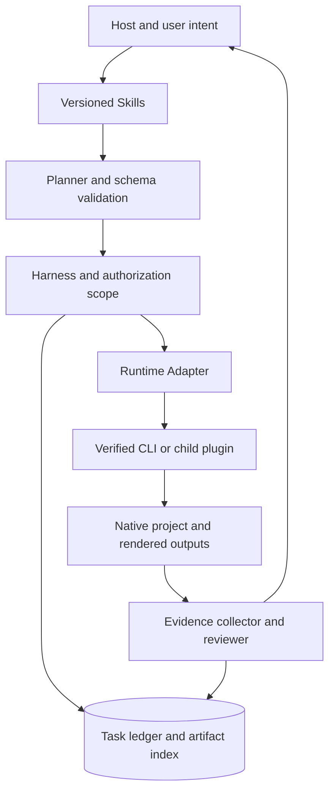
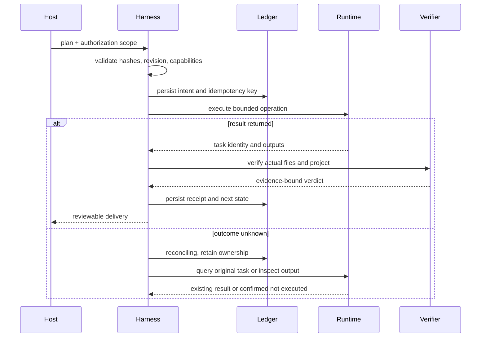
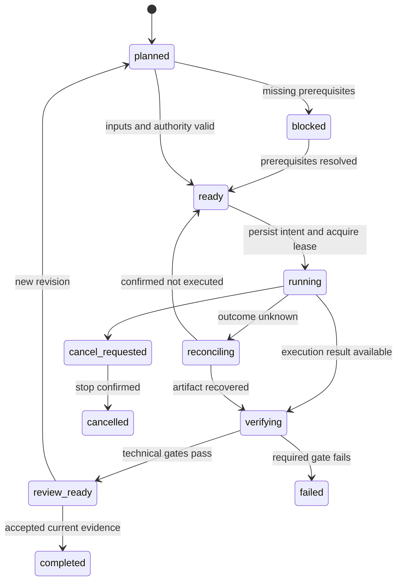
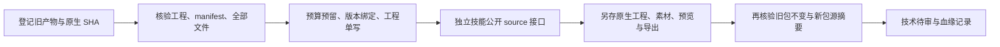
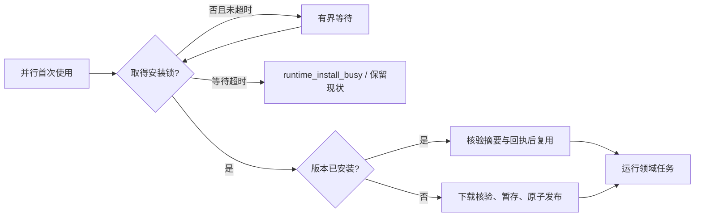
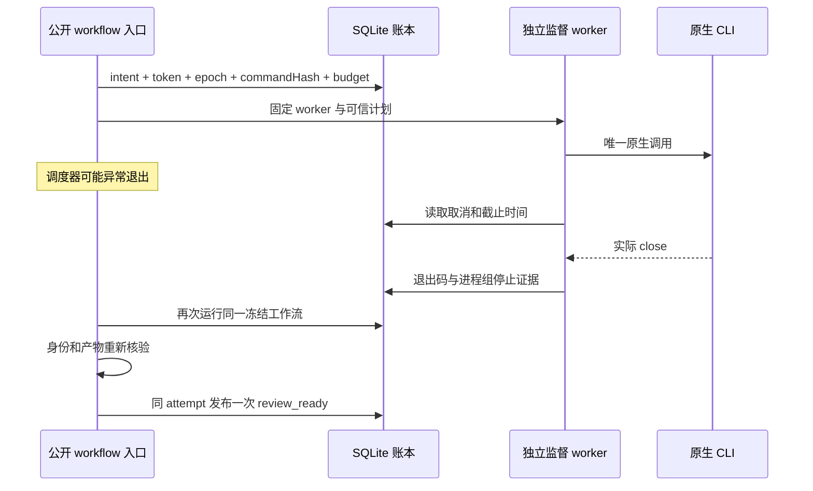
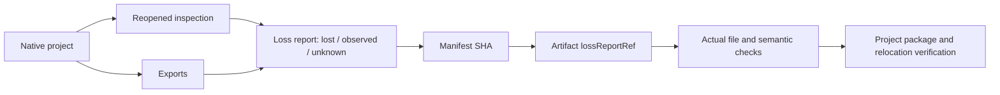

# ArtCraft Runtime Architecture

> **文档说明**：进程、数据、协议、故障恢复及验收的完整目标设计。
>
> **版本**：1.0.0
> **最后更新**：2026-10-05
> **状态**：目标设计与分阶段实现。第 10 节记录当前实现和验证范围；未验收目标不作为已交付能力。

关联文档：[品牌边界](../product-docs/ArtCraft/1%E3%80%81ArtCraft-%E5%91%BD%E5%90%8D%E4%B8%8E%E5%93%81%E7%89%8C%E8%AF%B4%E6%98%8E.md) · [技术方案](../product-docs/ArtCraft/5%E3%80%81ArtCraft-%E6%8A%80%E6%9C%AF%E6%96%B9%E6%A1%88%E4%B8%8E%E8%B7%AF%E7%BA%BF.md) · [详细架构](ArtCraft-Runtime-Architecture.zh_CN.md) · [OpenSpec](../openspec/changes/establish-v1-plugin/proposal.md) · [证据](evidence/runtime-baseline.json)

## 1. 定位与证据边界

ArtCraft 负责跨插件创作编排、素材依赖与局部返工。当前仓库包含运行时源码、锁定独立技能源快照、SQLite 账本、DAG、源工程修订、项目打包和独立监督接管实现。实际验证见第 10 节与 evidence；完整宿主、创作审核、交换损失等目标仍待验收。其余章节描述目标合同，不自动代表全部实现。

## 2. 驱动与非目标

必须保留原生可编辑工程、独立技能分发、可恢复执行和可证实交付。V1 使用本地工作区；不建设 SaaS、多租户、账户计费、Web 管理台或新的桌面编辑器。不承诺自动跨软件无损动态链接。

## 3. 组件与依赖方向

| 组件 | 权威数据 | 禁止承担 |
| :--- | :--- | :--- |
| Skills | 操作知识、触发条件、领域方法 | 任务状态和秘密 |
| Domain Harness | 领域计划、工程修订、子任务账本 | 其他插件内部状态 |
| Runtime Adapter | 命令映射与能力快照 | 自行改变创作目标 |
| Native CLI | 原生对象、编辑与渲染 | 跨插件项目真相 |
| ArtCraft | Brief、DAG、资产版本与聚合交付 | 伪造子任务成功 |

## 4. 仓库与模块边界

| 规划模块 | 责任 | 输入与输出 |
| :--- | :--- | :--- |
| src/planning/ | 规范化目标与编辑计划 | Brief → DomainPlan |
| src/harness/ | 状态机、授权、预算、恢复 | DomainPlan → TaskReceipt |
| src/adapters/ | 上游命令与结果映射 | TaskRequest → native command |
| src/artifacts/ | 登记哈希、引用与交付 | files → ArtifactManifest |
| src/evaluation/ | 技术检查与创作问题 | artifacts → QualityVerdict |
| skills/ | 构建时锁定同步的技能 | skills.lock.json → packaged knowledge |
| runtime/ | 发行锁文件与兼容矩阵 | artifact metadata → verified executable |

以上路径为拟建模块，不代表源码已存在。

## 5. 原生领域边界

| 能力 | 行为边界 | 状态 |
| :--- | :--- | :--- |
| 混合需求与交付约束 | 将用户需求转为可版本化 Brief，记录画幅、品牌、角色、字体、预算与原生交付要求；歧义阻止依赖它的步骤，不阻塞独立检查。 | 计划中 |
| 能力与交付驱动路由 | 按能力快照与用户原生格式选工具；指定剪映工程不得静默替换为 FilmCraft 或 FFmpeg；不要求每次安装或调用全部插件。 | 计划中 |
| 依赖调度与并发隔离 | 执行前检查 DAG 循环、缺失节点与输入版本；独立节点可并行，同一原生工程单写；下游只消费已验证产物。 | 计划中 |
| 素材版本与选择性失效 | 区分逻辑资产 ID 与内容哈希；显式记录派生边；修改 Logo 只使传递依赖失效，已审阅旧版本仍可追溯。 | 计划中 |
| 跨产物一致性 | 以固定品牌与主体参考评估海报、片头和成片，问题绑定资产版本及帧或区域；单一提示词不是一致性证据。 | 计划中 |
| 交付与外部生态接入 | 汇总子工程、素材、输出、损失报告和验收记录；现有插件需经过公开适配接口，禁止导入兄弟仓库私有模块或伪造完成。 | 计划中 |

领域对象：`CreativeBrief`, `WorkflowPlan`, `ProjectRevision`, `AssetVersion`, `TaskReceipt`.

## 6. 进程、会话与并发

宿主加载知识并调用插件入口；Harness 在本地进程中运行，通过 stdio MCP 子进程或已验证 CLI argv 调用上游。需要连续编辑时维持同一原生会话；一次 CLI 命令结束不意味着下一命令拥有相同内存状态。每个工程持有独占写入租约与 epoch；读操作只读取稳定快照。用户 GUI 修改通过 expectedRevision 校验发现。ArtCraft 只并行调度没有共同写入资源的节点。

## 7. 成功路径与副作用边界

## 8. 状态机与合法转换

取消后迟到结果可登记为孤立产物，不得恢复已取消任务为完成。未知结果不通过释放租约假装失败；人工核对也需留下证据。

## 9. 持久化、恢复与记忆

目标采用 SQLite 事务记录任务、事件、资产索引与授权引用；大文件存于内容哈希目录。副作用意图提交后才能启动进程；文件先写暂存，核验后原子更名，再登记可消费产物。崩溃后的孤立文件通过 reconcile 登记或隔离。不能宣称 SQLite 与原生应用具有分布式原子事务。会话摘要只辅助规划；工程状态、任务账本和验收记录分别是权威来源。长期用户偏好仅按授权保存，不把推断写成项目事实。

## 10. 接口与公共契约

插件适配接口为 capabilities、validate、estimate、submit、status、cancel、reconcile、collect、verify。它们是拟建公共接口，不是上游 CLI 同名命令。ArtCraft 的 OpenSpec 拥有 craft-task/v1 与 craft-artifact/v1；领域插件只定义命令映射与领域 payload。交付前应将跨仓引用固定到经过联调的提交。

| Field | 语义 |
| :--- | :--- |
| idempotencyKey | 同输入返回原任务；不同输入冲突 |
| expectedRevision | 保护用户或其他运行造成的修改 |
| authorizationRef | 引用已有授权范围；不要求每次重新确认 |
| inputRefs | 包含资产版本与摘要，不只有路径 |
| runtimeIdentity | 绑定运行时版本、摘要、模式和能力快照 |
| deadline / budget | 父子任务共享上限，不重复计账 |

### 10.1 原生源工程修订适配（开发版本 3）

`payload.sourceProject = {"assetId":"old-output"}` 单独消费一个登记输入，不把旧工程当作 `assetBindings` 中的媒体。节点 `externalInputs` 从上次结果提供 root 与完整 artifact，也可使用显式依赖绑定。`expectedRevision` 必须为输入的原生工程 SHA，不能使用预览或成片 SHA。适配器解析登记的源交付，拒绝任意源路径、缺失 manifest 证据、不兼容运行时身份和 `document` 重建；填入 `plan.expectedProjectSha256` 后调用独立技能公开 `--source` 接口。

旧交付作为历史血缘引用，不伪称已经复制为新媒体依赖。继承素材全部进入新 manifest 和证据引用；EffectCraft 替换素材按计划显式 `asset.replace` 目标别名核验。工厂准备、执行准备和交付验收时均重查源文件，漂移拒绝执行或拒绝交付。新交付目录不覆盖旧包；本能力不代表 GUI 协作、崩溃接管或创作审核已经完成。

本地原生回归使用 `npm run test:native` 串行运行测试文件。并行全量原生套件出现 EffectCraft 偶发失败，多进程原生渲染稳定性尚未验证；单元测试和 SQLite/进程竞争测试保留各自显式并发覆盖。

### 10.2 安装互斥竞争修复（开发版本 4）

此前并行失败已定位为四领域 bootstrap 在安装/复用 CLI 时直接使用 LOCK_NB。16 个样本中 12 个在渲染前被锁竞争拒绝。独立技能源 dev.1 改为单调时钟有界等待 120 秒，取得锁后重查已安装摘要与回执，原子安装仍只执行一次。超时返回 runtime_install_busy，保留安装和工程，不重放任何原生任务。进程退出由操作系统释放锁；不把遗留锁文件当作活动证明。

修复后四执行器下 16/16 EffectCraft 样本通过，59 项 ArtCraft 并行原生回归和四领域合计 71 项真实技能测试通过，之前的串行限制已被这些当前证据更新。测试负载不证明无限并发或生产容量。

### 10.3 可信账本项目交付包（开发版本 5）

公开 package 命令读取授权范围匹配的账本事务快照，要求节点就绪或可复用、子任务回执已核验且进程组已停止；工程活跃写入者阻止打包。节点产物必须与可信子任务回执一致。领域 manifest 定义收集范围，包括原生工程、素材、预览、导出和已经生成的交换证据；外部素材与旧源交付单独收集。只复制登记文件，大媒体使用流式摘要核验。

项目包包含 project.json、children、inputs、原始冻结 workflow-plan.json、具有独立摘要的相对索引 workflow-plan-portable.json 和任务记录 workflow-record.json。原计划保留历史路径以便追溯；相对索引不伪称为原执行计划。打包 JSON 回执独立提供清单 SHA；verify-package 使用该 SHA 检查全部文件、原生引用和精确文件清单，并返回当前移动位置下的子工程 root。

发布只独占新目录并替换本调用的空占位；失败清理只删除自有暂存或自有空占位，保留用户既有文件。缺依赖、外逃路径、回执产物被替换、源文件漂移或任务未就绪均拒绝。验包拒绝清单外文件与链接。打包保留 review_ready 和预算快照，不提升创作验收、不复制活跃 SQLite 账本、不建立重新执行历史计划的授权。原生内部素材指针在验包后由独立技能源工程接口重关联，运行时、字体和效果兼容性仍按领域检查。

### 10.4 已实现：独立监督与原任务接管（dev.6）

LocalRunner 在登记 intent、token、epoch、命令摘要与预算占用之后，启动固定 runtime 中的独立 execution_worker.ts。worker 重查身份后启动原生子进程，使用独立进程组并忽略标准流，不依赖调度器管道存活。worker 从 SQLite 读取任务和父工作流取消意图及截止时间，观察真实 close 与进程组停止，再以原 token/epoch 写入停止证据。

接管不重新 claim 或分配预算，不重放原生任务。进程仍运行时返回 waiting；已停止且成功时重新编译只读计划、匹配命令摘要并验证产物；verifying 中断允许重新核验，两个并发接管至多提交一个 outcome。父取消但没有停止证据时返回 cancel_requested，保留占用；worker 读到父取消后负责停止其自有子进程组。

worker 自身崩溃、prepared 提交窗口未知、进程组停止未确认时保留 reconciling/waiting 和写锁，不凭 PID 消失或文件存在完成任务。没有 worker/停止证据的旧执行保持等待；SQLite schema 仍为 v2。实测为 macOS arm64、Node 24、EffectCraft 0.2.0；76 项并行回归通过，Linux CI、付费服务、完整宿主和创作审核是不同证据范围。详见 [接管证据](evidence/crash-recovery.json)。

## 11. 错误语义

| Code | 何时出现 | 恢复动作 |
| :--- | :--- | :--- |
| runtime_missing | 没有兼容运行时 | 执行显式 setup；不自动编译来源不明代码 |
| capability_missing | 命令、参数或模式未支持 | 修订计划或固定受支持版本 |
| revision_conflict | 工程已被修改 | 重新检查与规划，不覆盖 |
| outcome_unknown | 副作用结果未知 | reconcile |
| artifact_invalid | 产物哈希、解码或工程检查失败 | 保留失败证据，局部返工 |
| budget_exhausted | 达到成本或修订上限 | 停止新增工作并交付状态 |

## 12. 配置、权限与输入信任

配置优先级：已授权任务参数 → 项目配置 → 用户配置 → 默认值；秘密只传引用。显式 CLI 路径仍需校验身份。V1 默认本地文件，读写根目录独立，解析真实路径后拒绝越界、符号链接逃逸和覆盖非目标文件。执行 argv 数组而非拼接 shell。素材名、图层文字、上游返回与参考文档都是数据，不能修改执行策略。专业编辑默认不上传素材，云端调用由适配器检查授权范围与预算。

## 13. 质量与评估

技术评估器执行确定性检查：结构、哈希、尺寸、时长、音轨、alpha 与工程重开。创作评估器读取固定参考与产物，只产生带位置的缺陷建议，无权直接编辑或把任务标为完成。Planner/Executor/Evaluator 为逻辑职责，可在单宿主内实现，不强制多 Agent 运行。人工接受绑定当前证据摘要。固定离线 fixture 覆盖成功、缺失依赖、损坏输出、旧版本证据与对抗元数据；审美评价记录模型、提示词与量表版本，不能用单次评分证明稳定。

## 14. 资源与性能目标

以下是待测目标：每工程最大并发写入数 1；每项目默认同时渲染 1 个节点；创作修订默认最多 3 轮。metadata 请求截止时间 10 秒，渲染截止时间按计划显式设置，超时不等于失败。渲染速度、内存和磁盘需求必须按尺寸、时长、效果与硬件测量；本阶段没有吞吐或实时性能承诺。磁盘预算覆盖输入、源工程、检查点、输出与最大临时峰值；空间不足时在副作用前阻止新任务。

## 15. 安装、升级与回退

用户级版本目录保存 CLI、许可、摘要与回执，插件缓存只保存只读包。优先使用官方制品，安装前检查平台与摘要，在暂存目录验证后原子激活。升级时等待活动会话排空，保留旧版本，启动探测通过才切换；状态 schema 迁移需备份与回退兼容性检查。独立技能也能通过公开安装入口发现运行时。禁止在每次普通任务中重新下载、升级或编译 CLI。

## 16. 可观测性与运维

日志以 projectId、taskId、attemptId、runtimeIdentity、planHash、artifactHash 关联，记录状态变更、队列等待、执行时长、重试和验收门禁；不记录凭据或完整隐私素材。doctor 区分安装、版本、能力、宿主、原生交付五个层面。备份先停止写入并保存账本一致性快照，同时记录资产清单；恢复后重算哈希并核对未终结任务。清理只处理已确认无引用的缓存，工程、证据与用户素材保留。

## 17. 兼容、验收与演进

已观察：macOS arm64 上四款官方 CLI 0.2.0 能启动并完成基础 MCP 调用。未验证：完整创作流程、宿主插件安装、桌面桥接、macOS x64、Windows、Linux。兼容矩阵每行对应版本、平台、模式和真实用例证据。V1 先验收本地原生链路，后增加跨插件与生成服务。

完成品牌图形、海报、动态片头与宣传片；替换 Logo 后仅更新依赖它的产物；中断恢复不重复提交已发生的生成任务。

## 18. 混合场景与局部重做

品牌配方：VectorCraft 品牌图形 → PhotoCraft 海报与 EffectCraft 片头 → FilmCraft 主片。独立配音无 Logo 依赖边，替换 Logo 时应复用。生成配方：Blender 预演参考 → 授权生成服务 → EffectCraft → FilmCraft。分发配方：主片 → 多画幅/语言变体 → Content Factory 接收已验证视觉资产。父项目持有子任务引用，子插件仍是执行状态权威；适配失败报告缺失能力，不通过读取私有数据库补洞。

## 19. 风险与决策反转条件

| 风险 | 发现方式 | 处理与责任人 |
| :--- | :--- | :--- |
| R1 | 上游命令或格式变化 | Runtime owner：固定版本，比较 schema，重跑 fixture；未通过保持旧版 |
| R2 | 文字、透明或颜色交接损失 | Domain owner：保存源工程，生成 loss report，使用像素与对象检查 |
| R3 | 断线导致重复提交 | Harness owner：持久化意图与幂等键，先 reconcile，再决定重试 |
| R4 | 文档被误读为已实现 | Release owner：功能状态为 planned；无技能和运行时入口不得进市场 |
| R5 | ArtCraft 商标和受限许可代码边界 | Maintainer：独立实现；不复制上游 ArtCraft/Services 代码；品牌授权在发行前核对 |

如果真实并行或跨机器需求超过本地账本能力，再通过新 OpenSpec 变更评估服务化；如果上游命令长期缺失，则缩减明确能力范围或新增受验收的适配，不悄悄改写原生交付要求。

---

**文档版本**：1.0.0
**创建日期**：2026-10-05
**最后更新**：2026-10-05
**文档状态**：待评审；实现以 OpenSpec 任务和证据为准。

当前实现：原生交付包含 exchange-loss.json，公开工作流保留原生源与重开检查摘要，记录格式损失、SVG/PSD 实际结构观察及未知字体/效果保真。报告进入 manifest.files，由 ArtCraft 接管与打包时重新核验；完整交换保真验收仍待完成。

交换报告信任链

## 当前宿主验收

快照 `0.1.0-dev.7` 已有安装、发现及安装后公开入口的限定范围证据。参见[验证合同与未验证范围](ArtCraft-Host-Verification-Architecture.zh_CN.md)。完整发布任务仍保持未完成，目标设计段落不作为实现证明。
