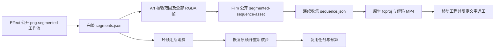

# ArtCraft 分段序列架构

日期：2026-10-07。规范事实源：`establish-v1-plugin`，AC-DM-004 与 AC-AR-001-SEGMENT。本增量为候选源码联调；Art 插件 dev.70／技能源 dev.47／runtime dev.68 及领域不可变发行保持原身份。

## 合同与职责

Effect 负责有界原生分段渲染，Film 负责连续收集和原生导入，Art 负责类型化产物核验、依赖调度、修订及任务协调。MIME 保持 `application/vnd.craft.image-sequence+json`，按显式 descriptor schema 分派，拒绝未知 schema。

`craft-segmented-render-checkpoint/v1` 必须完整 verified，绑定工程和运行时摘要、合成时间及精确有理数分段范围，各段使用原 v1 清单。每段编码与解码字节均不超过 512 MiB；全序列逻辑上限为 64 GiB／10,000 帧，编码总量 2 GiB。原 `craft-image-sequence/v1` 全序列 512 MiB 上限保留。资源上限不等于长序列验收。

Film 生成 `filmcraft-collected-sequence/v1`，保留每段来源摘要与原 `sourceSequenceSha256`；新规范化清单具有不同 SHA。Art 分别核验原来源绑定和收集后的新摘要，不能直接要求新旧清单摘要相等，也不能省略来源校验。

## 路径、证据与恢复

构造 Film 公开参数前，Art 对已登记分段素材解析真实路径，以支持 macOS 系统临时目录别名；Film 对子路径符号链接的拒绝规则保留。prepare 在原生启动前再次核验真实输入。模型不能指定本地执行器或任意脚本。

源产物包含全部子清单与帧引用，Film 产物包含全部收集帧及原生依赖记录。不完整状态、范围缺口／重叠、时间不符、坏 PNG 和摘要变化均阻断。恢复同版本原帧后复用既有任务 ID 和预算；不承诺跨已修改源版本的片段复用。

## 验证与发行门禁

[候选证据](evidence/art-segment-adapter-candidate-20261007.json) 绑定原生运行时摘要、独立技能逐文件摘要、原生驱动及候选适配器／协议源码摘要。公开工作流完成三段十二帧、十二帧 MP4 独立解码及六处合成像素检查；移动 Film 包并删除原背景后修改文字，保留旧文件；坏帧阻断，恢复后复用任务／预算，最终复核全部技能文件。

本验证使用已有核验原生执行器及当前领域源码，不是 Art 空运行时安装，也不是新固定插件安装。6.46 覆盖候选联调；6.47 保留 HD 长序列、固定领域及 Art runtime／技能源／插件发布、安装快照、公开冷使用、移动包和安装摘要验收。完整 V1、GUI／模型派发／创作接受仍开放，Art 不含剪映适配。

协议复验：`node --test test/segmented_sequence.test.ts`。原生驱动为 `test/segmented_sequence_native.test.ts`，通过 `CRAFT_ART_SEGMENT_NATIVE=1` 及显式核验的 Python／领域技能／原生 CLI 路径启用；本机路径仅作运行配置，不进入公开证据。

## HD 领域候选与当前源码回归

[领域 HD 证据](evidence/effect-film-segment-hd-candidate-20261007.json) 证明两个单独复制的技能源从空运行时使用默认下载，完成五秒 1080p／24 fps 序列及完整 120 帧 Film 成片解码，包含动态标题。这不证明安装版 Art HD。

[当前源码 Art 回归](evidence/art-segment-fast-rgba-candidate-20261007.json) 使用优化后的领域解码器，一项原生用例在 5.905 秒通过，覆盖十二帧、移动工程后的局部文字修订、损坏拒绝／恢复、源文件保全和恢复预算不变。任务 6.47 保持开放，等待不可变发行和安装版 HD 验收。
