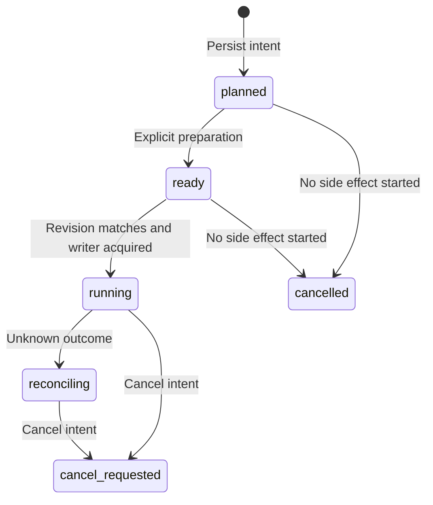

# ArtCraft persistent task ledger

The [implementation](../src/harness/task_ledger.ts) follows the active OpenSpec requirements AC-CP-001 and AC-TX-001 through AC-TX-003. It implements registration, version bindings, writer ownership, unknown outcomes and cancellation intent. A local supervisor and stopped-process failure/cancellation/review-ready settlement are now integrated. Final creative completion and crash adoption remain pending.

## State behavior

| API | Implemented behavior |
| :--- | :--- |
| register | Validate protocol and actual payload digest; persist identity and bindings before side effects |
| ready | Mark preparation without starting native execution |
| claim | Check adapter-supplied current revision, deadline and project ownership; persist attempt and epoch atomically |
| unknown | Retain attempt and ownership; enter reconciling or keep an existing cancel request |
| cancel | Immediately cancel unstarted tasks; record intent for started tasks |
| status / list / events / leases | Read only; never retry or release ownership automatically |

## Idempotency and scope

Keys are partitioned by caller and target plugin. Repeated requests return the original task even if the client supplies a different task ID. Changes to the plan, input versions, project identity, runtime, authorization reference, budget or deadline conflict. Reusing a task ID for a new task also conflicts.

The plan hash covers the complete versioned payload. The domain adapter must read the actual revision before calling claim. This module does not connect to a GUI or discover current project hashes. Caller and project identities are controlled execution context; future execution adapters must canonicalize project identities to prevent aliases from bypassing ownership.

## Persistence and concurrency

Task records, events, writer ownership and monotonic epochs change together in SQLite `BEGIN IMMEDIATE` transactions, using WAL and FULL synchronization. Application and schema version identifiers reject foreign or unsupported databases without creating application tables.

Two connections and two actual Node processes competing for the same project allow exactly one running task. Stale epochs cannot record unknown outcomes. Expired deadlines prevent new starts. Deadline reconciliation of already-started side effects still requires execution integration.

Closing and reopening the database preserves active states and ownership. There is no time-based automatic retry or ownership release. Settlement now requires observed close and confirmed process-group stop. Technical output verification can enter review_ready and release ownership. Unconfirmed stops retain ownership.

## Evidence and remaining work

Twelve ledger tests and ten protocol tests pass. They cover real temporary SQLite files, reopening, two connections, two competing OS processes and a writer killed with SIGKILL. The killed writer retains durable intent and ownership; restart does not replay it. Revision and cancellation tests use protocol fixtures; no GUI session, native render cancellation or paid call is covered.

Authorization scope, shared budget consumption, child process identities, stop evidence, terminal reconciliation, output/evidence registration, immutable asset versions, recoverable scheduling and independent skill installation remain pending. OpenSpec tasks stay unchecked; these tests do not establish production recovery acceptance.

See [local execution acceptance](ArtCraft-Local-Execution.md) for native rendering integration.
