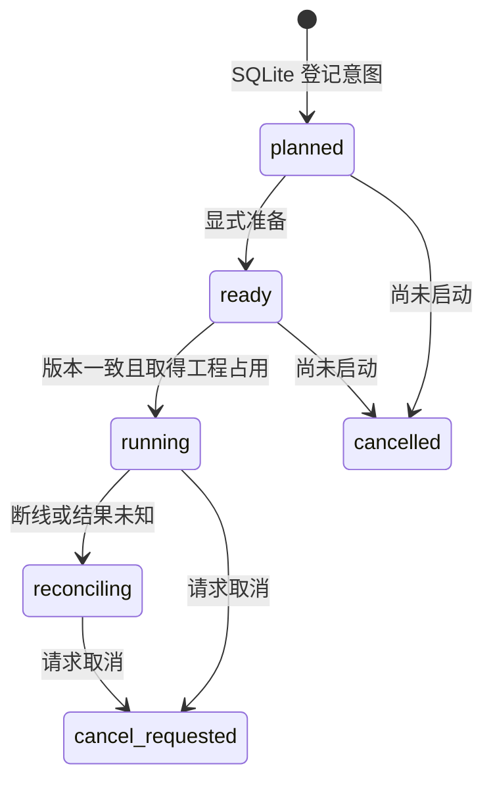

# ArtCraft 持久化任务账本

当前实现位于 [task_ledger.ts](../src/harness/task_ledger.ts)，由已有 OpenSpec 的 AC-CP-001、AC-TX-001、AC-TX-002 与 AC-TX-003 约束。本阶段完成任务登记、版本绑定、单写占用、未知结果和取消意图；现已接入本地监督器与已核验停止后的失败/取消终结及 review_ready 释放；完整完成与崩溃 adoption 仍待实现。

## 行为和状态

| 入口 | 当前承诺 |
| :--- | :--- |
| register | 校验协议和实际 payload 摘要；副作用前保存身份及绑定 |
| ready | 表示准备完成，尚未启动原生调用 |
| claim | 核对适配器提供的当前 revision、截止时间和工程占用，原子保存 attempt 与 epoch |
| unknown | 保留原 attempt 和工程占用，进入 reconciling；取消中的任务保持 cancel_requested |
| cancel | 启动前立即 cancelled；启动后只记录 cancel_requested |
| status / list / events / leases | 只读，不自动重试、不释放占用 |

## 幂等和绑定

键按 callerId 和目标 pluginId 分区。同一键重复提交返回原任务，即使客户端再次提供另一 taskId；计划、输入版本、工程身份、运行时、授权引用、预算或 deadline 改变均返回 idempotency_conflict。相同 taskId 用于另一新任务返回 task_identity_conflict。

`planHash` 当前覆盖完整版本化 payload。预计工程 revision 由实际适配器读取后传入 claim；本模块不连接 GUI、不自行确认文件当前摘要。callerId 与 projectKey 是受控执行上下文，不能由不可信素材随意指定；后续执行器需要规范化工程身份，避免同一路径的别名绕开占用。

## 存储和并发

SQLite 中的任务、状态事件、工程占用和递增 epoch 在 `BEGIN IMMEDIATE` 事务内变更，使用 WAL 与 FULL 同步。账本格式带 application_id 和 user_version；非本应用数据库或不支持版本拒绝打开，不创建业务表。

两连接与两个实际 Node 进程争用同一工程时，只允许一个运行。过期 epoch 的执行者不能写未知结果。截止时间已过不启动新工作；已发生副作用的到期核对尚未由执行器接入。

关闭和重新打开数据库会保留 running、reconciling、cancel_requested 及工程占用。没有按租约时间自动重试或释放，因为时间经过不证明原生进程停止。当前终结 API 要求监督器观察 close 和进程组停止；产物核验后可进入 review_ready 并释放。没有停止证明的占用仍不释放。

## 实际证据与剩余工作

账本新增 12 项测试，加上 10 项协议测试共 22 项通过，包含真实临时 SQLite 文件重开、双连接及双进程竞争，以及 SIGKILL 终止写入进程后意图与占用仍保留、重开不重复启动。revision 和取消使用协议 fixture；本文件对应的账本测试没有运行 GUI 或付费调用；后续本地执行联调见[执行与终结](ArtCraft-Local-Execution.zh_CN.md)。

仍需实现授权范围核验、共享预算消耗、子进程身份与停止证明、reconcile 到终结状态、输出与证据入账、素材版本注册、可恢复调度及独立技能安装。上述 OpenSpec 任务保持未完成，不将账本单元测试写为生产恢复验收。
