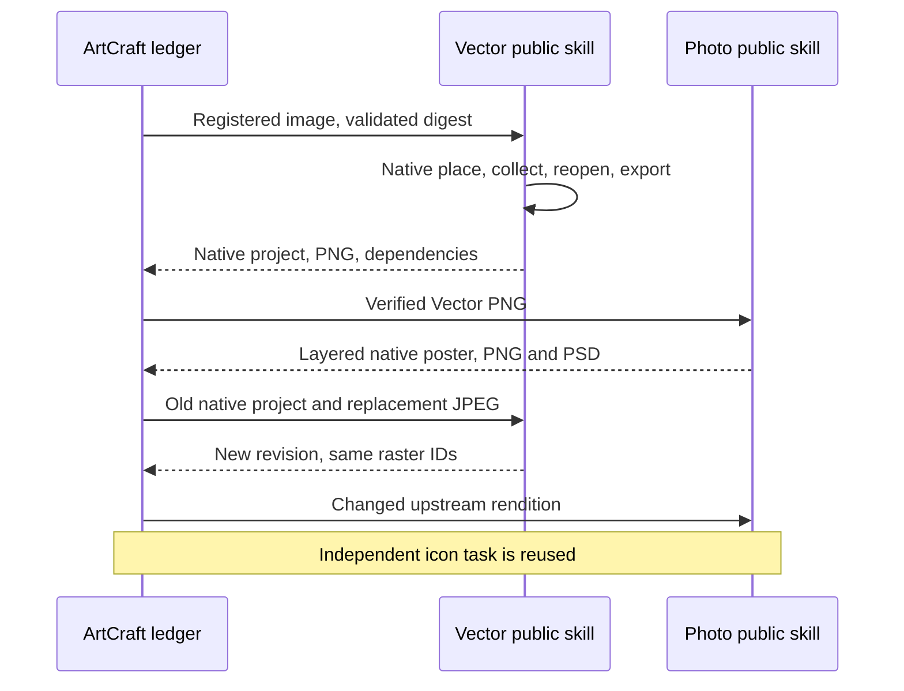

# ArtCraft Vector Assets Architecture

## Authority and candidate boundary

AC-DM-007 in the existing OpenSpec change owns logical VectorCraft asset handoff. Skill source dev.42 pins published runtime dev.60 and VectorCraft source dev.10. The previous full plugin dev.59 remains immutable; full plugin dev.61 installation is verified separately.

## Input and execution contract

Models supply assetBindings with names and artifact IDs, never machine paths or inline plan.assets. publicSkillFactory verifies all registered input bytes, derives --asset arguments and pins the interpreter, native executable and skill files through launcher identity. sourceProject is another registered artifact and must match expectedRevision and its manifest.

## Verification and revisions

The former unconditional Vector asset rejection is removed only because the independent workflow now implements the public asset contract. New and inherited collected files are rehashed. For asset.replace, the new input must occur in one explicit replacement mapping and its collected digest must appear under the old alias. Missing, unbound, duplicated or mismatched inputs do not become accepted lineage.

Result artifacts retain sourceRefs, nativeProjectRef, lossReportRef, manifest evidence and collected dependency references. Source revision is preserved rather than overwritten. A changed asset invalidates consumers through actual input hashes; unrelated nodes can reuse only verified prior outputs. Replay of the same plan must not allocate extra native tasks.

## Source-candidate acceptance

`test/public_skill_adapter.test.ts` first failed on skill_assets_unsupported, then verifies public argv and unbound/path rejection. `test/vector_asset_workflow.test.ts` runs actual current Vector/Photo scripts: supplied PNG, collected native dependency, layered poster, JPEG source replacement, changed output pixels, reuse of independent icon, preservation of all old package hashes and same-plan replay. This is not a substitute for a newly installed fixed ArtCraft skill.

Evidence: [candidate verification](evidence/vector-assets-candidate-20261006.json). New distribution locks, immutable source/runtime/plugin releases, installed-host first use, complete four-domain creative acceptance and model/GUI gates remain open. Jianying adaptation remains outside ArtCraft.

Public cold candidate acceptance now passes with runtime dev.60, Vector source dev.10 and Photo source dev.9 (1 native mixed test, 29.988s). Photo image-only font preconditions are fixed in its independent source. Fixed full-plugin installation remains pending. [Evidence](evidence/vector-assets-public-candidate-20261006.json).

Fixed installed plugin dev.61 now passes registered PNG/JPEG mixed repetition (35.090s), existing four-domain first use (3 tests, 116.788s), and all 22 updated Art/Photo isolated cold CLI checks (190.051s). All 58 installed skill hashes remain intact. This completes the pending installed checks for that bounded scope; SVG registered mixed input and complete creative acceptance remain pending. [Fixed proof](evidence/codex-release61-vector-photo-first-use-20261006.json).

## SVG failure diagnostics candidate

AC-DM-007-SVG requires a complete one-field JSON error from the fixed Vector skill to preserve `asset_svg_external_dependency`. The collector exposes only the exact closed code and output digests; private error details, unknown suffixes, extra fields and conflicting causes remain excluded. Two new tests first failed because the code was null. After the whitelist change, runtime regression passes 153 tests with seven optional native skips; durable failure blocks the consumer and resumes without replay or extra budget. Source regression passes 75 tests with 24 first-use skips.

[Candidate evidence](evidence/svg-domain-diagnostics-candidate-20261006.json) proves current-source diagnostics, not a new installed runtime. Task 6.35 remains open until immutable runtime/source/plugin publication and actual installed SVG mixed acceptance. The strengthened source fixture explicitly paints an independent green object and compares its pixels, checks SVG replacement IDs and independently compares PSD composite pixels to PNG.

Fixed ArtCraft plugin dev.63 / skill source dev.43 / runtime dev.62 passes isolated Codex discovery (five plugins, 58 skills, zero errors), installed PNG/JPEG and SVG mixed first use (2 tests, 76.574s), four-domain regression (3 tests, 116.076s), and ten Art independent cold CLI starts (133.395s). All 58 installed digests remain unchanged, five locked bundles rebuild identically and both public release archives match their file hashes. SVG rejection preserves its domain code; replacement changes only consumers, retains non-target pixels and independently verified PNG/PSD composites, and packages relocate. This closes the bounded fixed SVG handoff gate; SVG type metadata, dynamic transparent sequence and full V1/creative/model/GUI remain open. [Fixed evidence](evidence/codex-release63-svg-first-use-20261006.json).
