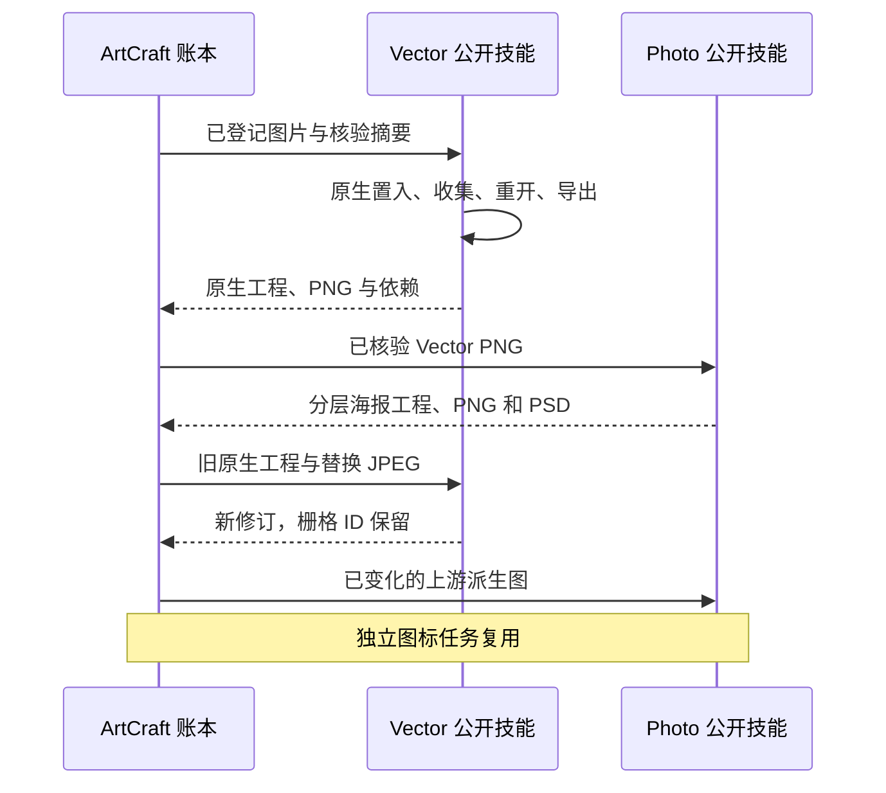

# ArtCraft Vector 素材交接架构

## 事实源与候选范围

现有 OpenSpec 中 AC-DM-007 持有 VectorCraft 逻辑素材交接行为。技能源 dev.42 固定已发布 runtime dev.60 和 VectorCraft 技能源 dev.10。旧完整插件 dev.59 保持不可变；完整插件 dev.61 安装复验单独进行。

## 输入与执行合同

模型只提供包含名字和产物 ID 的 assetBindings，不提供本机路径或内联 plan.assets。publicSkillFactory 校验登记输入字节、派生 --asset，通过 launcher identity 绑定解释器、原生程序和技能文件。sourceProject 也是登记产物，必须匹配 expectedRevision 及工程清单。

## 核验与返工

仅在独立工作流实现公开素材合同后移除原来的 Vector 无条件拒绝。新增与继承依赖均再次核对摘要。asset.replace 的新输入只接受一个显式替换映射，原别名下实际收集文件必须匹配新输入摘要。缺失、未绑定、重复或摘要冲突输入不形成已验收血缘。

结果保留 sourceRefs、nativeProjectRef、lossReportRef、清单证据及实际收集依赖引用。源修订不覆盖旧工程；变化通过真实输入摘要使消费者失效，无关节点仅能复用已验证产物。相同计划重放不得增加原生任务。

## 源码候选验收

`test/public_skill_adapter.test.ts` 先因 skill_assets_unsupported 失败，随后验证公开 argv、未绑定输入与路径拒绝。`test/vector_asset_workflow.test.ts` 执行真实当前 Vector／Photo 脚本：用户提供 PNG、原生依赖收集、分层海报、JPEG 源替换、真实像素变化、独立图标复用、旧包全部摘要保全及计划重放。这不能替代新版固定 ArtCraft 技能安装验收。

证据：[候选验证](evidence/vector-assets-candidate-20261006.json)。新版分发锁、不可变技能源／runtime／插件发行、安装宿主首次使用、四领域完整创作及模型／GUI 门禁仍开放。ArtCraft 不增加剪映适配。

公开冷启动候选验收现已通过：runtime dev.60、Vector 技能源 dev.10、Photo 技能源 dev.9，1 项原生混合测试 29.988 秒。Photo 纯图片字体前置条件在其独立技能源修复。固定完整插件安装仍待复验。[证据](evidence/vector-assets-public-candidate-20261006.json)。

固定已安装插件 dev.61 现通过登记 PNG／JPEG 混合复验（35.090 秒）、原有四工具首用（3 项，116.788 秒）及更新的 Art／Photo 全部 22 技能独立冷启动 CLI 检查（190.051 秒）；58 项安装摘要保持不变。此证据完成上文该有界范围的待执行宿主检查；SVG 登记混合输入与完整创作验收仍待完成。[固定证据](evidence/codex-release61-vector-photo-first-use-20261006.json)。

## SVG 失败诊断候选

AC-DM-007-SVG 要求固定 Vector 技能返回完整的单字段 JSON 错误时保留 `asset_svg_external_dependency`。采集器只公开精确的已知代码及输出摘要；用户错误详情、未知后缀、多余字段和冲突原因继续不公开。两项新增测试先因错误码为 null 失败；白名单修复后，运行时 153 项通过、七项可选原生测试跳过，验证消费者阻断及恢复时不重放、不重复预算。技能源 75 项通过、24 项首次使用测试跳过。

[候选证据](evidence/svg-domain-diagnostics-candidate-20261006.json) 证明当前源码诊断行为，不能代表新版运行时安装验收。6.35 在不可变 runtime／技能源／插件发行和真实安装 SVG 混合验收前保持开放。技能源加强的用例显式为无关对象设置绿色并比较像素，检查 SVG 替换对象身份，同时独立解码 PSD 合成像素并与 PNG 比较。
