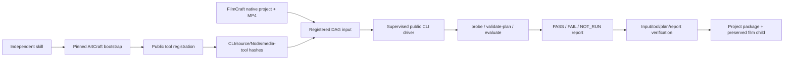

# ArtCraft public Video Factory validation architecture

The adapter consumes registered FilmCraft MP4 artifacts through an installed Video Factory 0.4.0 public CLI, without private-module imports. The independent skill bootstraps ArtCraft dev.13 and four native domains. External plugin/FFmpeg/ffprobe paths are explicitly registered; missing registration rejects before installation or editing. Native projects stay in the film child delivery.

## Contracts and failures

The closed craft-video-evaluation/v1 payload declares one registered MP4 and width/height/fps/durationSeconds/requireAudio expectations. Dimensions are positive even integers; FPS is 1–120 and duration at most 24 hours. Model data cannot select executables, commands, output paths or modules. Local validation reserves zero monetary and external-service usage.

Trusted registration binds matching 0.4.0 plugin/package versions, public entrypoint, JS/JSON source resources, Node and media-tool digests. Linked entries encountered during source traversal are rejected. Only fixed public argv are invoked. Registry changes conflict with frozen revisions; inputs/tools are verified before and after execution.

Required gates and failedRequired must agree. Missing Video Factory render-ledger provenance stays NOT_RUN; ArtCraft lineage cannot fabricate that ledger. accepted or exit zero does not establish completion. Required FAIL blocks delivery; review is not creative approval. Unknown attempts remain under normal durable recovery without replay.

JSON evidence is syntax-checked after complete hashing, capped at 16 MiB. Report metadata stays in the report rather than extending technicalMetadata. The non-native report child packages its report and evaluation plan; the film child preserves MP4 and native projects.

## Scope and evidence

[Candidate first use](evidence/video-factory-candidate.json) uses a local locked ArtCraft ZIP with public Node/domain CLI downloads. All 83 native runtime tests pass, including real public evaluation, failed dimension gates, NOT_RUN provenance, reuse and packaging. Default public runtime downloads require separate post-publication verification. Legacy rendering, Jianying conversion, other platforms, model dispatch and creative approval remain unverified.
