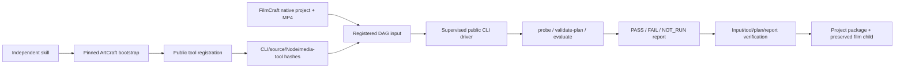

# ArtCraft 与 Video Factory 公开验证架构

本适配消费已登记的 FilmCraft MP4，只通过已安装 Video Factory 0.4.0 的公开 CLI 验证，不导入其私有模块。独立技能自动安装 ArtCraft dev.13 与四领域依赖；外部插件、FFmpeg、ffprobe 由实际加载路径显式登记，缺失前置在安装/编辑前拒绝。原生工程保持在 film 子交付。

## 合同与失败语义

固定 payload 为 craft-video-evaluation/v1，仅声明一个登记视频及 width/height/fps/durationSeconds/requireAudio。输入为 MP4，尺寸为正偶数；帧率 1–120，时长至多 24 小时。模型不能指定执行器、命令、输出路径或外部模块。预算为零金额、零外部服务调用；本地子进程不产生付费服务额度。

可信配置绑定 plugin.json/package.json 版本 0.4.0、公开 bin、JS/JSON 源资源、Node、FFmpeg/ffprobe 摘要。遍历条目中的链接拒绝；CLI 驱动只调用固定 argv。登记表变化与旧修订冲突，运行前后核对文件与输入。

报告逐项校验必需门禁与 failedRequired。缺 Video Factory 自身渲染账本时 provenance 保持 NOT_RUN；不能用 ArtCraft 血缘伪造该账本。accepted 或退出零不算完成；必需 FAIL 阻断交付，review 不代表创作通过。未知执行结果沿用账本恢复，不自动重放。

JSON 文件先核对完整摘要，再校验语法，上限 16 MiB；报告元信息放在报告中，不扩展公共 technicalMetadata。非原生报告子节点随包保存报告和验收计划，源 MP4/原生工程由 film 子节点保留。

## 范围与证据

[候选首次使用](evidence/video-factory-candidate.json) 是本地锁定 ArtCraft ZIP 配合公开 Node/领域 CLI 的验证。83 项原生回归通过，包括真实 Video Factory 调用、失败尺寸阻断、来源 NOT_RUN、复用和打包。默认公开新制品下载发布后另验；旧插件渲染、剪映转换、其他平台、模型派发与创作审核仍未覆盖。
