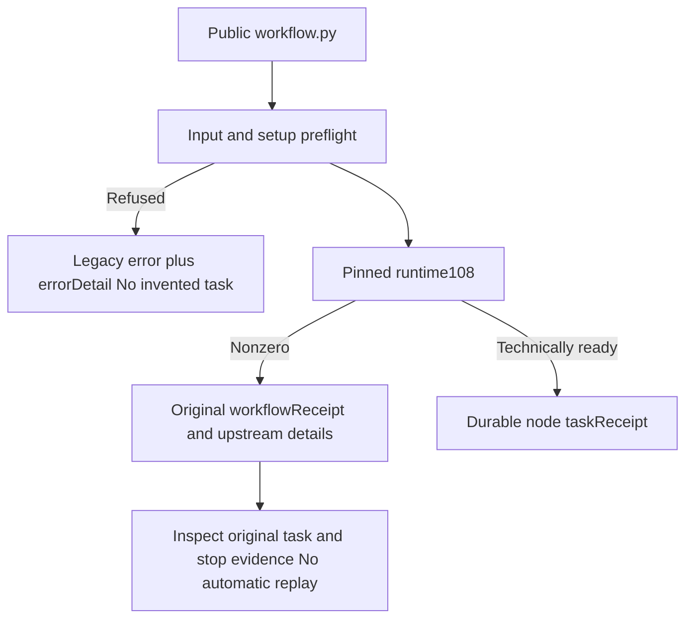

# Structured workflow launcher rejection

Source84 synchronizes ten independent skills; plugin112 pins that source commit. Runtime108 and all domain distribution locks remain unchanged. Durable node taskReceipt still comes from the ledger; this change fixes the Python public error envelope while preserving legacy error and workflowReceipt.

Input/setup refusal returns errorDetail code/message. Valid error identifiers are retained; other messages use operation_failed. A nonzero upstream receipt preserves valid structured details; otherwise workflow_not_ready describes the envelope and the original receipt remains available. This code neither declares task failure nor authorizes replay. Inspect durable receipts and original stop evidence; unregistered refusal does not invent task/attempt identity.

Seven unit tests first produced six errors and one failure, then passed. Source regression:153 tests,116 passed and37 conditional skips. Actual installed111 reproduces missing errorDetail before runtime installation. Candidate single-skill public cold native Vector creation, durable receipt querying, same-task/attempt reuse, input/revision refusal and upstream authorization-conflict rejection pass, preserving original native file hashes. Fixed plugin112 installation qualification remains separate and pending.

This covers the error envelope and bounded native first-use behavior. Full protocol, all business/command contexts, generic Skills CLI, model dispatch, GUI/other platforms, human creative acceptance and fullV1 remain open. No OpenSpec sync/archive or Jianying adapter is introduced.

[Evidence](evidence/artcraft-workflow-error-detail-20261008.json).
