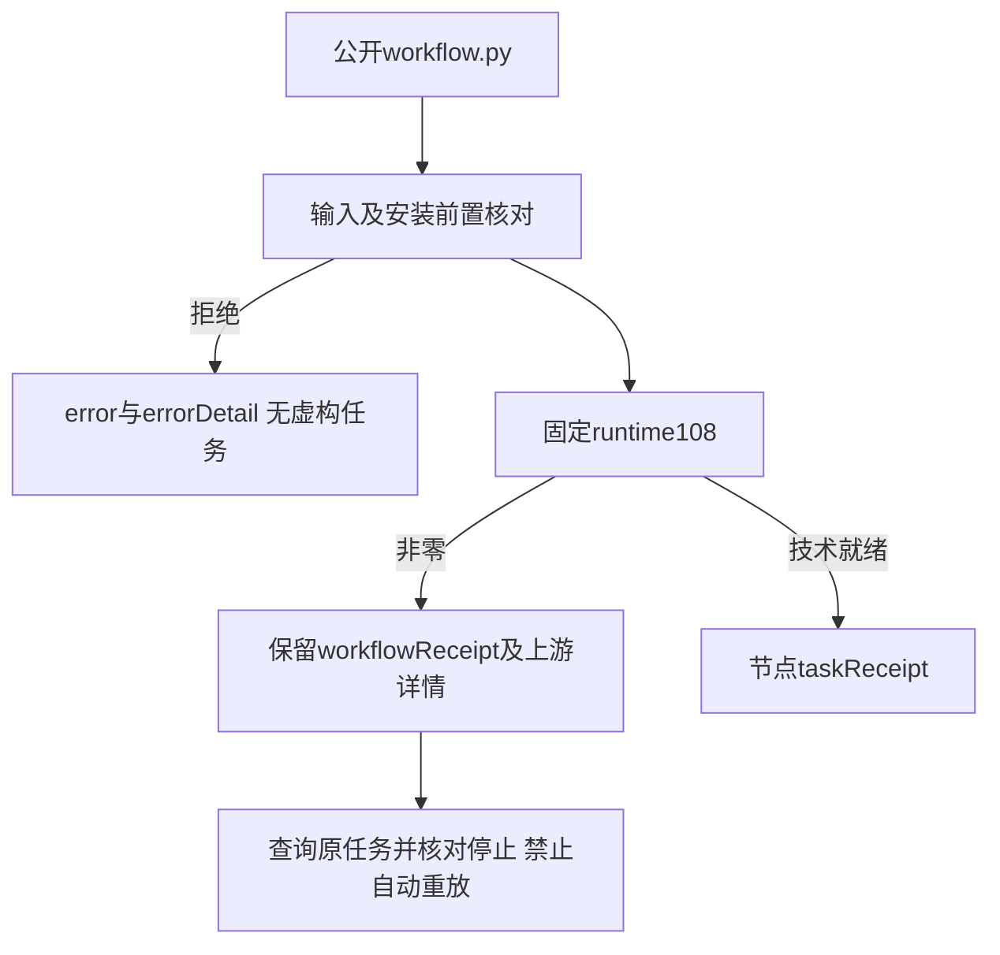

# 工作流入口结构化拒绝

源84同步十个独立技能，插件112引用固定源提交；runtime108与四领域分发锁保持不变。已有节点taskReceipt继续来自持久账本，本次修复Python公开入口的错误封装，保留既有error字符串与workflowReceipt。

输入／安装前置失败返回errorDetail.code/message；合法错误标识沿用，其他消息使用operation_failed。上游非零回执有结构化错误时保留其code/message；无上游详情时返回workflow_not_ready，并保留原始回执。workflow_not_ready不表示任务失败，不授权重放；应检查节点taskReceipt与原任务停止证据。未登记的失败不伪造任务或attempt。

7项单元测试先出现6错误／1失败，修正后7通过；源码153项116通过37条件跳过。旧固定安装111在输入拒绝中真实复现缺少errorDetail。候选单技能公开空运行时真实创建Vector工程、查询账本回执、复用同taskId／attemptId、输入与同修订冲突拒绝、真实上游授权冲突拒绝均通过，旧原生文件摘要保持。固定安装112原生验收39.512秒通过；64技能发现零错误，10变化技能独立冷安装通过，54整树相等技能复用历史冷证明。十个已安装入口均在安装前拒绝无效输入且不伪造回执。

本变更仅证明入口错误与限定真实首用场景；完整公共协议、全部业务与命令、通用Skills CLI、模型调度、GUI和其他平台、人工创作及完整V1仍开放。不sync/archive，不增加剪映适配。

[证据](evidence/artcraft-workflow-error-detail-20261008.json)。

[固定安装证据](evidence/craft-workflow-error-detail-fixed-first-use-20261008.json)。默认工具使用host-acceptance-workflow-error.lock.json，显式历史参数兼容；不关闭完整公共协议任务。

实际默认审计核对64项安装身份通过，保留120完整需求／250开放任务；维护回归104项98通过6条件跳过。
