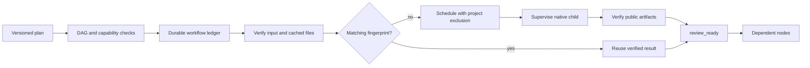

# ArtCraft dependency scheduling implementation

`src/planning/workflow_engine.ts` uses SQLite workflow and node records in `TaskLedger` and process supervision in `LocalRunner`. Eight scheduling tests pass. The complete 40-test regression includes one real EffectCraft render. Multi-tool scheduling outputs are string fixtures; they do not establish a mixed native project delivery.

## Public inputs and persistence

`WorkflowPlan` declares workflow ID, owner, revision, authorization reference, budget, deadline and nodes. Each node declares its runtime identity, project key, versioned domain payload, dependencies, expected project revision and input bindings. Preflight validates the graph, registered plugins, protocol, budget types and bindings. A workflow revision binds one plan digest; a changed plan requires a new revision.

## Scheduling, reuse and revisions

Dependency producers must be technically `review_ready` or completed. The engine rechecks actual output files, native project references, renditions and evidence hashes. External inputs are also checked. Changed files block consumption without silently overwriting or regenerating the old delivery. Cache scope is owner, workflow and node; fingerprints bind domain parameters, input versions and hashes, runtime identity, project key and expected revision.

Unchanged nodes can reuse verified results in a new workflow revision. Changing the Logo parameters rebuilds poster, intro and film while reusing independent narration. Nodes sharing a project key serialize; independent nodes run within an explicit concurrency limit. SQLite writer leases protect cross-process mutations. After reopen, running or ambiguous tasks wait instead of launching another native attempt.

Parent cancellation or deadline expiry stops new downstream scheduling and records cancellation intent for active children. A child settles only after process close and confirmed group stop. Unknown stop outcomes retain writer ownership.

## Evidence and remaining work

[Recorded tests](evidence/workflow-tests.json) include source hashes, the initial missing-module failure, 40 regression tests and limitations. Coverage includes dependency joins, durable no-replay resume, selective Logo invalidation, corrupt-cache rejection, project serialization, parent cancellation, cycle and unknown-plugin rejection, and same-revision plan conflicts.

Four public skill workflows now pass native handoff tests. Complete first-use installation, native source revision bindings, provider invoice settlement, immutable asset registration, creative review, final packaging, crashed-supervisor adoption, independent ArtCraft skill installation and host acceptance remain unfinished. `review_ready` denotes technical verification. OpenSpec AC-DM-003/004 remain in progress; native acceptance tasks remain unchecked.

[Subsequent native integration evidence](ArtCraft-Native-Handoff.md): four-domain handoff now passes; complete first-use setup remains pending.

Shared execution-budget admission and revision counters now apply across the authorization scope. See [budget architecture](ArtCraft-Budget-Architecture.md); paid-provider settlement remains pending.
