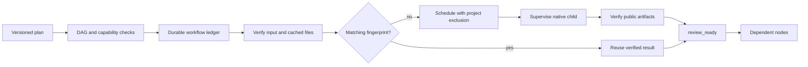

# ArtCraft 依赖调度实现边界

当前实现为 `src/planning/workflow_engine.ts`，使用 `TaskLedger` 的 SQLite 工作流和节点记录以及 `LocalRunner` 的进程监督。8 项调度测试通过；完整回归 40 项通过，其中 1 项为真实 EffectCraft 渲染。调度测试的多工具输出仍为字符串 fixture，不是四工具原生混合项目验收。

## 公共输入与持久化

`WorkflowPlan` 指定工作流 ID、调用者、修订、授权引用、预算、截止时间与节点。节点显式声明插件运行时身份、目标工程键、版本化领域 payload、依赖、预期工程修订和输入绑定。启动前验证 DAG、插件注册、协议、预算类型和输入绑定；同一工作流修订绑定唯一计划摘要，变化必须使用新修订。

## 调度、复用与返工

依赖输出必须处于技术 `review_ready` 或已完成状态，并再次核对实际文件及原生工程、rendition、证据引用的摘要。外部输入同样核验。文件改变则阻止依赖消费，不静默覆盖或重新生成原产物。缓存限定在同一调用者、工作流、节点，指纹包括领域参数、实际输入版本和摘要、运行时身份、目标工程与预期修订。

新修订中未变化的节点复用已核验产物；Logo 参数变化使海报、片头、宣传片重新执行，独立配音复用。同一工程节点串行，其他独立节点可在明确并发上限内执行；SQLite 单写租约保护跨进程写入。重开后运行或结果不明确的任务进入等待，不启动第二个原生子进程。

父任务取消或到期停止启动下游，对活跃子任务登记取消意图；只有实际进程关闭并确认进程组停止才能结束子任务。未知停止状态保持租约。

## 证据与未完成项

[测试记录](evidence/workflow-tests.json) 包含代码摘要、初始缺失模块失败、40 项回归及范围。测试覆盖依赖汇合、重开不重复、Logo 下游失效、损坏缓存拒绝、同工程串行、父取消、环和未知插件拒绝、同修订计划冲突。

四个公共技能脚本已通过原生交接测试；尚未完成完整首次安装、原生源工程修订绑定、付费服务核销、不可变素材注册、创作评审、最终打包、崩溃监督器接管、ArtCraft 独立技能安装和宿主验收。`review_ready` 只表示技术核验，不标记创作完成或市场发布。对应 OpenSpec AC-DM-003/004 仍为进行中，真实验收任务保持未勾选。

[后续原生联调证据](ArtCraft-Native-Handoff.zh_CN.md)：四领域交接已通过，首次完整安装仍未完成。

共享执行预算准入及修订轮次已跨授权范围实施；见[预算架构](ArtCraft-Budget-Architecture.zh_CN.md)，付费服务核销仍待实现。
