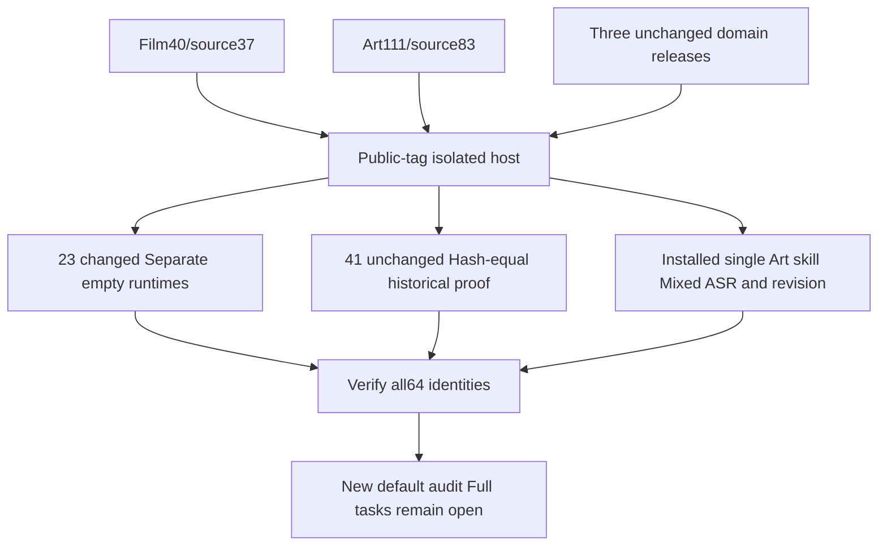

# Fixed first use after ASR caption handoff corrections

The fixed matrix is Film40/source37, Effect38/source34, Photo37/source33, Vector35/source31 and Art111/source83. Art runtime108 and its Film dependency source36/nativecraft.4 remain unchanged. New tags/ZIPs and historical assets are separate immutable releases.

Actual isolated Codex public-tag installation discovers64 skills with no loading errors and matching source/tree identities. All13 changed Film and10 changed Art skills pass individually copied, empty public runtime installation, exact native versions and discovery/help checks. Temporary runtimes were removed after terminal calls and no open files. The41 unchanged skills reuse historical independent cold proof only after complete tree equality. These are not64 new runtimes or full business scenarios.

The actual installed Art-use single skill passed first model download,28-word recognition, five child projects, six single-line caption segments, brand-source revision, four dependent updates, badge reuse, preserved captions/timing/originals/voice/model and moved five-child packaging in117.673s. The native preview separates the title from captions; human creative acceptance remains NOT_RUN. Earlier installed Film40 recognition proof retains its own identity and is not represented as part of the same native run.

Maintenance audit, installed CLI verification and independent installation planning now default to this matrix. Three old-default assertions failed first;29 target tests then passed. Plugin regression:104 tests,98 passed,6 conditional skips. The actual default audit retains120 full requirements and250 open tasks. Explicit historical lock/evidence overrides remain supported. Only the bounded mixed-ASR handoff gate closes; full V1 remains incomplete.

Disk cleanup removed only completed task-owned native/model QA caches after file inventories and no-open-file checks. Editable deliveries, input media, installed skills, logs and the current installed mixed-model cache remain. Removed caches can be downloaded from fixed locks/model revisions; their physical presence is not claimed.

[Current fixed evidence](evidence/craft-asr-caption-fixed-first-use-20261008.json). Complete changed-role scenarios, generic Skills CLI, model dispatch, all command contexts, GUI, other platforms, human creative acceptance and full V1 remain open. No sync/archive or Jianying integration.
