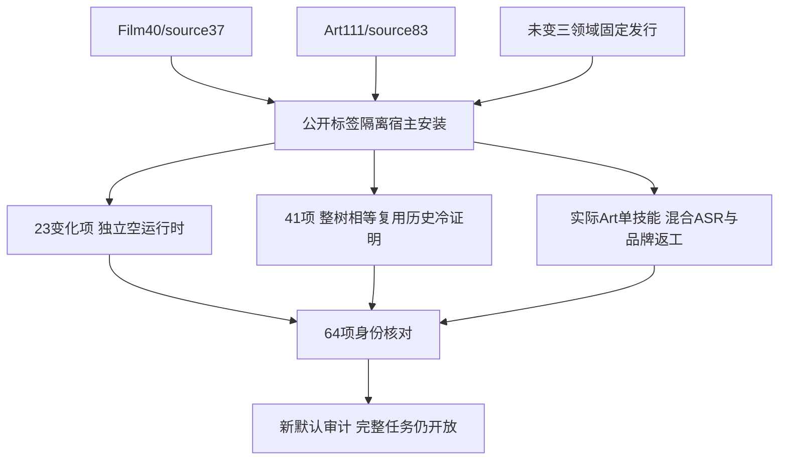

# ASR字幕交接修正后的固定首用

当前固定矩阵为Film40/source37、Effect38/source34、Photo37/source33、Vector35/source31、Art111/source83。Art编排runtime108及其Film依赖source36/nativecraft.4保持不变。所有新标签、公开ZIP和历史制品分别保留，不覆盖历史发行。

实际隔离Codex公开标签安装发现64项技能、零加载错误，来源与完整安装摘要匹配。内容变化的Film13项和Art10项均逐个独立复制、空公开运行时安装、精确CLI版本及目录／帮助核验，临时运行时在终止调用和无打开文件后删除。41项未变技能仅在整树摘要一致时复用已有独立冷证明。这不是64个新运行时，也不是所有领域场景原生验收。

当前安装Art-use单技能的真实模型首次下载、28词识别、五子工程创建、单行六段字幕、品牌源返工、四关联产物更新、徽标复用、字幕文字／时间及原工程／配音／模型保全、五子工程移动包117.673秒通过。原生预览已查看，品牌标题与字幕分开；人工创作验收NOT_RUN。此前Film40的固定真实识别证据保留于其独立交接记录，不把不同矩阵冒充同一次原生测试。

维护审计、已安装CLI验证和独立安装计划的默认锁更新到本矩阵，三个旧默认断言先失败，29项目标回归通过；104项插件回归98通过／6条件跳过。实际默认审计保留120项完整需求和250项开放任务，历史显式锁／证据参数继续支持。仅关闭限定混合ASR交接门禁，完整V1仍未完成。

磁盘受限时仅清理了本任务已结束的原生／模型QA缓存；删除前保存文件摘要清单并确认无打开文件。交付工程、输入媒体、安装技能、日志及当前安装混合模型缓存保留。原缓存可从固定公开锁与模型修订重新下载，不能声称已删除缓存仍在磁盘。

[当前固定证据](evidence/craft-asr-caption-fixed-first-use-20261008.json)。全部变化角色的完整业务场景、通用Skills CLI、模型派发、全部命令上下文、GUI、其他平台、人工创作和完整V1保持开放；不sync/archive，不适配剪映。
