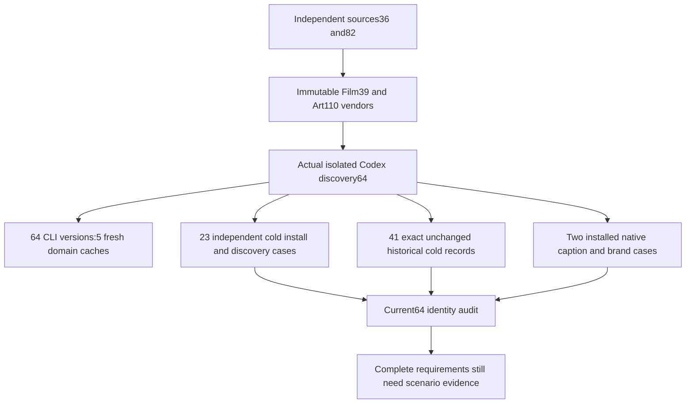

# Fixed installed first use after caption-size correction

The matrix is Film39/source36, Effect38/source34, Photo37/source33, Vector35/source31 and Art110/source82. Art runtime remains108 and Film native remains craft.4. New immutable tags/ZIPs were created without replacing historical assets.

Isolated Codex installs five fixed public tags and discovers64 skills with zero loading errors; every source and installed tree matches. All64 copied-alone CLI version probes pass using five fresh domain caches, with later probes reusing their domain cache. This is not64 independent cold installations. Separately,23 changed Film/Art skills each use their own empty public runtime and command discovery.41 unchanged skills reuse historical cold evidence only after complete tree-digest equality. These prove installation/discovery, not23 complete native scene roles.

Two actual installed native cases use the subtitle and revise directories. Film reopens and exports a captioned native project with ten bright glyph rows. Art's default caption also has ten rows, followed by five-child brand source revision, dependent rebuild, unrelated reuse, original preservation and packaging. Film uses silent PCM as technical input, not creative voice proof. Both download into their own empty cache; all64 installed trees still match afterward. Human acceptance was not performed.

Default maintainer audit, CLI verification and independent-install planning use this matrix, preserving explicit historical parameters. A target assertion first reproduced the old default; the corrected default passes. The actual audit does not close fullV1 from a64-skill count. Stale generated index/commit expectations were corrected before release; rejected candidates are not represented as published product failures.

Only completed task-owned old/new CLI QA runtime caches were removed under disk pressure, after checking for open files and recording inventory/receipt hashes. Skill copies, media, native projects and logs remain. Fixed public locks can rebuild the caches.

[Fixed evidence](evidence/craft-caption-size-fixed-first-use-20261008.json). FullV1, all command contexts,23 complete scene roles, other platforms, GUI, model dispatch, human creative acceptance and actual generic Skills CLI installation remain open. No complete requirement was closed or synced/archived.
