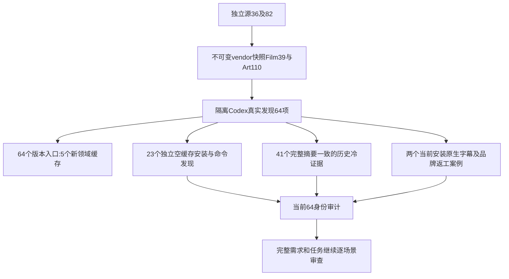

# 字幕尺寸修正后的固定安装首用

当前矩阵为Film39／source36、Effect38／source34、Photo37／source33、Vector35／source31、Art110／source82；Art运行时保持108，Film原生保持craft.4。新发布标签及ZIP均独立创建，未替换任何历史制品。

实际隔离Codex从固定公开标签安装五插件，发现64项、零加载错误，所有来源及安装整树摘要匹配。64项各自单技能复制后的CLI版本调用通过：五个新领域缓存，各域后续技能复用该域缓存，不能称为64次冷安装。另对23项已变化的Film／Art技能逐项使用独立空缓存公开下载和命令发现；41项未变化技能仅在完整摘要相等时复用原冷安装证据。这是安装／发现证明，不是23个完整场景均已原生验收。

两个当前安装原生案例分别使用真实subtitle和revise技能目录：Film原生重开及字幕成片的亮字高10行，Art五子工程默认字幕同为10行，并完成品牌源返工、受影响重建、无关复用、旧产物保全及打包。Film测试使用静音PCM技术输入，不能证明语音创作质量。两项均各自空缓存公开下载，执行后64目录整树匹配。人工验收未执行。

默认维护审计、CLI核验和独立安装计划更新为字幕修正矩阵，保留显式历史锁参数。原默认值的目标断言先失败，修正后通过。当前实际审计仍报告完整需求未证明，而不是依据64计数关闭V1。source锁更新期间的旧索引与过期提交断言已在发行前发现并修正，不把拒绝候选当作已发布产品错误。

为应对磁盘紧张，只删除了本任务已完成的旧／新CLI验收运行时缓存；删除前确认无打开文件、保存清单及回执摘要。技能副本、交付媒体、工程与日志保留，缓存可由固定公开锁重建。

[固定证据](evidence/craft-caption-size-fixed-first-use-20261008.json)。完整V1、所有命令上下文、23技能全场景、其他平台、GUI、模型派发、人工创作验收和实际通用Skills CLI安装仍未完成。没有关闭完整需求或sync/archive。
