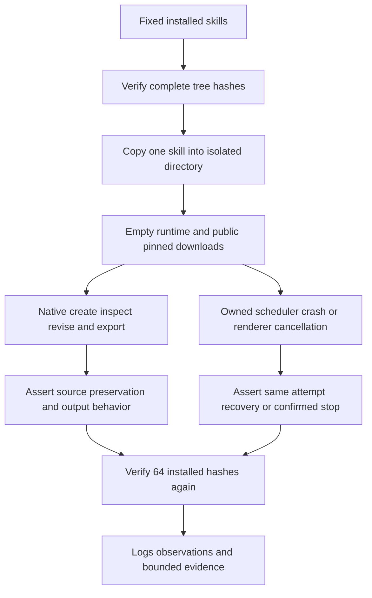

# Fixed-release role first-use evidence

The 2026-10-08 matrix is Film40/source37, Effect38/source34, Photo37/source33, Vector35/source31 and Art111/source83. Art runtime108 and selected domain distribution locks are unchanged. This update adds observed behavior from installed skills without changing skills, runtimes or release tags.

Nineteen tests passed without skips. The count includes one static contract check and one Python-only planning flow; it does not mean nineteen native tests. Current source tests consume scripts and examples from the fixed installed host. Each case copies a single skill, uses a separate empty runtime and public pinned downloads, and excludes offline overrides. All64 installed complete-tree hashes match before and after execution.

| Case | Passed | Seconds |
|---|---:|---:|
| film-ten-roles | 10 | 66.87 |
| art-task-roles | 3 | 168.175 |
| art-review | 1 | 49.606 |
| art-execute | 1 | 26.236 |
| film-use | 1 | 10.553 |
| art-cli-film-commands | 1 | 37.003 |
| art-recover-scheduler-crash | 1 | 48.082 |
| art-recover-live-cancel | 1 | 50.546 |

Film domain cases verify project reopening, media imports, cuts preserving audio, decoded gain samples, subtitle timing and SRT, LUT pixels after source removal, keyframe pixels, multicamera picture/audio preservation, transcript import and exports. Film-use separately verifies native delivery/revision with Chinese and spaced paths. Actual ASR/model first download remains covered by the preceding fixed-install evidence; transcript import does not prove recognition.

Art cases verify moved planning records and conflicts, four dependent revisions and unrelated-node reuse, asset-ledger status, a moved five-child package, review records with stale/tampered rejection, independent new-authorization tasks preserving old delivery, and the public Film command component. Recovery separately exercises real scheduler SIGKILL takeover of the same attempt and live render cancellation with confirmed stop and no replay. These do not establish every crash or cancellation timing.

Failures retain original logs and nonzero results; stop the group and inspect the original task rather than treating an observation timeout as termination. All cases here ended normally. Tests clean temporary native fixtures after assertions; logs, observations, source-test hashes and input/output hashes remain. The preceding mixed-ASR handoff retains its actual projects, previews and movable package; the temporary fixtures from this run are not claimed to remain on disk.

Scope is macOS arm64 and Python3.13.5. Human creative acceptance remains NOT_RUN. Full command contexts, all scenarios per role, generic Skills CLI, model planning/dispatch, GUI, other platforms and fullV1 remain open. The completion baseline remains120 full requirements and250 open tasks. No full requirement is checked off, no OpenSpec sync/archive is performed and no Jianying adapter is introduced.

[Fixed role evidence](evidence/craft-fixed-role-first-use-20261008.json).
