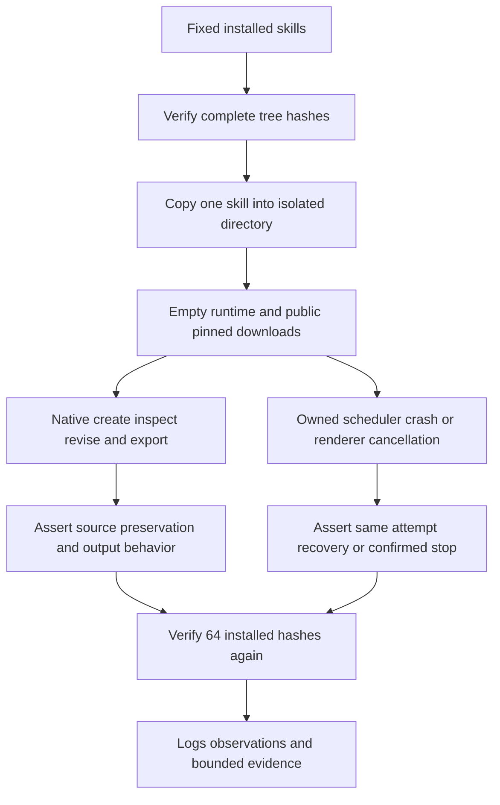

# 固定版本角色首用补证

2026-10-08，当前固定矩阵 Film40/source37、Effect38/source34、Photo37/source33、Vector35/source31、Art111/source83。Art runtime108 与所选领域分发锁保持原样。本轮不修改技能、运行时或发行标签，补充变化技能安装后的实际行为证据。

已确认：19 项测试通过、零跳过，其中包含一项静态合同检查和一项纯 Python 规划流程，不将其全部称为原生测试。测试来自当前源文件，业务脚本与示例来自固定宿主已安装技能，每次复制单技能并使用独立空运行时，排除离线覆盖后公开下载。执行前后全部64项技能完整摘要一致。

| Case | Passed | Seconds |
|---|---:|---:|
| film-ten-roles | 10 | 66.87 |
| art-task-roles | 3 | 168.175 |
| art-review | 1 | 49.606 |
| art-execute | 1 | 26.236 |
| film-use | 1 | 10.553 |
| art-cli-film-commands | 1 | 37.003 |
| art-recover-scheduler-crash | 1 | 48.082 |
| art-recover-live-cancel | 1 | 50.546 |

Film十领域检查覆盖工程重开、素材导入、剪切保留音轨、音频实际采样、字幕时序及SRT、LUT源删除后的像素、动画关键帧像素、多机位画面和音轨保全、转录导入及成片导出。Film-use另验证中文含空格路径下的原生创建与返工。真实ASR首次模型下载继续引用上一轮固定安装证据，转录导入不能替代识别验收。

Art角色检查覆盖规划文件移动与冲突拒绝，四关联产物返工和无关节点复用，素材账本查询，五子工程移动包，审阅记录与过期／篡改拒绝，新授权创建独立任务且保全旧交付，公共Film命令入口局部返工。恢复另通过真实调度器SIGKILL同attempt接管，以及渲染中取消确认停止、不重放；不据此证明全部崩溃或所有取消时序。

测试异常须保留原日志与非零结果，停止本组后检查原任务，不把观察超时当作任务终止。本轮所有测试正常结束，临时原生fixture由测试清理；保留日志、输入输出摘要、观察记录及测试源码摘要。此前混合ASR的实际工程、预览与移动交付包保留在原交接目录；不能声称本轮临时工程仍在磁盘。

当前为macOS arm64与Python3.13.5的限定首用证据，人工创作仍NOT_RUN。全部命令上下文、每角色全部业务场景、通用Skills CLI、模型规划派发、GUI和其他平台、完整V1保持开放。完成审计基线仍为120完整需求／250开放任务，本轮不勾选整体要求、不sync/archive，也不增加剪映适配。

[Fixed role evidence](evidence/craft-fixed-role-first-use-20261008.json)。
